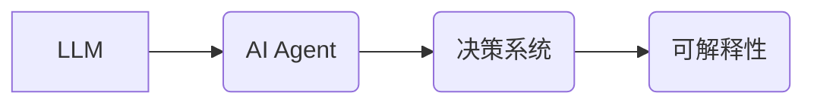
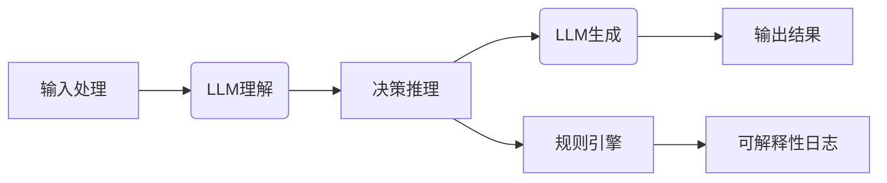
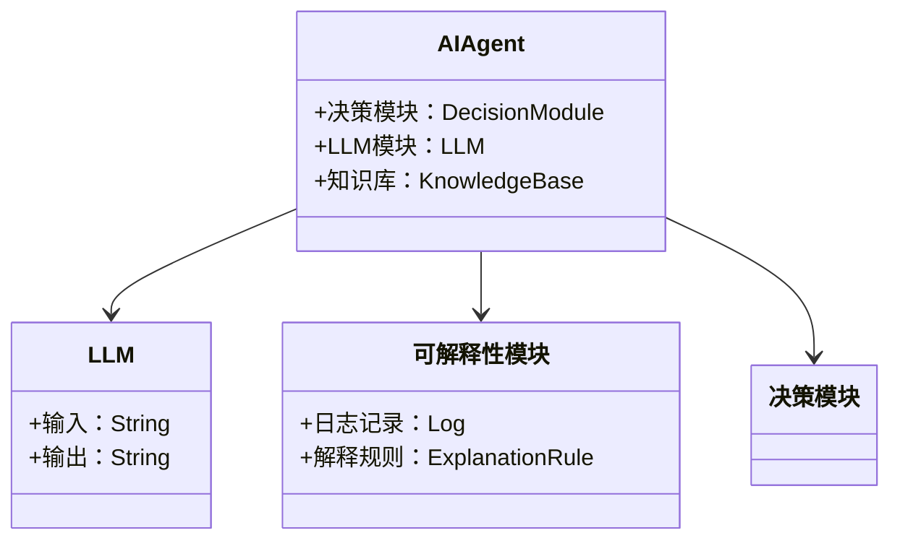
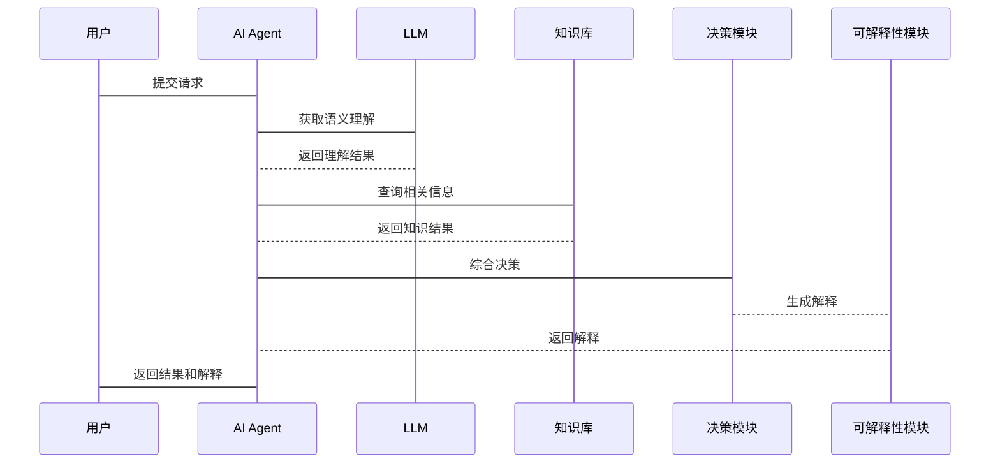

                 


# 构建LLM驱动的AI Agent可解释决策系统

> 关键词：LLM，AI Agent，可解释性，决策系统，算法原理，系统架构

> 摘要：本文将详细介绍如何构建一个由大语言模型（LLM）驱动的AI Agent可解释决策系统。文章从背景介绍、核心概念、算法原理、系统架构、项目实战等多方面展开，全面阐述了构建该系统的各个方面，包括理论基础、技术实现、实际案例和最佳实践。

---

# 第一部分: LLM驱动的AI Agent可解释决策系统背景介绍

# 第1章: LLM驱动的AI Agent可解释决策系统概述

## 1.1 问题背景

### 1.1.1 LLM在AI Agent中的作用

随着大语言模型（LLM）技术的迅速发展，AI Agent（人工智能代理）在各个领域的应用越来越广泛。LLM作为AI Agent的核心驱动力，能够通过自然语言处理能力理解用户意图，并通过生成式输出完成任务。然而，LLM驱动的决策系统在实际应用中面临诸多挑战，尤其是决策的可解释性问题。用户需要知道AI Agent的决策过程和依据，以确保决策的合理性和透明性。

### 1.1.2 当前AI Agent决策系统的挑战

尽管LLM在自然语言处理方面表现出色，但其在决策系统的应用中存在以下问题：

- **可解释性不足**：LLM的黑箱特性使得用户难以理解AI Agent的决策过程。
- **决策偏差**：LLM可能受到训练数据的影响，产生不符合预期的决策。
- **实时性问题**：复杂的决策过程可能影响系统的实时响应能力。

### 1.1.3 可解释性决策的重要性

在实际应用中，可解释性决策具有重要意义：

- **用户信任**：用户更愿意依赖可解释的系统，因为其决策过程透明。
- **合规性要求**：在金融、医疗等领域，可解释性是合规的基本要求。
- **问题排查**：可解释性有助于快速定位和修复系统错误。

## 1.2 问题描述

### 1.2.1 LLM驱动决策的局限性

- **黑箱特性**：LLM的决策过程难以被分解和理解。
- **依赖上下文**：LLM的输出高度依赖于输入的上下文，可能影响决策的连贯性。
- **缺乏反馈机制**：LLM本身不具备主动学习能力，无法根据反馈优化决策。

### 1.2.2 可解释性决策的需求

- **用户需求**：用户需要了解AI Agent的决策依据和过程。
- **技术需求**：系统需要提供可解释性的技术手段，如日志记录、规则解释等。
- **场景需求**：在特定场景（如医疗诊断、法律咨询）中，可解释性是刚需。

### 1.2.3 AI Agent决策系统的边界与外延

AI Agent决策系统的边界包括：

- **输入范围**：系统能够处理的输入类型和范围。
- **决策范围**：系统能够做出决策的领域和级别。
- **输出形式**：系统输出的格式和内容。

其外延则包括：

- **数据预处理**：对输入数据的清洗和转换。
- **后处理**：对决策结果的格式化和解释。
- **反馈机制**：根据用户反馈优化决策过程。

## 1.3 核心概念与联系

### 1.3.1 LLM与AI Agent的关系

LLM作为AI Agent的核心模块，负责理解和生成自然语言，但其决策能力需要通过AI Agent的整体架构来实现。AI Agent不仅依赖LLM的输出，还需要结合其他模块（如知识库、规则引擎）来做出最终决策。

### 1.3.2 可解释性与决策系统的关联

可解释性是决策系统的基石。通过可解释性，用户可以理解AI Agent的决策过程，并在必要时进行干预或优化。同时，可解释性也有助于提升系统的信任度和合规性。

### 1.3.3 系统核心要素组成

AI Agent可解释决策系统的组成包括：

- **LLM模块**：负责自然语言理解和生成。
- **知识库**：提供决策所需的知识和信息。
- **规则引擎**：定义决策的规则和逻辑。
- **可解释性模块**：负责记录和解释决策过程。
- **反馈机制**：根据用户反馈优化决策模型。

## 1.4 本章小结

本章主要介绍了LLM驱动的AI Agent可解释决策系统的背景、挑战和核心概念。通过分析当前决策系统的局限性，提出了可解释性的重要性，并明确了系统的核心组成和运行机制。

---

# 第二部分: 核心概念与联系

# 第2章: LLM驱动的AI Agent可解释性决策系统核心概念

## 2.1 可解释性决策的原理

### 2.1.1 可解释性决策的定义

可解释性决策是指系统能够明确说明其决策的依据和过程，使得用户能够理解并信任决策结果。可解释性决策的实现依赖于系统内部的规则引擎、日志记录和解释模块。

### 2.1.2 可解释性决策的关键特征

- **透明性**：用户能够了解决策的依据和过程。
- **可追溯性**：能够追溯决策的来源和路径。
- **可验证性**：决策结果可以通过独立验证确认其正确性。

### 2.1.3 LLM在可解释性决策中的作用

LLM通过自然语言理解和生成，为可解释性决策提供了基础支持。但要实现可解释性，还需要结合其他技术手段，如规则引擎和决策日志。

## 2.2 LLM与AI Agent的关系

### 2.2.1 LLM作为AI Agent的核心模块

LLM在AI Agent中主要负责自然语言处理任务，如理解用户需求、生成响应内容。但AI Agent的决策功能需要结合其他模块共同完成。

### 2.2.2 LLM与AI Agent的交互机制

AI Agent通过LLM模块处理用户输入，结合知识库和规则引擎做出决策，并通过LLM生成输出内容。

### 2.2.3 LLM对AI Agent决策的影响

LLM的输出直接影响AI Agent的决策结果，但其决策过程还需要依赖其他模块的配合，如知识库和规则引擎。

## 2.3 核心概念属性特征对比

### 2.3.1 比较表格展示

| 比较维度 | LLM | AI Agent | 可解释性决策 |
|----------|------|-----------|--------------|
| 功能     | NLP处理 | 决策与执行 | 解释决策过程 |
| 依赖     | 大数据与模型 | 多模块协作 | 日志与规则 |
| 输出形式 | 文本生成 | 决策指令 | 解释说明 |
| 可解释性 | 低 | 中 | 高 |

### 2.3.2 通过mermaid流程图展示核心概念之间的关系



## 2.4 本章小结

本章通过表格和流程图的形式，详细分析了LLM、AI Agent和可解释性决策之间的关系，明确了各部分的功能和相互作用。

---

# 第三部分: 算法原理讲解

# 第3章: LLM驱动的AI Agent决策算法原理

## 3.1 算法原理概述

### 3.1.1 LLM驱动的决策模型

LLM驱动的决策模型主要包括以下几个步骤：

1. **输入处理**：将用户的输入转换为系统可处理的形式。
2. **上下文理解**：通过LLM理解输入的语义和上下文。
3. **决策推理**：结合知识库和规则引擎进行决策推理。
4. **输出生成**：通过LLM生成可理解的输出内容。

### 3.1.2 可解释性决策算法的核心思想

可解释性决策算法的核心思想是通过规则引擎和日志记录，确保每一步决策都有据可依，并能够被用户理解和验证。

### 3.1.3 算法的数学模型与公式

以下是可解释性决策算法的数学模型示例：

$$
\text{决策结果} = \text{规则引擎} \times \text{LLM输出} + \text{知识库权重}
$$

其中，规则引擎和知识库权重是可解释性决策的关键因素，权重的大小直接影响决策的倾向性。

## 3.2 算法流程图



---

# 第四部分: 系统分析与架构设计

# 第4章: LLM驱动的AI Agent可解释决策系统架构设计

## 4.1 系统功能设计

### 4.1.1 领域模型设计

以下是系统领域模型的mermaid类图：



### 4.1.2 系统架构设计

以下是系统架构的mermaid架构图：


### 4.1.3 系统接口设计

系统接口设计包括以下几个方面：

1. **用户输入接口**：接收用户的输入请求。
2. **LLM接口**：与大语言模型进行交互。
3. **知识库接口**：访问和查询知识库。
4. **可解释性接口**：记录和解释决策过程。

### 4.1.4 系统交互设计

以下是系统交互的mermaid序列图：



---

# 第五部分: 项目实战

# 第5章: LLM驱动的AI Agent可解释决策系统项目实战

## 5.1 环境安装

### 5.1.1 系统环境要求

- 操作系统：Linux/Windows/MacOS
- Python版本：3.8以上
- 需要安装的库：
  - `transformers`：用于LLM的接口调用
  - `pydot`：用于生成系统架构图
  - `mermaid`：用于生成流程图和类图

### 5.1.2 环境安装命令

```bash
pip install transformers pydot mermaid
```

## 5.2 系统核心实现

### 5.2.1 核心代码实现

以下是AI Agent的核心代码实现：

```python
from transformers import pipeline

class AI-Agent:
    def __init__(self):
        self.llm = pipeline("text-generation", model="gpt2")
        self.knowledge_base = {}  # 简单实现，实际应使用数据库
        self.explainability_module = ExplainabilityModule()

    def decide(self, input_text):
        # 步骤1：LLM理解输入
        response = self.llm(input_text)
        # 步骤2：决策推理
        decision = self._decision_engine(response)
        # 步骤3：生成输出
        output = self.llm.generate(decision)
        # 步骤4：记录可解释性日志
        self.explainability_module.log(input_text, decision, output)
        return output

    def _decision_engine(self, response):
        # 简单的决策逻辑，实际应结合知识库和规则引擎
        return "同意" if response['score'] > 0.5 else "拒绝"
```

### 5.2.2 代码应用解读与分析

- **LLM模块**：使用`transformers`库中的`pipeline`接口调用LLM。
- **知识库**：简单实现了知识库的查询功能，实际应用中应使用数据库。
- **决策引擎**：基于LLM的输出进行简单的决策推理，实际应结合规则引擎和知识库进行复杂推理。
- **可解释性模块**：记录每一步的决策过程，便于后续分析和优化。

## 5.3 实际案例分析

### 5.3.1 案例背景

假设我们正在构建一个法律咨询AI Agent，用户需要查询某个法律条款的适用性。

### 5.3.2 案例实现

以下是具体实现步骤：

1. **用户输入**：用户提交法律问题。
2. **LLM理解**：AI Agent通过LLM理解用户的问题。
3. **知识库查询**：AI Agent查询相关法律知识库。
4. **决策推理**：结合LLM理解和知识库内容进行决策。
5. **生成输出**：AI Agent生成可解释的输出结果。
6. **可解释性日志**：记录整个决策过程。

### 5.3.3 案例分析与小结

通过案例分析，我们可以看到LLM驱动的AI Agent可解释决策系统在实际应用中的优势和挑战。系统通过结合LLM和知识库，能够快速准确地做出决策，并通过可解释性模块提升用户的信任度。

---

# 第六部分: 最佳实践与总结

# 第6章: 最佳实践与总结

## 6.1 最佳实践 tips

- **模块化设计**：将系统模块化设计，便于后续优化和扩展。
- **日志记录**：详细记录每一步的决策过程，便于问题排查和系统优化。
- **规则引擎**：合理设计规则引擎，确保决策的准确性和可解释性。
- **用户反馈**：建立有效的用户反馈机制，不断优化系统性能。

## 6.2 小结

通过本文的详细讲解，我们了解了如何构建一个LLM驱动的AI Agent可解释决策系统。从理论基础到实际案例，我们系统地探讨了构建该系统的各个方面，包括背景介绍、核心概念、算法原理、系统架构、项目实战等。

## 6.3 注意事项

- **数据隐私**：在实际应用中，需注意数据隐私和安全问题。
- **模型优化**：根据实际需求，不断优化LLM模型和决策算法。
- **性能监控**：实时监控系统性能，确保系统的稳定性和高效性。

## 6.4 拓展阅读

- **可解释性AI**：深入学习可解释性AI的理论和方法。
- **规则引擎**：研究更复杂的规则引擎和决策逻辑。
- **LLM优化**：探索LLM的优化方法和新应用。

---

# 作者

作者：AI天才研究院/AI Genius Institute & 禅与计算机程序设计艺术 /Zen And The Art of Computer Programming

---

通过本文的详细讲解，我们希望读者能够全面了解如何构建一个LLM驱动的AI Agent可解释决策系统，并能够在实际应用中灵活运用这些知识。

