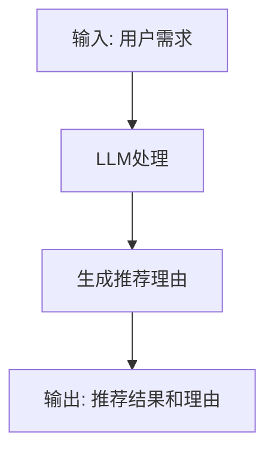
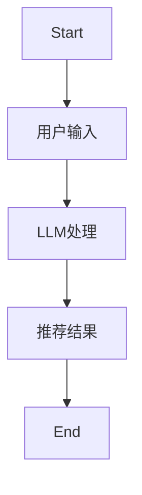
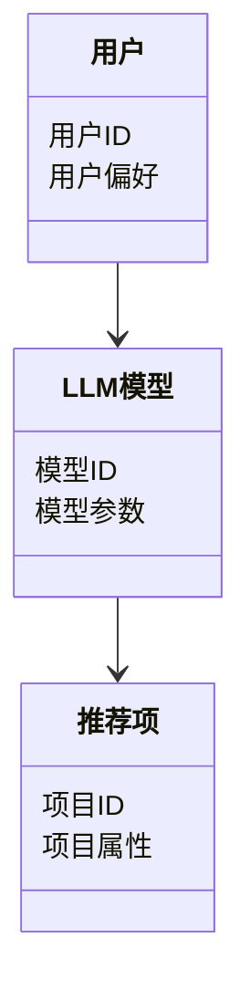
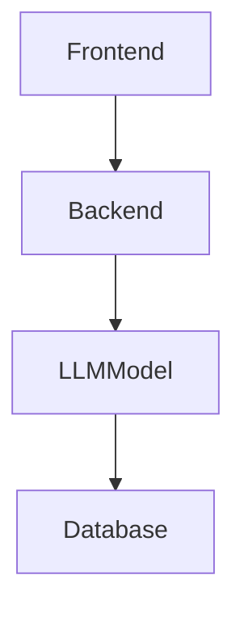
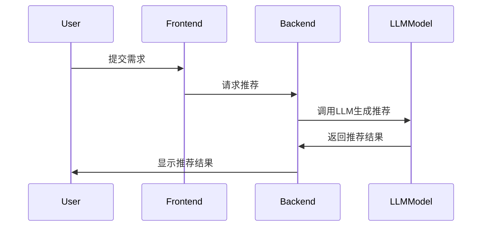

                 


# 《构建LLM驱动的AI Agent可解释推荐系统》

---

## 关键词：
LLM、AI Agent、可解释推荐系统、推荐算法、系统架构、项目实战

---

## 摘要：
本文详细探讨了如何利用大语言模型（LLM）驱动的AI Agent构建可解释推荐系统。从背景介绍到系统架构设计，再到项目实战，本文通过逐步分析，展示了如何结合LLM的强大能力，设计出一个既智能又可解释的推荐系统。通过实际案例分析和代码实现，本文为读者提供了从理论到实践的完整指南。

---

## 第一部分：背景与概念

### 第1章：问题背景与描述

#### 1.1 问题背景
- **1.1.1 推荐系统的重要性**  
  推荐系统在电子商务、社交媒体、视频平台等领域发挥着至关重要的作用，能够提升用户体验和平台粘性。然而，现有的推荐系统往往缺乏透明性，用户难以理解推荐的依据。

- **1.1.2 当前推荐系统的局限性**  
  当前推荐系统主要基于协同过滤或基于内容的推荐算法，虽然能够生成推荐结果，但推荐理由通常不透明，难以满足用户对可解释性的需求。

- **1.1.3 LLM驱动的AI Agent的引入**  
  大语言模型（LLM）具有强大的语义理解和生成能力，结合AI Agent的自主决策能力，可以为推荐系统提供更智能、更可解释的解决方案。

#### 1.2 问题描述
- **1.2.1 用户需求的多样性**  
  用户的需求复杂多样，且往往隐性化，传统的推荐系统难以捕捉用户的深层需求。

- **1.2.2 推荐系统的可解释性需求**  
  用户希望了解推荐的原因，以便信任和接受推荐结果。此外，可解释性也是企业合规性和透明运营的重要要求。

- **1.2.3 LLM在推荐系统中的作用**  
  LLM可以通过自然语言处理能力，帮助理解用户需求，并生成可解释的推荐理由。

#### 1.3 问题解决
- **1.3.1 可解释推荐的核心目标**  
  可解释推荐系统的目标是提供透明、可理解的推荐理由，同时保持推荐的准确性和多样性。

- **1.3.2 LLM驱动的AI Agent的优势**  
  LLM驱动的AI Agent能够结合上下文信息，生成动态、个性化的推荐，并提供可解释的理由。

- **1.3.3 解决方案的可行性分析**  
  通过结合LLM和AI Agent，可以实现推荐系统的智能化和可解释性，提升用户体验和系统信任度。

#### 1.4 边界与外延
- **1.4.1 系统的边界定义**  
  本系统的边界包括用户输入、推荐生成和解释输出，不涉及后端数据存储和第三方API调用。

- **1.4.2 相关领域的区别与联系**  
  与传统推荐系统相比，LLM驱动的推荐系统在可解释性和动态性方面更具优势，但可能在推荐效率和 scalability 上有所 trade-off。

- **1.4.3 系统的适用场景与限制**  
  适用于需要动态调整推荐且对可解释性要求较高的场景，如个性化教育推荐、医疗建议等。

#### 1.5 核心概念与组成
- **1.5.1 LLM的基本概念**  
  LLM是一种基于深度学习的自然语言处理模型，能够理解和生成人类语言。

- **1.5.2 AI Agent的定义与功能**  
  AI Agent是一种智能体，能够感知环境、执行任务并做出决策。

- **1.5.3 可解释推荐系统的组成**  
  包括用户输入、LLM推理、推荐生成和解释输出四个模块。

---

### 第2章：核心概念与联系

#### 2.1 核心概念原理
- **2.1.1 LLM的工作原理**  
  LLM通过大规模预训练，学习语言的分布规律，能够根据输入生成相关文本。

- **2.1.2 AI Agent的工作原理**  
  AI Agent通过感知环境、推理和执行动作，实现自主决策。

- **2.1.3 可解释推荐的核心原理**  
  基于LLM的理解能力，生成与用户需求匹配的推荐，并提供可解释的理由。

#### 2.2 概念属性特征对比
以下是LLM、AI Agent和可解释推荐系统的对比：

| 概念     | 特性                  | 优势                   |
|----------|-----------------------|------------------------|
| LLM     | 自然语言处理能力       | 高精度文本理解和生成   |
| AI Agent | 自主决策能力           | 动态适应环境           |
| 推荐系统 | 可解释性               | 提供透明推荐理由         |

#### 2.3 ER实体关系图

```mermaid
erd
    title 实体关系图
    User (用户) {
        用户ID
        用户偏好
    }
    Item (推荐项) {
        项目ID
        项目属性
    }
    LLMModel (LLM模型) {
        模型ID
        模型参数
    }
    用户 --> LLM模型
    LLM模型 --> 推荐项
```

---

## 第二部分：算法原理

### 第3章：LLM算法原理

#### 3.1 算法流程图



#### 3.2 算法实现代码

```python
def llm_recommend(user_input):
    # 使用LLM生成推荐理由
    explanation = llm_model.generate(user_input)
    # 返回推荐结果和理由
    return {"recommendation": "推荐结果", "explanation": explanation}
```

#### 3.3 数学公式
LLM的训练目标是最小化生成文本的交叉熵损失：

$$ \text{损失} = -\sum_{i=1}^{n} \log p(w_i) $$

其中，\( p(w_i) \) 是第 \( i \) 个词的条件概率。

---

### 第4章：推荐系统算法原理

#### 4.1 算法流程图



#### 4.2 算法实现代码

```python
def recommendation_system(user_input):
    # 使用LLM生成推荐
    recommendations = llm_model.predict(user_input)
    return recommendations
```

#### 4.3 数学公式
推荐系统的相似度计算公式：

$$ \text{相似度} = \sum_{i=1}^{n} (u_i \cdot v_i) $$

其中，\( u_i \) 和 \( v_i \) 分别是用户和项目的特征向量。

---

## 第三部分：系统分析与架构设计

### 第5章：系统分析与架构设计

#### 5.1 系统分析
- **场景介绍**  
  本系统适用于需要动态推荐且对可解释性要求较高的场景，如在线教育平台。

- **功能设计**  
  包括用户输入、LLM处理、推荐生成和结果输出四个功能模块。

- **领域模型**  
  使用类图展示系统中的主要实体和它们之间的关系。



- **系统架构图**  
  展示系统整体架构，包括前端、后端和LLM模型。



- **接口设计**  
  定义系统接口，如`/recommend`，用于接收用户输入并返回推荐结果。

- **交互流程图**  
  展示用户与系统之间的交互流程。



---

## 第四部分：项目实战

### 第6章：环境搭建与核心实现

#### 6.1 环境搭建
- **安装依赖**  
  安装必要的Python库，如`llm_model`和`transformers`。

#### 6.2 核心实现代码

```python
class AIAssistant:
    def __init__(self):
        self.llm_model = LLMModel()

    def generate_recommendation(self, user_input):
        explanation = self.llm_model.explain(user_input)
        return {"recommendation": "推荐结果", "explanation": explanation}
```

#### 6.3 功能实现与解读
- **代码解读**  
  通过LLM模型生成推荐结果和解释，实现可解释推荐的核心功能。

- **功能实现**  
  展示如何结合LLM和AI Agent实现推荐系统的动态调整。

### 第7章：案例分析与代码解读

#### 7.1 案例分析
- **案例背景**  
  在线教育平台推荐课程，用户输入学习需求。

#### 7.2 代码实现

```python
def main():
    assistant = AIAssistant()
    user_input = "我想学习机器学习"
    result = assistant.generate_recommendation(user_input)
    print("推荐结果:", result["recommendation"])
    print("推荐理由:", result["explanation"])

if __name__ == "__main__":
    main()
```

#### 7.3 代码解读
- **输入处理**  
  接收用户输入并传递给LLM模型。
- **结果输出**  
  返回推荐结果和解释，帮助用户理解推荐理由。

---

## 第五部分：总结与展望

### 第8章：总结

#### 8.1 核心总结
- LLM驱动的AI Agent能够提供可解释的推荐，提升用户体验。
- 可解释推荐系统在实际应用中具有重要意义。

#### 8.2 最佳实践 tips
- 在设计推荐系统时，优先考虑可解释性。
- 结合LLM和AI Agent，实现动态、个性化的推荐。

#### 8.3 注意事项
- 确保系统的可解释性，避免推荐结果的不透明。
- 定期更新模型，以适应用户需求的变化。

#### 8.4 拓展阅读
- 探索多模态推荐系统，结合图像和文本信息。
- 研究可解释性算法，进一步提升推荐系统的透明度。

---

## 作者：AI天才研究院/AI Genius Institute & 禅与计算机程序设计艺术 /Zen And The Art of Computer Programming

---

通过本文的详细讲解，读者可以系统地理解如何利用LLM驱动的AI Agent构建可解释推荐系统，并在实际项目中应用相关技术。希望本文能够为相关领域的研究和实践提供有价值的参考。

