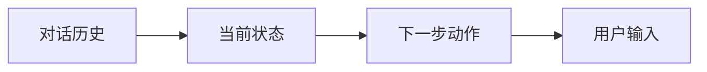
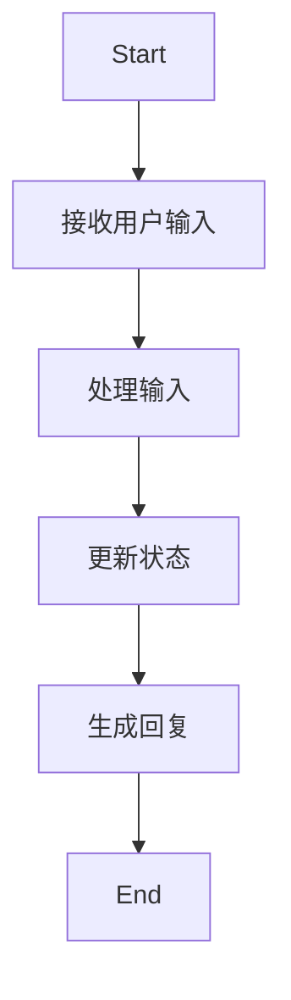
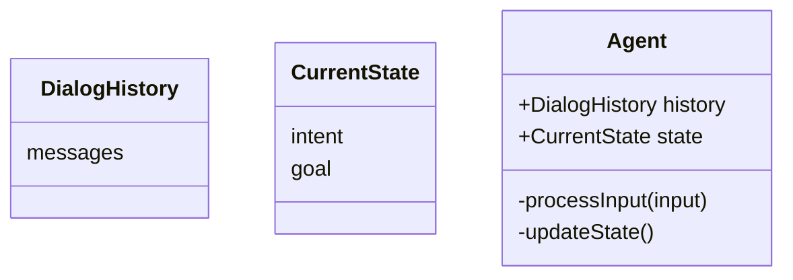
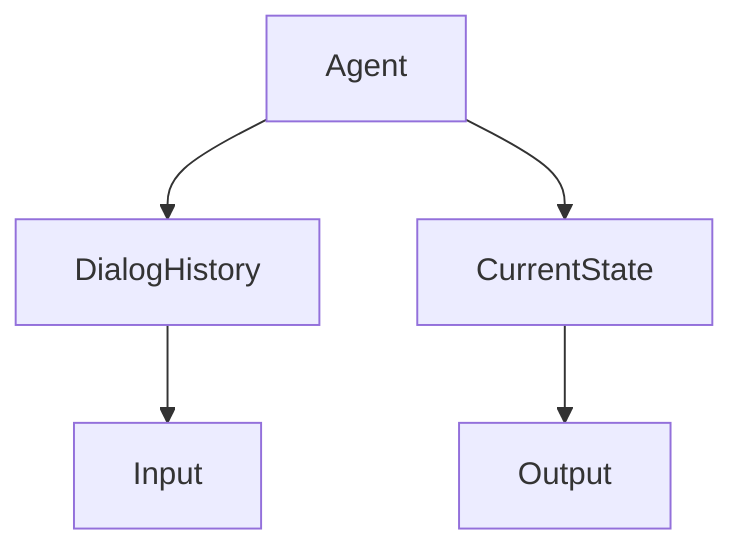

                 


# 构建LLM驱动的AI Agent多轮对话状态追踪

## 关键词：LLM，AI Agent，多轮对话，状态追踪，自然语言处理

## 摘要

随着人工智能技术的快速发展，多轮对话系统在各个领域的应用日益广泛。然而，如何高效准确地追踪对话状态，确保对话的连贯性和有效性，成为构建高效AI Agent的关键挑战。本文将详细探讨如何利用大型语言模型（LLM）构建多轮对话状态追踪系统，涵盖核心概念、算法原理、系统架构设计以及实际项目实现等多方面内容，为读者提供全面的技术指导。

---

## 第一部分: 背景介绍

### 第1章: 多轮对话状态追踪概述

#### 1.1 问题背景

在现代人机交互系统中，多轮对话已成为提升用户体验的重要手段。然而，对话过程中状态信息的丢失或错误识别可能导致对话中断或用户体验下降。传统的基于规则的对话系统难以应对复杂多变的用户输入，而基于LLM的新一代系统虽然在自然语言处理能力上有显著提升，但如何有效追踪对话状态仍是一个待解决的关键问题。

#### 1.2 问题描述

多轮对话过程中，系统需要维护对话历史、当前状态以及下一步动作等信息。这些信息的准确追踪直接影响对话系统的性能。然而，由于用户输入的多样性和复杂性，状态信息容易被忽略或误判，导致对话系统无法正确理解和响应用户的意图。

#### 1.3 问题解决

通过引入LLM，我们可以实现对对话历史的深度分析和对当前状态的准确识别。结合状态更新规则，系统能够在每一轮对话后及时调整状态，确保对话的连贯性和有效性。

#### 1.4 边界与外延

对话状态追踪的边界在于仅关注对话过程中与当前目标相关的状态信息，而不涉及其他系统功能。与相关概念如意图识别和情感分析相比，状态追踪更注重对话的上下文信息和目标导向。

#### 1.5 核心概念结构与组成

- **对话历史记录**：记录用户与系统之间的所有交互信息，用于分析对话上下文。
- **当前对话状态**：描述当前对话的目标或意图，是状态追踪的核心。
- **状态更新规则**：定义如何根据用户输入和系统响应更新对话状态。

---

## 第二部分: 核心概念与联系

### 第2章: 状态追踪的核心原理

#### 2.1 状态追踪的原理

- **基于LLM的意图识别**：利用LLM分析用户输入，提取意图信息。
- **对话历史分析**：通过历史记录理解对话的上下文。
- **状态更新的逻辑**：根据意图识别结果和对话历史更新当前状态。

#### 2.2 实体关系图



#### 2.3 对比分析表

| 概念       | 属性       | 描述                                                                 |
|------------|------------|----------------------------------------------------------------------|
| 对话历史   | 时间顺序   | 用户与系统交互的记录                                                 |
| 当前状态   | 状态变量   | 当前对话的目标或意图                                                 |
| 下一步动作 | 动作类型   | 系统根据状态决定的响应类型                                         |

---

## 第三部分: 算法原理讲解

### 第3章: 状态追踪算法

#### 3.1 算法流程



#### 3.2 算法实现

以下是一个基于概率计算的状态更新算法示例：

$$ P(\text{state}_t | \text{input}_t, \text{state}_{t-1}) $$

其中，$\text{state}_t$ 是当前状态，$\text{input}_t$ 是用户输入，$\text{state}_{t-1}$ 是上一状态。

---

## 第四部分: 系统分析与架构设计

### 第4章: 系统设计

#### 4.1 项目介绍

以电商客服对话系统为例，设计一个基于LLM的状态追踪系统。

#### 4.2 系统功能设计



#### 4.3 系统架构设计



---

## 第五部分: 项目实战

### 第5章: 实战案例

#### 5.1 环境安装

安装必要的库：

```bash
pip install transformers
```

#### 5.2 核心实现

实现状态更新逻辑：

```python
def update_state(current_state, user_input):
    # 使用LLM分析输入
    intent = model.predict(user_input)
    # 更新状态
    new_state = {
        'intent': intent,
        'goal': current_state['goal']
    }
    return new_state
```

---

## 第六部分: 最佳实践与小结

### 第6章: 最佳实践

- **数据质量**：确保训练数据的多样性和代表性。
- **模型选择**：根据具体任务选择合适的LLM。
- **系统优化**：定期更新模型和优化对话流程。

### 6.1 小结

通过本文的详细讲解，读者可以系统地了解如何构建LLM驱动的AI Agent多轮对话状态追踪系统。从核心概念到算法实现，再到系统设计和项目实战，每一部分都为构建高效对话系统提供了重要参考。

---

## 作者

作者：AI天才研究院 & 禅与计算机程序设计艺术

