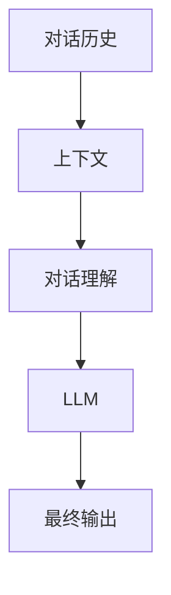
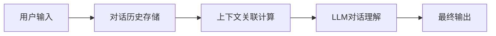

                 


# 《构建LLM驱动的AI Agent多轮对话理解》

> 关键词：大语言模型（LLM）、AI Agent、多轮对话理解、对话历史、上下文关联、系统架构

> 摘要：本文系统地探讨了如何构建基于大语言模型（LLM）的AI Agent多轮对话理解系统。通过分析对话历史与上下文关联，结合算法原理与系统架构设计，提供了一套完整的解决方案。文章从背景、核心概念、算法原理、系统架构到项目实战，层层深入，为读者提供全面的技术指导。

---

# 第一部分: 多轮对话理解的背景与挑战

## 第1章: 多轮对话理解的背景与挑战

### 1.1 问题背景与问题描述

#### 1.1.1 多轮对话理解的定义
多轮对话理解是指在连续的对话过程中，AI Agent能够准确理解用户意图、上下文关系以及对话历史信息，从而生成连贯且合理的回复。

#### 1.1.2 当前对话系统的主要挑战
- 对话历史的复杂性
- 上下文关联的多样性
- 对话理解的实时性要求
- 对话终止条件的不确定性

#### 1.1.3 多轮对话理解的核心问题
- 如何有效处理对话历史信息
- 如何建立上下文关联关系
- 如何实时更新对话理解结果

### 1.2 LLM与AI Agent的结合

#### 1.2.1 大语言模型（LLM）的基本概念
- LLM的定义
- LLM的核心特点：大规模参数、上下文窗口、生成能力

#### 1.2.2 AI Agent的定义与功能
- AI Agent的定义
- AI Agent的主要功能：感知、推理、决策、执行

#### 1.2.3 LLM驱动AI Agent的优势
- 利用LLM的生成能力实现自然对话
- 通过上下文理解实现多轮对话

### 1.3 多轮对话理解的边界与外延

#### 1.3.1 对话历史的重要性
- 对话历史是多轮对话理解的基础
- 对话历史的存储与管理

#### 1.3.2 上下文关联的处理方式
- 上下文的定义与表示
- 上下文关联的计算与更新

#### 1.3.3 对话终止的条件与机制
- 对话终止的条件
- 终止机制的设计

### 1.4 核心概念与联系

#### 1.4.1 LLM与多轮对话理解的关系
- LLM作为多轮对话理解的核心模块
- 多轮对话理解为LLM提供上下文信息

#### 1.4.2 对话历史与上下文的关联
- 对话历史是上下文的基础
- 上下文是对话历史的扩展

#### 1.4.3 多轮对话理解的实体关系图



---

## 第2章: 多轮对话理解的核心算法原理

### 2.1 对话历史的处理机制

#### 2.1.1 基于LLM的对话历史编码
- 对话历史的序列表示
- 基于注意力机制的编码方法

#### 2.1.2 对话历史的序列建模
- 基于RNN的对话历史建模
- 基于Transformer的对话历史建模

#### 2.1.3 基于注意力机制的对话历史处理
- 注意力机制的定义
- 对话历史注意力权重的计算

### 2.2 多轮对话理解的算法流程

#### 2.2.1 对话历史的输入方式
- 序列输入
- 分段输入

#### 2.2.2 上下文关联的计算方法
- 基于相似度的计算
- 基于概率的计算

#### 2.2.3 对话理解的输出机制
- 确定性输出
- 概率性输出

### 2.3 基于LLM的对话理解模型

#### 2.3.1 模型输入的构造
- 对话历史的整合
- 上下文的嵌入

#### 2.3.2 对话历史的嵌入表示
- 基于词嵌入的对话历史表示
- 基于句嵌入的对话历史表示

#### 2.3.3 基于LLM的对话预测
- 基于生成模型的对话预测
- 基于检索模型的对话预测

---

## 第3章: 多轮对话理解的系统架构设计

### 3.1 系统功能模块划分

#### 3.1.1 对话历史存储模块
- 对话历史的存储方式
- 对话历史的查询与更新

#### 3.1.2 上下文关联计算模块
- 上下文关联的计算逻辑
- 上下文关联的更新机制

#### 3.1.3 对话理解输出模块
- 对话理解的输出格式
- 对话理解的反馈机制

### 3.2 系统架构图



### 3.3 系统接口设计

#### 3.3.1 对话历史接口
- 对话历史的获取接口
- 对话历史的更新接口

#### 3.3.2 上下文关联接口
- 上下文关联的计算接口
- 上下文关联的更新接口

#### 3.3.3 对话理解接口
- 对话理解的请求接口
- 对话理解的响应接口

---

## 第4章: 多轮对话理解的数学模型与公式

### 4.1 对话历史编码的数学表示

#### 4.1.1 对话历史序列的表示
- 对话历史序列的表示方法
- 对话历史序列的向量化

#### 4.1.2 基于注意力机制的编码公式
$$\text{Attention}(Q,K,V) = \text{softmax}\left(\frac{QK^T}{\sqrt{d_k}}\right)V$$

### 4.2 上下文关联的计算公式

#### 4.2.1 上下文相似度的计算
$$\text{Similarity}(C_i, C_j) = \frac{C_i \cdot C_j}{\|C_i\|\|C_j\|}$$

#### 4.2.2 上下文概率的计算
$$P(C_j|C_i) = \frac{\exp(\text{sim}(C_i, C_j))}{\sum_{k} \exp(\text{sim}(C_i, C_k))}$$

### 4.3 对话理解的输出模型

#### 4.3.1 对话预测的生成模型
$$P(y|x) = \text{softmax}(Wx + b)$$

#### 4.3.2 对话预测的检索模型
$$P(y|x) = \sum_{i} P(y|c_i)P(c_i|x)$$

---

## 第5章: 多轮对话理解的项目实战

### 5.1 环境安装与配置

#### 5.1.1 开发环境的选择
- Python版本要求
- 依赖库的安装

#### 5.1.2 LLM模型的下载与配置
- 模型选择
- 模型加载

### 5.2 系统核心实现

#### 5.2.1 对话历史存储模块的实现
- 数据结构设计
- 代码实现

#### 5.2.2 上下文关联计算模块的实现
- 算法实现
- 代码实现

#### 5.2.3 对话理解输出模块的实现
- 接口设计
- 代码实现

### 5.3 代码实现与解读

#### 5.3.1 对话历史存储模块的代码实现
```python
class DialogHistory:
    def __init__(self):
        self.history = []
    
    def add(self, utterance):
        self.history.append(utterance)
    
    def get(self, index):
        return self.history[index]
```

#### 5.3.2 上下文关联计算模块的代码实现
```python
class ContextCalculator:
    def __init__(self):
        self.contexts = {}
    
    def update(self, utterance, context_id):
        self.contexts[context_id] = utterance
    
    def get_context(self, context_id):
        return self.contexts.get(context_id, "")
```

### 5.4 案例分析与详细解读

#### 5.4.1 案例背景
- 用户需求分析
- 对话场景设定

#### 5.4.2 实际对话过程
- 对话历史的记录
- 上下文关联的计算
- 对话理解的输出

### 5.5 项目小结

#### 5.5.1 项目实现的关键点
- 对话历史的高效存储
- 上下文关联的准确计算
- 对话理解的高效输出

#### 5.5.2 项目实现的难点
- 对话历史的管理
- 上下文关联的动态更新
- 对话理解的实时性

---

## 第6章: 最佳实践与小结

### 6.1 最佳实践 tips

#### 6.1.1 对话历史的管理
- 定期清理过时的对话历史
- 建立对话历史的索引机制

#### 6.1.2 上下文关联的优化
- 使用更复杂的上下文建模方法
- 引入领域知识进行上下文优化

#### 6.1.3 对话理解的优化
- 结合领域知识进行对话理解
- 引入用户反馈进行模型优化

### 6.2 项目小结

#### 6.2.1 核心内容回顾
- 多轮对话理解的背景与挑战
- LLM驱动AI Agent的核心算法
- 系统架构设计与实现
- 项目实战与案例分析

#### 6.2.2 未来研究方向
- 更高效的对话历史处理方法
- 更精准的上下文关联计算
- 更智能的对话理解模型

---

## 作者：AI天才研究院/AI Genius Institute & 禅与计算机程序设计艺术 /Zen And The Art of Computer Programming

