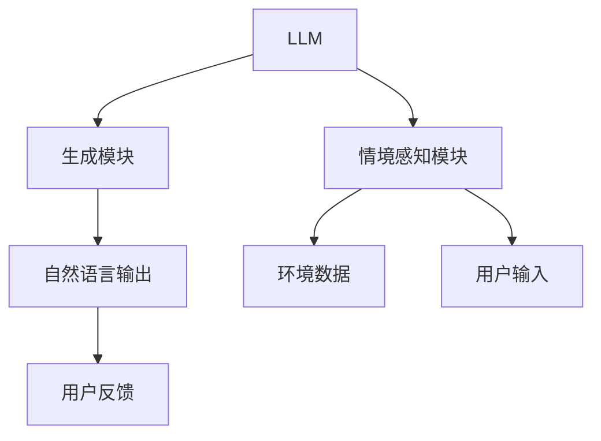
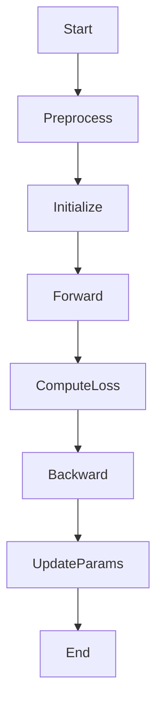
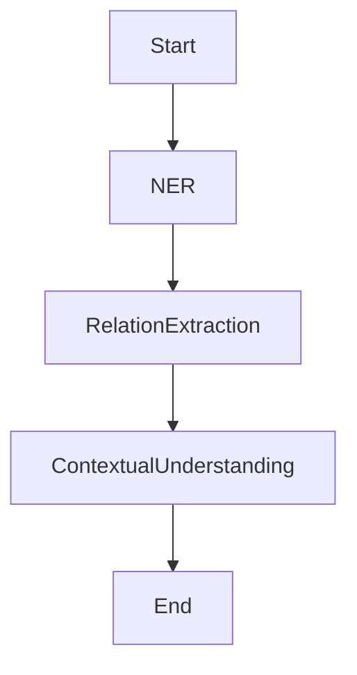
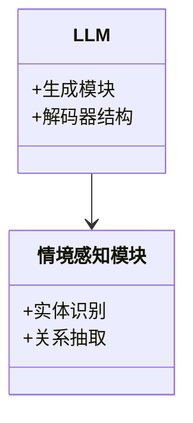
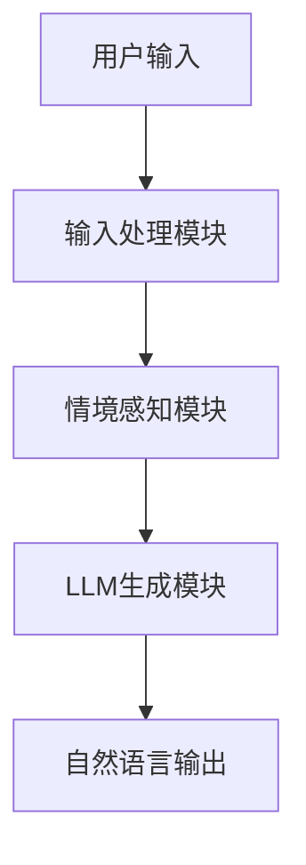

                 


# 构建LLM驱动的AI Agent情境感知系统

## 关键词：LLM, AI Agent, 情境感知, 系统架构, 算法原理

## 摘要：本文详细探讨了如何利用大语言模型（LLM）构建具备情境感知能力的AI Agent系统。通过分析LLM的基本原理、情境感知的核心机制，结合系统的架构设计和算法实现，本文为读者提供了从理论到实践的全面指导，帮助开发者构建高效、智能的AI Agent系统。

---

## 第一部分: LLM驱动的AI Agent情境感知系统背景介绍

### 第1章: 问题背景与目标

#### 1.1 问题背景

##### 1.1.1 当前AI技术的发展现状
近年来，人工智能技术发展迅猛，尤其是在大语言模型（LLM）领域取得了显著突破。LLM如GPT-3、GPT-4等模型，以其强大的生成能力和理解能力，成为构建智能系统的核心技术之一。然而，现有LLM的应用大多集中在文本生成、对话系统等领域，如何将LLM与情境感知结合，构建更智能的AI Agent，成为当前研究的热点。

##### 1.1.2 LLM在AI Agent中的应用潜力
AI Agent（智能代理）是一种能够感知环境、执行任务的智能实体。传统的AI Agent通常依赖于规则或有限的训练数据，难以处理复杂多变的现实场景。而LLM的强大能力为AI Agent提供了更强大的语义理解和生成能力，使其能够更好地适应动态环境。

##### 1.1.3 情境感知系统的核心问题
情境感知是指系统能够理解当前环境的状态、用户的需求以及可能的后续动作。在构建LLM驱动的AI Agent时，如何有效提取和利用情境信息，是实现高效任务执行的关键挑战。

#### 1.2 问题描述

##### 1.2.1 LLM驱动的AI Agent定义
LLM驱动的AI Agent是一种结合了大语言模型的生成能力和情境感知技术的智能系统。它能够通过自然语言处理技术理解用户需求，利用情境信息做出决策，并通过LLM生成合适的响应或动作。

##### 1.2.2 情境感知的关键挑战
- **信息不完整**：环境信息可能存在缺失，导致感知错误。
- **动态变化**：环境状态可能随时变化，需要系统具备实时感知能力。
- **复杂场景**：不同场景下的感知需求各不相同，系统需要具备灵活性和适应性。

##### 1.2.3 系统目标与边界
系统目标：构建一个能够理解用户需求、感知环境状态，并通过LLM生成相应动作的AI Agent系统。
系统边界：限定在LLM驱动的AI Agent领域，不涉及硬件设备或其他外部系统的集成。

### 第2章: 核心概念与联系

#### 2.1 核心概念原理

##### 2.1.1 LLM的基本原理
LLM通过大规模的预训练数据学习语言模型的参数，能够生成与上下文相关的文本。其核心在于解码器结构和注意力机制。

##### 2.1.2 情境感知的核心机制
情境感知通过分析环境信息、用户输入和历史数据，提取关键特征，生成对当前场景的理解。

##### 2.1.3 二者的结合方式
LLM作为生成模块，负责根据情境感知的结果生成自然语言响应；情境感知模块则为LLM提供上下文信息，使其生成更准确的输出。

#### 2.2 概念属性特征对比

| 特征维度 | LLM | 情境感知 |
|----------|-----|----------|
| 输入类型 | 文本数据 | 环境数据、用户数据 |
| 输出类型 | 文本生成 | 上下文理解、实体识别 |
| 核心能力 | 生成能力 | 理解能力 |

#### 2.3 ER实体关系图



---

## 第二部分: LLM驱动的AI Agent情境感知系统算法原理

### 第3章: LLM算法原理

#### 3.1 LLM的核心算法

##### 3.1.1 注意力机制
注意力机制（Attention Mechanism）用于计算输入序列中各位置的重要性权重，公式如下：

$$\alpha_i = \frac{\exp(e_i)}{\sum_{j} \exp(e_j)}$$

其中，$e_i$ 是第i个位置的编码值。

##### 3.1.2 解码器结构
解码器负责将输入转换为输出序列，通常包括自注意力机制和前馈网络。

##### 3.1.3 模型训练流程
1. 数据预处理：清洗和分词。
2. 模型初始化：随机初始化参数。
3. 前向传播：输入序列经过编码器和解码器。
4. 损失计算：使用交叉熵损失。
5. 反向传播：更新模型参数。

#### 3.2 算法流程图



### 第4章: 情境感知算法

#### 4.1 情境感知的核心算法

##### 4.1.1 实体识别
实体识别通过命名实体识别（NER）技术，从文本中提取人名、地名等实体。

##### 4.1.2 关系抽取
关系抽取通过依赖解析或模式匹配，识别文本中的语义关系。

##### 4.1.3 上下文理解
上下文理解基于上下文表示模型（如BERT），生成语义向量。

#### 4.2 算法流程图



---

## 第三部分: 系统分析与架构设计

### 第5章: 系统功能设计

#### 5.1 功能需求分析

##### 5.1.1 用户需求
- 实时对话交互
- 多场景适应
- 高效任务执行

##### 5.1.2 系统功能模块
- 输入处理模块
- 情境感知模块
- LLM生成模块
- 输出反馈模块

##### 5.1.3 功能优先级
优先实现核心功能，如情境感知和LLM生成，再逐步扩展其他功能。

#### 5.2 领域模型设计

##### 5.2.1 领域模型类图



### 第6章: 系统架构设计

#### 6.1 系统架构图



#### 6.2 系统接口设计

##### 6.2.1 API接口
- 输入接口：接收用户输入文本。
- 输出接口：返回生成文本或执行结果。

##### 6.2.2 交互流程
1. 用户输入：用户发送查询或指令。
2. 输入处理：解析输入并提取关键信息。
3. 情境感知：分析环境和用户需求。
4. LLM生成：根据情境生成响应。
5. 输出反馈：返回结果给用户。

---

## 第四部分: 项目实战

### 第7章: 环境安装与核心实现

#### 7.1 环境安装
安装Python、PyTorch、Hugging Face库等。

#### 7.2 核心代码实现

##### 7.2.1 情境感知模块

```python
from transformers import pipeline

ner = pipeline("ner")
relations = pipeline("relation-extraction")
```

##### 7.2.2 LLM生成模块

```python
from transformers import AutoModelForCausalLM, AutoTokenizer

model = AutoModelForCausalLM.from_pretrained("gpt-2")
tokenizer = AutoTokenizer.from_pretrained("gpt-2")
```

#### 7.3 代码应用解读与分析
代码实现了基本的NER和关系抽取功能，以及LLM的文本生成功能。

#### 7.4 实际案例分析
通过一个客服对话案例，展示系统如何结合情境感知和LLM生成响应。

---

## 第五部分: 最佳实践与总结

### 第8章: 总结与注意事项

#### 8.1 总结
本文详细介绍了构建LLM驱动的AI Agent情境感知系统的背景、核心概念、算法原理和系统架构，并通过项目实战展示了实现过程。

#### 8.2 注意事项
- 数据质量对系统性能影响重大，需确保数据多样性。
- 系统需要定期更新模型以适应新场景。
- 注意隐私和数据安全问题。

### 第9章: 拓展阅读与参考文献

#### 9.1 拓展阅读
推荐相关书籍和论文，供读者深入学习。

#### 9.2 参考文献
列出文章中引用的主要文献和资料。

---

## 作者：AI天才研究院 & 禅与计算机程序设计艺术

---

以上是《构建LLM驱动的AI Agent情境感知系统》的完整目录和内容大纲，涵盖从理论到实践的各个方面，旨在为读者提供全面的技术指导。

