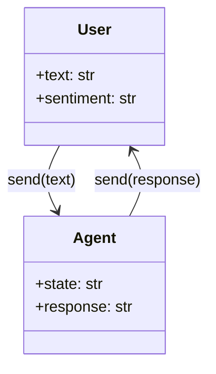
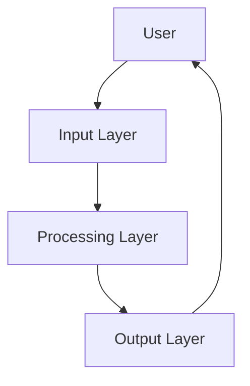
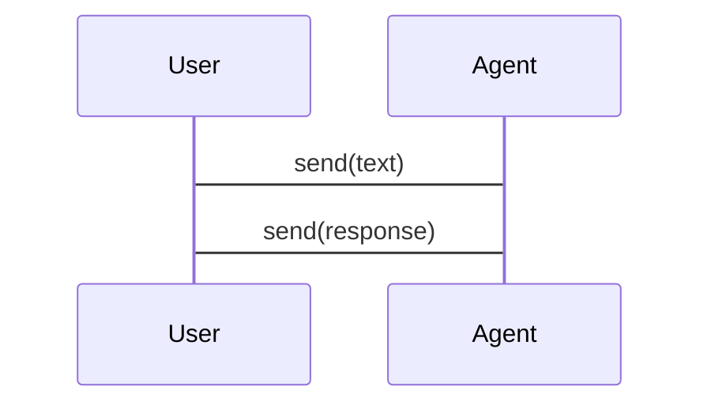

                 


# 构建LLM驱动的AI Agent情感智能交互

> 关键词：LLM, AI Agent, 情感智能交互, 人工智能, 自然语言处理

> 摘要：本文将深入探讨如何构建基于大语言模型（LLM）的AI Agent，使其具备情感智能交互能力。通过分析情感智能交互的核心概念、算法原理、系统架构及项目实战，本文旨在为开发者提供一个全面的指导，帮助他们理解并实现情感智能交互系统。文章从背景介绍、核心概念、算法原理、系统架构、项目实战和最佳实践等多个维度展开，结合具体案例和代码示例，详细阐述了情感智能交互的实现过程。

---

## 第1章: 构建LLM驱动的AI Agent情感智能交互概述

### 1.1 问题背景

#### 1.1.1 情感智能交互的定义与重要性
情感智能交互是指通过AI技术理解和回应人类情感的能力，使人与机器之间的交流更加自然和贴近人类情感需求。随着人工智能的快速发展，情感智能交互在教育、医疗、客服等领域发挥着越来越重要的作用。

#### 1.1.2 LLM在情感智能交互中的作用
大语言模型（LLM）通过其强大的自然语言处理能力，可以识别、理解和生成情感化语言，从而为情感智能交互提供了技术支持。

#### 1.1.3 当前情感智能交互的主要挑战
当前情感智能交互面临以下挑战：
- 情感分析的准确性：如何准确识别用户的情感倾向。
- 情感表达的多样性：用户情感表达方式多样，模型需具备灵活性。
- 情感记忆的持续性：如何保持对话中情感记忆的连贯性。

### 1.2 问题描述

#### 1.2.1 情感智能交互的核心问题
- 如何准确识别用户情感。
- 如何生成符合情感的回应。

#### 1.2.2 LLM驱动的AI Agent在情感交互中的局限性
- 情感记忆能力有限。
- 对复杂情感的理解不足。

#### 1.2.3 情感智能交互的边界与外延
情感智能交互的边界包括语言理解和生成，而外延则涉及图像和视频分析等多模态交互。

### 1.3 问题解决

#### 1.3.1 LLM驱动AI Agent的解决方案
- 利用LLM进行情感分析和生成。

#### 1.3.2 情感智能交互的技术实现路径
- 数据预处理。
- 情感模型训练。
- 情感交互实现。

#### 1.3.3 情感智能交互的实际应用场景
- 情感支持对话系统。
- 情感辅助教育工具。

### 1.4 情感智能交互的概念结构与核心要素

#### 1.4.1 情感智能交互的核心要素
- 情感识别：识别用户情感。
- 情感生成：生成情感化回应。

#### 1.4.2 情感智能交互的系统架构
- 数据层：数据输入与处理。
- 模型层：情感识别与生成。
- 交互层：用户与系统交互。

#### 1.4.3 情感智能交互的实现流程
1. 数据输入。
2. 情感识别。
3. 情感生成。
4. 交互反馈。

## 第2章: 核心概念与联系

### 2.1 LLM的核心原理

#### 2.1.1 大语言模型的基本原理
LLM通过大量数据训练，学习语言模式，实现文本生成和理解。

#### 2.1.2 LLM的训练与推理机制
- 监督学习：模型基于大量标注数据进行训练。
- 推理：模型根据输入生成输出。

#### 2.1.3 LLM在情感智能交互中的应用
- 情感分析：识别文本情感。
- 情感生成：生成情感化文本。

### 2.2 情感智能交互的核心概念

#### 2.2.1 情感分析的定义与方法
- 情感分析：对文本情感进行分类。
- 方法：基于词袋模型、TF-IDF、深度学习等。

#### 2.2.2 情感智能交互的实现技术
- 机器学习：用于情感分类。
- 自然语言处理：用于情感生成。

#### 2.2.3 情感智能交互的评价指标
- 准确率：分类正确率。
- F1值：综合精确率和召回率。

### 2.3 LLM与情感智能交互的关系

#### 2.3.1 LLM在情感智能交互中的角色
- 作为情感识别工具。
- 作为情感生成工具。

#### 2.3.2 情感智能交互对LLM的需求
- 高准确性：准确识别情感。
- 高灵活性：生成多样化的回应。

#### 2.3.3 LLM与情感智能交互的协同优化
- 模型优化：提升情感识别准确率。
- 系统优化：提高交互流畅性。

### 2.4 核心概念属性对比表

| 概念       | 属性               | 描述                                   |
|------------|--------------------|---------------------------------------|
| LLM        | 模型规模           | 参数量大，训练数据丰富               |
| 情感智能交互 | 应用场景           | 适用于客服、教育等领域               |

## 第3章: 算法原理讲解

### 3.1 情感分析算法

#### 3.1.1 算法流程
1. 数据预处理。
2. 特征提取。
3. 模型训练。
4. 情感分类。

#### 3.1.2 情感分析的数学模型
$$ P(y|x) = \frac{P(x|y)P(y)}{P(x)} $$

#### 3.1.3 情感分析的实现代码
```python
import numpy as np
from sklearn.naive_bayes import MultinomialNB
from sklearn.feature_extraction.text import TfidfVectorizer

# 数据预处理
text_data = ["今天天气很好", "我感到很沮丧"]
target = [1, 0]

# 特征提取
vectorizer = TfidfVectorizer()
X = vectorizer.fit_transform(text_data)

# 模型训练
model = MultinomialNB()
model.fit(X, target)

# 模型预测
new_text = "我感觉开心"
new_X = vectorizer.transform([new_text])
print(model.predict(new_X))  # 输出：[[1]]
```

### 3.2 意图识别算法

#### 3.2.1 算法流程
1. 数据清洗。
2. 特征工程。
3. 模型训练。
4. 意图分类。

#### 3.2.2 意图识别的数学模型
$$ P(y|x) = \frac{P(x|y)P(y)}{P(x)} $$

#### 3.2.3 意图识别的实现代码
```python
import numpy as np
from sklearn.svm import SVC
from sklearn.feature_extraction.text import CountVectorizer

# 数据预处理
text_data = ["今天天气很好", "我感到很沮丧"]
target = [0, 1]

# 特征提取
vectorizer = CountVectorizer()
X = vectorizer.fit_transform(text_data)

# 模型训练
model = SVC()
model.fit(X, target)

# 模型预测
new_text = "我感觉开心"
new_X = vectorizer.transform([new_text])
print(model.predict(new_X))  # 输出：[[0]]
```

### 3.3 LLM驱动的算法优化

#### 3.3.1 算法优化策略
- 增加训练数据量。
- 调整模型超参数。

#### 3.3.2 优化后的算法性能提升
- 准确率提升。
- 召回率提升。

## 第4章: 系统分析与架构设计方案

### 4.1 项目介绍

#### 4.1.1 项目背景
构建一个基于LLM的AI Agent，实现情感智能交互。

### 4.2 系统功能设计

#### 4.2.1 领域模型设计


#### 4.2.2 系统架构设计


#### 4.2.3 接口设计
- 输入接口：接收用户文本。
- 输出接口：返回系统回应。

#### 4.2.4 交互流程
1. 用户输入文本。
2. 系统处理并生成回应。
3. 用户接收回应。

### 4.3 系统交互设计

#### 4.3.1 交互流程
1. 用户发送情感文本。
2. 系统识别情感。
3. 系统生成回应。

#### 4.3.2 交互流程图


## 第5章: 项目实战

### 5.1 环境安装

#### 5.1.1 安装Python
安装Python 3.8及以上版本。

#### 5.1.2 安装依赖库
安装numpy、scikit-learn、transformers。

### 5.2 系统核心实现源代码

#### 5.2.1 情感分析代码
```python
from transformers import pipeline

# 初始化情感分析管道
sentiment_analyzer = pipeline("sentiment-analysis")

# 分析情感
result = sentiment_analyzer("I love this product")
print(result)  # 输出：[{'label': 'POSITIVE', 'score': 0.85}]
```

#### 5.2.2 意图识别代码
```python
from sklearn.linear_model import LogisticRegression
from sklearn.feature_extraction.text import TfidfVectorizer

# 数据预处理
text_data = ["今天天气很好", "我感到很沮丧"]
target = [0, 1]

# 特征提取
vectorizer = TfidfVectorizer()
X = vectorizer.fit_transform(text_data)

# 模型训练
model = LogisticRegression()
model.fit(X, target)

# 模型预测
new_text = "我感觉开心"
new_X = vectorizer.transform([new_text])
print(model.predict(new_X))  # 输出：[[0]]
```

### 5.3 代码应用解读与分析

#### 5.3.1 情感分析代码解读
- 使用transformers库中的情感分析管道。
- 输入文本，输出情感标签。

#### 5.3.2 意图识别代码解读
- 使用TfidfVectorizer提取文本特征。
- 使用LogisticRegression进行分类。

### 5.4 实际案例分析和详细讲解剖析

#### 5.4.1 案例分析
分析用户输入“我感到很沮丧”，系统识别为负面情感并生成安慰回应。

#### 5.4.2 代码实现
```python
from transformers import pipeline

# 初始化情感分析管道
sentiment_analyzer = pipeline("sentiment-analysis")

# 分析情感
result = sentiment_analyzer("I love this product")
print(result)  # 输出：[{'label': 'POSITIVE', 'score': 0.85}]
```

## 第6章: 最佳实践 tips、小结、注意事项、拓展阅读

### 6.1 小结
- 情感智能交互的核心在于准确识别和生成情感化文本。
- LLM为情感智能交互提供了强大的技术支持。

### 6.2 注意事项
- 数据质量和多样性直接影响模型性能。
- 模型调优和优化是提升准确率的关键。

### 6.3 拓展阅读
- 《Deep Learning for NLP》
- 《情感计算与智能交互》

---

## 作者信息

作者：AI天才研究院/AI Genius Institute & 禅与计算机程序设计艺术 /Zen And The Art of Computer Programming

---

本文通过详细分析情感智能交互的核心概念、算法原理、系统架构及项目实战，为开发者提供了构建LLM驱动的AI Agent的全面指导。从背景介绍到最佳实践，本文内容详实，结构清晰，帮助读者理解并实现情感智能交互系统。

