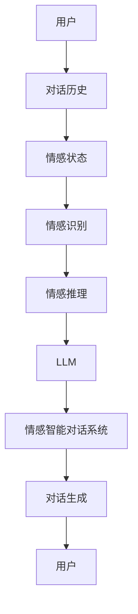
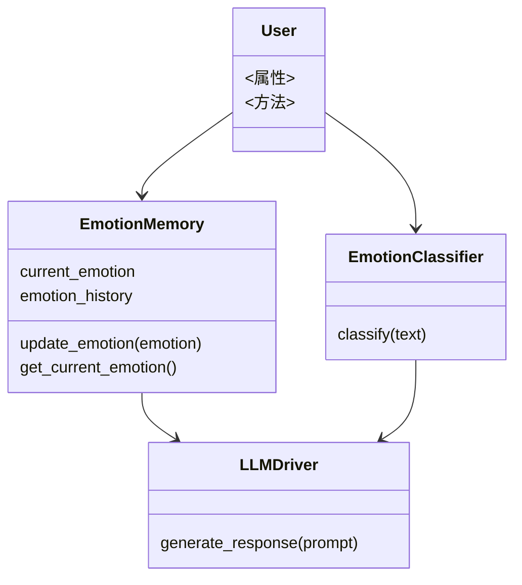
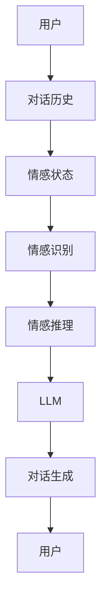
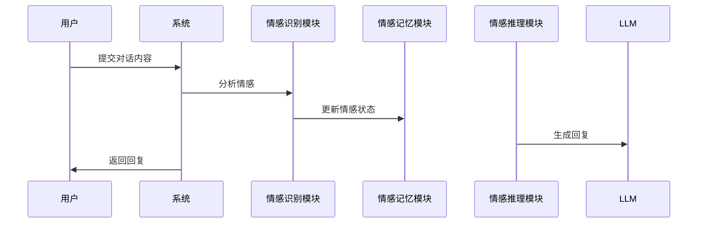

                 


# 构建LLM驱动的AI Agent情感智能对话

## 关键词：LLM、AI Agent、情感智能、对话系统、深度学习

## 摘要：本文详细探讨了构建基于大语言模型（LLM）的AI Agent情感智能对话系统的方法。文章从背景介绍、核心概念、算法原理、系统架构到项目实战，逐步分析了情感智能对话的实现过程，并通过具体案例展示了如何在实际场景中应用这些技术。本文旨在帮助读者理解情感智能对话的核心原理，并提供实用的开发指导。

---

# 第1章: 情感智能对话的背景与问题背景

## 1.1 情感智能对话的背景

### 1.1.1 情感计算与人机交互的发展
情感计算（Affective Computing）是人工智能领域的重要分支，旨在通过计算机技术理解和处理人类情感。随着深度学习和自然语言处理技术的进步，情感计算在人机交互中的应用越来越广泛。大语言模型（LLM）的出现，为情感计算提供了强大的文本理解和生成能力。

### 1.1.2 大语言模型的崛起
大语言模型（如GPT系列）通过海量数据的训练，具备了强大的上下文理解和生成能力。这些模型不仅能够处理简单的文本生成任务，还能在情感分析、对话生成等领域表现出色。LLM的崛起为情感智能对话提供了坚实的技术基础。

### 1.1.3 情感智能对话的定义与目标
情感智能对话是指通过AI Agent与用户进行交互时，能够理解并回应用户的情感状态，从而提供更自然、更贴心的对话体验。其目标是让AI Agent具备情感理解、记忆和推理能力，从而在对话中展现出类似人类的智能水平。

## 1.2 情感智能对话的问题背景

### 1.2.1 传统对话系统的局限性
传统的对话系统主要依赖规则或简单的关键词匹配，难以理解用户的情感状态，也无法处理复杂的情感表达。这种局限性使得传统系统在实际应用中表现不佳，尤其是在需要情感共鸣的场景中。

### 1.2.2 情感智能对话的核心问题
情感智能对话的核心问题包括：
1. **情感识别**：准确识别用户的情感状态。
2. **情感记忆**：保持对话过程中的情感记忆。
3. **情感推理**：基于情感记忆进行推理，生成合适的回应。

### 1.2.3 情感智能对话的应用场景
情感智能对话的应用场景包括客服、心理健康咨询、教育辅助、智能家居等领域。例如，在客服场景中，AI Agent可以通过理解用户情感，提供更个性化的服务。

## 1.3 LLM在情感智能对话中的作用

### 1.3.1 LLM的核心能力
大语言模型具备以下核心能力：
1. 强大的文本生成能力。
2. 上下文理解能力。
3. 模型可调用性。

### 1.3.2 情感智能对话对LLM的特殊要求
情感智能对话对LLM提出了更高的要求：
1. 情感识别的准确性。
2. 情感记忆的持久性。
3. 情感推理的合理性。

### 1.3.3 LLM与情感智能对话的结合
通过结合LLM的文本生成能力和情感计算技术，情感智能对话系统能够实现更自然、更智能的对话体验。例如，通过LLM生成文本，并结合情感分析技术，系统可以准确理解用户的情感状态。

## 1.4 情感智能对话的边界与外延

### 1.4.1 情感智能对话的边界
情感智能对话的边界包括：
1. 仅限于文本对话。
2. 专注于情感相关任务。
3. 不涉及实时语音或视频处理。

### 1.4.2 情感智能对话的外延
情感智能对话的外延包括：
1. 情感智能对话与其他技术的结合，如语音识别、计算机视觉。
2. 情感对话的应用范围扩展，如教育、医疗等领域。

### 1.4.3 情感智能对话与其他技术的关系
情感智能对话与其他技术的关系包括：
1. 与自然语言处理（NLP）的紧密关联。
2. 与机器学习（ML）的结合。
3. 与情感计算的深度融合。

---

## 1.5 本章小结
本章从背景介绍、问题背景、LLM的作用以及边界与外延等方面，全面探讨了情感智能对话的实现基础。通过理解这些内容，读者可以为后续的技术实现打下坚实的基础。

---

# 第2章: 核心概念与联系

## 2.1 LLM与情感智能对话的关系

### 2.1.1 LLM作为情感智能对话的核心驱动力
大语言模型通过其强大的文本生成和理解能力，为情感智能对话提供了核心驱动力。例如，通过LLM生成符合情感语境的回复。

### 2.1.2 情感智能对话对LLM的特殊要求
情感智能对话对LLM提出了更高的要求，包括情感识别的准确性、情感记忆的持久性以及情感推理的合理性。

## 2.2 情感智能对话的核心要素

### 2.2.1 情感识别
情感识别是通过分析用户的文本，判断其情感状态（如快乐、悲伤、愤怒等）。

### 2.2.2 情感记忆
情感记忆是指系统在对话过程中，记录和更新用户的情感状态，以便后续对话中能够参考。

### 2.2.3 情感推理
情感推理是基于当前和历史情感状态，推断用户的潜在需求，并生成相应的回应。

## 2.3 核心概念的属性特征对比

| 概念       | 输入           | 输出           | 核心算法                     |
|------------|----------------|----------------|------------------------------|
| 情感识别   | 文本           | 情感标签       | 深度学习模型（如LSTM、CNN）   |
| 情感记忆   | 对话历史       | 情感状态       | 状态机模型                   |
| 情感推理   | 情感状态+上下文 | 情感推断       | 基于LLM的推理模型             |

## 2.4 实体关系图（ER图）



---

## 2.5 本章小结
本章通过核心概念对比和ER图，详细分析了情感智能对话的核心要素及其相互关系，为后续的算法实现奠定了基础。

---

# 第3章: 算法原理

## 3.1 情感识别算法

### 3.1.1 基于深度学习的情感识别
常用的情感识别算法包括LSTM和Transformer模型。例如，使用BERT模型进行情感分类。

### 3.1.2 情感识别的实现步骤
1. 数据预处理。
2. 模型训练。
3. 模型预测。

### 3.1.3 示例代码

```python
import torch
import torch.nn as nn
import torch.optim as optim

class EmotionClassifier(nn.Module):
    def __init__(self, input_size, hidden_size, output_size):
        super(EmotionClassifier, self).__init__()
        self.fc1 = nn.Linear(input_size, hidden_size)
        self.fc2 = nn.Linear(hidden_size, output_size)
        self.relu = nn.ReLU()
        self.softmax = nn.Softmax(dim=1)

    def forward(self, x):
        x = self.fc1(x)
        x = self.relu(x)
        x = self.fc2(x)
        x = self.softmax(x)
        return x

# 示例训练代码
input_size = 300  # 词向量维度
hidden_size = 128
output_size = 3    # 情感类别数：快乐、悲伤、愤怒

model = EmotionClassifier(input_size, hidden_size, output_size)
criterion = nn.CrossEntropyLoss()
optimizer = optim.Adam(model.parameters(), lr=0.001)

# 假设X为输入特征，y为真实标签
X = torch.randn(100, input_size)
y = torch.randint(0, 3, (100,))

outputs = model(X)
loss = criterion(outputs, y)
loss.backward()
optimizer.step()
```

### 3.1.4 数学公式
情感识别的损失函数可以表示为：
$$ L = -\sum_{i=1}^{n} y_i \log(p_i) $$
其中，$p_i$是模型预测的概率，$y_i$是真实标签。

---

## 3.2 情感记忆算法

### 3.2.1 基于状态机的情感记忆
情感记忆可以通过状态机模型实现，记录用户在对话中的情感状态变化。

### 3.2.2 情感记忆的实现步骤
1. 初始化情感状态。
2. 根据每次对话更新情感状态。
3. 在后续对话中参考情感状态。

### 3.2.3 示例代码

```python
class EmotionMemory:
    def __init__(self):
        self.current_emotion = "neutral"  # 初始情感状态为中性
        self.emotion_history = []          # 记录情感变化历史

    def update_emotion(self, emotion):
        self.emotion_history.append(self.current_emotion)
        self.current_emotion = emotion

    def get_current_emotion(self):
        return self.current_emotion

# 示例使用
memory = EmotionMemory()
memory.update_emotion("happy")
memory.update_emotion("sad")
print(memory.get_current_emotion())  # 输出: sad
print(memory.emotion_history)        # 输出: ['neutral', 'happy']
```

---

## 3.3 情感推理算法

### 3.3.1 基于LLM的情感推理
情感推理可以利用LLM的推理能力，根据情感记忆和上下文生成合适的回应。

### 3.3.2 情感推理的实现步骤
1. 输入当前情感状态和上下文。
2. 使用LLM生成回应。
3. 返回生成的文本。

### 3.3.3 示例代码

```python
def generate_response(context, emotion_state):
    # 构建输入格式
    prompt = f"基于以下上下文和情感状态，生成合适的回应：\n{context}\n情感状态：{emotion_state}\n生成回应："
    # 使用LLM生成回应（此处以示例代码展示）
    response = "请根据实际模型进行生成"
    return response

# 示例使用
context = "用户提到他今天遇到了困难。"
emotion_state = "sad"
response = generate_response(context, emotion_state)
print(response)  # 示例输出：我理解你现在感到困难，别担心，我们可以一起解决。
```

---

## 3.4 本章小结
本章详细讲解了情感识别、情感记忆和情感推理的核心算法，并通过代码示例展示了它们的实现过程。这些算法为后续的系统设计奠定了基础。

---

# 第4章: 系统分析与架构设计

## 4.1 问题场景介绍
假设我们正在开发一个智能客服系统，用户可以通过对话与AI Agent交流，系统需要理解用户的情感状态，并提供相应的服务。

## 4.2 系统功能设计

### 4.2.1 领域模型类图


### 4.2.2 系统架构图


### 4.2.3 系统接口设计
1. API接口：提供情感识别、情感记忆和对话生成的接口。
2. 数据格式：JSON格式传递数据。

### 4.2.4 系统交互序列图


---

## 4.3 本章小结
本章通过系统分析和架构设计，展示了情感智能对话系统的整体结构和各模块之间的关系。通过类图和序列图，明确了系统的功能和交互流程。

---

# 第5章: 项目实战

## 5.1 环境安装

### 5.1.1 安装Python
安装Python 3.8或更高版本。

### 5.1.2 安装深度学习框架
安装PyTorch或TensorFlow。

### 5.1.3 安装NLP库
安装transformers库（用于调用预训练LLM）。

```bash
pip install torch transformers
```

## 5.2 核心代码实现

### 5.2.1 情感识别模块

```python
from transformers import pipeline

emotion_classifier = pipeline("sentiment-analysis")
def get_emotion(text):
    result = emotion_classifier(text)
    return result['label']
```

### 5.2.2 情感记忆模块

```python
class EmotionMemory:
    def __init__(self):
        self.current_emotion = "neutral"
        self.emotion_history = []

    def update_emotion(self, emotion):
        self.emotion_history.append(self.current_emotion)
        self.current_emotion = emotion

    def get_current_emotion(self):
        return self.current_emotion
```

### 5.2.3 情感推理模块

```python
from transformers import AutoModelForCausalLM, AutoTokenizer

model_name = "gpt2"
tokenizer = AutoTokenizer.from_pretrained(model_name)
model = AutoModelForCausalLM.from_pretrained(model_name)

def generate_response(prompt):
    inputs = tokenizer.encode(prompt, return_tensors="pt")
    outputs = model.generate(inputs, max_length=50, do_sample=True)
    response = tokenizer.decode(outputs[0], skip_special_tokens=True)
    return response
```

## 5.3 代码应用解读与分析
1. 情感识别模块使用预训练模型进行情感分类。
2. 情感记忆模块记录用户的情感状态。
3. 情感推理模块基于LLM生成对话回复。

## 5.4 实际案例分析
假设用户输入：“我今天很不开心，因为考试没及格。” 系统会识别情感为“sad”，并生成相应的安慰回复。

## 5.5 本章小结
本章通过实际项目实战，展示了情感智能对话系统的实现过程，包括环境安装、代码实现和案例分析。

---

# 第6章: 最佳实践、小结与注意事项

## 6.1 最佳实践
1. 选择合适的LLM模型。
2. 优化对话流程。
3. 提供用户反馈机制。

## 6.2 小结
本文从背景介绍、核心概念、算法原理到系统设计和项目实战，全面探讨了情感智能对话的实现过程。通过本文的学习，读者可以掌握构建基于LLM的AI情感对话系统的核心技术。

## 6.3 注意事项
1. 注意数据隐私问题。
2. 确保系统的可扩展性。
3. 定期更新模型和算法。

## 6.4 拓展阅读
推荐阅读相关领域的书籍和论文，如《深度学习》、《自然语言处理入门》等。

---

# 作者：AI天才研究院/AI Genius Institute & 禅与计算机程序设计艺术/Zen And The Art of Computer Programming

---

通过本文的详细讲解，读者可以系统地了解并掌握构建基于LLM的AI情感对话系统的核心技术和实现方法。希望本文能够为相关领域的研究和应用提供有价值的参考和指导。

