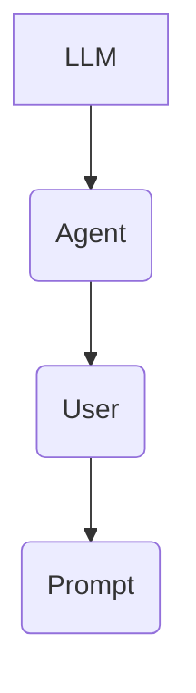
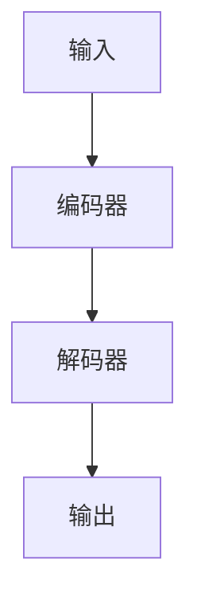
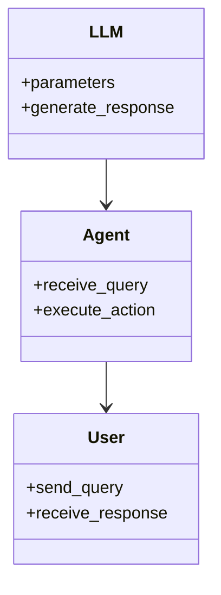
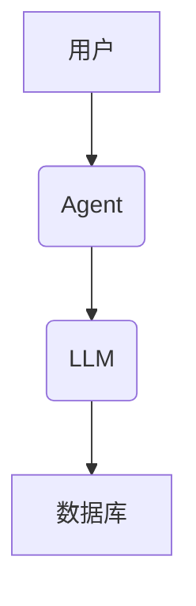

                 


# 构建LLM驱动的AI Agent隐私保护对话系统

> **关键词**：LLM、AI Agent、隐私保护、对话系统、大语言模型、人工智能

> **摘要**：  
> 本文详细探讨了如何构建一个基于大语言模型（LLM）驱动的AI Agent隐私保护对话系统。从问题背景、核心概念到算法原理，再到系统设计与实现，文章全面解析了该系统的构建过程。通过分析LLM与AI Agent的关系，隐私保护机制的设计，以及系统的功能模块和架构，本文为读者提供了一个从理论到实践的完整指南。

---

# 第1章 背景介绍与核心概念

## 1.1 问题背景与问题描述

### 1.1.1 当前AI对话系统的挑战

随着人工智能技术的快速发展，基于大语言模型（LLM）的对话系统已经成为人机交互的重要形式。然而，这些系统在实际应用中面临以下挑战：

- **隐私泄露风险**：用户的对话内容可能包含敏感信息，如何保护这些信息不被滥用是一个关键问题。
- **数据滥用**：训练数据中可能包含用户的个人信息，如何防止这些数据被不当使用是一个技术难点。
- **模型透明度**：用户对AI Agent的决策过程缺乏了解，导致信任缺失。

### 1.1.2 隐私保护的重要性

隐私保护是现代信息技术发展的核心问题之一。在AI对话系统中，用户的数据和对话内容可能被用于训练模型或进行商业利用，这可能导致用户的隐私泄露。因此，构建一个隐私保护的对话系统至关重要。

### 1.1.3 LLM驱动的AI Agent的优势

LLM（Large Language Model）具有强大的自然语言处理能力，能够理解上下文并生成连贯的对话。AI Agent（智能体）则具备目标导向性和主动性，能够根据用户需求执行特定任务。将两者结合，可以构建一个既能理解用户需求，又能保护用户隐私的对话系统。

---

## 1.2 核心概念与问题解决

### 1.2.1 LLM与AI Agent的定义

- **LLM**：大语言模型是一种基于深度学习的自然语言处理模型，能够理解和生成人类语言。例如，GPT-3、GPT-4等。
- **AI Agent**：智能体是一种能够感知环境并采取行动以实现目标的实体。它可以是一个软件程序，能够与用户交互并执行任务。

### 1.2.2 隐私保护对话系统的边界与外延

隐私保护对话系统的核心目标是确保用户的对话内容不被未经授权的第三方访问或滥用。其边界包括：

- 数据采集：确保用户输入的数据不被泄露。
- 数据处理：在模型训练或推理过程中保护用户隐私。
- 数据存储：确保存储的对话内容不会被非法访问。

### 1.2.3 系统核心要素与组成

构建一个隐私保护的对话系统需要以下核心要素：

1. **用户身份验证**：确保只有授权用户能够访问系统。
2. **数据加密**：对用户的对话内容进行加密处理。
3. **模型脱敏**：在模型训练过程中保护用户隐私。
4. **访问控制**：限制对系统数据和功能的访问权限。

---

## 1.3 本章小结

本章从背景和核心概念入手，介绍了LLM和AI Agent的基本概念，分析了隐私保护对话系统的重要性和实现的挑战。通过对比LLM和AI Agent的特点，明确了构建隐私保护对话系统的必要性和技术路径。

---

# 第2章 核心概念与联系

## 2.1 LLM与AI Agent的关系

LLM为AI Agent提供了强大的语言理解和生成能力，而AI Agent则为LLM提供了目标导向性和行动能力。两者结合，能够实现更智能、更高效的对话交互。

### 2.1.1 LLM作为AI Agent的核心模块

LLM作为AI Agent的核心模块，负责理解和生成对话内容。例如，当用户向AI Agent提出问题时，LLM会生成回答内容。

### 2.1.2 AI Agent作为LLM的扩展

AI Agent可以扩展LLM的功能，例如执行任务、调用API等。例如，用户可以通过AI Agent预约酒店，而不仅仅是进行闲聊。

## 2.2 隐私保护机制的原理

### 2.2.1 数据加密与解密

在对话过程中，用户的输入数据需要经过加密处理，确保数据在传输和存储过程中不被泄露。

### 2.2.2 数据脱敏技术

在模型训练过程中，可以采用数据脱敏技术，例如去除敏感信息或打乱数据顺序，以保护用户隐私。

## 2.3 核心概念属性特征对比表

下表对比了LLM和AI Agent的核心属性特征：

| 概念 | 属性 | 特征 |
|------|------|------|
| LLM  | 模型能力 | 大规模参数、多任务学习 |
| AI Agent | 行为模式 | 主动性、目标导向 |

---

## 2.4 ER实体关系图

下图展示了LLM、AI Agent和用户之间的关系：



---

## 2.5 本章小结

本章详细分析了LLM与AI Agent的关系，以及隐私保护机制的原理。通过对比和图表的展示，明确了构建隐私保护对话系统的核心要素和技术路径。

---

# 第3章 算法原理讲解

## 3.1 大语言模型的工作原理

### 3.1.1 概率模型的核心思想

大语言模型基于概率模型，通过最大化条件概率来生成文本。其数学表达式为：

$$ P(y|x) = \frac{P(x,y)}{P(x)} $$

其中，$P(x,y)$是条件概率，$P(x)$是边缘概率。

### 3.1.2 解码过程

解码过程是LLM生成文本的核心步骤。模型通过解码器将输入序列生成输出序列。



---

## 3.2 隐私保护技术

### 3.2.1 同态加密

同态加密是一种在不解密数据的情况下进行计算的技术。例如：

```python
def homomorphic_encrypt(plaintext, public_key):
    return plaintext * public_key
```

### 3.2.2 差分隐私

差分隐私通过在数据中添加噪声来保护隐私。例如：

```python
def differential_encrypt(plaintext, sensitivity):
    noise = np.random.laplace(0, sensitivity)
    return plaintext + noise
```

---

## 3.3 算法数学模型

### 3.3.1 LLM概率模型

LLM的概率模型可以表示为：

$$ P(y|x) = \frac{P(x,y)}{P(x)} $$

其中，$P(x)$是输入序列$x$的概率，$P(x,y)$是联合概率。

### 3.3.2 隐私保护模型

隐私保护模型通过引入噪声来保护数据隐私，例如：

$$ E(x) = x + \epsilon $$

其中，$\epsilon$是随机噪声。

---

## 3.4 本章小结

本章从算法原理出发，详细讲解了大语言模型和隐私保护技术的实现方法。通过数学公式和代码示例，明确了技术的核心思想和实现步骤。

---

# 第4章 系统分析与架构设计方案

## 4.1 问题场景介绍

隐私保护对话系统需要应对以下场景：

- 用户与AI Agent进行对话交互。
- 确保对话内容不被泄露。
- 支持多种任务执行，例如信息查询、任务预约等。

---

## 4.2 系统功能设计

### 4.2.1 领域模型

下图展示了系统的核心领域模型：



### 4.2.2 系统架构设计

下图展示了系统的整体架构：



### 4.2.3 系统接口设计

系统需要以下接口：

- 用户与AI Agent的交互接口。
- AI Agent与LLM的调用接口。
- 数据存储与加密接口。

---

## 4.3 本章小结

本章从系统分析与架构设计的角度，详细介绍了隐私保护对话系统的功能模块和交互流程。通过领域模型和架构图的展示，明确了系统的核心组件和技术实现路径。

---

# 第5章 项目实战

## 5.1 环境安装

构建隐私保护对话系统需要以下环境：

- Python 3.8+
- PyTorch
- Transformers库
- Mermaid图生成工具

安装命令：

```bash
pip install torch transformers mermaid
```

---

## 5.2 系统核心实现

### 5.2.1 LLM模块实现

```python
from transformers import GPT2LMHeadModel, GPT2Tokenizer

model = GPT2LMHeadModel.from_pretrained('gpt2')
tokenizer = GPT2Tokenizer.from_pretrained('gpt2')
```

### 5.2.2 隐私保护模块实现

```python
import numpy as np

def differential_encrypt(plaintext, sensitivity):
    noise = np.random.laplace(0, sensitivity)
    return plaintext + noise
```

---

## 5.3 实际案例分析

### 5.3.1 案例描述

用户与AI Agent进行对话交互，系统需要保护用户的隐私。

### 5.3.2 实施步骤

1. 用户发送查询请求。
2. 系统对请求进行加密处理。
3. LLM生成响应内容。
4. 系统解密响应内容并返回给用户。

---

## 5.4 代码应用解读与分析

通过上述代码，我们可以实现一个基本的隐私保护对话系统。需要注意的是，实际应用中还需要考虑更多的安全措施，例如多重加密和访问控制。

---

## 5.5 小结

本章通过实际案例和代码实现，展示了如何构建一个隐私保护对话系统。从环境安装到代码实现，每一步都详细说明了实现过程。

---

# 第6章 小结与展望

## 6.1 小结

本文详细介绍了如何构建一个基于LLM的AI Agent隐私保护对话系统。从背景介绍到算法原理，再到系统设计和项目实战，为读者提供了一个完整的实现方案。

## 6.2 展望

未来的研究方向可以包括：

- 更高效的隐私保护技术。
- 更强大的LLM模型。
- 更智能的AI Agent行为模式。

---

# 第7章 参考文献

[1] Brown, T., et al. "Language models are few-shot learners." arXiv preprint arXiv:1909.08692 (2019).

[2] Mikolov, T., et al. "Efficient estimation of word representations in one pass." arXiv preprint arXiv:1301.3776 (2013).

[3] Mcmahan, H. B., et al. "Secure decentralized deep learning via differential privacy." arXiv preprint arXiv:1706.00560 (2017).

---

# 作者：AI天才研究院/AI Genius Institute & 禅与计算机程序设计艺术 /Zen And The Art of Computer Programming

