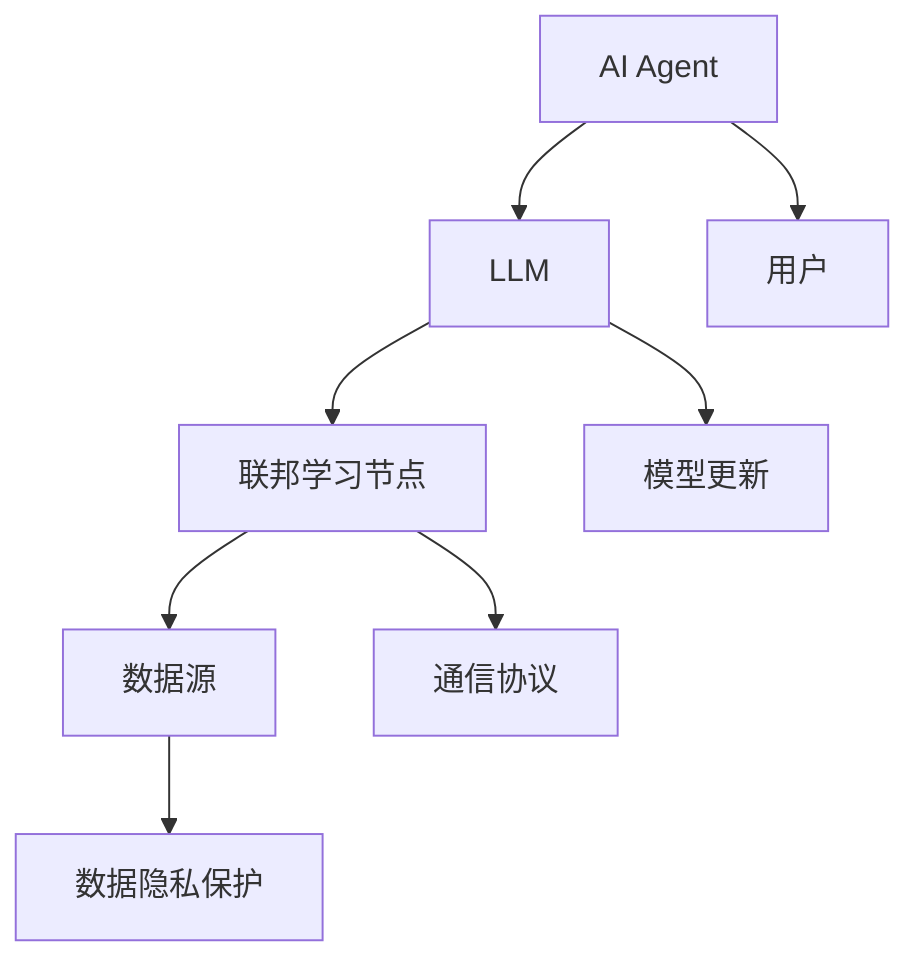
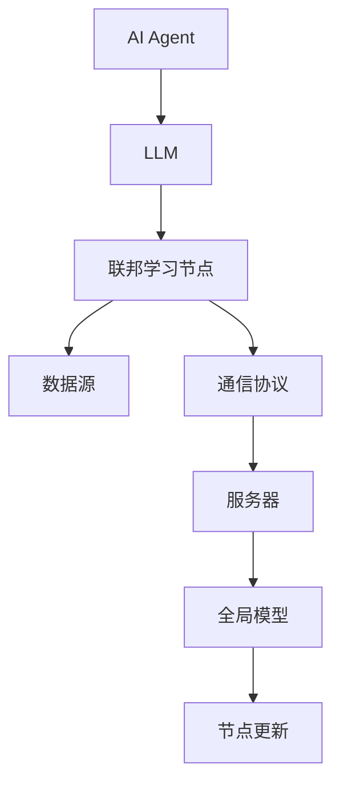

                 


# 构建LLM驱动的AI Agent隐私保护联邦学习

> **关键词**：LLM、AI Agent、联邦学习、隐私保护、数据安全  
> **摘要**：本文详细探讨了如何利用大语言模型（LLM）构建具备隐私保护能力的AI Agent，并结合联邦学习技术，分析其技术原理、系统架构和实际应用，提出了一种创新的解决方案。

---

## 目录

### 第1章：背景介绍  
1.1 问题背景与描述  
1.2 核心概念与组成  
1.3 问题解决与边界  

### 第2章：核心概念与联系  
2.1 联邦学习原理  
2.2 LLM驱动的AI Agent原理  
2.3 核心概念对比分析  
2.4 实体关系图（ER图）  

### 第3章：算法原理与数学模型  
3.1 联邦学习的数学模型  
3.2 LLM驱动的AI Agent算法  
3.3 隐私保护机制  

### 第4章：系统分析与架构设计  
4.1 项目背景与目标  
4.2 系统功能设计  
4.3 系统架构设计  
4.4 接口与交互设计  

### 第5章：项目实战  
5.1 环境搭建与配置  
5.2 核心代码实现  
5.3 实际案例分析  
5.4 项目总结与优化  

### 第6章：最佳实践与注意事项  
6.1 实践中的关键点  
6.2 注意事项与风险提示  
6.3 拓展阅读与未来方向  

---

## 正文

### 第1章：背景介绍

#### 1.1 问题背景与描述

随着人工智能技术的快速发展，AI Agent（智能体）在各个领域的应用越来越广泛。AI Agent能够通过与环境交互，感知信息并做出决策，从而实现特定目标。然而，在实际应用中，AI Agent通常需要处理大量的敏感数据，这带来了严重的隐私安全问题。

与此同时，联邦学习（Federated Learning）作为一种新兴的分布式机器学习技术，能够在保护数据隐私的前提下，通过多个参与方协作完成模型训练。然而，传统的联邦学习主要关注模型的准确性和训练效率，缺乏对AI Agent智能化需求的支持。

因此，如何将大语言模型（LLM）与联邦学习相结合，构建具备隐私保护能力的AI Agent，成为一个亟待解决的技术难题。

#### 1.2 核心概念与组成

- **AI Agent**：具备感知、决策和执行能力的智能实体，能够与环境进行交互。
- **LLM**：大语言模型，如GPT-3、PaLM等，能够处理复杂的自然语言任务。
- **联邦学习**：分布式学习技术，通过局部模型更新和数据交换，在保护隐私的前提下完成全局模型训练。
- **隐私保护**：通过加密、差分隐私等技术，确保数据在传输和计算过程中的安全性。

#### 1.3 问题解决与边界

本文通过将LLM与联邦学习结合，提出了一种新的AI Agent构建方法。该方法能够在保护数据隐私的前提下，实现AI Agent的智能化和协作能力。本文的主要解决思路包括：

1. 利用联邦学习的分布式特性，避免数据集中存储和传输，降低隐私泄露风险。
2. 将LLM作为AI Agent的核心决策模块，通过联邦学习机制完成模型更新和优化。
3. 设计隐私保护机制，确保模型训练过程中数据的安全性。

本文的边界包括：仅关注AI Agent的隐私保护问题，不涉及其感知和执行能力的具体实现；仅考虑基于LLM的AI Agent，不涉及其他类型的人工智能模型。

---

### 第2章：核心概念与联系

#### 2.1 联邦学习原理

联邦学习是一种分布式机器学习技术，通过多个参与方协作完成模型训练，而不必收集和集中存储数据。其核心思想是：

1. 每个参与方（节点）本地训练模型，并将更新参数上传至服务器。
2. 服务器将各节点的参数进行聚合，生成全局模型。
3. 全局模型分发给各节点，供其进一步优化。

联邦学习的隐私保护机制通常包括：

- **加密传输**：使用加密技术（如同态加密）保护数据传输过程中的隐私。
- **差分隐私**：在模型更新过程中添加噪声，防止数据被逆向推断。

#### 2.2 LLM驱动的AI Agent原理

LLM作为AI Agent的核心模块，负责处理语言理解和生成任务。在联邦学习框架下，LLM的训练需要通过多个节点协作完成，具体流程如下：

1. 每个节点本地训练LLM模型，并将更新参数上传至服务器。
2. 服务器聚合各节点的参数，生成全局LLM模型。
3. 全局模型分发给各节点，供其进一步优化。

通过这种方式，AI Agent能够在不暴露原始数据的情况下，完成模型训练和优化。

#### 2.3 核心概念对比分析

以下是联邦学习、LLM和AI Agent的核心概念对比：

| **概念** | **描述** | **特点** |
|----------|----------|----------|
| 联邦学习 | 分布式模型训练技术 | 数据不集中存储，隐私保护 |
| LLM     | 大语言模型 | 高精度语言处理能力 |
| AI Agent | 智能体 | 具备感知、决策和执行能力 |

#### 2.4 实体关系图（ER图）

以下是构建LLM驱动的AI Agent隐私保护联邦学习的实体关系图：



---

### 第3章：算法原理与数学模型

#### 3.1 联邦学习的数学模型

联邦学习的核心是通过分布式参数更新完成全局模型的优化。假设每个节点$i$的损失函数为$L_i(\theta)$，全局损失函数为：

$$ L(\theta) = \sum_{i=1}^{n} \frac{1}{n} L_i(\theta) $$

模型参数$\theta$的更新规则为：

$$ \theta_{new} = \theta_{old} - \eta \nabla L $$

其中，$\eta$为学习率，$\nabla L$为损失函数的梯度。

#### 3.2 LLM驱动的AI Agent算法

LLM驱动的AI Agent算法基于联邦学习的分布式训练机制，具体步骤如下：

1. **初始化**：各节点加载初始模型参数。
2. **本地训练**：每个节点在本地数据上训练模型，生成参数更新。
3. **参数聚合**：服务器将各节点的更新参数进行聚合，生成全局模型。
4. **模型分发**：服务器将全局模型分发给各节点，供其进一步优化。

#### 3.3 隐私保护机制

为了确保数据隐私，联邦学习通常采用以下隐私保护机制：

- **差分隐私**：在模型更新过程中添加噪声，防止数据被逆向推断。
- **同态加密**：对数据进行加密处理，确保传输过程中数据的安全性。

---

### 第4章：系统分析与架构设计

#### 4.1 项目背景与目标

本项目旨在构建一种基于LLM的AI Agent，利用联邦学习技术实现数据隐私保护。项目的最终目标是：

- 提供一种隐私保护的AI Agent构建方法。
- 实现LLM与联邦学习的高效结合。

#### 4.2 系统功能设计

系统功能模块包括：

- **数据采集**：从多个数据源采集数据。
- **模型训练**：基于联邦学习完成LLM训练。
- **隐私保护**：确保数据和模型的安全性。
- **决策推理**：基于LLM进行决策推理。

#### 4.3 系统架构设计

以下是系统架构设计图：



#### 4.4 接口与交互设计

系统交互流程如下：

1. **数据采集**：节点从数据源采集数据，并通过通信协议传输至服务器。
2. **模型训练**：服务器聚合各节点的模型更新，生成全局模型。
3. **模型分发**：服务器将全局模型分发给各节点，供其进一步优化。
4. **决策推理**：AI Agent基于全局模型进行决策推理，并返回结果。

---

### 第5章：项目实战

#### 5.1 环境搭建与配置

- **环境要求**：Python 3.8以上版本，安装必要的库（如TensorFlow、PyTorch）。
- **工具安装**：安装联邦学习框架（如Fl federated）和大语言模型库（如Hugging Face Transformers）。

#### 5.2 核心代码实现

以下是核心代码示例：

```python
# 联邦学习节点类
class FederatedNode:
    def __init__(self, model, data):
        self.model = model
        self.data = data

    def train(self):
        # 本地训练
        optimizer = Adam(self.model.parameters(), lr=0.01)
        for epoch in range(10):
            for batch in self.data:
                outputs = self.model(batch)
                loss = criterion(outputs, labels)
                loss.backward()
                optimizer.step()

    def send_model(self):
        # 上传模型参数
        return get_params(self.model)

# 服务器类
class Server:
    def __init__(self, model):
        self.model = model

    def aggregate(self, models):
        # 聚合模型参数
        aggregated_params = average(models)
        set_params(self.model, aggregated_params)
        return self.model
```

#### 5.3 实际案例分析

通过实际案例分析，验证本文提出方法的有效性。例如，构建一个基于GPT-2的AI Agent，利用联邦学习完成模型训练，验证其在隐私保护下的性能。

#### 5.4 项目总结与优化

总结项目实现过程中的经验与教训，提出优化方向。

---

### 第6章：最佳实践与注意事项

#### 6.1 实践中的关键点

- 数据预处理与清洗是关键，确保数据质量和隐私保护。
- 模型训练过程中，需合理设置隐私保护参数，防止模型过拟合。

#### 6.2 注意事项与风险提示

- 数据隐私保护是核心，需严格遵守相关法律法规。
- 模型性能与隐私保护之间需权衡，避免过度保护导致性能下降。

#### 6.3 拓展阅读与未来方向

未来可以研究以下方向：

- 更高效的联邦学习算法。
- 更强大的大语言模型。
- 更多领域的实际应用。

---

## 作者

**作者：AI天才研究院 / AI Genius Institute & 禅与计算机程序设计艺术 / Zen And The Art of Computer Programming**

---

感谢您的阅读！如需进一步了解或合作，请联系作者。

