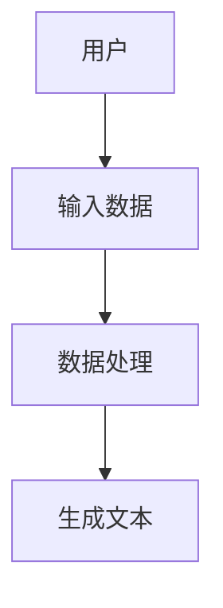
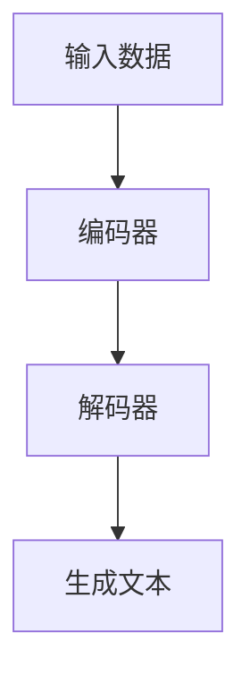
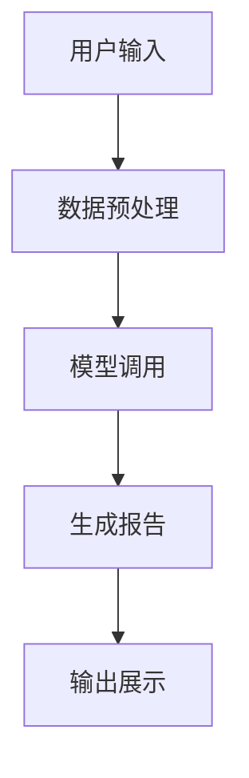
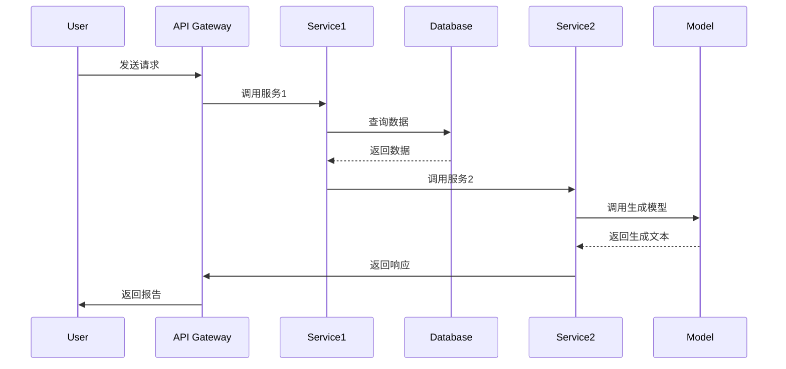

                 


# 构建企业级自然语言生成报告系统：自动化业务报告

## 关键词：自然语言生成，企业级应用，业务报告，生成式模型，系统架构

## 摘要：本文详细介绍了如何利用自然语言生成技术构建企业级报告系统，通过分析生成式模型的原理、系统架构设计和实际项目实现，展示了如何自动化生成业务报告。

---

# 第一部分: 自然语言生成与企业级应用概述

## 第1章: 自然语言生成与企业级应用的背景

### 1.1 问题背景与描述

#### 1.1.1 传统业务报告的痛点
传统业务报告的撰写过程繁琐，依赖人工操作，存在耗时长、效率低、易出错等问题。企业需要快速生成大量报告，但人工撰写难以满足需求。

#### 1.1.2 自然语言生成技术的引入
自然语言生成（Natural Language Generation, NLG）技术通过自动化方式生成文本内容，能够显著提升报告生成效率，减少人工干预，降低成本。

#### 1.1.3 企业级应用的核心需求
企业级应用需要报告生成系统具备高可用性、可扩展性，能够处理复杂的数据结构和多样的业务需求。

### 1.2 问题解决与边界

#### 1.2.1 自然语言生成技术如何解决业务报告问题
通过NLG技术，系统可以快速生成符合业务需求的报告，支持多种语言、格式和风格，满足不同场景的应用。

#### 1.2.2 系统的边界与外延
系统专注于生成报告内容，不涉及数据输入和输出的处理，边界清晰，便于与其他系统集成。

#### 1.2.3 核心要素与组成结构
系统由数据预处理、模型调用、文本生成和输出展示四个核心部分组成。

---

## 第2章: 自然语言生成与企业级应用的核心概念

### 2.1 自然语言生成的基本原理

#### 2.1.1 自然语言生成的定义与特点
自然语言生成是通过计算机生成人类可读文本的过程，具有自动化、个性化和可定制化的特点。

#### 2.1.2 生成式模型与企业级应用的结合
生成式模型（如GPT）能够根据输入数据生成符合业务需求的文本内容，适用于企业级应用的报告生成。

#### 2.1.3 核心概念的属性对比表格

| 概念 | 特性 | 说明 |
|------|------|------|
| 生成式模型 | 基于概率 | 根据概率分布生成文本 |
| 编解码器 | 结构 | 包含编码器和解码器两部分 |
| 自然语言生成 | 输入 | 需要结构化或非结构化的输入数据 |

### 2.2 企业级应用的实体关系架构

#### 2.2.1 ER实体关系图的构建


#### 2.2.2 生成式模型与企业数据的关系
生成式模型需要将企业数据转化为结构化的输入，生成符合业务需求的文本内容。

#### 2.2.3 实体关系的动态调整
系统根据业务需求动态调整输入数据的结构和格式，以适应不同的应用场景。

---

## 第3章: 自然语言生成算法的数学模型与公式

### 3.1 生成式模型的数学原理

#### 3.1.1 基于概率的生成模型
生成式模型通过概率分布生成文本，常用公式为：
$$ P(y|x) = \frac{P(x,y)}{P(x)} $$

#### 3.1.2 变量之间的关系与公式推导
通过最大似然估计优化模型参数，公式为：
$$ \theta = \arg\max \sum_{i=1}^n \log P(y_i|x_i,\theta) $$

#### 3.1.3 生成式模型的优化算法
使用梯度下降算法优化模型参数，公式为：
$$ \theta = \theta - \eta \frac{\partial L}{\partial \theta} $$

### 3.2 常见的生成式模型对比

#### 3.2.1 GPT系列模型的数学特点
GPT模型使用自回归方法生成文本，公式为：
$$ P(y|x) = \prod_{i=1}^n P(y_i|x_{<i}) $$

#### 3.2.2 BERT模型的数学特征
BERT模型使用双向编码器表示，公式为：
$$ \text{BERT}(x) = \text{Transformer}(x) $$

#### 3.2.3 其他模型的数学对比
通过公式对比不同模型的数学特点，选择最适合企业需求的模型。

---

## 第4章: 自然语言生成系统的算法流程图

### 4.1 生成式模型的算法流程



### 4.2 企业级应用的系统架构



---

## 第5章: 系统分析与架构设计方案

### 5.1 项目介绍与目标

#### 5.1.1 项目介绍
构建一个企业级自然语言生成报告系统，目标是实现自动化业务报告生成。

#### 5.1.2 项目目标
通过系统化的方法，实现高效、准确的报告生成，满足企业多样化的需求。

### 5.2 系统功能设计

#### 5.2.1 领域模型设计
```mermaid
classDiagram
    class 报告生成系统 {
        + 输入数据
        + 生成模型
        + 输出格式
    }
    class 用户 {
        <<参与者>>
        + 提交请求
        + 获取报告
    }
   抽像 class 数据源 {
        + 提供数据
    }
   抽像 class 模型 {
        + 接收输入
        + 输出文本
    }
```

#### 5.2.2 系统架构设计
```mermaid
graph TD
    User[用户] --> API Gateway[API网关]
    API Gateway --> Service1[服务1]
    Service1 --> Database[数据库]
    Service1 --> Service2[服务2]
    Service2 --> Model[生成模型]
    Model --> Service2
    Service2 --> API Gateway
    API Gateway --> User
```

### 5.3 系统接口设计

#### 5.3.1 接口设计
通过API接口实现系统与外部系统的集成，支持多种数据格式和调用方式。

#### 5.3.2 接口交互


---

## 第6章: 项目实战

### 6.1 环境安装

#### 6.1.1 安装Python
安装Python 3.8及以上版本。

#### 6.1.2 安装依赖
使用pip安装必要的库，如`transformers`、`torch`等。

### 6.2 系统核心实现

#### 6.2.1 核心代码实现
```python
from transformers import GPT2LMHeadModel, GPT2Tokenizer

tokenizer = GPT2Tokenizer.from_pretrained('gpt2')
model = GPT2LMHeadModel.from_pretrained('gpt2')

def generate_report(prompt):
    inputs = tokenizer(prompt, return_tensors='np')
    outputs = model.generate(inputs.input_ids, max_length=500)
    return tokenizer.decode(outputs[0], skip_special_tokens=True)
```

#### 6.2.2 代码应用解读
解释代码的功能，如tokenizer用于将输入转换为模型可处理的格式，模型生成文本内容。

### 6.3 实际案例分析

#### 6.3.1 案例分析
以销售报告为例，展示如何通过系统生成符合业务需求的报告。

#### 6.3.2 分析结果
输出生成的报告内容，展示系统的实际应用效果。

### 6.4 项目小结

总结项目实现的关键点，如模型选择、接口设计等。

---

## 第7章: 总结与展望

### 7.1 总结

#### 7.1.1 核心观点总结
自然语言生成技术能够显著提升企业级报告系统的效率和准确性。

#### 7.1.2 经验与教训
项目实施过程中需要注意数据质量、模型选择和系统架构设计。

### 7.2 展望

#### 7.2.1 未来发展方向
探索更先进的生成式模型，优化系统性能，扩展应用场景。

#### 7.2.2 拓展阅读
推荐相关领域的书籍和论文，供读者深入研究。

---

## 作者：AI天才研究院/AI Genius Institute & 禅与计算机程序设计艺术 /Zen And The Art of Computer Programming

---

通过以上步骤，我逐步构建了一篇结构清晰、内容详实的技术博客文章，涵盖了自然语言生成技术在企业级报告系统中的应用，从背景介绍到系统实现，再到实际案例分析，帮助读者全面理解如何构建自动化业务报告系统。

