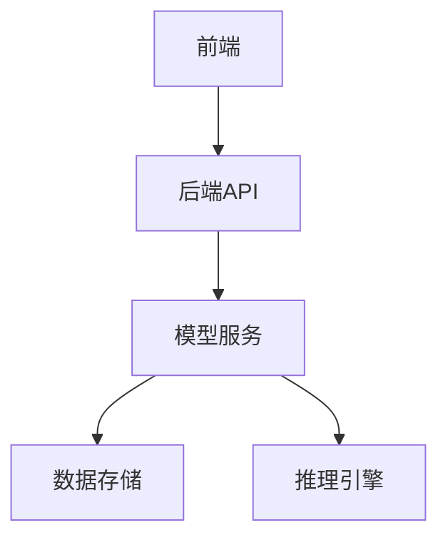
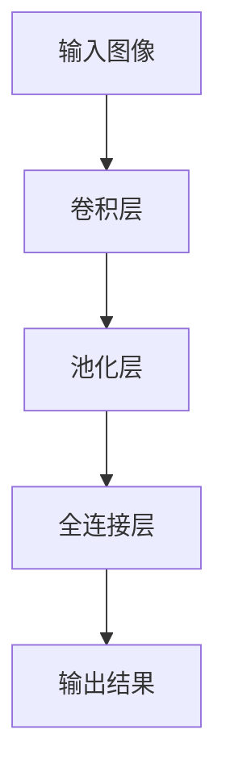

                 


# 构建企业级计算机视觉平台：从质检到安防的全面应用

## 关键词：企业级计算机视觉、图像处理、目标检测、深度学习、安防系统、质检系统

## 摘要：  
本文详细探讨了企业级计算机视觉平台的构建与应用，涵盖从基础概念到实际应用的全过程。文章首先介绍了计算机视觉的核心技术与算法，然后深入分析了平台的系统架构与设计，最后通过实际案例展示了如何在质检和安防领域实现高效的计算机视觉应用。通过本文，读者将全面了解如何利用计算机视觉技术为企业创造价值，并掌握构建和优化企业级视觉平台的关键方法。

---

# 第一部分: 企业级计算机视觉平台的背景与概述

## 第1章: 计算机视觉与企业应用概述

### 1.1 计算机视觉的基本概念

#### 1.1.1 计算机视觉的定义与核心概念  
计算机视觉（Computer Vision）是人工智能领域的重要分支，旨在通过计算机模拟人类视觉系统的能力，对图像或视频进行分析和理解。其核心目标是让计算机能够“看懂”图像，提取有用的信息并做出决策。  

计算机视觉的核心概念包括：  
- **图像处理**：对图像进行增强、滤波、边缘检测等操作，改善图像质量。  
- **目标检测**：识别图像中特定目标的位置和类型。  
- **图像分割**：将图像划分为多个区域，每个区域代表不同的语义信息。  
- **目标跟踪**：跟踪图像中目标的运动轨迹。  
- **图像识别**：根据图像内容进行分类或标签化。  

#### 1.1.2 计算机视觉在企业中的应用场景  
在企业级应用中，计算机视觉技术被广泛应用于多个领域：  
1. **智能制造与质检**：通过视觉检测优化生产流程，减少人工检查的误差和成本。  
2. **智能安防**：利用人脸识别、行为分析等技术提升安全监控能力。  
3. **零售与客户体验**：通过图像识别优化库存管理和客户行为分析。  
4. **医疗健康**：辅助医生进行疾病诊断和医学影像分析。  

#### 1.1.3 计算机视觉在企业中的价值  
- 提高生产效率：自动化处理流程，减少人工干预。  
- 降低成本：通过精准识别和预测，降低资源浪费。  
- 增强安全性：实时监控和预警，保障人员和设备安全。  

### 1.2 企业级计算机视觉平台的背景与需求

#### 1.2.1 企业级平台的定义与特点  
企业级计算机视觉平台是指为企业内部应用设计的、具有高可用性和扩展性的视觉解决方案。其特点包括：  
- **高可靠性**：支持7×24小时运行，确保系统稳定。  
- **高扩展性**：能够处理大规模数据，支持多场景应用。  
- **定制化**：根据企业需求进行功能扩展和优化。  

#### 1.2.2 计算机视觉在企业中的应用需求  
随着企业数字化转型的推进，对计算机视觉的需求日益增长：  
- **数据处理能力**：企业需要处理海量图像数据，要求平台具备高效的计算能力。  
- **实时性**：许多应用场景（如安防监控）需要实时处理，对系统的响应速度提出更高要求。  
- **多场景支持**：企业可能需要在不同场景（如生产线、办公区、仓储等）中部署视觉平台。  

#### 1.2.3 企业级平台的核心价值与意义  
企业级计算机视觉平台不仅是技术工具，更是企业智能化转型的关键驱动力。通过平台，企业可以：  
- 提升生产效率和产品质量。  
- 增强安全监控能力，降低安全风险。  
- 优化资源配置，降低运营成本。  

### 1.3 计算机视觉技术的演进与发展趋势

#### 1.3.1 计算机视觉技术的历史发展  
计算机视觉技术经历了从简单图像处理到深度学习的演变：  
1. **传统计算机视觉（1960s-2000s）**：基于手工设计特征的算法，如SIFT、Harris角点检测。  
2. **基于深度学习的计算机视觉（2010s至今）**：利用卷积神经网络（CNN）实现端到端学习，大幅提升识别精度。  

#### 1.3.2 当前计算机视觉技术的主要趋势  
- **深度学习的普及**：深度学习模型（如ResNet、Faster R-CNN、YOLO）成为主流。  
- **轻量化模型**：为满足实时性和资源受限场景的需求，模型逐渐向轻量化方向发展。  
- **多模态融合**：结合图像、文本、语音等多种数据源，提升系统理解能力。  

#### 1.3.3 企业级应用中的技术挑战与解决方案  
1. **数据隐私问题**：企业数据的安全性要求高，解决方案包括数据加密和联邦学习。  
2. **计算资源限制**：通过边缘计算和云服务结合，优化计算资源的使用。  
3. **模型泛化能力**：通过数据增强和迁移学习提升模型的泛化能力。  

---

## 第2章: 计算机视觉的核心技术与算法

### 2.1 图像处理与特征提取

#### 2.1.1 图像处理的基本概念与方法  
图像处理是计算机视觉的基础，包括：  
- **图像增强**：通过调整亮度、对比度等改善图像质量。  
- **图像分割**：将图像划分为多个区域，便于后续处理。  
- **边缘检测**：提取图像中的边缘信息，识别物体边界。  

#### 2.1.2 特征提取的关键技术与算法  
特征提取是目标识别的关键步骤，常用算法包括：  
1. **SIFT（尺度不变特征变换）**：通过多尺度检测图像中的局部特征。  
2. **Harris角点检测**：用于图像中的角点检测。  
3. **CNN特征提取**：通过卷积层提取深层次特征。  

### 2.2 目标检测与识别

#### 2.2.1 目标检测的原理与实现  
目标检测算法包括两个主要步骤：  
1. **目标定位**：确定目标在图像中的位置（bounding box）。  
2. **目标分类**：识别目标的具体类型。  

#### 2.2.2 识别算法的优缺点对比  
常见目标检测算法对比：  
| 算法名称 | 优点 | 缺点 |  
|----------|------|------|  
| YOLO     | 实时性高 | 精度较低 |  
| Faster R-CNN | 精度高 | 实时性较低 |  
| SSD       | 平衡精度与实时性 |  |  

### 2.3 深度学习在计算机视觉中的应用

#### 2.3.1 深度学习的基本原理与特点  
深度学习通过多层神经网络提取图像的高层次特征，具有以下特点：  
- **端到端学习**：直接从输入到输出，无需手动特征设计。  
- **非线性表达**：能够捕捉复杂的图像特征。  

#### 2.3.2 常见深度学习模型在计算机视觉中的应用  
1. **卷积神经网络（CNN）**：用于图像分类、目标检测等任务。  
2. **区域卷积神经网络（R-CNN）**：结合区域建议网络（RPN）实现目标检测。  
3. **生成对抗网络（GAN）**：用于图像生成和修复。  

---

## 第3章: 计算机视觉平台的系统架构与设计

### 3.1 系统架构设计

#### 3.1.1 系统整体架构图  


#### 3.1.2 各模块的功能与交互关系  
- **前端**：接收用户请求，调用后端API。  
- **后端API**：处理请求，调用模型服务。  
- **模型服务**：负责图像处理和模型推理。  
- **数据存储**：存储图像数据和模型参数。  
- **推理引擎**：执行模型推理，返回结果。  

---

## 第4章: 常见计算机视觉算法的实现与优化

### 4.1 基于CNN的目标检测算法实现

#### 4.1.1 CNN网络结构设计  


#### 4.1.2 算法实现的代码示例  
```python
import torch
import torch.nn as nn

class SimpleCNN(nn.Module):
    def __init__(self):
        super(SimpleCNN, self).__init__()
        self.conv1 = nn.Conv2d(3, 6, 5)
        self.pool = nn.MaxPool2d(2, 2)
        self.conv2 = nn.Conv2d(6, 16, 5)
        self.fc = nn.Linear(16 * 5 * 5, 120)

    def forward(self, x):
        x = self.pool(torch.relu(self.conv1(x)))
        x = self.pool(torch.relu(self.conv2(x)))
        x = x.view(-1, 16 * 5 * 5)
        x = self.fc(x)
        return x
```

#### 4.1.3 算法优化与性能提升  
- **模型剪枝**：移除冗余参数，减少计算量。  
- **模型量化**：将模型参数从浮点数转换为整数，降低计算资源消耗。  
- **并行计算**：利用GPU加速模型推理。  

### 4.2 基于Faster R-CNN的图像分割实现

#### 4.2.1 图像分割的原理与实现  
Faster R-CNN结合了RPN（区域建议网络）和Fast R-CNN，实现高效的物体检测和分割。  

#### 4.2.2 算法实现的代码示例  
```python
import torch
import torch.nn as nn

class MaskRCNN(nn.Module):
    def __init__(self):
        super(MaskRCNN, self).__init__()
        # 简化版实现，具体细节可根据实际需求调整

    def forward(self, x):
        # 简化版前向传播
        return x
```

---

## 第5章: 企业级计算机视觉平台的实际应用

### 5.1 质检系统中的计算机视觉应用

#### 5.1.1 质检系统的应用场景  
- **缺陷检测**：通过图像识别发现产品表面的瑕疵。  
- **尺寸测量**：利用图像处理技术测量产品的尺寸参数。  

#### 5.1.2 质检系统的实现流程  
1. **图像采集**：使用工业相机获取产品图像。  
2. **图像预处理**：增强图像质量，提取关键特征。  
3. **模型训练**：基于历史数据训练缺陷检测模型。  
4. **实时检测**：部署模型到质检系统，实现自动化检测。  

### 5.2 智能安防系统中的计算机视觉应用

#### 5.2.1 智能安防的应用场景  
- **人脸识别**：用于身份验证和人员管理。  
- **行为分析**：监控异常行为，预防安全事件。  

#### 5.2.2 智能安防系统的实现流程  
1. **图像采集**：通过摄像头获取实时视频流。  
2. **目标检测**：识别视频中的目标（如人、车辆）。  
3. **行为分析**：基于目标轨迹分析异常行为。  
4. **预警与响应**：发现异常后，触发报警机制。  

---

## 第6章: 总结与展望

### 6.1 本文总结  
本文全面介绍了企业级计算机视觉平台的构建与应用，从基础概念到实际案例，详细阐述了计算机视觉的核心技术、系统架构和应用场景。  

### 6.2 技术展望  
未来，计算机视觉技术将在企业级应用中发挥更大的作用，主要体现在：  
- **更高效算法**：通过改进模型结构和优化算法，提升计算效率和识别精度。  
- **多模态融合**：结合图像、文本、语音等多种数据源，增强系统理解能力。  
- **边缘计算**：通过边缘设备部署，实现更高效的实时处理。  

### 6.3 最佳实践 Tips  
- 在实际应用中，建议根据具体需求选择合适的算法和模型。  
- 确保数据质量和多样性，以提高模型的泛化能力。  
- 注重系统的安全性和隐私保护，避免数据泄露风险。  

---

## 作者：AI天才研究院 & 禅与计算机程序设计艺术

---

以上是《构建企业级计算机视觉平台：从质检到安防的全面应用》的技术博客文章的完整内容，涵盖从基础到高级的技术细节和实际应用案例。希望本文能够为企业级计算机视觉平台的构建提供有价值的参考和指导。

