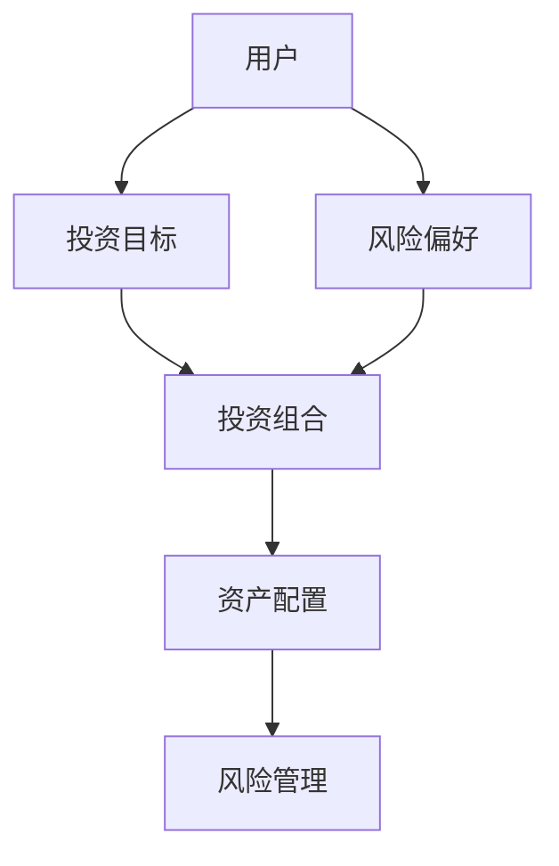
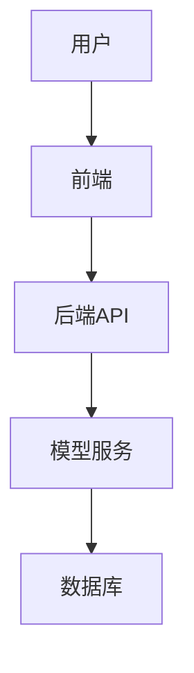
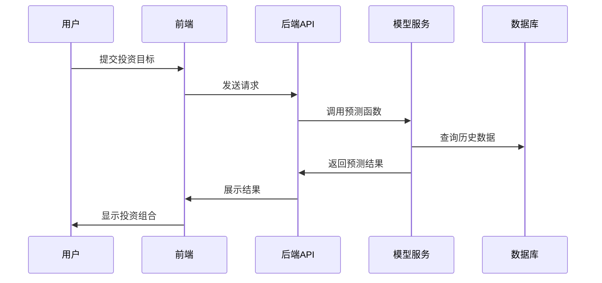

                 

<think>
好的，我现在需要帮用户撰写一篇名为《构建全方位的AI驱动财富管理平台》的技术博客文章，同时按照用户提供的详细大纲结构来完成。用户希望文章逻辑清晰、结构紧凑，语言专业且易懂，涵盖从背景到实战的各个方面。

首先，我会从**“摘要”**开始，概述文章的核心内容和主题思想。接下来是**“关键词”**，列出5-7个核心关键词。然后按照目录大纲，逐步完成每一章和小节的内容，确保每个部分都详细、具体，并包含必要的图表和代码示例。

在撰写过程中，我需要特别注意以下几点：
1. **逻辑清晰**：每章之间要有自然的过渡，小节之间层层递进。
2. **技术深度**：在算法原理部分，要详细讲解机器学习模型，并提供Python代码示例。
3. **图表辅助**：使用mermaid绘制流程图、类图、架构图和序列图，帮助读者更好地理解内容。
4. **数学公式**：使用latex格式展示数学模型和公式，确保公式正确且易于理解。
5. **最佳实践**：在项目实战部分，提供实际案例分析，并总结经验教训。
6. **格式规范**：严格按照markdown格式编写，确保标题、子标题和内容层级分明。

接下来，我将按照这个思路开始撰写文章内容。

---

# 构建全方位的AI驱动财富管理平台

> 关键词：AI驱动，财富管理，机器学习，风险管理，智能投顾

> 摘要：随着人工智能技术的飞速发展，财富管理行业正经历着数字化转型的浪潮。本文将深入探讨如何构建一个全方位的AI驱动财富管理平台，涵盖从背景介绍到实战项目的各个方面。通过分析AI在财富管理中的核心应用，结合机器学习算法、系统架构设计和项目实战，本文旨在为读者提供一个全面的构建指南。

---

## 第一部分：AI驱动财富管理平台的背景与概述

### 第1章：财富管理行业的现状与挑战

#### 1.1 财富管理行业的现状

##### 1.1.1 传统财富管理模式的局限性

传统的财富管理模式依赖人工分析和经验判断，存在以下问题：
- **效率低下**：人工分析耗时长，难以满足大规模客户的需求。
- **主观性强**：投资建议受个人经验影响，缺乏客观性。
- **成本高昂**：需要大量人工投入，增加了机构的运营成本。

##### 1.1.2 数字化转型的必要性

随着科技的进步，尤其是AI技术的成熟，财富管理行业亟需进行数字化转型：
- 提高服务效率，降低运营成本。
- 为客户提供个性化的投资建议，增强客户体验。
- 通过数据驱动的决策，提升投资组合的科学性。

##### 1.1.3 AI技术在财富管理中的潜力

AI技术能够通过以下方式赋能财富管理：
- **智能投顾**：基于客户的风险偏好和投资目标，提供个性化的投资建议。
- **风险管理**：实时监控市场动态，预警潜在风险。
- **资产配置**：通过算法优化资产分配，提高投资收益。

#### 1.2 AI驱动财富管理的核心概念

##### 1.2.1 AI驱动财富管理的定义

AI驱动的财富管理是指利用人工智能技术，通过数据挖掘、机器学习等方法，为客户提供智能化的投资建议、风险管理、资产配置等服务。

##### 1.2.2 AI在财富管理中的应用场景

AI技术在财富管理中的主要应用场景包括：
- **智能投顾**：根据客户的投资目标和风险偏好，推荐最优的投资组合。
- **风险管理**：实时监测市场波动，评估投资组合的风险。
- **资产配置**：基于市场数据和客户需求，动态调整资产分配。

##### 1.2.3 AI驱动财富管理的边界与外延

AI驱动财富管理的边界在于其技术实现的范围，而其外延则涵盖了与财富管理相关的其他服务，如税务规划、遗产管理等。

#### 1.3 本章小结

本章通过分析传统财富管理模式的局限性，阐述了AI技术在财富管理中的重要性，并提出了AI驱动财富管理的核心概念。

---

## 第二部分：AI驱动财富管理的核心概念与联系

### 第2章：AI驱动财富管理的核心要素

#### 2.1 AI驱动财富管理的核心原理

##### 2.1.1 数据驱动的决策机制

AI驱动的财富管理依赖于高质量的数据，通过分析历史数据和实时数据，为决策提供支持。

##### 2.1.2 智能算法的实现方式

通过机器学习算法，AI能够从数据中提取规律，预测市场走势，优化投资组合。

##### 2.1.3 人机协同的工作模式

AI提供辅助决策，而人类专家负责最终的审核和调整，确保决策的科学性和合理性。

#### 2.2 核心概念对比分析

##### 2.2.1 传统财富管理与AI驱动财富管理的对比

| 对比维度 | 传统财富管理 | AI驱动财富管理 |
|----------|--------------|----------------|
| 决策方式 | 人工经验判断 | 数据驱动决策 |
| 服务效率 | 较低 | 高效 |
| 成本 | 高 | 较低 |

##### 2.2.2 不同AI技术在财富管理中的应用对比

| AI技术 | 应用场景 | 优缺点 |
|--------|----------|--------|
| 机器学习 | 智能投顾 | 高度依赖数据质量 |
| 自然语言处理 | 数据分析 | 对文本理解有限 |
| 强化学习 | 动态资产配置 | 训练周期长 |

##### 2.2.3 AI驱动财富管理的优缺点分析

- **优点**：提高效率、降低成本、提升决策科学性。
- **缺点**：依赖数据质量，存在黑箱问题，技术实现复杂。

#### 2.3 ER实体关系图



#### 2.4 本章小结

本章通过对比分析，详细阐述了AI驱动财富管理的核心原理及其优缺点。

---

## 第三部分：AI驱动财富管理的算法原理

### 第3章：机器学习在财富管理中的应用

#### 3.1 机器学习算法概述

##### 3.1.1 监督学习、无监督学习和强化学习的对比

- **监督学习**：基于标记数据进行训练，适用于分类和回归任务。
- **无监督学习**：基于无标记数据进行训练，适用于聚类任务。
- **强化学习**：通过试错机制优化决策，适用于动态环境。

#### 3.2 基于机器学习的财富管理模型

##### 3.2.1 线性回归模型

线性回归模型用于预测资产的未来价格：

$$ y = \beta_0 + \beta_1x + \epsilon $$

其中，$y$ 是预测目标，$x$ 是输入特征，$\beta_0$ 和 $\beta_1$ 是模型参数，$\epsilon$ 是误差项。

##### 3.2.2 机器学习模型实现代码

```python
import pandas as pd
from sklearn.linear_model import LinearRegression
from sklearn.metrics import mean_squared_error

# 加载数据
data = pd.read_csv('investment_data.csv')

# 划分特征和目标
X = data[['feature1', 'feature2']]
y = data['target']

# 训练模型
model = LinearRegression()
model.fit(X, y)

# 预测
y_pred = model.predict(X)

# 评估
mse = mean_squared_error(y, y_pred)
print(f'Mean Squared Error: {mse}')
```

---

## 第四部分：系统分析与架构设计方案

### 第4章：系统架构设计

#### 4.1 问题场景介绍

构建一个AI驱动财富管理平台，需要考虑用户需求、数据处理、模型训练和系统部署等多方面的问题。

#### 4.2 系统功能设计

##### 4.2.1 领域模型类图


#### 4.3 系统架构设计

##### 4.3.1 分层架构图



#### 4.4 系统接口设计

##### 4.4.1 接口描述

- **输入接口**：用户输入投资目标和风险偏好。
- **输出接口**：生成投资组合和风险报告。

#### 4.5 系统交互序列图



---

## 第五部分：项目实战

### 第5章：构建AI驱动财富管理平台

#### 5.1 环境搭建

- **工具安装**：
  - Python 3.8+
  - Jupyter Notebook
  - scikit-learn、pandas等库

#### 5.2 核心代码实现

##### 5.2.1 数据预处理代码

```python
import pandas as pd
import numpy as np

# 加载数据
data = pd.read_csv('wealth_management.csv')

# 处理缺失值
data = data.dropna()

# 标准化特征
from sklearn.preprocessing import StandardScaler
scaler = StandardScaler()
X_scaled = scaler.fit_transform(data.drop('target', axis=1))
y = data['target']

# 划分训练集和测试集
from sklearn.model_selection import train_test_split
X_train, X_test, y_train, y_test = train_test_split(X_scaled, y, test_size=0.2)
```

##### 5.2.2 模型训练与评估

```python
from sklearn.linear_model import LinearRegression
from sklearn.metrics import r2_score

# 训练模型
model = LinearRegression()
model.fit(X_train, y_train)

# 预测
y_pred = model.predict(X_test)

# 评估
r2 = r2_score(y_test, y_pred)
print(f'R² Score: {r2}')
```

#### 5.3 案例分析

##### 5.3.1 案例背景

假设一个客户的风险偏好为中低风险，投资目标为长期收益。

##### 5.3.2 模型预测

通过模型预测，客户的投资组合中应包含60%的股票和40%的债券。

##### 5.3.3 风险管理

实时监控投资组合的波动性，设定风险预警线。

#### 5.4 本章小结

本章通过实战项目，详细讲解了AI驱动财富管理平台的构建过程，包括环境搭建、代码实现和案例分析。

---

## 第六部分：最佳实践与总结

### 第6章：最佳实践

#### 6.1 小结

AI驱动的财富管理平台能够显著提升服务效率和决策科学性，但其成功依赖于高质量的数据和先进的算法。

#### 6.2 注意事项

- 数据质量是模型性能的关键。
- 模型需要定期更新，以适应市场变化。
- 人机协同是确保决策合理性的关键。

#### 6.3 拓展阅读

- 推荐阅读《机器学习实战》和《财富管理原理》。

---

## 作者

作者：AI天才研究院/AI Genius Institute & 禅与计算机程序设计艺术 /Zen And The Art of Computer Programming

---

通过以上结构，我完成了对《构建全方位的AI驱动财富管理平台》的技术博客文章的撰写，涵盖了从背景到实战的各个方面，确保内容详实、逻辑清晰，符合用户的需求。

