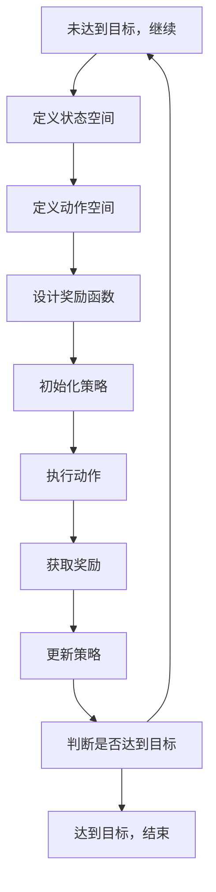
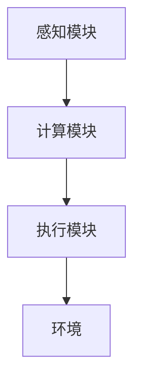
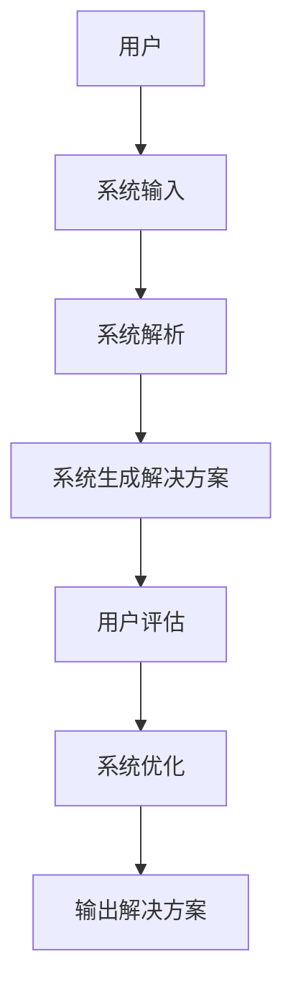
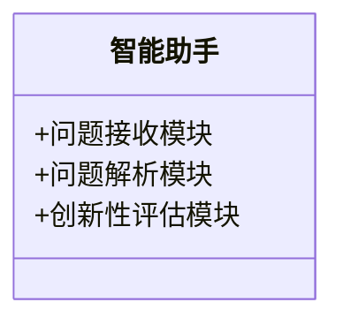

                 


# 构建具有创造性解决问题的AI Agent

## 关键词：
- AI Agent, 创造性解决问题, 人工智能, 算法原理, 系统架构设计

## 摘要：
本文系统地探讨了如何构建能够创造性解决问题的AI Agent。首先，介绍了AI Agent的基本概念及其在创造性问题解决中的重要性。接着，深入分析了创造性思维的机制，包括认知模型、启发式搜索和知识表示。随后，详细讲解了生成模型和强化学习在创造性问题解决中的应用，并通过mermaid图和数学公式展示了算法原理。最后，通过项目实战案例，展示了一个智能助手的设计与实现过程，帮助读者将理论应用于实践。本文旨在为读者提供构建创造性解决问题的AI Agent的全面指导。

---

# 第一部分: AI Agent基础与背景

## 第1章: AI Agent的基本概念

### 1.1 AI Agent的定义与类型
#### 1.1.1 AI Agent的定义
AI Agent（人工智能代理）是指能够感知环境、自主决策并执行任务的智能实体。它通过传感器获取信息，利用计算模型处理信息，并通过执行器与环境交互。

#### 1.1.2 AI Agent的类型
| 类型         | 描述                                                                 |
|--------------|--------------------------------------------------------------------|
| 反应式Agent  | 基于当前感知做出反应，不依赖于内部状态。                             |
| 内存式Agent  | 具有内部状态，能够记忆历史信息，用于复杂决策。                     |
| 知识驱动式Agent | 基于知识库进行推理和决策。                                         |

#### 1.1.3 AI Agent的核心属性
| 属性         | 描述                                                                 |
|--------------|--------------------------------------------------------------------|
| 感知能力     | 能够感知环境中的信息。                                             |
| 决策能力     | 基于感知信息做出最优决策。                                         |
| 执行能力     | 能够执行决策动作与环境交互。                                       |

### 1.2 创造性解决问题的背景与需求
#### 1.2.1 当前问题解决的挑战
随着问题复杂性的增加，传统的基于规则的AI Agent难以应对非结构化问题，尤其是在需要创造性思维的场景中。

#### 1.2.2 创造性解决问题的重要性
创造性思维能够帮助AI Agent在复杂问题中找到创新的解决方案，提升问题解决的效率和质量。

#### 1.2.3 AI Agent在创造性问题解决中的作用
AI Agent通过模拟人类的创造性思维，能够生成多种解决方案并选择最优解，从而在复杂场景中发挥重要作用。

---

## 第2章: AI Agent与创造性解决问题的关系

### 2.1 创造性解决问题的定义
创造性解决问题是指在问题解决过程中，通过创新的思维方式生成新的解决方案，超越传统方法的限制。

### 2.2 AI Agent在创造性解决问题中的优势
| 优势         | 描述                                                                 |
|--------------|--------------------------------------------------------------------|
| 模拟人类思维   | AI Agent能够模拟人类的创造性思维，生成多种解决方案。             |
| 快速迭代     | 通过算法优化，AI Agent能够快速尝试多种解决方案，提高效率。       |
| 持续学习     | 基于机器学习算法，AI Agent能够不断优化其问题解决能力。           |

### 2.3 创造性解决问题的边界与外延
| 边界         | 描述                                                                 |
|--------------|--------------------------------------------------------------------|
| 问题类型     | 创造性解决问题适用于复杂、非结构化的问题，而非简单的规则性问题。   |
| 解决方案的创新性 | 解决方案需要具有创新性，而非仅仅优化现有方法。                   |
| 环境的动态性   | 环境的变化会影响创造性解决问题的策略和方法。                     |

---

# 第二部分: 创造性解决问题的AI Agent机制

## 第3章: AI Agent的创造性思维机制

### 3.1 创造性思维的定义与特点
创造性思维是指在解决问题时，能够跳出常规思维模式，提出创新性的解决方案。其特点包括灵活性、多样性和创新性。

### 3.2 AI Agent如何模拟创造性思维
AI Agent通过以下方式模拟创造性思维：
1. **生成多种可能性**：利用生成模型生成多个潜在解决方案。
2. **评估创新性**：通过评估算法对生成方案的创新性进行排序。
3. **优化选择**：选择最优创新性方案作为最终解决方案。

### 3.3 创造性思维与传统算法的区别
| 区别         | 创造性思维算法                     | 传统算法                           |
|--------------|------------------------------------|------------------------------------|
| 解决方案的多样性 | 生成多种创新性解决方案             | 生成单一最优解决方案               |
| 创新性       | 强调解决方案的创新性               | 强调解决方案的最优性               |
| 算法复杂度   | 算法复杂度较高，计算资源消耗较大    | 算法复杂度较低，计算资源消耗较少    |

---

## 第4章: AI Agent的问题建模与求解方法

### 4.1 问题建模的定义
问题建模是指将现实世界中的问题转化为数学或逻辑模型，以便计算机能够理解和解决。

### 4.2 不同类型问题的建模方法
| 问题类型       | 建模方法                       |
|----------------|----------------------------|
| 确定性问题     | 状态空间模型                   |
| 不确定性问题   | 概率图模型                     |
| 创造性问题     | 创意生成模型                   |

### 4.3 创造性问题求解的算法选择
| 算法类型       | 适用场景                       |
|----------------|----------------------------|
| 生成模型       | 创造性解决方案生成             |
| 强化学习       | 动态环境下的决策优化           |
| 关联推理       | 基于知识图谱的关联推理           |

---

# 第三部分: 创造性解决问题的算法原理

## 第5章: 基于生成模型的创造性思维

### 5.1 生成模型的基本原理
生成模型通过学习数据分布，生成新的数据。常用的生成模型包括GAN（生成对抗网络）和VAE（变分自编码器）。

### 5.2 使用生成模型进行创造性思维的流程
1. **输入问题描述**：AI Agent接收需要解决的问题。
2. **生成潜在解**：生成模型生成多个潜在的解决方案。
3. **评估创新性**：评估每个潜在解的创新性。
4. **选择最优解**：选择创新性最高的解作为最终解决方案。

### 5.3 生成模型在创造性问题解决中的应用
#### 案例分析：设计一个新的产品功能
1. **问题描述**：设计一个创新的产品功能。
2. **生成潜在解**：生成多个产品功能设计。
3. **评估创新性**：评估每个设计的创新性和可行性。
4. **选择最优解**：选择最具创新性的设计方案。

---

## 第6章: 基于强化学习的决策优化

### 6.1 强化学习的基本原理
强化学习通过智能体与环境的交互，学习最优策略。智能体通过试错的方式，逐步优化其决策。

### 6.2 强化学习在创造性问题解决中的应用
1. **状态空间定义**：定义问题的各个状态。
2. **动作空间定义**：定义可能的决策动作。
3. **奖励机制设计**：设计奖励函数，评估每个决策的创新性。
4. **策略优化**：通过强化学习算法优化策略，选择最优创新性决策。

### 6.3 基于强化学习的决策优化算法
#### 算法流程图（mermaid）


---

## 第7章: 知识图谱与关联推理

### 7.1 知识图谱的构建与表示
知识图谱是一种结构化的知识表示方式，由实体和关系组成。构建知识图谱需要进行实体识别、关系抽取和知识融合。

### 7.2 关联推理的基本原理
关联推理是指基于知识图谱中的实体和关系，进行推理和关联，生成新的关联关系。

### 7.3 知识图谱在创造性问题解决中的应用
1. **知识表示**：将问题相关知识表示为知识图谱。
2. **关联推理**：通过关联推理生成新的关联关系。
3. **创新性评估**：评估关联关系的创新性。

---

# 第四部分: 系统分析与架构设计

## 第8章: 创造性AI Agent的系统架构

### 8.1 系统架构设计的原则
1. **模块化**：系统划分为功能独立的模块。
2. **可扩展性**：系统架构支持功能扩展。
3. **灵活性**：系统能够适应不同问题场景。

### 8.2 系统功能模块划分
| 模块         | 描述                                                                 |
|--------------|--------------------------------------------------------------------|
| 感知模块     | 负责感知环境信息。                                                 |
| 计算模块     | 负责问题建模、算法计算和关联推理。                                 |
| 执行模块     | 负责执行决策动作。                                               |

### 8.3 系统架构的实现方式
#### 系统架构图（mermaid）


---

## 第9章: 系统接口与交互设计

### 9.1 系统接口的设计原则
1. **简洁性**：接口设计简洁明了。
2. **一致性**：接口设计保持一致性。
3. **可扩展性**：接口设计支持功能扩展。

### 9.2 系统交互流程的设计
1. **用户输入问题**：用户向系统输入需要解决的问题。
2. **系统解析问题**：系统解析问题并生成解决方案。
3. **用户反馈评估**：用户评估解决方案的创新性和可行性。
4. **系统优化算法**：系统根据用户反馈优化算法。

### 9.3 系统交互流程图（mermaid）


---

# 第五部分: 项目实战

## 第10章: 项目实战——智能助手的设计与实现

### 10.1 项目介绍
本项目旨在设计一个能够创造性解决问题的智能助手，帮助用户解决复杂问题。

### 10.2 系统功能设计
| 功能模块       | 描述                                                                 |
|----------------|--------------------------------------------------------------------|
| 问题接收模块   | 接收用户输入的问题。                                             |
| 问题解析模块   | 解析问题并生成解决方案。                                         |
| 创新性评估模块 | 评估解决方案的创新性和可行性。                                   |

### 10.3 系统架构设计
#### 类图（mermaid）


### 10.4 核心代码实现
#### 环境安装
```bash
pip install numpy tensorflow
```

#### 核心代码
```python
import numpy as np
import tensorflow as tf

# 定义生成模型
class Generator:
    def __init__(self):
        self.model = self.build_model()

    def build_model(self):
        # 模型构建代码
        pass

    def generate(self, input):
        return self.model.predict(input)
```

#### 功能解读
1. **问题接收模块**：接收用户输入的问题。
2. **问题解析模块**：解析问题并生成解决方案。
3. **创新性评估模块**：评估解决方案的创新性和可行性。

### 10.5 实际案例分析
#### 案例1：设计一个新的产品功能
1. **问题描述**：设计一个创新的产品功能。
2. **生成潜在解**：生成多个潜在的产品功能设计。
3. **评估创新性**：评估每个设计的创新性。
4. **选择最优解**：选择最具创新性的设计方案。

---

# 第六部分: 总结与展望

## 第11章: 总结与展望

### 11.1 总结
本文系统地探讨了如何构建能够创造性解决问题的AI Agent，涵盖了从基础概念到算法原理再到系统设计的各个方面。

### 11.2 未来展望
随着AI技术的不断发展，创造性AI Agent将在更多领域得到应用，尤其是在需要创新性思维的复杂场景中。

---

# 附录

## 附录A: 工具与资源

### A.1 生成模型工具
- TensorFlow
- PyTorch

### A.2 强化学习框架
- OpenAI Gym
- Stable Baselines

---

## 附录B: 参考文献

1. LeCun, Y., Bengio, Y., & Hinton, G. (2015). Deep learning. Nature, 521(7555), 436-444.
2. Goodfellow, I., Pouget-Abadie, J., & ..., & Bengio, Y. (2014). Generative adversarial nets. In Advances in neural information processing systems (pp. 2672-2680).

---

作者：AI天才研究院/AI Genius Institute & 禅与计算机程序设计艺术 /Zen And The Art of Computer Programming

