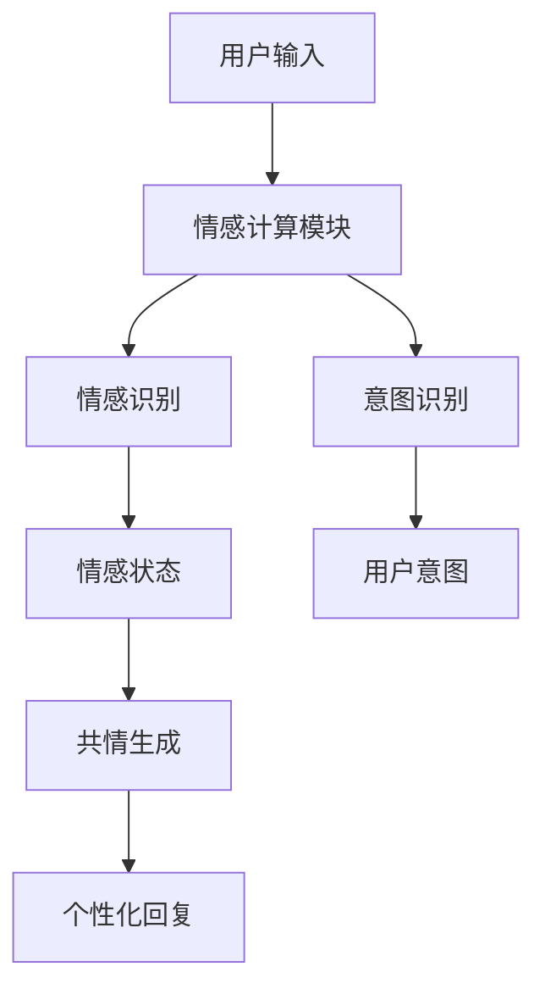
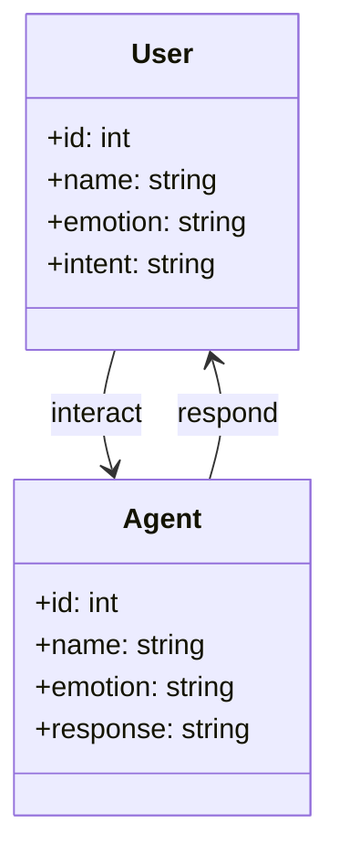
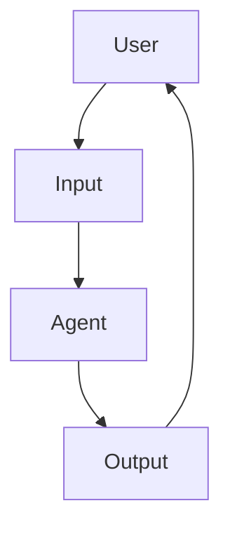

                 


# 《构建具有同理心的AI Agent咨询系统》

## 关键词：
- AI Agent
- 同理心
- 人机交互
- 情感计算
- 机器学习

## 摘要：
本文将深入探讨如何构建一个具有同理心的AI Agent咨询系统。通过分析用户需求，设计情感计算模型，并结合机器学习算法，实现AI Agent对用户情感的理解和共鸣。文章从背景介绍、核心概念、算法原理、系统架构到项目实战，详细阐述了构建具有同理心的AI Agent的全过程。

---

# 第1章: 构建具有同理心的AI Agent咨询系统概述

## 1.1 问题背景
### 1.1.1 当前AI咨询系统的局限性
传统的AI咨询系统在处理用户需求时，往往缺乏对用户情感和意图的深度理解。例如，当用户表达焦虑或不满时，系统可能仅能提供标准的解决方案，而无法感受到用户的情感状态，导致用户体验不佳。

### 1.1.2 同理心在人机交互中的重要性
同理心（Empathy）是人与人之间建立信任和情感连接的关键。在AI Agent与用户的交互中，具备同理心的系统能够更好地理解用户的情感需求，从而提供更贴心的服务。

### 1.1.3 构建具有同理心的AI Agent的必要性
随着AI技术的普及，用户对智能化服务的需求日益增加。具备同理心的AI Agent能够提升用户体验，增强用户满意度和忠诚度。

## 1.2 问题描述
### 1.2.1 用户需求的多样性与复杂性
用户在咨询过程中可能表达的需求多样，且具有复杂性。例如，用户可能在寻求技术解决方案的同时，也隐含着焦虑或不安的情绪。

### 1.2.2 当前AI咨询系统在情感理解上的不足
传统的AI咨询系统主要依赖关键词匹配和规则引擎，难以准确理解用户的情感状态和深层需求。

### 1.2.3 同理心AI Agent的目标与核心问题
目标是通过技术手段，使AI Agent能够理解和回应用户的情感需求。核心问题包括如何准确识别用户情感，如何生成共情的回应，以及如何在实际场景中应用这些技术。

## 1.3 问题解决
### 1.3.1 同理心AI Agent的核心功能
- 情感识别：通过自然语言处理（NLP）技术，识别用户的情感状态。
- 意图识别：理解用户的深层需求和意图。
- 共情回应：生成符合用户情感需求的回应。

### 1.3.2 同理心AI Agent与传统AI咨询系统的区别
| 特性 | 传统AI咨询系统 | 具有同理心的AI Agent |
|------|----------------|-----------------------|
| 情感理解 | 基于关键词匹配 | 基于情感计算和深度学习 |
| 用户互动 | 单向信息传递 | 双向情感互动 |
| 个性化服务 | 标准化响应 | 情感化、个性化响应 |

### 1.3.3 同理心AI Agent的实现路径
1. 收集用户输入。
2. 分析用户情感和意图。
3. 生成共情的回应。
4. 实时调整交互策略。

## 1.4 边界与外延
### 1.4.1 同理心AI Agent的适用场景
- 客户服务：帮助用户解决复杂问题，提升满意度。
- 教育咨询：为学生提供情感支持和学习建议。
- 健康咨询：提供情感支持和健康建议。

### 1.4.2 同理心AI Agent的局限性
- 情感识别的准确性受数据质量和算法限制。
- 个性化服务需要大量用户数据，可能引发隐私问题。
- 共情回应的生成需要依赖高质量的训练数据。

### 1.4.3 同理心AI Agent与其他AI技术的关系
- 与自然语言处理（NLP）密切相关。
- 依赖于机器学习算法进行情感分析和意图识别。
- 与人机交互设计有深度融合。

## 1.5 概念结构与核心要素组成
### 1.5.1 同理心AI Agent的定义
同理心AI Agent是一种能够理解和回应用户情感需求的智能系统，通过情感计算和意图识别技术，实现与用户的深度交互。

### 1.5.2 同理心AI Agent的核心要素
- 情感识别模块：负责分析用户的情感状态。
- 意图识别模块：识别用户的深层需求。
- 共情生成模块：生成符合用户情感需求的回应。

### 1.5.3 同理心AI Agent的实现框架
1. 数据输入：用户输入文本或语音。
2. 情感分析：识别用户情感状态。
3. 意图分析：理解用户需求。
4. 共情回应：生成个性化回复。
5. 反馈优化：根据用户反馈调整系统参数。

## 1.6 本章小结
本章介绍了构建具有同理心的AI Agent咨询系统的背景、目标、核心概念和实现框架。通过对比传统AI咨询系统，明确了同理心AI Agent的独特优势和应用场景。

---

# 第2章: 同理心AI Agent的核心概念与联系

## 2.1 情感计算与同理心的关系
### 2.1.1 情感计算的定义与原理
情感计算（Affective Computing）是通过计算机技术分析和理解人类情感的过程。它涉及语音、面部表情和文本等多种数据源。

### 2.1.2 同理心在情感计算中的作用
同理心是情感计算的核心，它使AI系统能够理解并回应用户的情感需求。

### 2.1.3 情感计算与同理心的关系
情感计算是实现同理心的基础，而同理心是情感计算的目标之一。

## 2.2 用户意图识别
### 2.2.1 意图识别的定义
意图识别是通过分析用户输入，理解其深层需求的过程。

### 2.2.2 意图识别的关键技术
- 自然语言处理（NLP）：分析文本中的关键词和语义。
- 机器学习：训练模型识别用户意图。

### 2.2.3 意图识别与情感计算的关系
意图识别关注用户的需求，而情感计算关注用户的情感状态。两者结合可以更全面地理解用户需求。

## 2.3 共情生成
### 2.3.1 共情生成的定义
共情生成是指AI系统根据用户情感和需求，生成符合用户情感需求的回应。

### 2.3.2 共情生成的关键技术
- 情感分析：识别用户情感。
- 个性化回复生成：根据用户情感生成个性化回应。

## 2.4 情感计算与意图识别的关系
| 关系类型 | 情感计算 | 意图识别 |
|----------|----------|----------|
| 数据来源 | 文本、语音、面部表情 | 文本 |
| 目标 | 理解用户情感 | 理解用户需求 |
| 关联性 | 高 | 中 |

## 2.5 情感计算的实体关系图


## 2.6 本章小结
本章详细阐述了情感计算、意图识别和共情生成的核心概念及其相互关系。通过实体关系图展示了各模块之间的协作关系。

---

# 第3章: 同理心AI Agent的算法原理

## 3.1 情感分析算法
### 3.1.1 基于词袋模型的情感分析
- **词袋模型**：将文本表示为词袋，忽略词序。
- **算法流程**：
  1. 分词：将文本分割成词语。
  2. 特征提取：提取词语作为特征。
  3. 分类：使用机器学习模型进行情感分类。

### 3.1.2 基于深度学习的情感分析
- **模型选择**：使用预训练的BERT模型进行情感分类。
- **算法流程**：
  1. 分词：将文本分割成词语。
  2. 输入BERT模型：获取词向量。
  3. 分类：使用BERT模型进行情感分类。

### 3.1.3 情感分析的Python实现
```python
from transformers import pipeline

sentiment_pipeline = pipeline("sentiment-analysis")

result = sentiment_pipeline("I'm feeling very sad today.")
print(result)
```

### 3.1.4 情感分析的数学模型
情感分类可以使用逻辑回归模型：
$$ P(y=1|x) = \frac{1}{1 + e^{-\beta x}} $$

## 3.2 意图识别算法
### 3.2.1 基于规则的意图识别
- **规则定义**：根据关键词匹配意图。
- **算法流程**：
  1. 分词：将文本分割成词语。
  2. 关键词匹配：检查是否存在预设关键词。

### 3.2.2 基于机器学习的意图识别
- **模型选择**：使用支持向量机（SVM）进行分类。
- **算法流程**：
  1. 特征提取：提取文本特征。
  2. 训练模型：使用SVM进行训练。
  3. 预测意图。

### 3.2.3 意图识别的Python实现
```python
from sklearn.feature_extraction.text import TfidfVectorizer
from sklearn.svm import SVC

# 特征提取
vectorizer = TfidfVectorizer()
X = vectorizer.fit_transform(corpus)

# 训练模型
model = SVC()
model.fit(X, labels)

# 预测意图
test_text = ["I need help with my homework."]
test_X = vectorizer.transform([test_text])
predicted_label = model.predict(test_X)
```

## 3.3 共情生成算法
### 3.3.1 基于规则的共情生成
- **规则定义**：根据情感状态生成预设的回复。

### 3.3.2 基于机器学习的共情生成
- **模型选择**：使用循环神经网络（RNN）生成回复。
- **算法流程**：
  1. 分词：将文本分割成词语。
  2. 生成回复：使用RNN生成回复。

### 3.3.3 共情生成的Python实现
```python
import tensorflow as tf
from tensorflow.keras import layers

# 定义模型
model = tf.keras.Sequential([
    layers.Embedding(input_dim=vocabulary_size, output_dim=embedding_dim),
    layers.LSTM(units=64),
    layers.Dense(units=num_classes, activation='softmax')
])

# 编译模型
model.compile(optimizer='adam', loss='sparse_categorical_crossentropy', metrics=['accuracy'])
```

## 3.4 算法原理的总结
本章详细介绍了情感分析、意图识别和共情生成的算法原理，并通过Python代码示例展示了如何实现这些算法。情感分析使用了词袋模型和深度学习模型，意图识别结合了规则和机器学习方法，共情生成则基于规则和生成模型。

---

# 第4章: 同理心AI Agent系统分析与架构设计

## 4.1 问题场景介绍
用户与AI Agent进行对话，系统需要理解用户的情感和意图，并生成共情的回复。

## 4.2 系统功能设计
### 4.2.1 领域模型类图


### 4.2.2 系统架构设计


### 4.2.3 接口设计
- 输入接口：接收用户输入。
- 输出接口：返回AI Agent的回复。
- 数据接口：存储用户数据和系统状态。

### 4.2.4 交互流程
1. 用户输入问题。
2. 系统分析用户情感和意图。
3. 系统生成共情回复。
4. 系统输出回复。

## 4.3 本章小结
本章从系统设计的角度，详细阐述了同理心AI Agent的功能模块和架构设计。通过类图和流程图展示了系统的交互过程。

---

# 第5章: 同理心AI Agent的项目实战

## 5.1 环境安装
### 5.1.1 安装Python和相关库
```bash
pip install transformers scikit-learn tensorflow
```

## 5.2 核心实现
### 5.2.1 情感分析实现
```python
from transformers import pipeline

sentiment_pipeline = pipeline("sentiment-analysis")
```

### 5.2.2 意图识别实现
```python
from sklearn.feature_extraction.text import TfidfVectorizer
from sklearn.svm import SVC

vectorizer = TfidfVectorizer()
model = SVC()
model.fit(vectorizer.fit_transform(corpus), labels)
```

### 5.2.3 共情生成实现
```python
import tensorflow as tf
from tensorflow.keras import layers

model = tf.keras.Sequential([
    layers.Embedding(input_dim=vocabulary_size, output_dim=embedding_dim),
    layers.LSTM(units=64),
    layers.Dense(units=num_classes, activation='softmax')
])
```

## 5.3 代码解读
### 5.3.1 情感分析代码
```python
result = sentiment_pipeline("I'm feeling very sad today.")
print(result)
```

### 5.3.2 意图识别代码
```python
test_text = ["I need help with my homework."]
test_X = vectorizer.transform([test_text])
predicted_label = model.predict(test_X)
print(predicted_label)
```

### 5.3.3 共情生成代码
```python
model.compile(optimizer='adam', loss='sparse_categorical_crossentropy', metrics=['accuracy'])
model.fit(train_data, train_labels, epochs=10, batch_size=32)
```

## 5.4 案例分析
用户输入：“我最近感觉压力很大，不知道该怎么办。”
系统分析：用户情感为“焦虑”，意图是“寻求帮助”。
系统生成回复：“我能理解你现在的心情，如果你愿意，我可以为你提供一些建议。”

## 5.5 本章小结
本章通过实际案例展示了如何实现同理心AI Agent的核心功能，并通过代码解读帮助读者理解实现细节。

---

# 第6章: 同理心AI Agent的最佳实践

## 6.1 小结
同理心AI Agent通过情感计算和意图识别技术，能够更好地理解用户需求，提供更贴心的服务。

## 6.2 注意事项
- 数据隐私：处理用户数据时需遵守隐私保护法规。
- 情感识别的准确性：需不断优化算法模型。
- 用户体验：确保系统交互流畅，用户反馈及时。

## 6.3 拓展阅读
- 《情感计算：人工智能的新维度》
- 《深度学习在自然语言处理中的应用》

## 6.4 本章小结
本章总结了同理心AI Agent的应用注意事项和拓展方向，帮助读者更好地理解和应用相关技术。

---

# 结语
同理心AI Agent的构建是一个复杂而有趣的过程，需要结合情感计算、意图识别和机器学习等多种技术。通过本文的详细讲解，读者可以全面了解如何构建一个具有同理心的AI Agent咨询系统。

---

# 作者：AI天才研究院/AI Genius Institute & 禅与计算机程序设计艺术 /Zen And The Art of Computer Programming

