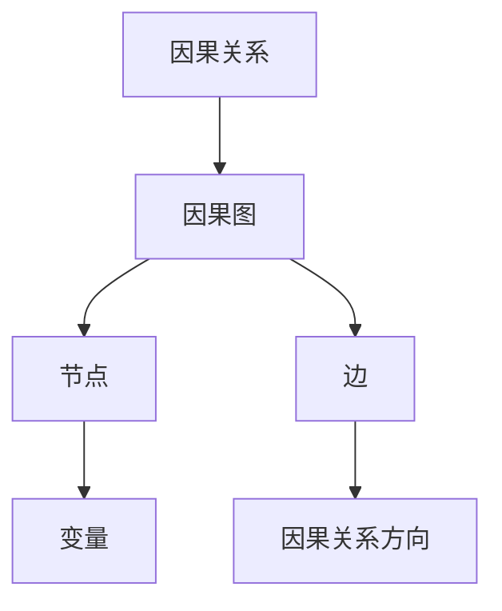

                 

# 《构建具有因果推理能力的AI Agent》

**关键词**：因果推理、AI Agent、机器学习、知识图谱、强化学习、推理引擎

**摘要**：本文深入探讨了构建具有因果推理能力的AI Agent的关键技术与方法。通过分析因果推理的基本原理、算法实现、系统架构以及实际应用场景，本文为读者提供了从理论到实践的全面指南。我们还将对比传统推理方法，展示因果推理在AI Agent中的独特优势，并通过具体案例分析，帮助读者理解如何在实际项目中应用这些技术。

---

# 第一部分: 构建具有因果推理能力的AI Agent背景介绍

## 第1章: 问题背景与问题描述

### 1.1 问题背景
#### 1.1.1 当前AI技术的局限性
现代AI技术，尤其是基于机器学习的方法，主要依赖相关性分析，而非因果关系。这种方法在处理复杂问题时存在局限性，例如无法准确理解变量之间的因果关系，导致决策错误。

#### 1.1.2 因果推理在AI中的重要性
因果推理能够帮助AI理解变量之间的因果关系，从而在决策时考虑“如果改变某个变量，结果会如何变化”。这种能力使得AI Agent能够更好地处理复杂场景，提高决策的准确性和可靠性。

#### 1.1.3 AI Agent的定义与目标
AI Agent是一种智能实体，能够感知环境、自主决策并采取行动以实现特定目标。其核心目标是通过感知和行动，优化其在复杂环境中的表现。

### 1.2 问题描述
#### 1.2.1 当前AI Agent的不足
现有的AI Agent主要依赖相关性分析，难以处理因果关系复杂的问题，导致在动态变化的环境中表现不佳。

#### 1.2.2 因果推理在AI Agent中的需求
为了提高AI Agent的决策能力，需要引入因果推理技术，使其能够理解变量之间的因果关系，并在动态环境中做出更合理的决策。

#### 1.2.3 问题解决的必要性
通过引入因果推理，AI Agent能够更好地理解问题的本质，从而在复杂场景中做出更准确的决策，提升整体性能。

## 第2章: 问题解决与边界定义

### 2.1 问题解决方法
#### 2.1.1 因果推理的基本概念
因果推理是研究变量之间因果关系的科学，通过分析变量之间的因果关系，推断出变量变化对结果的影响。

#### 2.1.2 基于因果推理的AI Agent设计思路
通过构建因果图模型，分析变量之间的因果关系，设计AI Agent的推理引擎，使其能够基于因果关系进行决策。

#### 2.1.3 解决方案的可行性分析
因果推理技术已经在多个领域取得成功应用，具备一定的技术成熟度，能够在AI Agent中实现。

### 2.2 边界与外延
#### 2.2.1 因果推理的边界条件
因果推理仅适用于存在明确因果关系的场景，对于复杂或模糊的因果关系可能无法准确建模。

#### 2.2.2 相关概念的对比与区分
因果推理与相关性推理、逻辑推理等方法有明显的区别，但在实际应用中可以相互结合，提升整体性能。

#### 2.2.3 解决方案的适用范围
因果推理适用于需要精确理解变量之间因果关系的场景，例如医疗诊断、金融风险评估等领域。

## 第3章: 核心概念与要素

### 3.1 核心概念
#### 3.1.1 因果关系的定义
因果关系是指一个事件（原因）导致另一个事件（结果）发生的关系。

#### 3.1.2 因果推理的基本原理
通过分析变量之间的因果关系，推断出变量变化对结果的影响。

#### 3.1.3 AI Agent的核心功能
AI Agent需要具备感知环境、推理因果关系、做出决策并采取行动的能力。

### 3.2 核心要素
#### 3.2.1 数据来源与处理
AI Agent需要收集、处理和分析多源异构数据，构建因果图模型。

#### 3.2.2 因果图模型的构建
通过分析变量之间的因果关系，构建因果图模型，为推理引擎提供基础。

#### 3.2.3 推理引擎的设计
设计高效的推理引擎，能够基于因果图模型进行推理，支持决策过程。

---

# 第二部分: 因果推理与AI Agent的核心概念

## 第4章: 因果推理的基本原理

### 4.1 因果关系的类型
#### 4.1.1 直接因果关系
直接因果关系是指一个变量直接影响另一个变量，例如“降雨量增加导致河流水位上涨”。

#### 4.1.2 间接因果关系
间接因果关系是指一个变量通过中间变量影响另一个变量，例如“降雨量增加导致植被生长，进而影响动物栖息地”。

#### 4.1.3 调整因果关系
调整因果关系是指在存在多个因果路径的情况下，通过调整某些变量来影响结果。

### 4.2 因果图模型
#### 4.2.1 DAG（有向无环图）的基本概念
DAG是一种有向图，用于表示变量之间的因果关系，避免循环依赖。

#### 4.2.2 因果图的构建方法
通过分析变量之间的因果关系，使用结构学习算法构建DAG。

#### 4.2.3 因果图的属性分析
分析DAG的属性，例如父节点、子节点、条件独立性等，为推理提供基础。

## 第5章: 因果推理与传统推理的对比

### 5.1 对比分析
#### 5.1.1 因果推理与相关性推理的区别
相关性推理仅分析变量之间的相关性，无法推断因果关系，而因果推理能够分析变量之间的因果关系。

#### 5.1.2 因果推理与逻辑推理的联系
因果推理可以基于逻辑推理构建因果图模型，逻辑推理用于推理因果关系中的逻辑关系。

#### 5.1.3 因果推理与统计推理的结合
统计推理用于分析数据的分布和关系，因果推理基于统计推理构建因果模型。

### 5.2 因果图模型的ER实体关系图

---

# 第三部分: 因果推理算法原理

## 第6章: 因果发现算法

### 6.1 因果发现算法概述
因果发现算法用于从数据中发现变量之间的因果关系，构建因果图模型。

### 6.2 因果发现算法实现
#### 6.2.1 基于结构学习的因果发现算法
通过结构学习算法，例如PC算法，构建DAG。

#### 6.2.2 基于贝叶斯网络的因果发现算法
使用贝叶斯网络方法，从数据中学习因果关系。

### 6.3 因果发现算法的数学模型
因果发现算法的数学模型通常涉及概率论和图论的知识，用于构建和分析DAG。

## 第7章: 因果推断算法

### 7.1 因果推断算法概述
因果推断算法用于在已知因果图的情况下，推断变量变化对结果的影响。

### 7.2 因果推断算法实现
#### 7.2.1 基于反事实推理的因果推断算法
通过反事实推理方法，推断变量变化对结果的影响。

#### 7.2.2 基于干预的因果推断算法
通过模拟干预实验，推断变量变化对结果的影响。

### 7.3 因果推断算法的数学模型
因果推断算法的数学模型涉及概率论和图论的知识，用于分析因果关系。

---

# 第四部分: 系统分析与架构设计

## 第8章: 系统分析与架构设计

### 8.1 项目介绍
构建一个具有因果推理能力的AI Agent系统，用于解决复杂场景中的决策问题。

### 8.2 系统功能设计
#### 8.2.1 数据处理模块
负责数据的采集、清洗和预处理，构建因果图模型。

#### 8.2.2 推理引擎模块
基于因果图模型，进行因果推理，支持决策过程。

#### 8.2.3 决策模块
根据推理结果，做出决策并采取行动。

### 8.3 系统架构设计
#### 8.3.1 分层架构
系统采用分层架构，包括数据层、推理层和决策层。

#### 8.3.2 微服务架构
系统采用微服务架构，各模块独立运行，便于扩展和维护。

---

# 第五部分: 项目实战

## 第9章: 项目实战

### 9.1 环境安装
安装必要的开发工具和库，例如Python、TensorFlow、因果推理库等。

### 9.2 系统核心实现
#### 9.2.1 数据处理
编写代码，实现数据的采集、清洗和预处理。

#### 9.2.2 因果图构建
使用结构学习算法，构建因果图模型。

#### 9.2.3 因果推理
基于因果图模型，进行因果推理，支持决策过程。

### 9.3 案例分析
通过具体案例，展示系统的实际应用和效果。

### 9.4 项目小结
总结项目的实现过程和成果，分析存在的问题和改进方向。

---

# 第六部分: 总结与展望

## 第10章: 总结与展望

### 10.1 全文总结
总结本文的主要内容和研究成果，强调因果推理在AI Agent中的重要性。

### 10.2 未来展望
展望因果推理技术的发展方向，及其在AI Agent中的潜在应用。

---

**作者：AI天才研究院/AI Genius Institute & 禅与计算机程序设计艺术 /Zen And The Art of Computer Programming**

---

本文详细介绍了构建具有因果推理能力的AI Agent的关键技术与方法，从理论到实践，为读者提供了全面的指导。通过本文的学习，读者可以深入了解因果推理的基本原理、算法实现、系统架构以及实际应用场景，掌握构建具有因果推理能力的AI Agent的核心技术。

