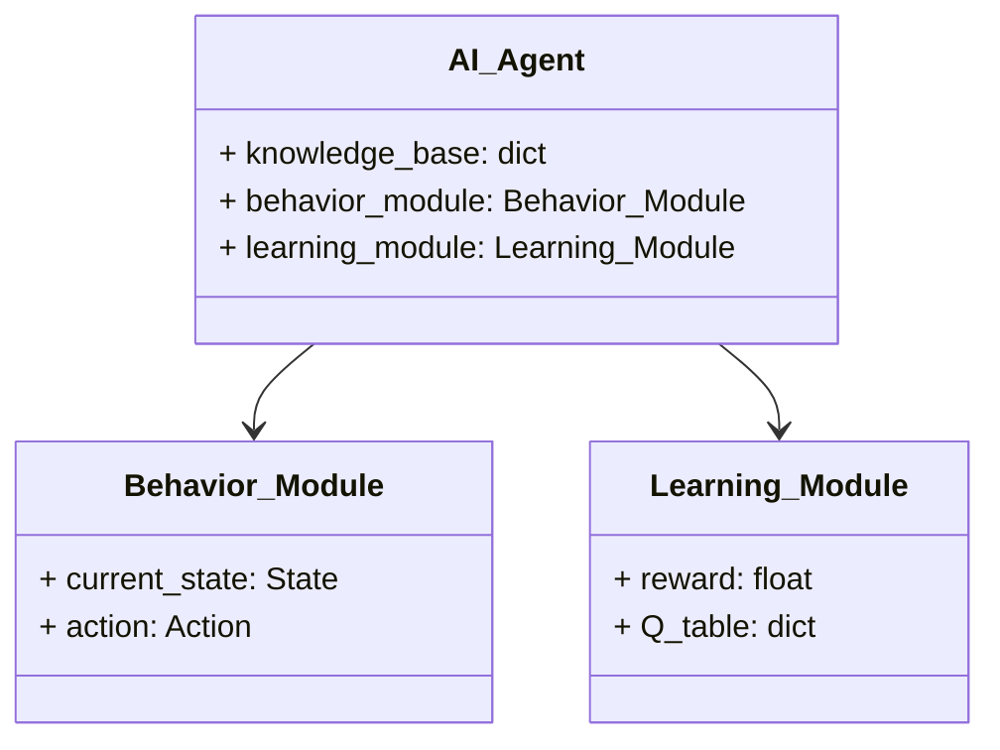
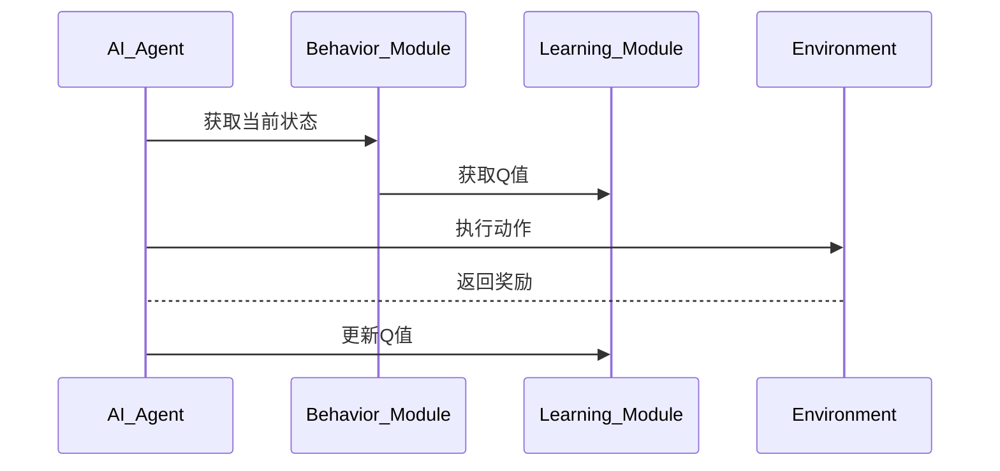

                 


# 构建具有好奇心的AI Agent：探索与学习

> 关键词：AI Agent, 好奇心驱动, 探索机制, 强化学习, 系统架构, 项目实战

> 摘要：本文将探讨如何构建一个具有好奇心的AI Agent，通过分析其核心概念、算法原理、系统架构及项目实战，详细阐述如何设计和实现一个能够自主探索、持续学习的AI代理。

---

# 第一部分：构建具有好奇心的AI Agent背景介绍

## 第1章：问题背景与描述

### 1.1 问题背景
#### 1.1.1 当前AI代理的发展现状
目前，AI Agent（智能体）在各个领域得到了广泛应用，如推荐系统、自动驾驶、机器人等。然而，现有的AI Agent大多依赖于固定的规则或外部奖励，缺乏主动探索和自我改进的能力。

#### 1.1.2 现有AI代理的局限性
1. 过度依赖外部奖励：AI Agent的行为往往被外部奖励驱动，缺乏内在动机。
2. 缺乏主动性：在未知环境中，AI Agent难以主动探索新知识或新技能。
3. 适应性有限：面对动态变化的环境，AI Agent难以快速调整策略。

#### 1.1.3 引入好奇心机制的意义
通过引入好奇心机制，AI Agent可以在没有明确目标的情况下主动探索新知识，增强其在复杂环境中的适应能力和创造力。

### 1.2 问题描述
#### 1.2.1 AI Agent的核心功能需求
1. 自主探索能力：能够在未知环境中主动寻找新知识。
2. 学习能力：能够通过探索积累知识并优化行为策略。
3. 自我改进能力：能够根据探索结果调整自身行为。

#### 1.2.2 好奇心驱动的探索目标
1. 发现新的知识或技能。
2. 解决当前无法解决的问题。
3. 优化现有行为策略。

#### 1.2.3 好奇心机制的实现挑战
1. 如何定义好奇心的数学模型。
2. 如何平衡好奇心驱动的探索与实用性的利用。
3. 如何避免过度探索导致的资源浪费。

### 1.3 问题解决思路
#### 1.3.1 好奇心驱动的探索策略
1. 基于信息差距的探索：AI Agent倾向于探索那些能够减少信息不确定性的领域。
2. 基于 novelty 的探索：AI Agent倾向于探索新奇的事物。

#### 1.3.2 学习机制的设计
1. 使用强化学习（Reinforcement Learning）框架。
2. 引入好奇心驱动的奖励机制。

#### 1.3.3 自我改进的实现路径
1. 定期回顾探索结果，优化行为策略。
2. 结合监督学习和无监督学习，提升知识积累效率。

### 1.4 边界与外延
#### 1.4.1 好奇心驱动的边界条件
1. 探索范围的限制：AI Agent的探索行为不能超出其设计目标。
2. 资源限制：探索行为需要考虑计算资源和时间成本。

#### 1.4.2 相关概念的区分与联系
1. 好奇心与奖励机制：好奇心驱动的探索是内在动机，而奖励机制是外在动机。
2. 好奇心与风险规避：好奇心驱动的探索可能带来高风险，需要平衡探索与风险。

#### 1.4.3 技术实现的可行性分析
1. 基于现有技术，好奇心驱动的AI Agent可以在特定领域实现。
2. 需要结合多种技术，如强化学习、无监督学习等。

### 1.5 概念结构与核心要素
#### 1.5.1 核心概念的层次分解
1. 好奇心：内在动机，驱动AI Agent主动探索。
2. 探索机制：实现好奇心的具体方法。
3. 学习机制：通过探索积累知识并优化行为。

#### 1.5.2 各要素之间的关系
1. 好奇心驱动探索，探索结果用于学习，学习结果优化好奇心机制。

#### 1.5.3 案例分析与对比
1. 案例：AI Agent在游戏中的应用。
2. 对比：传统AI Agent与好奇心驱动的AI Agent在探索行为上的差异。

---

## 第2章：好奇心驱动的AI Agent核心概念

### 2.1 好奇心的定义与特征
#### 2.1.1 好奇心的定义
好奇心是一种内在动机，驱使个体主动探索新知识或新技能。

#### 2.1.2 好奇心的特征对比
1. 内在性：好奇心是内在动机，不需要外部奖励。
2. 主动性：好奇心驱动的行为是主动的，而非被动的。
3. 多样性：好奇心可以针对不同的目标，如知识、技能、问题等。

### 2.2 AI Agent的结构与功能
#### 2.2.1 AI Agent的基本结构
1. 知识库：存储已知的知识和经验。
2. 行为模块：根据当前状态生成行为。
3. 学习模块：通过探索和经验积累知识。

#### 2.2.2 核心功能模块
1. 好奇心驱动的探索模块。
2. 学习与优化模块。

#### 2.2.3 各模块之间的关系
1. 探索模块生成探索目标。
2. 行为模块执行探索行为。
3. 学习模块根据探索结果优化知识库。

### 2.3 好奇心驱动的探索机制
#### 2.3.1 探索目标的生成
1. 基于信息差距：AI Agent倾向于探索能够减少不确定性的事物。
2. 基于novelty：AI Agent倾向于探索新奇的事物。

#### 2.3.2 探索路径的选择
1. 使用启发式算法选择最优路径。
2. 结合强化学习的Q-learning算法。

#### 2.3.3 探索结果的评估
1. 评估新知识的价值。
2. 根据价值调整未来探索策略。

### 2.4 好奇心与其他驱动的对比
#### 2.4.1 好奇心与奖励机制的对比
1. 好奇心是内在动机，奖励机制是外在动机。
2. 好奇心驱动的探索可能带来更高的长期收益。

#### 2.4.2 好奇心与风险规避的对比
1. 好奇心驱动的探索可能带来高风险，需要平衡探索与风险。

#### 2.4.3 好奇心与目标驱动的对比
1. 好奇心驱动的探索是无目标的，目标驱动的行为是有目标的。

---

## 第3章：核心概念的原理与联系

### 3.1 好奇心驱动的数学模型
#### 3.1.1 好奇心的数学表达
1. 好奇心可以表示为对信息不确定性的减少。
2. 数学公式：$$ curiosity = -\log(p(x))$$，其中 \( p(x) \) 是对未知事件的概率估计。

#### 3.1.2 探索行为的数学模型
1. 使用Q-learning算法，定义状态-动作值函数：
   $$ Q(s, a) = r + \gamma \max Q(s', a') $$
   其中 \( r \) 是奖励，\( \gamma \) 是折扣因子。

#### 3.1.3 好奇心驱动的优化目标
1. 最大化好奇心驱动的奖励：
   $$ R_{curiosity} = \sum \gamma^t r_t $$
   其中 \( r_t \) 是第 \( t \) 步的奖励，\( \gamma \) 是折扣因子。

### 3.2 核心概念的属性特征对比
#### 3.2.1 表格对比
| 概念 | 内在性 | 主动性 | 多样性 |
|------|--------|--------|--------|
| 好奇心 | 是     | 是     | 是     |
| 奖励机制 | 否     | 否     | 否     |

### 3.3 ER实体关系图
```mermaid
er
  actor(AI Agent)
  actor -|> curiosity_driven_explore(CDE)
  CDE -

  CDE -->| explores | target(T)
  CDE -->| generates | knowledge(K)
```

---

## 第4章：好奇心驱动的探索机制

### 4.1 好奇心驱动的算法原理
#### 4.1.1 基于信息差距的探索
1. 使用KL散度衡量信息差距：
   $$ D_{KL}(p || q) = \sum p \log \frac{p}{q} $$
2. AI Agent倾向于探索能够最小化KL散度的领域。

#### 4.1.2 基于novelty的探索
1. 使用无监督学习方法发现新奇的事件或模式。

### 4.2 算法实现
#### 4.2.1 使用Q-learning实现好奇心驱动的探索
```python
import numpy as np

class Curiosity_Driven_EXP:
    def __init__(self, state_space, action_space, gamma=0.99):
        self.state_space = state_space
        self.action_space = action_space
        self.gamma = gamma
        self.Q = np.zeros((state_space, action_space))

    def choose_action(self, state, epsilon=0.1):
        if np.random.random() < epsilon:
            return np.random.randint(self.action_space)
        q_values = self.Q[state, :]
        return np.argmax(q_values)

    def update_Q(self, state, action, reward, next_state):
        self.Q[state, action] = reward + self.gamma * np.max(self.Q[next_state, :])
```

#### 4.2.2 使用神经网络实现复杂环境中的探索
```python
import tensorflow as tf

class CuriosityModel(tf.keras.Model):
    def __init__(self, state_shape, action_shape):
        super(CuriosityModel, self).__init__()
        self.state_shape = state_shape
        self.action_shape = action_shape
        self.dense1 = tf.keras.layers.Dense(64, activation='relu')
        self.dense2 = tf.keras.layers.Dense(32, activation='relu')
        self.value = tf.keras.layers.Dense(1, activation='linear')

    def call(self, inputs):
        x = self.dense1(inputs)
        x = self.dense2(x)
        v = self.value(x)
        return v
```

---

## 第5章：系统分析与架构设计

### 5.1 问题场景介绍
假设我们正在开发一个用于教育领域的AI助教，该助教需要通过与学生互动，主动探索新的知识点，以提供更个性化的学习建议。

### 5.2 系统功能设计
#### 5.2.1 领域模型类图


### 5.3 系统架构设计
#### 5.3.1 系统架构图
```mermaid
arch
  container AI_Agent {
    component Behavior_Module
    component Learning_Module
  }
  container Environment {
    component Student
  }
  AI_Agent --> Environment
```

#### 5.3.2 系统接口设计
1. 接口1：`get_curiosity_reward`：获取好奇心驱动的奖励。
2. 接口2：`update_knowledge_base`：更新知识库。

#### 5.3.3 系统交互流程


---

## 第6章：项目实战

### 6.1 环境安装
1. 安装Python和相关库：
   ```bash
   pip install numpy tensorflow
   ```

### 6.2 系统核心实现
#### 6.2.1 实现好奇心驱动的探索模块
```python
def explore_new_concepts(knowledge_base):
    # 找出知识库中未覆盖的概念
    unknown_concepts = [c for c in all_possible_concepts if c not in knowledge_base]
    # 选择其中一个概念进行探索
    return random.choice(unknown_concepts)
```

#### 6.2.2 实现学习与优化模块
```python
def update_knowledge_base(knowledge_base, new_concept):
    knowledge_base.append(new_concept)
    return knowledge_base
```

### 6.3 代码应用解读与分析
1. `explore_new_concepts`函数用于生成新的探索目标。
2. `update_knowledge_base`函数用于更新知识库。

### 6.4 实际案例分析
1. 案例：AI助教在教育领域的应用。
2. 分析：通过好奇心驱动的探索，AI助教可以主动学习新的知识点，提供更全面的学习建议。

---

## 第7章：最佳实践

### 7.1 注意事项
1. 确保探索行为的可控性。
2. 定期评估探索结果的价值。

### 7.2 小结
通过本文的分析，我们了解了如何构建一个具有好奇心的AI Agent，包括核心概念、算法原理、系统架构及项目实战。

### 7.3 注意事项
1. 好奇心驱动的探索需要平衡探索与实用性的利用。
2. 避免过度探索导致的资源浪费。

### 7.4 拓展阅读
1. 建议阅读相关强化学习和无监督学习的书籍。
2. 关注最新的AI Agent研究进展。

---

作者：AI天才研究院/AI Genius Institute & 禅与计算机程序设计艺术 /Zen And The Art of Computer Programming

