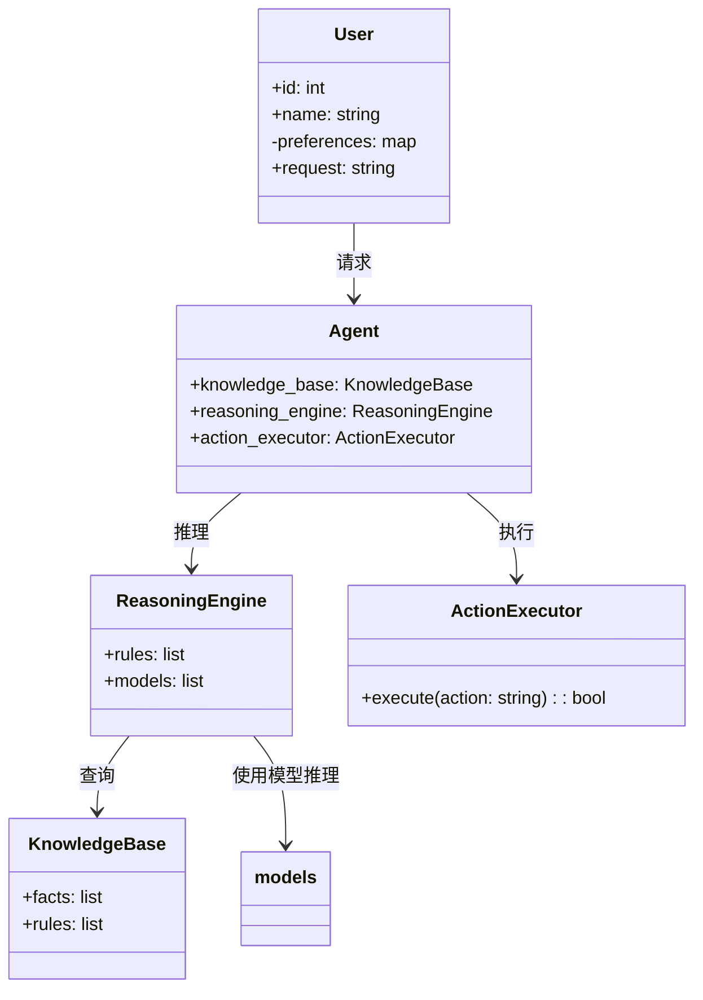
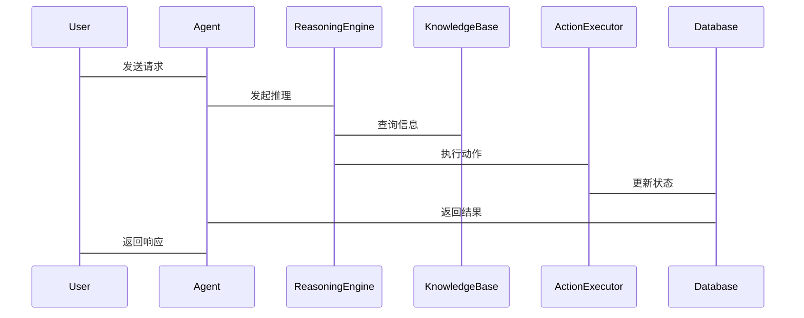

                 


# 构建具有批判性思维的AI Agent系统

## 关键词：AI Agent，批判性思维，人工智能，系统设计，算法实现，智能决策

## 摘要：本文详细探讨了如何构建具有批判性思维的AI Agent系统。首先介绍了AI Agent的基本概念和批判性思维的定义，接着分析了批判性思维在AI Agent中的重要性。然后从算法原理、系统架构、项目实战等多方面展开，详细讲解了如何实现具有批判性思维的AI Agent系统，包括逻辑推理、概率推理等算法，以及系统架构设计和实际案例分析。最后给出了实际应用中的注意事项和未来的发展方向。

---

# 构建具有批判性思维的AI Agent系统

## 第1章: AI Agent系统概述

### 1.1 AI Agent的基本概念

#### 1.1.1 什么是AI Agent

AI Agent（人工智能代理）是指能够感知环境、自主决策并采取行动以实现特定目标的智能实体。AI Agent可以是软件程序、机器人或其他智能系统，能够根据输入的信息做出反应，并采取相应的行动。

#### 1.1.2 AI Agent的分类

AI Agent可以根据智能水平、任务类型、环境类型等多种标准进行分类。常见的分类包括：

1. **反应式Agent**：基于当前感知做出反应，不依赖历史信息。
2. **认知式Agent**：具有复杂推理和规划能力，能够处理长期任务。
3. **学习式Agent**：能够通过经验改进性能。
4. **协作式Agent**：能够与其他Agent或人类协作完成任务。

#### 1.1.3 AI Agent的核心特征

AI Agent的核心特征包括：

1. **自主性**：能够在没有外部干预的情况下自主运作。
2. **反应性**：能够感知环境并实时做出反应。
3. **目标导向性**：具有明确的目标，并采取行动以实现目标。
4. **学习能力**：能够通过经验或数据改进性能。

### 1.2 批判性思维的定义与特点

#### 1.2.1 批判性思维的定义

批判性思维是指能够分析、评估和判断信息的能力，强调逻辑推理和独立思考。它不仅关注事实本身，还关注信息的来源、逻辑关系和潜在偏见。

#### 1.2.2 批判性思维的核心要素

批判性思维的核心要素包括：

1. **分析能力**：分解问题，识别关键因素。
2. **评估能力**：评估信息的可靠性、有效性和相关性。
3. **判断能力**：基于分析和评估做出合理判断。

#### 1.2.3 批判性思维与AI Agent的结合

将批判性思维应用于AI Agent，可以使AI Agent在决策过程中更加理性、准确和可靠。AI Agent可以通过批判性思维分析多个可能性，评估每个可能性的优缺点，并做出最优选择。

### 1.3 本章小结

本章介绍了AI Agent的基本概念、分类及其核心特征，并定义了批判性思维，分析了其核心要素及在AI Agent中的应用。这为后续章节奠定了基础。

---

## 第2章: AI Agent系统的发展背景

### 2.1 AI Agent的历史发展

#### 2.1.1 从规则驱动到数据驱动的演变

早期的AI Agent主要基于规则进行推理，随着大数据和机器学习技术的发展，AI Agent逐渐从规则驱动转向数据驱动。

#### 2.1.2 大模型在AI Agent中的应用

近年来，大语言模型（如GPT系列）的出现，为AI Agent的自然语言处理和决策能力带来了革命性的进步。

#### 2.1.3 当前AI Agent的发展趋势

当前，AI Agent正朝着更加智能化、个性化和协作化的方向发展，尤其是在自动驾驶、智能助手和机器人领域。

### 2.2 批判性思维在AI Agent中的重要性

#### 2.2.1 批判性思维在AI决策中的作用

批判性思维可以帮助AI Agent在复杂的环境中做出合理决策，避免盲目跟随数据或规则。

#### 2.2.2 批判性思维对AI Agent性能的提升

通过批判性思维，AI Agent可以更好地理解任务需求，分析问题本质，从而提高决策的准确性和效率。

#### 2.2.3 批判性思维在复杂场景中的应用

在多变和不确定的环境中，批判性思维能够帮助AI Agent灵活应对各种挑战，做出更具前瞻性的决策。

### 2.3 本章小结

本章分析了AI Agent的历史发展和当前趋势，并重点探讨了批判性思维在AI Agent中的重要性及其在复杂场景中的应用。

---

## 第3章: 批判性思维的数学模型与算法原理

### 3.1 批判性思维的逻辑框架

#### 3.1.1 命题逻辑与谓词逻辑

命题逻辑研究命题的真假关系，而谓词逻辑则研究更复杂的逻辑关系，常用于AI Agent的知识表示和推理。

#### 3.1.2 模糊逻辑与概率推理

模糊逻辑处理不确定性问题，概率推理则基于概率论进行推断，常用于处理不确定性和不完全信息的情况。

#### 3.1.3 归纳推理与演绎推理

归纳推理从具体实例中总结一般规律，演绎推理则从一般规律推出具体结论。

### 3.2 AI Agent的推理机制

#### 3.2.1 逻辑推理算法

逻辑推理算法包括命题逻辑推理和谓词逻辑推理，用于处理基于事实的推理问题。

#### 3.2.2 概率推理算法

概率推理算法（如贝叶斯网络）用于处理基于概率的推理问题，能够处理不确定性。

#### 3.2.3 模糊推理算法

模糊推理算法（如模糊逻辑推理）用于处理模糊信息，适用于自然语言理解和情境分析。

### 3.3 批判性思维的数学模型

#### 3.3.1 基于逻辑的批判性思维模型

基于逻辑的模型使用逻辑推理来分析和评估信息，确保决策的合理性和正确性。

#### 3.3.2 基于概率的批判性思维模型

基于概率的模型结合概率论进行推理，能够处理不确定性和不完全信息。

#### 3.3.3 基于神经网络的批判性思维模型

基于神经网络的模型利用深度学习技术，通过训练数据学习批判性思维的模式和规律。

---

## 第4章: AI Agent的批判性思维实现

### 4.1 批判性思维的实现方法

#### 4.1.1 基于规则的实现

基于规则的实现通过预定义的规则和条件来实现批判性思维，适用于任务简单且规则明确的场景。

#### 4.1.2 基于知识图谱的实现

基于知识图谱的实现利用知识图谱表示和推理，适用于需要处理复杂知识和关系的场景。

#### 4.1.3 基于大模型的实现

基于大模型的实现利用大语言模型进行自然语言理解和推理，适用于需要处理复杂语义和上下文的场景。

### 4.2 批判性思维的算法实现

#### 4.2.1 基于逻辑推理的算法

基于逻辑推理的算法通过逻辑推理模型进行分析和评估，确保决策的正确性和合理性。

#### 4.2.2 基于概率推理的算法

基于概率推理的算法通过概率模型进行推理，能够处理不确定性和不完全信息。

#### 4.2.3 基于模糊推理的算法

基于模糊推理的算法通过模糊逻辑进行推理，适用于处理模糊信息和自然语言理解。

### 4.3 本章小结

本章详细讲解了批判性思维在AI Agent中的实现方法和算法原理，分析了不同实现方法的优缺点及其适用场景。

---

## 第5章: AI Agent系统分析与架构设计

### 5.1 问题场景介绍

本章以一个具体的场景为例，介绍如何设计和实现一个具有批判性思维的AI Agent系统。例如，设计一个智能助手，能够帮助用户完成日常任务并做出合理决策。

### 5.2 系统功能设计

#### 5.2.1 领域模型设计

领域模型设计使用Mermaid类图展示系统的功能模块及其关系。例如：



#### 5.2.2 系统架构设计

系统架构设计使用Mermaid架构图展示系统的整体架构。例如：


#### 5.2.3 系统接口设计

系统接口设计需要定义各个模块之间的接口。例如：

- `User`向`Agent`发送请求。
- `Agent`调用`ReasoningEngine`进行推理。
- `ReasoningEngine`查询`KnowledgeBase`获取信息。
- `ActionExecutor`执行具体动作。

#### 5.2.4 系统交互设计

系统交互设计使用Mermaid序列图展示系统之间的交互流程。例如：



### 5.3 本章小结

本章通过具体场景介绍，详细讲解了AI Agent系统的分析与架构设计，包括领域模型设计、系统架构设计、系统接口设计和系统交互设计。

---

## 第6章: 项目实战

### 6.1 环境安装与配置

#### 6.1.1 安装Python

安装Python 3.8或更高版本，确保环境满足要求。

#### 6.1.2 安装依赖库

安装必要的Python库，如`numpy`, `pandas`, `scikit-learn`, `transformers`等。

```bash
pip install numpy pandas scikit-learn transformers
```

### 6.2 系统核心实现

#### 6.2.1 逻辑推理算法实现

实现基于逻辑推理的算法，例如：

```python
def logical_inference(rules, facts):
    # 实现逻辑推理算法
    pass
```

#### 6.2.2 概率推理算法实现

实现基于概率的推理算法，例如：

```python
from sklearn.naive_bayes import MultinomialNB

def probability_inference(data, labels):
    model = MultinomialNB()
    model.fit(data, labels)
    return model
```

#### 6.2.3 模糊推理算法实现

实现基于模糊逻辑的推理算法，例如：

```python
import fuzzyset

def fuzzy_inference(input, rules):
    # 实现模糊推理算法
    pass
```

#### 6.2.4 系统集成与测试

集成各个模块，进行系统测试，确保系统能够正常运行并实现预期功能。

### 6.3 案例分析与实现

#### 6.3.1 案例分析

以具体案例为例，分析系统的需求和实现步骤。

#### 6.3.2 代码实现

提供实现代码，并进行详细解读和分析。

#### 6.3.3 实际应用分析

分析系统在实际应用中的表现和效果，总结经验教训。

### 6.4 本章小结

本章通过项目实战，详细讲解了AI Agent系统的实现过程，包括环境配置、核心算法实现、系统集成与测试以及案例分析。

---

## 第7章: 总结与展望

### 7.1 总结

总结全文的主要内容，回顾AI Agent的基本概念、批判性思维的重要性以及系统的实现过程。

### 7.2 展望

展望未来的发展方向，探讨批判性思维在AI Agent中的进一步应用，例如结合边缘计算、区块链等技术，提升系统的智能化和安全性。

### 7.3 注意事项与最佳实践

提供实际应用中的注意事项和最佳实践建议，帮助读者更好地理解和应用这些概念。

---

## 作者

作者：AI天才研究院/AI Genius Institute & 禅与计算机程序设计艺术 /Zen And The Art of Computer Programming

---

以上是《构建具有批判性思维的AI Agent系统》的技术博客文章的完整大纲和部分内容。每一章都详细讲解了相关概念和实现方法，确保读者能够全面理解并掌握构建具有批判性思维的AI Agent系统的核心技术和方法。

