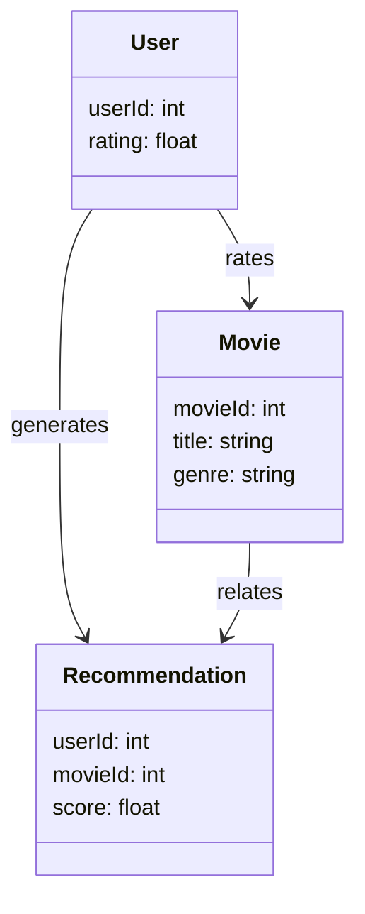
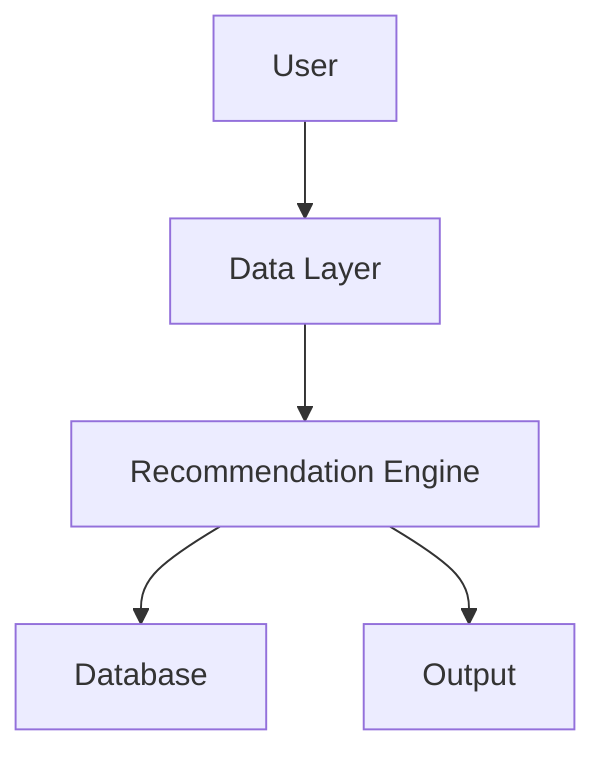
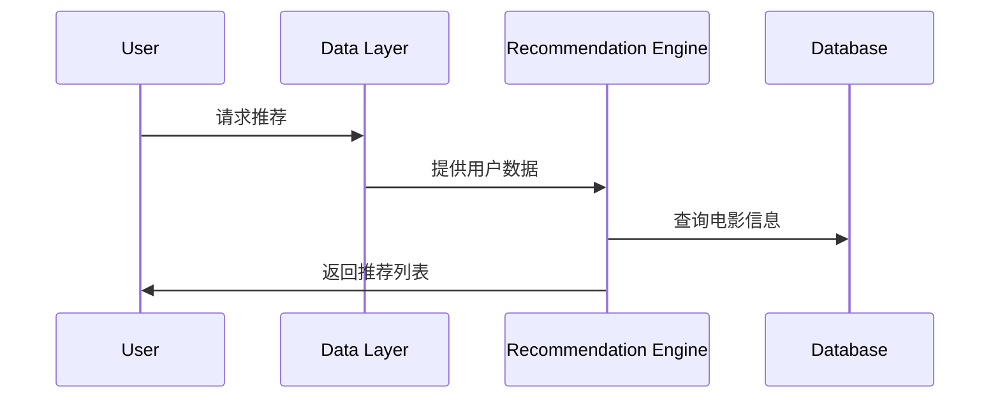

                 


# 构建具有推荐系统能力的AI Agent

> 关键词：推荐系统、AI Agent、协同过滤、矩阵分解、机器学习、自然语言处理

> 摘要：本文详细介绍了如何构建一个具有推荐系统能力的AI Agent，从推荐系统的概念、算法原理、系统架构设计到项目实战，全面解析了构建过程中的关键技术和实现细节。通过本文，读者可以掌握推荐系统的基本原理、AI Agent的核心概念以及如何将两者结合起来，实现智能化的推荐服务。

---

# 第一部分: 构建具有推荐系统能力的AI Agent概述

## 第1章: 推荐系统与AI Agent的背景介绍

### 1.1 推荐系统的概念与应用

#### 1.1.1 推荐系统的定义与核心问题
推荐系统是一种基于用户行为和偏好，通过算法生成个性化推荐的系统。其核心问题是解决信息过载问题，帮助用户从海量信息中快速找到感兴趣的内容。

#### 1.1.2 推荐系统的应用场景
推荐系统广泛应用于电商、社交媒体、视频平台等领域。例如，亚马逊的图书推荐、YouTube的视频推荐等。

#### 1.1.3 推荐系统的分类与特点
推荐系统主要分为基于协同过滤、基于内容的推荐和混合推荐三种类型。协同过滤推荐依赖用户行为数据，内容推荐依赖物品的特征信息，混合推荐则是两者的结合。

### 1.2 AI Agent的基本概念

#### 1.2.1 AI Agent的定义与特征
AI Agent是一种能够感知环境、自主决策并执行任务的智能实体。其核心特征包括感知能力、自主决策能力和人机交互能力。

#### 1.2.2 AI Agent的类型与功能
AI Agent可以分为简单反射型、基于模型的反射型、目标驱动型和效用驱动型四种类型。其功能包括数据采集、分析决策、执行反馈等。

#### 1.2.3 AI Agent的应用领域
AI Agent广泛应用于智能助手、自动驾驶、智能客服等领域。例如，Siri、Alexa等智能助手都是典型的AI Agent应用。

### 1.3 推荐系统与AI Agent的结合

#### 1.3.1 推荐系统在AI Agent中的作用
推荐系统作为AI Agent的核心模块之一，负责为用户提供个性化的内容推荐，提升用户体验。

#### 1.3.2 AI Agent如何提升推荐系统的性能
AI Agent通过整合多模态数据（如文本、图像、视频等），利用机器学习算法，提升推荐系统的准确性和实时性。

#### 1.3.3 推荐系统与AI Agent的协同工作模式
推荐系统与AI Agent协同工作的模式包括数据协同、算法协同和任务协同三种形式。通过协同工作，推荐系统能够更好地适应用户的动态需求。

---

## 第2章: 推荐系统的核心概念与原理

### 2.1 推荐系统的数学模型

#### 2.1.1 用户-物品交互矩阵
用户-物品交互矩阵是推荐系统的基础数据结构，记录用户对物品的偏好信息。

#### 2.1.2 用户偏好与物品特征的表示
通过向量化的方法，将用户偏好和物品特征表示为高维向量，便于计算相似性。

#### 2.1.3 推荐系统的评价指标
常见的评价指标包括准确率、召回率、F1值等，用于衡量推荐系统的性能。

### 2.2 推荐系统的算法原理

#### 2.2.1 协同过滤算法

##### 2.2.1.1 基于用户的协同过滤
基于用户的协同过滤算法通过寻找与目标用户行为相似的其他用户，将其喜欢的物品推荐给目标用户。

##### 2.2.1.2 基于物品的协同过滤
基于物品的协同过滤算法通过寻找与目标物品相似的其他物品，将其推荐给目标用户。

##### 2.2.1.3 混合协同过滤
混合协同过滤算法结合基于用户和基于物品的协同过滤方法，通过加权融合提升推荐效果。

#### 2.2.2 基于内容的推荐算法

##### 2.2.2.1 基于文本挖掘的内容推荐
通过文本挖掘技术，提取物品的文本特征，生成推荐结果。

##### 2.2.2.2 基于特征提取的内容推荐
通过特征提取方法，如TF-IDF或Word2Vec，将文本特征表示为向量，用于推荐。

#### 2.2.3 基于矩阵分解的推荐算法

##### 2.2.3.1 矩阵分解的基本原理
矩阵分解通过将用户-物品交互矩阵分解为用户特征矩阵和物品特征矩阵，实现推荐。

##### 2.2.3.2 常见的矩阵分解方法
常见的矩阵分解方法包括奇异值分解(SVD)、非负矩阵分解(NMF)等。

---

## 第3章: AI Agent的核心概念与推荐系统的关系

### 3.1 AI Agent的推荐系统架构

#### 3.1.1 AI Agent的感知层
感知层负责采集用户行为数据、环境信息等，为推荐系统提供输入。

#### 3.1.2 AI Agent的认知层
认知层负责分析和处理数据，利用推荐算法生成推荐结果。

#### 3.1.3 AI Agent的决策层
决策层根据推荐结果和用户反馈，优化推荐策略，提升推荐效果。

### 3.2 推荐系统在AI Agent中的实现

#### 3.2.1 数据采集与处理
通过传感器、日志记录等方法采集用户行为数据，进行预处理和特征提取。

#### 3.2.2 算法实现与优化
基于协同过滤、矩阵分解等算法实现推荐系统，并通过参数调优提升性能。

#### 3.2.3 人机交互与反馈
通过自然语言处理技术实现人机交互，根据用户反馈优化推荐策略。

---

## 第4章: 推荐系统的数学模型与算法实现

### 4.1 协同过滤算法的数学模型

#### 4.1.1 基于用户的协同过滤模型
$$ sim(u, v) = \frac{\sum_{i} (r_{u,i} - \bar{r}_u)(r_{v,i} - \bar{r}_v)}{\sqrt{\sum_{i} (r_{u,i} - \bar{r}_u)^2} \sqrt{\sum_{i} (r_{v,i} - \bar{r}_v)^2}} $$

#### 4.1.2 基于物品的协同过滤模型
$$ sim(i, j) = \frac{\sum_{u} (r_{u,i} - \bar{r}_i)(r_{u,j} - \bar{r}_j)}{\sqrt{\sum_{u} (r_{u,i} - \bar{r}_i)^2} \sqrt{\sum_{u} (r_{u,j} - \bar{r}_j)^2}} $$

### 4.2 矩阵分解算法的数学模型

#### 4.2.1 矩阵分解的基本公式
$$ R = U \cdot V^T $$

#### 4.2.2 常见的矩阵分解方法
- 奇异值分解(SVD)
- 非负矩阵分解(NMF)
- 独特值分解(ALS)

---

## 第5章: 系统分析与架构设计方案

### 5.1 问题场景介绍
以电影推荐系统为例，介绍推荐系统的应用场景和需求分析。

### 5.2 项目介绍
项目目标是构建一个基于协同过滤算法的电影推荐系统。

### 5.3 系统功能设计

#### 5.3.1 领域模型设计


#### 5.3.2 系统架构设计


### 5.4 系统接口设计

#### 5.4.1 接口描述
- `/get_recommendations/`: 根据用户ID返回推荐列表。
- `/rate_movie/`: 用户对电影的评分接口。

### 5.5 系统交互设计



---

## 第6章: 项目实战

### 6.1 环境安装

#### 6.1.1 安装Python
```bash
python --version
```

#### 6.1.2 安装依赖库
```bash
pip install numpy pandas scikit-learn
```

### 6.2 核心实现源代码

#### 6.2.1 协同过滤算法实现
```python
from sklearn.metrics.pairwise import cosine_similarity

def collaborative_filtering(user_item_matrix):
    user_similarity = cosine_similarity(user_item_matrix)
    return user_similarity
```

#### 6.2.2 矩阵分解算法实现
```python
from sklearn.decomposition import TruncatedSVD

def matrix_factorization(user_item_matrix):
    svd = TruncatedSVD(n_components=50)
    user_factors = svd.fit_transform(user_item_matrix)
    return user_factors
```

### 6.3 实际案例分析

#### 6.3.1 数据预处理
```python
import pandas as pd

ratings = pd.read_csv('ratings.csv')
movies = pd.read_csv('movies.csv')
```

#### 6.3.2 模型训练
```python
user_item_matrix = ratings.pivot_table(index='userId', columns='movieId', values='rating', fill_value=0)
user_item_matrix = user_item_matrix.values
```

#### 6.3.3 推荐结果分析
```python
user_id = 1
recommended_movies = collaborative_filtering(user_item_matrix)[user_id]
print(recommended_movies)
```

---

## 第7章: 总结与展望

### 7.1 最佳实践Tips
- 数据预处理是关键，确保数据质量。
- 算法选择要根据场景和数据规模。
- 持续优化推荐策略，提升用户体验。

### 7.2 小结
本文详细介绍了如何构建具有推荐系统能力的AI Agent，从理论到实践，全面解析了推荐系统的实现过程。

### 7.3 注意事项
- 数据隐私和安全问题需要高度重视。
- 算法的可解释性需要进一步研究。
- 系统的实时性和响应速度需要优化。

### 7.4 拓展阅读
- 《推荐系统实践》
- 《机器学习实战》
- 《AI Agent原理与应用》

---

# 作者：AI天才研究院/AI Genius Institute & 禅与计算机程序设计艺术 /Zen And The Art of Computer Programming

