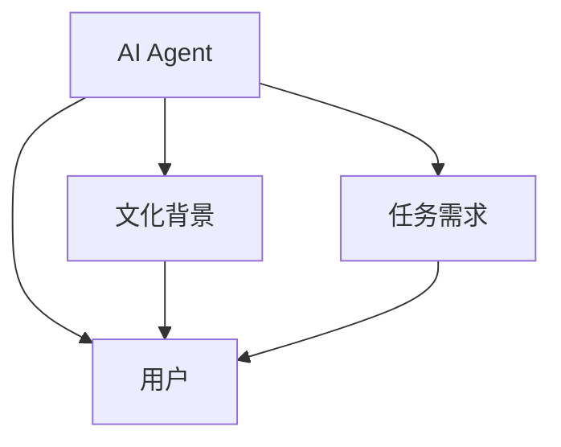
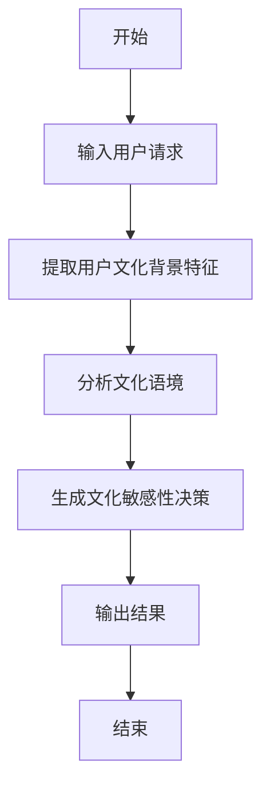
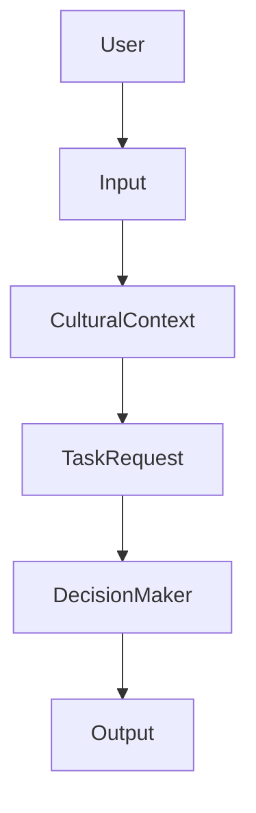

                 


# 《构建具有文化适应性的AI Agent系统》

## 关键词：
- AI Agent
- 文化适应性
- 跨文化适应
- 多语言支持
- 智能系统设计

## 摘要：
本文探讨了构建具有文化适应性的AI Agent系统的挑战与解决方案。通过分析文化差异对AI Agent行为的影响，提出了一种基于文化特征提取、文化语境分析和文化敏感决策的系统架构。本文详细阐述了跨文化适应算法的设计与实现，并通过实际案例展示了如何在不同文化背景下优化AI Agent的行为模式，确保系统能够提供更符合用户文化习惯的服务。

---

## 第一部分：文化适应性AI Agent系统概述

### 第1章：文化适应性AI Agent的背景与问题背景

#### 1.1 问题背景
- **AI Agent的基本概念**  
  AI Agent是一种智能实体，能够感知环境、执行任务并做出决策。它通常具备自主性、反应性、目标导向性和社交能力等特性。
- **文化差异对AI Agent的影响**  
  不同文化背景下的用户在语言表达、行为习惯和决策逻辑上存在显著差异。例如，某些文化更倾向于直接表达意见，而另一些文化则倾向于含蓄和间接的表达方式。
- **当前AI Agent在跨文化环境中的挑战**  
  当前的AI Agent系统往往基于单一文化背景设计，难以适应不同文化环境下的用户需求。例如，在某些文化中，AI Agent的决策逻辑可能被认为是过于直接或不够尊重。

#### 1.2 问题描述
- **AI Agent在不同文化中的适应性问题**  
  当AI Agent面对不同文化背景的用户时，可能因为缺乏对文化差异的理解而产生误解或错误决策。
- **用户需求与文化适应性之间的矛盾**  
  用户的需求往往受到文化背景的深刻影响，而AI Agent系统如果不具备文化适应性，将无法满足用户的实际需求。
- **AI Agent在文化敏感任务中的失败案例**  
  例如，在跨文化客服系统中，AI Agent可能因为不理解用户的含蓄表达方式而未能提供正确的解决方案。

#### 1.3 问题解决
- **文化适应性AI Agent的目标**  
  设计一种能够感知、理解和适应不同文化背景的AI Agent系统，使其能够在跨文化环境中提供个性化的服务。
- **解决问题的思路与方法**  
  通过文化特征提取、文化语境分析和文化敏感决策等技术，构建一个能够动态调整行为模式的AI Agent系统。
- **技术实现的可行性分析**  
  基于自然语言处理（NLP）、机器学习和知识图谱等技术，结合文化研究领域的研究成果，构建文化适应性AI Agent系统是可行的。

#### 1.4 边界与外延
- **文化适应性AI Agent的适用范围**  
  适用于需要跨文化支持的场景，如跨国企业客服、多语言AI助手和跨文化教育辅助系统等。
- **相关概念的区分与联系**  
  区分文化适应性AI Agent与其他类型的AI Agent（如任务专用AI Agent），并探讨它们之间的联系。
- **系统边界与功能限制**  
  系统的功能范围主要集中在文化适应性方面，其他功能（如任务执行和数据处理）作为基础支撑。

#### 1.5 核心要素组成
- **AI Agent的基本组成**  
  包括感知模块、决策模块和执行模块。
- **文化适应性模块的构成**  
  包括文化特征提取模块、文化语境分析模块和文化敏感决策模块。
- **系统整体架构分析**  
  系统整体架构包括用户输入、文化适应性处理、决策生成和输出反馈等部分。

---

## 第二部分：文化适应性AI Agent的核心概念与联系

### 第2章：文化适应性AI Agent的核心概念

#### 2.1 核心概念原理
- **文化适应性的定义与实现方式**  
  文化适应性是指AI Agent能够根据用户的文化背景动态调整其行为模式和输出结果。实现方式包括文化特征提取、文化语境分析和动态调整策略。
- **AI Agent的感知与决策机制**  
  AI Agent通过感知用户输入中的文化特征，分析文化语境，并基于文化敏感性做出决策。
- **跨文化语境下的信息处理流程**  
  包括文化特征提取、文化语境分析、文化敏感性判断和行为模式调整等步骤。

#### 2.2 核心概念属性特征对比
- **不同文化背景下AI Agent的行为模式对比**  
  列表展示了不同文化背景下AI Agent的行为模式差异，例如直接表达与间接表达、集体决策与个体决策等。
- **不同文化适应性算法的性能对比**  
  比较了基于规则的适应性算法和基于机器学习的适应性算法在不同文化环境下的性能。
- **不同文化背景下的用户需求特征分析**  
  列表展示了不同文化背景下用户的语言表达习惯和决策偏好。

#### 2.3 ER实体关系图


---

## 第三部分：文化适应性AI Agent的算法原理

### 第3章：文化适应性AI Agent的算法实现

#### 3.1 算法原理
- **跨文化适应性算法的基本思想**  
  基于用户的文化背景特征，动态调整AI Agent的决策策略。
- **基于文化特征的权重分配方法**  
  根据用户的文化背景特征，计算不同特征的权重，并基于权重进行决策。
- **动态调整策略的实现机制**  
  根据用户反馈和环境变化，实时调整AI Agent的行为模式。

#### 3.2 算法流程图


#### 3.3 算法实现代码
```python
def cultural_adaptation_agent(user_request, cultural_context):
    # 提取文化特征
    cultural_features = extract_features(user_request, cultural_context)
    
    # 计算特征权重
    feature_weights = calculate_weights(cultural_features)
    
    # 生成决策
    decision = generate_decision(cultural_features, feature_weights)
    
    return decision
```

#### 3.4 数学公式与详细讲解
- **文化特征权重计算公式**  
  $$ w_i = \frac{f_i}{\sum_{j=1}^{n} f_j} $$
  其中，\( w_i \) 表示第 \( i \) 个文化特征的权重，\( f_i \) 表示第 \( i \) 个文化特征的强度。
- **决策生成模型**  
  $$ D = \argmax_{i} (w_i \times s_i) $$
  其中，\( D \) 表示最终决策，\( s_i \) 表示第 \( i \) 个决策选项的支持度。

---

## 第四部分：文化适应性AI Agent的系统分析与架构设计

### 第4章：系统分析与架构设计

#### 4.1 问题场景介绍
- **跨国企业客服系统**  
  在跨国企业客服系统中，AI Agent需要能够理解不同文化背景下用户的语言表达和需求偏好。

#### 4.2 系统功能设计
- **领域模型类图**  
  ```mermaid
  classDiagram
  class User {
      <属性>
      <方法>
  }
  class CulturalContext {
      <属性>
      <方法>
  }
  class TaskRequest {
      <属性>
      <方法>
  }
  class DecisionMaker {
      <属性>
      <方法>
  }
  User --> CulturalContext
  User --> TaskRequest
  TaskRequest --> DecisionMaker
  ```

#### 4.3 系统架构设计
- **系统架构图**  
  ```mermaid
  graph TD
  A[User] --> B[CulturalContext]
  A --> C[TaskRequest]
  C --> D[DecisionMaker]
  D --> E[Output]
  ```

#### 4.4 系统接口设计
- **输入接口**  
  用户输入和文化背景信息。
- **输出接口**  
  文化适应性决策结果。

#### 4.5 系统交互序列图


---

## 第五部分：文化适应性AI Agent的项目实战

### 第5章：项目实战

#### 5.1 环境安装
- **Python环境**  
  需要安装Python 3.8及以上版本。
- **依赖库安装**  
  使用pip安装必要的依赖库，例如 `numpy`、`pandas` 和 `scikit-learn`。

#### 5.2 核心代码实现
```python
def extract_features(user_request, cultural_context):
    # 实现文化特征提取逻辑
    pass

def calculate_weights(cultural_features):
    # 实现特征权重计算逻辑
    pass

def generate_decision(cultural_features, feature_weights):
    # 实现决策生成逻辑
    pass
```

#### 5.3 代码应用解读与分析
- **特征提取模块**  
  该模块负责从用户请求和文化背景信息中提取文化特征。
- **权重计算模块**  
  该模块根据提取的文化特征计算权重，用于后续决策生成。
- **决策生成模块**  
  该模块基于文化特征和权重生成文化敏感性决策。

#### 5.4 实际案例分析
- **案例：跨国企业客服系统**  
  在跨国企业客服系统中，AI Agent需要能够理解不同文化背景下用户的语言表达和需求偏好。

#### 5.5 项目总结
- **项目目标的实现**  
  成功构建了一个具有文化适应性的AI Agent系统。
- **项目经验总结**  
  文化适应性AI Agent系统的实现需要结合自然语言处理、机器学习和文化研究等多方面的知识。

---

## 第六部分：最佳实践与总结

### 第6章：最佳实践 tips、小结、注意事项、拓展阅读

#### 6.1 最佳实践 tips
- **文化特征提取的关键性**  
  文化特征提取是文化适应性AI Agent系统的核心，需要准确识别和分类。
- **动态调整策略的有效性**  
  动态调整策略能够提高AI Agent在不同文化环境下的适应性。
- **用户反馈的重要性**  
  用户反馈是优化文化适应性AI Agent系统的重要依据。

#### 6.2 小结
- **文化适应性AI Agent系统的实现**  
  通过文化特征提取、文化语境分析和文化敏感决策等技术，构建了一个能够动态调整行为模式的AI Agent系统。
- **系统的优点与不足**  
  优点：能够提供个性化的服务，适应不同文化背景的需求。不足：需要大量的文化特征数据和用户反馈数据支持。

#### 6.3 注意事项
- **数据隐私问题**  
  在处理用户文化背景信息时，需要注意数据隐私保护。
- **文化特征的多样性**  
  不同文化背景下的文化特征可能存在多样性，需要灵活处理。
- **系统可扩展性**  
  系统需要具备良好的可扩展性，能够适应新的文化背景和用户需求。

#### 6.4 拓展阅读
- **推荐书籍**  
  《人工智能：一种现代的方法》（Russell & Norvig）
- **推荐论文**  
  "Cultural Adaptation in AI Agents: A Survey"（假设的论文标题）

---

## 作者：AI天才研究院/AI Genius Institute & 禅与计算机程序设计艺术 /Zen And The Art of Computer Programming

