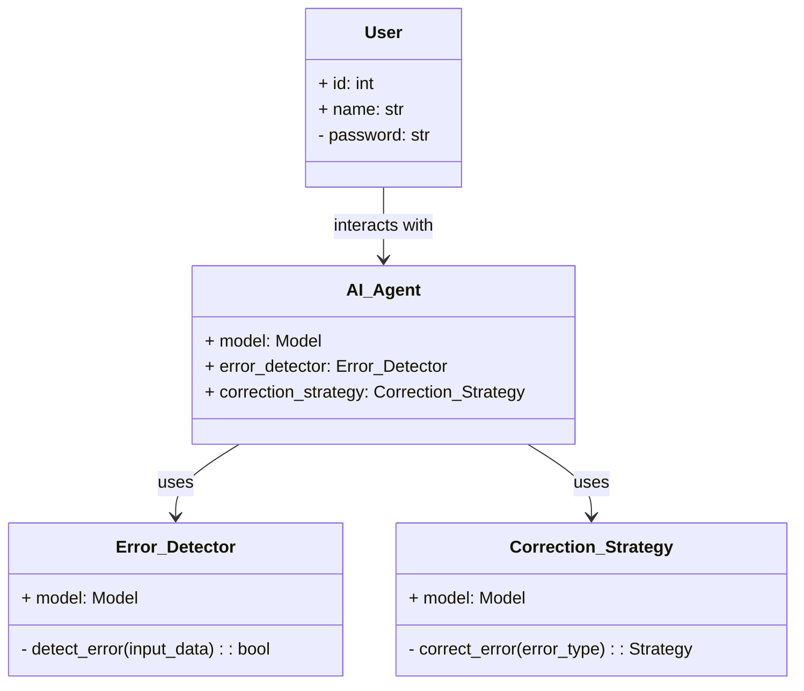
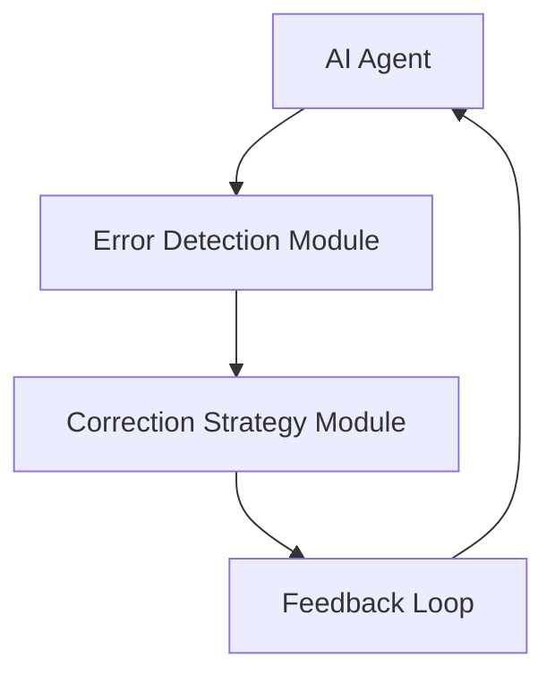
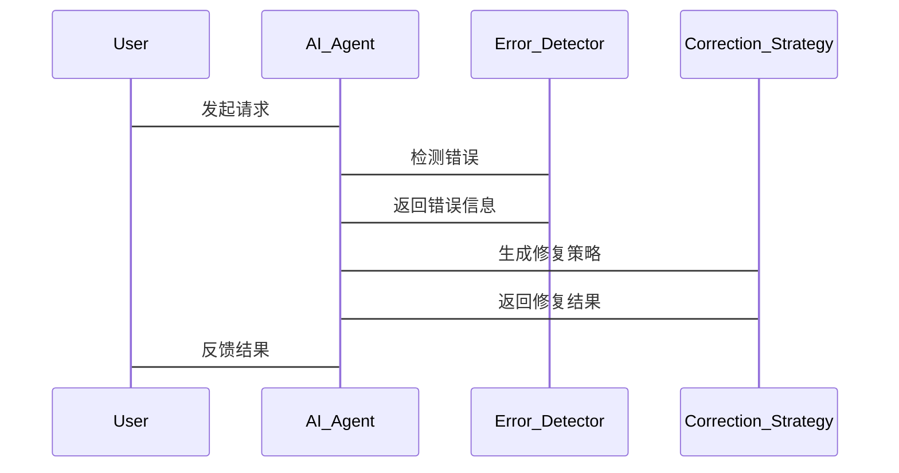

                 


# 构建具有自我修正能力的AI Agent

> 关键词：AI Agent，自我修正，机器学习，强化学习，错误检测，自动修正

> 摘要：本文详细探讨了构建具有自我修正能力的AI Agent的理论基础、算法原理和系统设计。通过分析自我修正机制的核心概念，结合实际案例，展示了如何通过强化学习和错误检测技术实现AI Agent的自我诊断与修复能力。文章内容涵盖了从理论到实践的全过程，为开发者和研究人员提供了系统化的指导。

---

# 第1章: 自我修正AI Agent的背景与概念

## 1.1 AI Agent的基本概念

### 1.1.1 AI Agent的定义
AI Agent（人工智能代理）是指能够感知环境、自主决策并执行任务的智能系统。它可以是一个软件程序、机器人或其他智能设备，通过传感器和执行器与环境交互。

### 1.1.2 自我修正能力的内涵
自我修正能力是指AI Agent在运行过程中能够识别自身错误或缺陷，并采取相应措施进行修复的能力。这种能力使得AI Agent能够在动态和不确定的环境中保持高效和可靠。

### 1.1.3 自我修正AI Agent的必要性
随着AI Agent的应用场景越来越广泛，特别是在自动驾驶、智能客服、工业自动化等领域，系统的可靠性和稳定性变得至关重要。自我修正能力能够显著提升AI Agent的鲁棒性和用户体验。

---

## 1.2 自我修正AI Agent的背景与现状

### 1.2.1 当前AI Agent的应用场景
AI Agent已在多个领域得到广泛应用，如智能助手（Siri、Alexa）、推荐系统、自动驾驶等。然而，这些系统在复杂环境中的表现仍存在局限性，尤其是在处理异常情况时。

### 1.2.2 自我修正能力的市场需求
随着AI技术的普及，市场对更智能、更可靠的AI Agent的需求日益增长。自我修正能力是提升AI Agent市场竞争力的关键因素。

### 1.2.3 当前技术的局限性与挑战
现有的AI Agent主要依赖于预定义的规则和训练数据，缺乏动态调整和自我修复的能力。在复杂场景中，系统可能会因为环境变化或数据偏差而失效。

---

## 1.3 自我修正AI Agent的核心目标

### 1.3.1 提高AI Agent的可靠性
通过自我修正机制，AI Agent能够在出现问题时快速识别并修复，从而提高系统的可靠性。

### 1.3.2 实现自我诊断与修复
自我修正能力使得AI Agent能够主动检测错误，并采取相应的修复策略，减少对外部干预的依赖。

### 1.3.3 优化AI Agent的持续性能
通过持续的学习和优化，AI Agent能够不断提升自身的性能，适应不断变化的环境。

---

# 第2章: 自我修正AI Agent的核心概念与联系

## 2.1 自我修正机制的原理

### 2.1.1 错误检测与识别
错误检测是自我修正的第一步，通常通过监督学习或无监督学习方法实现。例如，使用神经网络检测模型预测输出与期望输出之间的差异。

### 2.1.2 错误分析与归因
错误分析是指对检测到的错误进行深入分析，找出错误的根本原因。这通常涉及因果推理和逻辑分析技术。

### 2.1.3 自动修正策略
基于错误分析结果，AI Agent会生成修复策略，可能包括调整参数、重新执行任务或调用外部资源。

---

## 2.2 自我修正AI Agent的系统架构

### 2.2.1 模块化设计
系统分为错误检测模块、修正策略模块和反馈模块，各模块之间通过明确的接口进行交互。

### 2.2.2 数据流与信息交互
数据从传感器或输入端进入系统，经过处理后生成输出。错误检测模块实时监控数据流，发现异常后触发修正机制。

### 2.2.3 系统的可扩展性
系统设计应具备良好的可扩展性，以便在未来新增功能或优化现有模块时能够轻松扩展。

---

## 2.3 核心概念的ER实体关系图

```mermaid
er
    actor: 用户
    agent: AI Agent
    error_detection: 错误检测模块
    correction_strategy: 修正策略模块
    feedback_loop: 反馈循环
    relation: 用户 -> error_detection
    relation: error_detection -> correction_strategy
    relation: correction_strategy -> feedback_loop
    relation: feedback_loop -> 用户
```

---

# 第3章: 自我修正AI Agent的算法原理

## 3.1 错误检测与识别算法

### 3.1.1 基于监督学习的错误检测
使用分类器（如随机森林、神经网络）对输入数据进行分类，识别异常情况。

### 3.1.2 基于强化学习的错误检测
通过强化学习算法（如Q-learning）训练模型，使其能够在动态环境中识别错误。

### 3.1.3 错误检测的数学模型
$$ P(error) = \prod_{i=1}^{n} (1 - P(error\_i)) $$
其中，$P(error\_i)$表示第i个操作的错误概率。

---

## 3.2 错误分析与修正策略

### 3.2.1 基于因果推理的错误分析
通过因果推理模型（如贝叶斯网络）分析错误的根本原因。

### 3.2.2 自动修正策略的实现
使用强化学习算法训练修正策略模型，使其能够在错误发生时选择最优的修复动作。

### 3.2.3 修正策略的数学模型
$$ Q(s, a) = r + \gamma \max_{a'} Q(s', a') $$
其中，$s$是当前状态，$a$是动作，$r$是奖励，$\gamma$是折扣因子。

---

## 3.3 系统实现与优化

### 3.3.1 系统实现的Python代码示例
```python
def detect_error(input_data):
    # 假设input_data是输入数据
    model = load_model('error_detection_model')
    prediction = model.predict(input_data)
    return prediction

def correct_error(error_type):
    # 假设error_type是错误类型
    correction_strategies = {
        'type1': 'adjust_parameter',
        'type2': 'reinvoke_task',
        'type3': 'call_external_resource'
    }
    return correction_strategies.get(error_type, 'default_strategy')

# 示例使用
input_data = ...  # 输入数据
error_detected = detect_error(input_data)
if error_detected:
    error_type = get_error_type(error_detected)
    correction = correct_error(error_type)
    apply_correction(correction)
```

### 3.3.2 系统优化与性能提升
通过持续学习和优化算法（如在线学习、迁移学习）提升系统的错误检测和修正能力。

---

# 第4章: 系统分析与架构设计方案

## 4.1 问题场景介绍

### 4.1.1 问题场景描述
以智能客服系统为例，描述系统在处理客户请求时可能出现的错误及其影响。

### 4.1.2 问题分析
分析错误检测和修正过程中可能遇到的挑战，如数据不足、模型过时等。

---

## 4.2 系统功能设计

### 4.2.1 领域模型设计


### 4.2.2 系统架构设计


### 4.2.3 接口设计与交互流程


---

# 第5章: 项目实战

## 5.1 环境搭建与安装

### 5.1.1 安装Python和相关库
```bash
pip install numpy scikit-learn tensorflow
```

### 5.1.2 安装其他依赖
根据具体需求安装其他依赖库，如Keras、Pandas等。

---

## 5.2 系统核心实现

### 5.2.1 错误检测模块实现
```python
import numpy as np
from sklearn.ensemble import RandomForestClassifier

class Error_Detector:
    def __init__(self):
        self.model = RandomForestClassifier()

    def train(self, X_train, y_train):
        self.model.fit(X_train, y_train)

    def detect(self, X_test):
        return self.model.predict(X_test)
```

### 5.2.2 修正策略模块实现
```python
from tensorflow.keras import layers, Model

def build_model(input_shape):
    inputs = layers.Input(shape=input_shape)
    x = layers.Dense(64, activation='relu')(inputs)
    x = layers.Dense(1, activation='sigmoid')(x)
    model = Model(inputs=inputs, outputs=x)
    model.compile(optimizer='adam', loss='binary_crossentropy')
    return model

model = build_model((input_dim,))
model.fit(X_train, y_train, epochs=10, batch_size=32)
```

---

## 5.3 实际案例分析

### 5.3.1 案例描述
以一个数学问题求解为例，描述AI Agent如何检测错误并自动修正。

### 5.3.2 系统实现与分析
展示AI Agent在实际案例中的表现，并分析结果。

### 5.3.3 项目小结
总结项目实现过程中的经验与教训。

---

# 第6章: 最佳实践与总结

## 6.1 最佳实践

### 6.1.1 数据质量的重要性
确保训练数据的多样性和代表性，避免过拟合。

### 6.1.2 反馈机制的设计
设计有效的反馈机制，帮助系统持续学习和优化。

### 6.1.3 算法的可解释性
确保算法的可解释性，方便调试和优化。

---

## 6.2 小结与展望

### 6.2.1 全文总结
总结全文内容，强调自我修正AI Agent的重要性和实现方法。

### 6.2.2 未来展望
展望未来的发展方向，如更复杂的错误检测算法和更智能的修正策略。

---

# 作者：AI天才研究院/AI Genius Institute & 禅与计算机程序设计艺术 /Zen And The Art of Computer Programming

---

本文通过详细分析自我修正AI Agent的背景、核心概念、算法原理和系统设计，为开发者和研究人员提供了一个系统化的指导框架。希望本文能够帮助读者更好地理解并实现具有自我修正能力的AI Agent。

