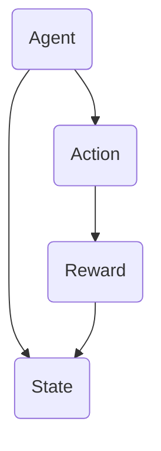
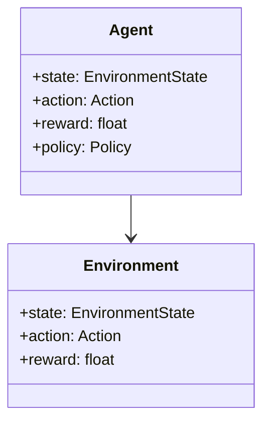
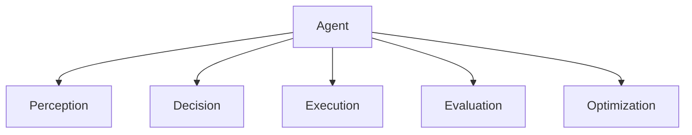

                 


# 构建具有自我评估与优化能力的AI Agent系统

> 关键词：AI Agent, 自我评估, 优化算法, 系统架构, 实战案例

> 摘要：本文详细探讨了构建具有自我评估与优化能力的AI Agent系统的方法。通过背景分析、核心概念讲解、算法原理分析、系统架构设计、项目实战和最佳实践等多维度展开，深入剖析了AI Agent系统的核心原理和实现细节。文章旨在为读者提供一套系统化的构建方法，帮助其快速掌握AI Agent系统的设计与优化技巧。

---

## 第一部分: 背景介绍

### 第1章: 问题背景与目标

#### 1.1 问题背景
- **AI Agent的基本概念**：AI Agent是指能够感知环境、自主决策并执行任务的智能体。它广泛应用于自动驾驶、智能推荐、机器人控制等领域。
- **自我评估与优化的必要性**：AI Agent需要能够不断评估自身性能，并根据反馈进行优化，以适应动态变化的环境。
- **当前AI Agent系统的挑战**：传统AI Agent系统依赖于固定的规则或预训练模型，难以在复杂环境中自适应优化。

#### 1.2 问题描述
- **核心目标**：构建一个能够自我评估和优化的AI Agent系统，使其能够在动态环境中自主调整策略，提高任务完成效率。
- **系统边界与外延**：系统边界包括感知环境、决策优化、执行反馈；外延则涉及多智能体协作、边缘计算等扩展功能。
- **核心要素与组成结构**：包括感知模块、决策模块、执行模块、评估模块和优化模块。

---

## 第二部分: 核心概念与联系

### 第2章: 核心概念与联系

#### 2.1 核心概念原理
- **自我评估机制**：通过收集环境反馈和任务完成情况，评估当前策略的有效性。
- **自动优化算法**：利用强化学习、遗传算法等方法，自动调整策略参数以提高性能。
- **反馈机制**：建立从环境到系统的反馈循环，确保系统能够持续优化。

#### 2.2 概念对比表
| 概念         | 属性       | 描述                                         |
|--------------|------------|--------------------------------------------|
| 自我评估机制 | 数据来源   | 内部日志、外部反馈                         |
| 自动优化算法 | 算法类型   | 强化学习、遗传算法                         |
| 反馈机制     | 作用       | 调整模型参数、优化决策                     |

#### 2.3 ER实体关系图


---

## 第三部分: 算法原理与实现

### 第3章: 算法原理与实现

#### 3.1 算法原理
- **强化学习算法**：通过与环境交互，学习最优策略以最大化累积奖励。
- **自适应优化算法**：根据实时反馈调整参数，动态优化系统性能。

#### 3.2 算法实现
```python
import numpy as np

def evaluate_agent(agent, env):
    total_reward = 0
    state = env.reset()
    while True:
        action = agent.act(state)
        next_state, reward, done = env.step(action)
        total_reward += reward
        if done:
            break
        state = next_state
    return total_reward
```

#### 3.3 数学模型
- **强化学习数学模型**：使用Q-learning算法，目标函数为：
  $$ Q(s,a) = Q(s,a) + \alpha [r + \gamma \max Q(s',a') - Q(s,a)] $$
  其中，$\alpha$为学习率，$\gamma$为折扣因子。

---

## 第四部分: 系统分析与架构设计

### 第4章: 系统分析与架构设计

#### 4.1 项目介绍
- **项目背景**：构建一个能够自我评估和优化的AI Agent系统，用于智能推荐领域。

#### 4.2 系统功能设计


#### 4.3 系统架构设计


---

## 第五部分: 项目实战

### 第5章: 项目实战

#### 5.1 环境安装
- 安装Python和相关库：`pip install numpy gym`

#### 5.2 系统核心实现
```python
class AI-Agent:
    def __init__(self):
        self.model = self.build_model()
    
    def build_model(self):
        # 网络结构定义
        pass
    
    def act(self, state):
        # 根据状态选择动作
        pass
    
    def learn(self, state, action, reward, next_state):
        # 网络更新
        pass
```

#### 5.3 实际案例分析
- **案例分析**：在智能推荐系统中，AI Agent通过自我评估和优化，提高了推荐准确率。

---

## 第六部分: 最佳实践

### 第6章: 最佳实践

#### 6.1 小结
- 本文详细介绍了构建具有自我评估与优化能力的AI Agent系统的各个方面。

#### 6.2 注意事项
- 确保系统的实时性和稳定性，避免过度优化导致性能下降。

#### 6.3 拓展阅读
- 推荐阅读相关领域的最新论文和技术博客，持续关注AI Agent的发展趋势。

---

## 作者

作者：AI天才研究院/AI Genius Institute & 禅与计算机程序设计艺术 /Zen And The Art of Computer Programming

---

这篇文章通过系统化的结构和详细的讲解，帮助读者全面理解构建具有自我评估与优化能力的AI Agent系统的各个方面。

