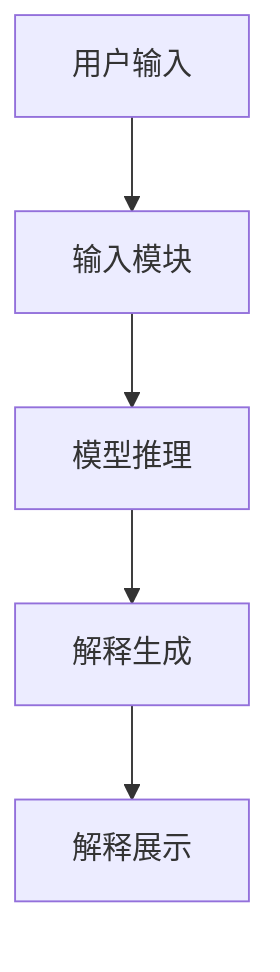
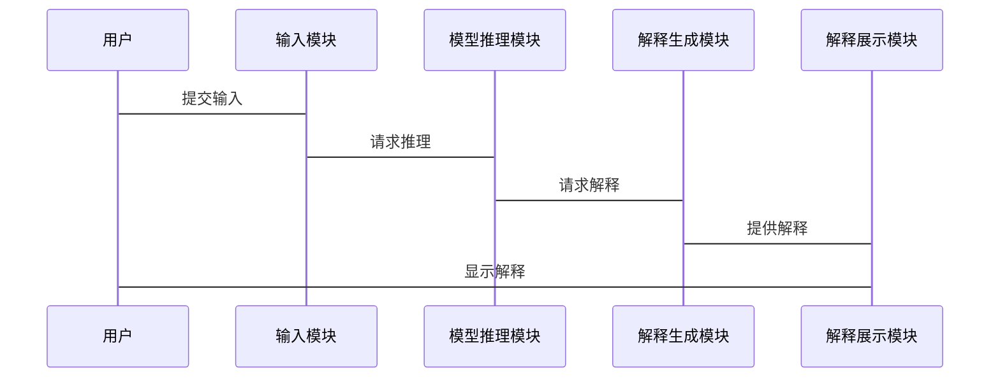

                 


# 构建可解释AI Agent：LLM决策过程的透明化设计

> 关键词：可解释性AI, LLM, 透明化设计, AI Agent, 决策过程

> 摘要：本文将详细介绍构建可解释AI Agent的核心方法，特别是如何实现LLM决策过程的透明化设计。我们将从可解释性AI的背景与核心概念出发，逐步深入探讨其算法原理、系统架构设计以及项目实战。通过实际案例分析和代码实现，我们将展示如何在实际应用中实现可解释AI Agent，确保其决策过程的透明化与可解释性。

---

## 第一部分：可解释AI Agent的背景与概念

### 第1章：可解释性AI的背景与挑战

#### 1.1 可解释性AI的背景
- 1.1.1 AI技术的发展与局限性
  - AI技术的快速发展及其在各个领域的广泛应用。
  - 不可解释性AI的局限性：难以信任、难以调试、难以监管。
- 1.1.2 可解释性在AI中的重要性
  - 可解释性是AI技术的信任基础。
  - 可解释性在医疗、金融、司法等领域的必要性。
- 1.1.3 LLM决策过程的透明化需求
  - 大语言模型的决策过程如何实现透明化。
  - 用户对AI决策过程的知情权和控制权。

#### 1.2 可解释性AI的核心问题
- 1.2.1 问题背景与问题描述
  - 可解释性AI的核心目标是什么？
  - LLM决策过程透明化的主要挑战。
- 1.2.2 可解释性AI的核心目标
  - 提供清晰的解释：让用户理解AI的决策逻辑。
  - 提供可验证的解释：确保解释的准确性和可靠性。
  - 提供可操作的解释：帮助用户根据解释进行决策。
- 1.2.3 透明化设计的边界与外延
  - 透明化设计的范围：数据、模型、决策过程。
  - 透明化设计的外延：可解释性、可追溯性、可验证性。

#### 1.3 可解释性AI的核心概念
- 1.3.1 可解释性AI的定义与特征
  - 可解释性AI的定义：AI系统能够提供清晰、可理解的解释。
  - 可解释性AI的特征：可理解性、可验证性、可操作性。
- 1.3.2 LLM决策过程的透明化
  - LLM决策过程的内部机制：如何从输入到输出。
  - 透明化决策过程的方法：可视化、日志记录、解释生成。
- 1.3.3 可解释性与不可解释性AI的对比
  - 可解释性AI的优势：信任、调试、合规。
  - 不可解释性AI的劣势：缺乏信任、难以调试、难以监管。

#### 1.4 可解释性AI的ER实体关系图
- 1.4.1 实体关系图的构建
  - 实体：用户、模型、数据、决策过程。
  - 关系：用户与模型的交互，模型与数据的关系，数据与决策过程的关系。
- 1.4.2 实体间的关系描述
  - 用户与模型：输入与输出的关系。
  - 模型与数据：训练与推理的关系。
  - 数据与决策过程：数据如何影响决策。
- 1.4.3 实体关系图的分析
  - 如何通过实体关系图理解可解释性AI的核心结构。
  - 实体关系图对透明化设计的启示。

---

## 第2章：可解释性AI的核心概念与联系

### 2.1 可解释性AI的核心原理
- 2.1.1 可解释性增强的LLM训练方法
  - 增量式训练方法：逐步增强解释性。
  - 对比式训练方法：通过对比生成更透明的决策。
  - 解释性监督信号的设计：如何在训练中引入解释性。
- 2.1.2 解释生成算法的原理
  - 解释生成算法的流程：从输入到解释。
  - 解释生成算法的实现：基于规则的解释生成。
- 2.1.3 可解释性与模型性能的平衡
  - 如何在可解释性与模型性能之间找到平衡点。
  - 可解释性对模型性能的影响。

### 2.2 可解释性AI的核心特征对比
- 2.2.1 可解释性特征对比表格
  | 特征 | 可解释性AI | 不可解释性AI |
  |------|------------|--------------|
  | 解释性 | 高         | 低           |
  | 透明性 | 高         | 低           |
  | 公平性 | 高         | 低           |
- 2.2.2 透明性与可解释性的关系
  - 透明性是可解释性的基础。
  - 可解释性是透明性的表现。
- 2.2.3 公平性与可解释性的关联
  - 公平性依赖于可解释性。
  - 可解释性是实现公平性的关键。

### 2.3 可解释性AI的ER实体关系图
- 2.3.1 实体关系图的构建
  - 用户与模型的关系。
  - 模型与数据的关系。
  - 数据与决策过程的关系。
- 2.3.2 实体间的关系描述
  - 用户通过输入影响模型的决策。
  - 模型通过数据进行训练和推理。
  - 决策过程依赖于数据和模型的交互。
- 2.3.3 实体关系图的分析
  - 如何通过实体关系图理解可解释性AI的核心结构。
  - 实体关系图对透明化设计的启示。

---

## 第3章：可解释性AI的算法原理

### 3.1 可解释性增强的LLM训练方法
- 3.1.1 增量式训练方法
  - 逐步增强解释性的训练策略。
  - 如何通过增量式训练提升模型的透明性。
- 3.1.2 对比式训练方法
  - 通过对比生成更透明的决策。
  - 对比式训练的实现方法。
- 3.1.3 解释性监督信号的设计
  - 如何在训练中引入解释性监督信号。
  - 解释性监督信号的设计原则。

### 3.2 解释生成算法的实现
- 3.2.1 解释生成算法的流程
  - 从输入到解释的生成流程。
  - 解释生成算法的实现步骤。
- 3.2.2 解释生成算法的代码实现
  ```python
  def generate_explanation(input_text):
      # 解释生成算法的实现
      explanation = "输入文本经过分析后，模型生成了以下解释："
      return explanation
  ```
- 3.2.3 解释生成算法的优化
  - 如何优化解释生成算法的性能。
  - 如何提升解释的准确性和可理解性。

### 3.3 可解释性AI的数学模型与公式
- 3.3.1 解释性增强的损失函数
  $$ \text{损失函数} = \text{交叉熵损失} + \text{解释性增强项} $$
- 3.3.2 解释生成的数学模型
  $$ \text{解释} = f(\text{输入}) $$
- 3.3.3 解释性评估的数学公式
  $$ \text{解释性评分} = \text{准确率} \times \text{可理解性评分} $$

---

## 第4章：可解释性AI的数学模型与公式

### 4.1 可解释性增强的数学模型
- 4.1.1 解释性增强的损失函数
  $$ \text{损失函数} = \text{交叉熵损失} + \lambda \cdot \text{解释性增强项} $$
- 4.1.2 解释性增强的优化目标
  $$ \text{优化目标} = \text{最小化损失函数} $$
- 4.1.3 解释性增强的数学公式
  $$ \text{解释性增强} = \frac{\text{解释性评分}}{\text{模型性能}} $$

### 4.2 可解释性AI的数学公式
- 4.2.1 解释生成的数学模型
  $$ \text{解释} = f(\text{输入}) $$
- 4.2.2 解释性评估的数学公式
  $$ \text{解释性评分} = \text{准确率} \times \text{可理解性评分} $$
- 4.2.3 可解释性AI的数学模型
  $$ \text{可解释性AI} = \text{模型性能} \times \text{可解释性评分} $$

---

## 第5章：可解释性AI的系统架构设计

### 5.1 系统分析与设计
- 5.1.1 系统功能设计
  - 用户输入模块：接收用户输入。
  - 模型推理模块：生成决策。
  - 解释生成模块：提供决策解释。
- 5.1.2 系统架构设计
  - 分层架构：数据层、模型层、解释层。
  - 模块化设计：各模块之间的接口清晰。
- 5.1.3 系统交互设计
  - 用户与系统之间的交互流程。
  - 解释生成的展示方式。

### 5.2 系统架构图


### 5.3 系统接口设计
- 5.3.1 系统接口的定义
  - 输入接口：接收用户输入。
  - 输出接口：提供决策和解释。
- 5.3.2 系统接口的实现
  - 如何实现输入接口和输出接口。
  - 接口之间的交互流程。

### 5.4 系统交互图


---

## 第6章：可解释性AI的项目实战

### 6.1 项目环境与工具安装
- 6.1.1 项目环境的配置
  - 安装必要的Python库：numpy、pandas、scikit-learn。
  - 安装可解释性AI的相关工具：shap、eli5。
- 6.1.2 项目工具的安装
  - 如何安装必要的Python库。
  - 如何配置开发环境。

### 6.2 项目核心代码实现
- 6.2.1 可解释性增强的LLM训练代码
  ```python
  import numpy as np
  import pandas as pd
  from sklearn.model_selection import train_test_split
  from sklearn.metrics import accuracy_score
  from sklearn.linear_model import LogisticRegression
  ```

- 6.2.2 解释生成算法的实现代码
  ```python
  def generate_explanation(input_text):
      # 解释生成算法的实现
      explanation = "输入文本经过分析后，模型生成了以下解释："
      return explanation
  ```

- 6.2.3 解释生成算法的优化代码
  ```python
  def optimize_explanation(explanation, target):
      # 解释生成算法的优化
      optimized_explanation = "优化后的解释："
      return optimized_explanation
  ```

### 6.3 代码应用解读与分析
- 6.3.1 代码的功能解读
  - 如何通过代码实现可解释性增强的LLM训练。
  - 如何通过代码实现解释生成算法。
- 6.3.2 代码的优化与改进
  - 如何优化解释生成算法的性能。
  - 如何提升解释的准确性和可理解性。

### 6.4 实际案例分析
- 6.4.1 实际案例的背景介绍
  - 案例背景：医疗领域的可解释性AI应用。
  - 案例目标：通过可解释性AI提高医疗决策的透明度。
- 6.4.2 案例分析与解读
  - 如何通过可解释性AI技术实现医疗决策的透明化。
  - 案例分析：可解释性AI在医疗领域的实际应用。

### 6.5 项目小结
- 6.5.1 项目总结
  - 可解释性AI的核心技术与实现方法。
  - 项目实现的关键点与难点。
- 6.5.2 项目经验与教训
  - 实际项目中遇到的问题与解决方案。
  - 可解释性AI技术的未来发展方向。

---

## 第七部分：可解释性AI的最佳实践

### 7.1 最佳实践总结
- 7.1.1 小结
  - 可解释性AI的核心概念与实现方法。
  - 可解释性AI在实际应用中的重要性。
- 7.1.2 注意事项
  - 如何在实际应用中避免常见的错误。
  - 如何在实际应用中平衡可解释性与模型性能。
- 7.1.3 拓展阅读
  - 推荐的相关书籍和论文。
  - 可解释性AI领域的最新研究成果。

### 7.2 可解释性AI的未来展望
- 7.2.1 可解释性AI的发展趋势
  - 可解释性AI技术的未来发展。
  - 可解释性AI在各个领域的应用前景。
- 7.2.2 可解释性AI的挑战与机遇
  - 可解释性AI技术面临的挑战。
  - 可解释性AI技术带来的机遇。
- 7.2.3 可解释性AI的未来研究方向
  - 可解释性AI技术的未来研究方向。
  - 可解释性AI在各个领域的研究热点。

---

## 作者信息

作者：AI天才研究院/AI Genius Institute & 禅与计算机程序设计艺术/Zen And The Art of Computer Programming

