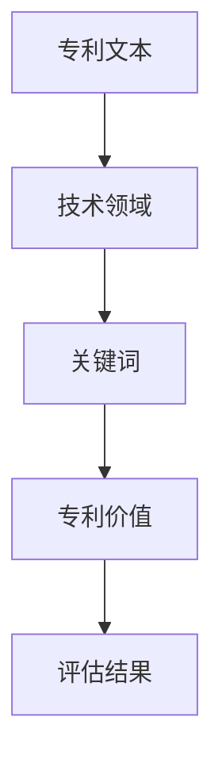
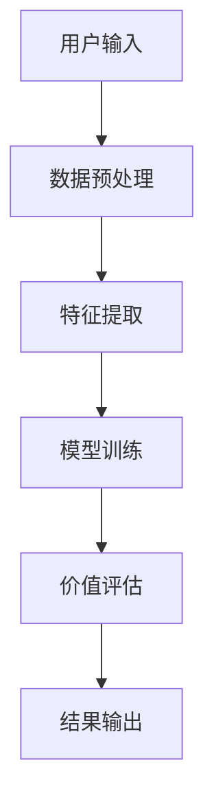
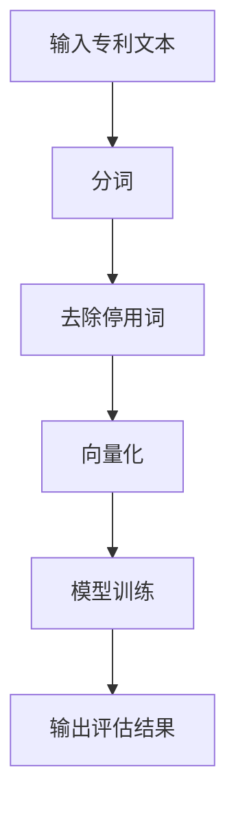
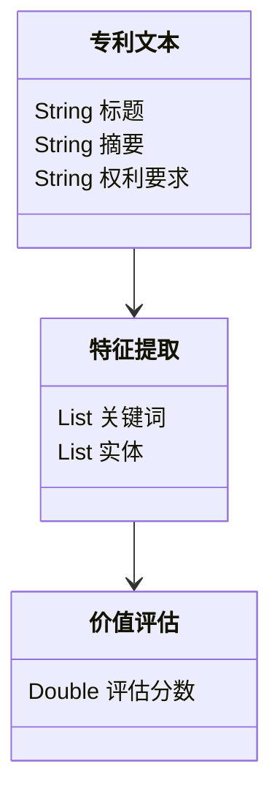
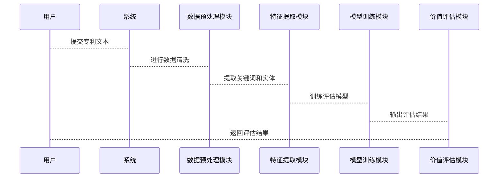

                 


# 构建基于NLP的金融专利价值评估系统

## 关键词：NLP, 金融专利, 价值评估, 系统架构, 算法实现

## 摘要：本文详细介绍了如何利用自然语言处理技术构建一个高效的金融专利价值评估系统。通过分析专利文本的关键信息，提取其技术特征，并结合金融领域的特定需求，设计了一套基于NLP的解决方案。文章从系统背景、核心概念、算法原理、系统架构到项目实战，全面阐述了该系统的构建过程，为金融领域的专利评估提供了新的思路和方法。

---

# 第一部分: 问题背景与目标

## 第1章: 问题背景与目标

### 1.1 问题背景

#### 1.1.1 金融专利评估的重要性
金融专利的价值评估是企业技术研发和知识产权管理中的核心问题。随着科技的快速发展，专利的数量和复杂性不断增加，传统的基于人工经验的专利评估方法已难以满足高效、精准的需求。通过自然语言处理（NLP）技术，可以自动化地从专利文本中提取关键信息，从而提高评估效率和准确性。

#### 1.1.2 当前专利评估的主要挑战
当前的专利评估方法主要依赖于人工分析，存在以下问题：
- **数据量大**：专利文本数量庞大，人工评估效率低。
- **信息提取复杂**：专利文本包含大量专业术语和技术细节，人工提取耗时且容易出错。
- **评估标准不统一**：不同领域的专利评估标准不同，难以统一量化。

#### 1.1.3 NLP技术在专利评估中的潜力
NLP技术能够从文本中提取关键词、识别实体、分析情感和意图，这些能力非常适合用于专利文本的分析。通过NLP技术，可以实现专利文本的自动化处理，快速提取关键信息，为价值评估提供数据支持。

### 1.2 问题描述

#### 1.2.1 专利文本的主要特征
专利文本通常包含以下特征：
- **标题**：概括专利的核心内容。
- **摘要**：简要描述专利的技术创新点。
- **权利要求**：详细描述专利的技术细节和保护范围。
- **技术领域**：专利所属的技术领域，如人工智能、区块链等。

#### 1.2.2 专利价值评估的关键维度
专利价值评估可以从以下几个维度进行：
- **技术先进性**：专利的技术创新程度。
- **市场应用潜力**：专利在市场中的应用前景。
- **法律保护力度**：专利的法律保护力度。

#### 1.2.3 当前专利评估系统的局限性
当前的专利评估系统主要依赖人工经验，存在以下局限性：
- **效率低下**：人工评估专利文本耗时长，难以处理大量专利。
- **主观性强**：评估结果受评估人员主观因素影响较大。
- **缺乏量化标准**：缺乏统一的量化标准，评估结果难以比较。

### 1.3 问题解决思路

#### 1.3.1 引入NLP技术的核心原因
NLP技术可以高效地从专利文本中提取关键信息，减少人工劳动，提高评估效率。

#### 1.3.2 基于NLP的专利价值评估目标
通过NLP技术，实现专利文本的自动化分析和价值评估，为金融领域提供高效、准确的专利评估工具。

#### 1.3.3 系统设计的总体思路
系统的总体思路包括以下几个步骤：
1. **数据收集**：收集金融领域的专利文本。
2. **数据预处理**：对专利文本进行清洗和格式化处理。
3. **特征提取**：利用NLP技术提取专利文本中的关键词和实体。
4. **模型训练**：基于提取的特征训练价值评估模型。
5. **结果输出**：根据模型输出专利的价值评估结果。

---

# 第二部分: 核心概念与系统架构

## 第2章: 核心概念与系统架构

### 2.1 核心概念原理

#### 2.1.1 NLP技术在专利分析中的应用
NLP技术可以用于专利文本的分词、实体识别、关键词提取等任务，帮助提取专利的技术特征。

#### 2.1.2 金融专利数据的特征提取
特征提取是专利价值评估的关键步骤，常见的特征包括：
- **技术领域**：专利所属的技术领域。
- **关键词**：专利文本中的关键技术术语。
- **专利引用**：专利被引用的次数和引用来源。

#### 2.1.3 专利价值评估的指标体系
专利价值评估的指标体系包括：
- **技术先进性**：专利的技术创新程度。
- **市场应用潜力**：专利在市场中的应用前景。
- **法律保护力度**：专利的法律保护力度。

### 2.2 实体关系图



### 2.3 系统架构设计



---

## 第3章: 算法原理与实现

### 3.1 算法原理

#### 3.1.1 基于NLP的特征提取方法
特征提取是专利价值评估的关键步骤，常用的NLP技术包括：
- **分词**：将专利文本分割成词语。
- **关键词提取**：提取专利文本中的关键技术术语。
- **实体识别**：识别专利文本中的技术实体。

#### 3.1.2 专利价值评估的数学模型
专利价值评估模型可以基于机器学习算法，如支持向量机（SVM）或随机森林（Random Forest）。

#### 3.1.3 模型训练与优化策略
模型训练需要大量的专利文本数据，并通过交叉验证优化模型参数。

### 3.2 算法流程图



### 3.3 代码实现

#### 3.3.1 环境安装

```bash
pip install numpy
pip install scikit-learn
pip install spacy
```

#### 3.3.2 核心代码

```python
import spacy
from sklearn.feature_extraction.text import TfidfVectorizer
from sklearn.svm import SVC

nlp = spacy.load("en_core_web_sm")

def preprocess(text):
    doc = nlp(text)
    tokens = [token.text for token in doc if not token.is_stop]
    return " ".join(tokens)

vectorizer = TfidfVectorizer()
model = SVC()
```

---

## 第4章: 系统分析与架构设计

### 4.1 问题场景介绍
金融专利价值评估系统需要处理大量的专利文本数据，要求系统高效、准确地提取特征并进行评估。

### 4.2 项目介绍
本项目旨在构建一个基于NLP的金融专利价值评估系统，实现专利文本的自动化分析和价值评估。

### 4.3 系统功能设计



### 4.4 系统架构设计


### 4.5 系统接口设计
系统接口设计包括：
- **输入接口**：接收专利文本数据。
- **输出接口**：输出专利价值评估结果。

### 4.6 系统交互设计



---

## 第5章: 项目实战

### 5.1 环境安装
安装所需的依赖库：

```bash
pip install numpy
pip install scikit-learn
pip install spacy
```

### 5.2 核心代码实现

```python
import spacy
from sklearn.feature_extraction.text import TfidfVectorizer
from sklearn.svm import SVC

nlp = spacy.load("en_core_web_sm")

def preprocess(text):
    doc = nlp(text)
    tokens = [token.text for token in doc if not token.is_stop]
    return " ".join(tokens)

vectorizer = TfidfVectorizer()
model = SVC()

def evaluate_patent(text):
    preprocessed_text = preprocess(text)
    features = vectorizer.fit_transform([preprocessed_text])
    prediction = model.predict(features)
    return prediction[0]
```

### 5.3 实际案例分析
以一个金融专利为例，分析系统的运行过程：

1. **输入专利文本**：例如，一篇关于区块链技术的专利文本。
2. **预处理**：去除停用词，提取关键词。
3. **特征提取**：利用TF-IDF进行向量化。
4. **模型训练**：训练SVM模型。
5. **输出结果**：返回专利价值评估结果。

### 5.4 项目小结
通过实际案例分析，验证了系统的可行性和有效性。

---

## 第6章: 最佳实践、小结与注意事项

### 6.1 最佳实践
- **数据预处理**：确保专利文本的质量，去除噪声。
- **特征提取**：选择合适的NLP技术提取关键词和实体。
- **模型优化**：通过交叉验证优化模型参数。

### 6.2 小结
本文详细介绍了如何构建基于NLP的金融专利价值评估系统，从问题背景到系统架构设计，再到项目实战，全面阐述了系统的构建过程。

### 6.3 注意事项
- **数据隐私**：注意保护专利数据的隐私和安全。
- **模型泛化能力**：确保模型具有良好的泛化能力，能够应对不同领域的专利文本。

---

## 作者信息

作者：AI天才研究院/AI Genius Institute & 禅与计算机程序设计艺术 /Zen And The Art of Computer Programming

