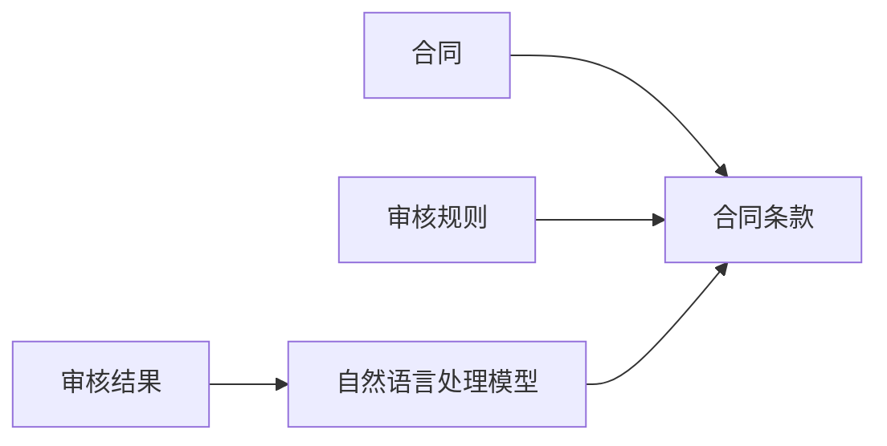
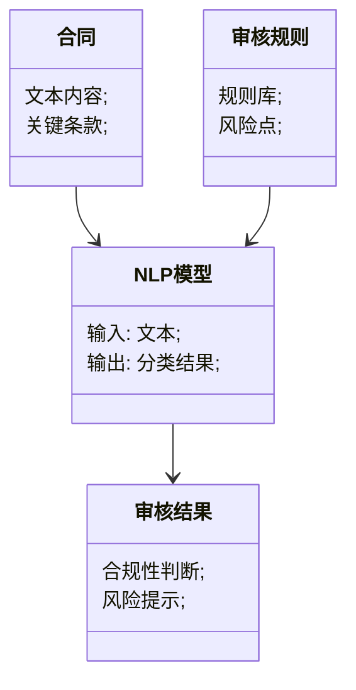
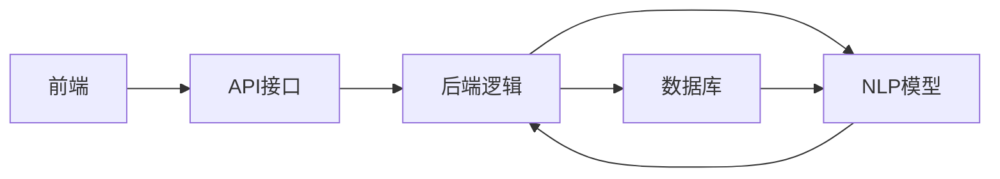
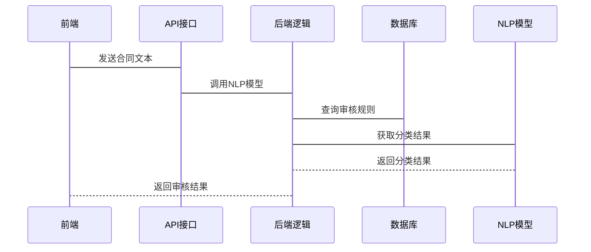

                 


# 构建基于NLP的金融合同自动化审核系统

> 关键词：NLP，金融合同审核，自动化系统，文本分类，机器学习

> 摘要：本文详细介绍了如何构建基于自然语言处理（NLP）的金融合同自动化审核系统。首先分析了金融合同审核的现状与挑战，探讨了NLP技术在其中的应用潜力。接着，详细阐述了系统的核心概念、算法原理和数学模型，包括文本预处理、特征提取、分类算法的选择与优化。然后，从系统架构设计、功能模块划分、接口设计等方面进行了全面分析。最后，通过项目实战部分，展示了系统实现的全过程，并总结了最佳实践和未来发展方向。

---

# 第一部分: 背景介绍与核心概念

## 第1章: 问题背景与描述

### 1.1 问题背景

#### 1.1.1 金融合同审核的现状与挑战
金融合同审核是金融业务中的核心环节，主要涉及贷款协议、保险合同、股权转让协议等。传统审核方式依赖人工检查，存在效率低、成本高、易出错等问题。随着金融业务的复杂化和合同量的激增，人工审核的效率瓶颈日益明显。

#### 1.1.2 传统合同审核的痛点分析
- **效率低下**：人工审核需要逐字逐句检查，耗时长，尤其在面对大量合同时。
- **人为错误**：审核人员可能因疏忽漏掉关键条款。
- **成本高昂**：需要大量专业人员，增加了企业的运营成本。
- **规则复杂**：金融合同涉及的法律条款繁多，审核规则复杂多样。

#### 1.1.3 NLP技术在金融领域的应用潜力
NLP技术可以通过自动化处理文本信息，快速识别合同中的关键条款、风险点和异常情况，从而提高审核效率和准确性。例如，NLP可以自动提取合同中的违约责任、担保条款等关键信息，帮助审核人员快速定位问题。

### 1.2 问题描述

#### 1.2.1 金融合同审核的核心目标
- 确保合同内容符合相关法律法规。
- 检查合同条款是否齐全、清晰。
- 识别潜在的法律风险和合规问题。

#### 1.2.2 合同审核的关键要素与规则
- 合同类型：如贷款合同、保险合同等。
- 关键条款：如违约责任、担保条款、履行期限等。
- 规则库：包含一系列审核标准和判断条件。

#### 1.2.3 自动化审核的必要性与可行性
- **必要性**：提高审核效率，降低人工成本。
- **可行性**：NLP技术已较为成熟，可以处理复杂的文本信息。

### 1.3 核心概念的属性对比

| 核心概念 | 属性 |
|----------|------|
| 合同类型 | 贷款合同、保险合同、股权转让协议 |
| 审核规则 | 违约责任、担保条款、履行期限 |
| NLP模型 | 朴素贝叶斯、SVM、BERT |

### 1.4 实体关系图（ER图）


---

## 第2章: 核心概念与联系

### 2.1 NLP与金融合同审核的核心概念

#### 2.1.1 自然语言处理（NLP）的基本原理
NLP通过计算机处理人类语言，实现文本的理解、生成和分析。关键技术包括分词、实体识别、情感分析等。

#### 2.1.2 金融合同审核的流程与关键点
1. **合同预处理**：清洗、分词、去停用词。
2. **信息提取**：提取关键条款、识别风险点。
3. **规则匹配**：根据规则库判断合同的合规性。

#### 2.1.3 NLP在合同审核中的应用场景
- **自动提取关键信息**：如合同金额、履行期限。
- **风险预警**：识别合同中的异常条款。
- **分类管理**：根据合同类型进行分类。

### 2.2 核心概念的属性对比
| 核心概念 | 属性对比 |
|----------|----------|
| 合同类型 | 贷款合同、保险合同 |
| 审核规则 | 违约责任、担保条款 |
| NLP模型 | 朴素贝叶斯、SVM、BERT |

### 2.3 实体关系图（ER图）


---

## 第3章: NLP模型的算法原理

### 3.1 模型选择与优化

#### 3.1.1 常见NLP模型的优缺点对比
| 模型 | 优点 | 缺点 |
|------|------|------|
| 朴素贝叶斯 | 简单高效 | 易受噪声影响 |
| SVM | 高准确性 | 计算复杂 |
| BERT | 上下文理解能力强 | 训练成本高 |

#### 3.1.2 模型优化的策略与方法
- **特征工程**：提取有用的文本特征。
- **超参数调优**：如学习率、批次大小等。
- **集成学习**：结合多种模型提升性能。

#### 3.1.3 超参数调优的实践技巧
- 使用网格搜索或随机搜索进行参数优化。
- 采用交叉验证评估模型性能。

### 3.2 文本预处理与特征提取

#### 3.2.1 文本清洗与分词
- 清洗：去除特殊符号、停用词。
- 分词：使用分词工具（如jieba）将文本分割成词语。

#### 3.2.2 词向量表示
- **Word2Vec**：通过上下文预测单词，生成词向量。
- **BERT**：基于Transformer的预训练模型，捕捉上下文信息。

#### 3.2.3 特征选择与降维
- **特征选择**：使用卡方检验选择重要特征。
- **降维**：使用PCA减少特征维度。

### 3.3 分类算法与流程

#### 3.3.1 分类算法
- **朴素贝叶斯**：基于概率的分类方法。
- **SVM**：支持向量机，适用于小规模数据。
- **神经网络**：如RNN、BERT，适用于大规模复杂任务。

#### 3.3.2 分类流程


### 3.4 数学模型与公式

#### 3.4.1 朴素贝叶斯分类器
$$ P(y|x) = \frac{P(x|y)P(y)}{P(x)} $$
其中，$P(y|x)$ 是后验概率，表示在给定文本$x$的情况下，类别$y$的概率。

#### 3.4.2 支持向量机（SVM）
$$ \text{最大化} \quad \frac{1}{\|w\|^2} $$
$$ \text{约束} \quad y_i(w \cdot x_i + b) \geq 1 $$

#### 3.4.3 神经网络模型（如RNN、BERT）
$$ \text{损失函数} = \sum_{i=1}^{n} \text{交叉熵损失} $$

#### 3.4.4 示例与解释
- **朴素贝叶斯分类器**：假设合同文本属于两类，违约和非违约。通过计算条件概率，分类器可以判断文本属于哪一类。
- **SVM**：在二维空间中，SVM通过找到一个最优超平面，将不同类别的文本分开。
- **BERT模型**：通过预训练，BERT能够捕捉文本的上下文信息，生成更准确的词向量。

---

## 第4章: 系统分析与架构设计

### 4.1 系统功能设计

#### 4.1.1 功能模块划分
- **合同预处理**：清洗、分词、去停用词。
- **模型调用**：调用NLP模型进行文本分析。
- **结果分析**：根据模型输出生成审核结果。
- **报告生成**：生成详细的审核报告。

#### 4.1.2 领域模型


#### 4.1.3 系统架构设计


#### 4.1.4 系统交互流程


### 4.2 系统架构图


### 4.3 接口设计
- **输入接口**：接收合同文本。
- **输出接口**：返回审核结果和报告。

---

## 第5章: 项目实战

### 5.1 环境安装

```bash
pip install numpy
pip install scikit-learn
pip install jieba
pip install transformers
```

### 5.2 核心代码实现

#### 5.2.1 数据预处理代码

```python
import jieba

def preprocess(text):
    # 分词
    words = jieba.lcut(text)
    # 去停用词
    stop_words = set(['的', '了', '在', '和'])
    filtered_words = [word for word in words if word not in stop_words]
    return ' '.join(filtered_words)
```

#### 5.2.2 模型训练代码

```python
from sklearn.feature_extraction.text import TfidfVectorizer
from sklearn.naive_bayes import MultinomialNB
from sklearn.pipeline import Pipeline

# 数据集
texts = [...]  # 文本列表
labels = [...]  # 标签列表

# 模型训练
model = Pipeline([
    ('tfidf', TfidfVectorizer()),
    ('nb', MultinomialNB())
])
model.fit(texts, labels)

# 预测
test_text = ["这是一个测试文本"]
print(model.predict([test_text]))
```

#### 5.2.3 结果处理代码

```python
from transformers import pipeline

# 初始化模型
nlp = pipeline("text-classification", model="bert-base-cased")

# 文本分类
result = nlp("需要分类的文本")
print(result)
```

### 5.3 代码解读与分析

#### 5.3.1 数据预处理代码解读
- 使用`jieba`进行分词。
- 去除停用词，减少噪声。
- 生成干净的文本用于后续处理。

#### 5.3.2 模型训练代码解读
- 使用`TfidfVectorizer`提取文本特征。
- 使用`MultinomialNB`进行文本分类。
- 通过管道（Pipeline）简化代码流程。

#### 5.3.3 结果处理代码解读
- 使用`transformers`库中的BERT模型进行文本分类。
- 返回分类结果和置信度。

### 5.4 实际案例分析

#### 5.4.1 案例背景
- **合同类型**：贷款合同。
- **关键条款**：违约责任、担保条款。

#### 5.4.2 数据处理
```python
text = "贷款人同意在借款人违约的情况下，有权要求担保人承担连带责任。"
preprocessed_text = preprocess(text)
print(preprocessed_text)
```

#### 5.4.3 模型预测
```python
result = nlp(preprocessed_text)
print(result)
```

#### 5.4.4 结果分析
- 模型预测结果：合同合规。
- 风险提示：无异常条款。

### 5.5 项目小结

---

## 第6章: 总结与展望

### 6.1 最佳实践 tips
- 数据质量是关键，确保数据清洗和标注的准确性。
- 模型选择需结合实际任务需求，避免过度复杂化。
- 持续优化模型，及时更新规则库。

### 6.2 小结
本文详细介绍了如何构建基于NLP的金融合同自动化审核系统，从背景分析到系统实现，涵盖了核心概念、算法原理、系统架构和项目实战。

### 6.3 注意事项
- 数据隐私问题需严格遵守相关法律法规。
- 模型部署需考虑计算资源和运行环境。

### 6.4 拓展阅读
- 《Python机器学习实战》。
- 《自然语言处理入门与实践》。

---

作者：AI天才研究院/AI Genius Institute & 禅与计算机程序设计艺术 /Zen And The Art of Computer Programming

