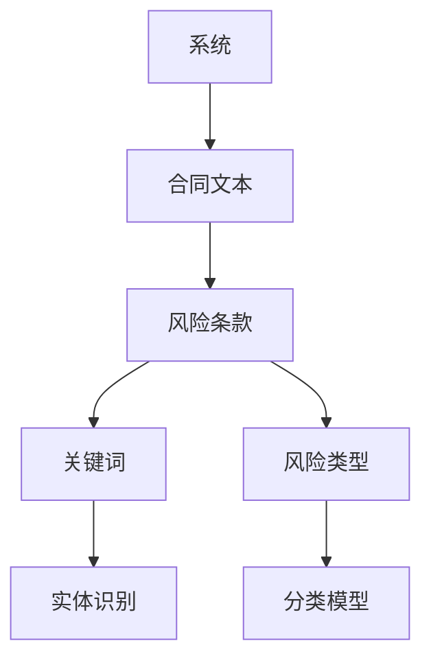
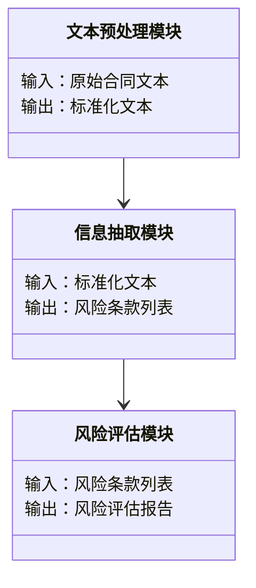
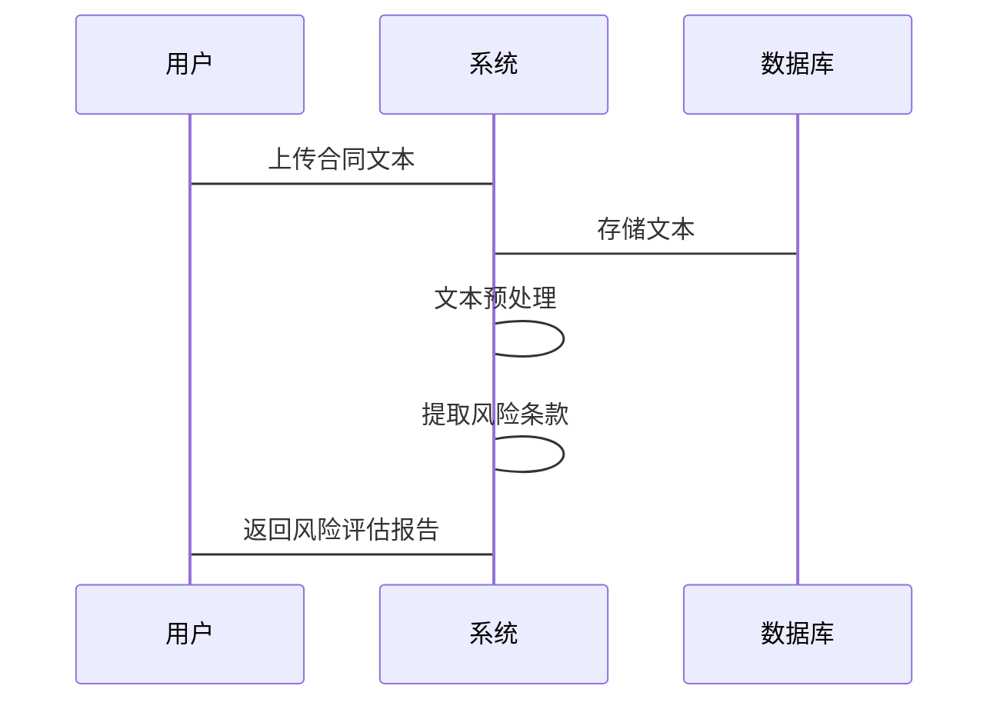

                 


# 《构建基于NLP的金融合同风险条款提取系统》

## 关键词：金融合同，NLP，风险条款，信息抽取，文本挖掘

## 摘要：本文章详细讲解了如何构建一个基于自然语言处理技术的金融合同风险条款提取系统。文章从背景分析、核心概念、系统架构设计、算法原理、项目实战、最佳实践等多个方面展开，通过详细的步骤和实例分析，为读者提供一个完整的系统构建方案。

---

# 第一部分: 金融合同风险条款提取系统概述

# 第1章: 问题背景与需求分析

## 1.1 问题背景介绍

### 1.1.1 金融合同的重要性
- 金融合同是金融交易的重要法律文件，涉及金额大、法律关系复杂，风险条款是合同中的关键部分。
- 风险条款通常包括免责条款、限制责任条款、担保条款等，直接影响交易双方的权益。

### 1.1.2 风险条款的定义与作用
- 风险条款是指合同中约定的可能影响合同履行的风险因素及其应对措施的条款。
- 风险条款的作用是明确双方在风险发生时的权利和义务，降低法律纠纷的风险。

### 1.1.3 现有合同处理方式的局限性
- 传统合同处理方式依赖人工阅读和分析，效率低且容易遗漏关键条款。
- 人工处理存在主观性和不一致性的风险，难以保证准确性和全面性。

## 1.2 问题描述与目标

### 1.2.1 金融合同风险条款提取的核心问题
- 如何高效、准确地从大量金融合同文本中提取关键风险条款。
- 如何处理文本中的复杂句式、专业术语和模糊表达。

### 1.2.2 系统建设的目标与意义
- 目标：构建一个基于NLP的金融合同风险条款提取系统，能够自动识别和提取合同中的风险条款。
- 意义：提高合同处理效率，降低法律风险，为金融业务提供智能化支持。

### 1.2.3 用户需求与痛点分析
- 用户需求：快速、准确地提取合同中的风险条款，减少人工审查的时间和成本。
- 痛点：现有方法依赖人工审查，效率低，容易出错。

## 1.3 问题解决思路

### 1.3.1 NLP技术在合同处理中的应用
- 使用分词、词性标注、句法分析等NLP技术处理合同文本。
- 通过信息抽取技术提取合同中的关键信息。

### 1.3.2 风险条款提取的关键步骤
- 文本预处理：去除停用词、分词、句法分析。
- 信息抽取：基于规则或深度学习模型提取风险条款。
- 风险评估：对提取的风险条款进行分类和优先级排序。

### 1.3.3 系统实现的可行性分析
- 技术可行性：NLP技术的快速发展为系统实现提供了技术基础。
- 数据可行性：金融合同数据的可获得性和可用性。

## 1.4 系统边界与外延

### 1.4.1 系统功能边界
- 输入：金融合同文本。
- 输出：提取的风险条款列表。

### 1.4.2 系统与外部系统的交互
- 数据输入接口：与合同管理系统集成。
- 结果输出接口：与风险评估系统对接。

### 1.4.3 系统的适用范围与限制
- 适用范围：适用于各类金融合同，如贷款合同、担保合同等。
- 限制：对于复杂、非标准的合同条款可能需要人工辅助校验。

## 1.5 核心概念与系统架构

### 1.5.1 系统核心要素组成
- 合同文本：输入数据。
- 风险条款：输出结果。
- NLP模型：信息抽取的核心工具。

### 1.5.2 系统架构的初步设想
- 分层架构：包括数据层、处理层、应用层。
- 模块化设计：文本预处理、信息抽取、风险评估。

### 1.5.3 系统功能模块的划分
- 文本预处理模块：负责清洗和标准化文本。
- 信息抽取模块：负责提取风险条款。
- 风险评估模块：负责对风险条款进行分类和排序。

---

# 第2章: 基于NLP的风险条款提取核心概念

## 2.1 NLP技术基础

### 2.1.1 自然语言处理的定义与核心任务
- 自然语言处理（NLP）：研究如何让计算机理解和处理人类语言的技术。
- 核心任务：分词、词性标注、句法分析、信息抽取。

### 2.1.2 常见NLP技术与工具
- 分词工具：jieba、Snowball。
- 信息抽取工具：spaCy、Stanford NLP。
- 深度学习模型：BERT、GPT。

### 2.1.3 NLP在金融领域的应用
- 股票分析、金融新闻处理、合同处理。

## 2.2 金融合同文本分析

### 2.2.1 合同文本的结构特征
- 标题、正文、条款编号。
- 法律术语、专业术语。

### 2.2.2 风险条款的关键特征
- 术语：免责、赔偿、担保。
- 句式：复杂句、被动句。

### 2.2.3 文本预处理与特征提取
- 分词：将文本分割成词语。
- 词性标注：确定词语的词性。
- 停用词处理：去除无意义的词汇。

## 2.3 风险条款提取的核心原理

### 2.3.1 文本分类与信息抽取
- 文本分类：将合同文本分为不同类别。
- 信息抽取：从文本中提取特定信息。

### 2.3.2 基于规则的提取方法
- 使用正则表达式匹配特定模式。
- 适用于规则明确的条款。

### 2.3.3 基于深度学习的提取方法
- 使用预训练模型如BERT进行微调。
- 适用于复杂句式和上下文理解。

## 2.4 系统核心概念的ER实体关系图



---

# 第3章: 系统架构与功能设计

## 3.1 系统架构设计

### 3.1.1 分层架构的设计思路
- 数据层：存储合同文本。
- 处理层：进行文本预处理和信息抽取。
- 应用层：提供用户界面和结果展示。

### 3.1.2 模块划分与功能分配
- 文本预处理模块：负责清洗和标准化。
- 信息抽取模块：负责提取风险条款。
- 风险评估模块：负责分类和排序。

### 3.1.3 系统架构的可扩展性
- 支持多种合同类型。
- 支持多种NLP模型。

## 3.2 系统功能设计

### 3.2.1 文本预处理模块
- 功能：清洗文本、分词、词性标注。
- 输入：原始合同文本。
- 输出：标准化文本。

### 3.2.2 信息抽取模块
- 功能：提取风险条款。
- 输入：标准化文本。
- 输出：风险条款列表。

### 3.2.3 风险评估与报告生成模块
- 功能：对风险条款进行分类和排序。
- 输入：风险条款列表。
- 输出：风险评估报告。

## 3.3 系统功能的领域模型



## 3.4 系统架构的交互设计

### 3.4.1 系统接口设计
- 输入接口：接收合同文本。
- 输出接口：返回风险评估报告。

### 3.4.2 系统交互流程
1. 用户上传合同文本。
2. 系统进行文本预处理。
3. 系统提取风险条款。
4. 系统生成风险评估报告。
5. 用户查看报告并进行后续操作。

### 3.4.3 系统安全与权限管理
- 用户权限控制：确保只有授权用户可以访问系统。
- 数据加密：保护合同文本的安全性。

## 3.5 系统架构的Mermaid序列图



---

# 第4章: 基于NLP的风险条款提取算法原理

## 4.1 算法原理概述

### 4.1.1 模型训练过程
- 数据准备：收集和标注金融合同数据。
- 模型训练：使用深度学习模型进行训练。
- 模型评估：验证模型的准确性和效果。

### 4.1.2 风险条款抽取过程
- 数据预处理：分词、词性标注、停用词处理。
- 特征提取：提取文本特征。
- 模型应用：使用训练好的模型进行风险条款抽取。

## 4.2 算法原理的数学模型和公式

### 4.2.1 基于条件概率的模型
- 条件概率公式：
  $$ P(B|A) = \frac{P(A \cap B)}{P(A)} $$
- 示例：计算某个术语属于风险条款的概率。

### 4.2.2 基于最大似然估计的模型
- 似然函数：
  $$ L(\theta) = P(X|\theta) $$
- 最大似然估计：
  $$ \theta = \arg\max_{\theta} \log L(\theta) $$

## 4.3 算法实现的详细步骤

### 4.3.1 数据预处理步骤
- 分词：使用jieba进行分词。
- 词性标注：使用HanLP进行词性标注。
- 停用词处理：去除无意义词汇。

### 4.3.2 特征提取步骤
- 词袋模型：提取文本的词袋特征。
- TF-IDF：计算词语的重要性。
- 词嵌入：使用Word2Vec生成词向量。

### 4.3.3 模型训练步骤
- 选择模型：选择合适的NLP模型。
- 模型微调：在特定数据上进行微调。
- 模型评估：验证模型的准确性和效果。

## 4.4 算法实现的Python代码示例

### 4.4.1 数据预处理代码

```python
import jieba
from hanlp import HanLP

text = "甲方应承担因自身原因导致的合同无法履行的风险。"
words = jieba.lcut(text)
hanlp = HanLP()
result = hanlp([words], tasks='pos')
```

### 4.4.2 特征提取代码

```python
from sklearn.feature_extraction.text import TfidfVectorizer

vectorizer = TfidfVectorizer()
tfidf_matrix = vectorizer.fit_transform([text])
```

### 4.4.3 模型训练代码

```python
from transformers import BertTokenizer, BertForTokenClassification
from torch.utils.data import Dataset, DataLoader

class CustomDataset(Dataset):
    def __init__(self, texts, labels):
        self.texts = texts
        self.labels = labels
    def __len__(self):
        return len(self.texts)
    def __getitem__(self, idx):
        text = self.texts[idx]
        label = self.labels[idx]
        return text, label

tokenizer = BertTokenizer.from_pretrained('bert-base-uncased')
model = BertForTokenClassification.from_pretrained('bert-base-uncased', num_labels=2)
dataset = CustomDataset([text], [0])
dataloader = DataLoader(dataset, batch_size=1, shuffle=True)
```

## 4.5 算法实现的数学模型和公式

### 4.5.1 基于条件概率的模型
- 条件概率公式：
  $$ P(B|A) = \frac{P(A \cap B)}{P(A)} $$
- 示例：计算“免责”这个词属于风险条款的概率。

### 4.5.2 基于最大似然估计的模型
- 似然函数：
  $$ L(\theta) = P(X|\theta) $$
- 最大似然估计：
  $$ \theta = \arg\max_{\theta} \log L(\theta) $$

---

# 第5章: 项目实战

## 5.1 项目环境配置

### 5.1.1 系统环境要求
- 操作系统：Windows、Linux、macOS。
- Python版本：3.6以上。
- 依赖库：jieba、HanLP、BertTokenizer、BertForTokenClassification。

### 5.1.2 安装依赖
```bash
pip install jieba
pip install hanlp
pip install transformers
```

## 5.2 核心代码实现

### 5.2.1 文本预处理代码

```python
import jieba
from hanlp import HanLP

def preprocess(text):
    words = jieba.lcut(text)
    hanlp = HanLP()
    result = hanlp([words], tasks='pos')
    return words, result

text = "甲方应承担因自身原因导致的合同无法履行的风险。"
words, result = preprocess(text)
print(words)
print(result)
```

### 5.2.2 风险条款提取代码

```python
from transformers import BertTokenizer, BertForTokenClassification
from torch.utils.data import Dataset, DataLoader

class CustomDataset(Dataset):
    def __init__(self, texts, labels):
        self.texts = texts
        self.labels = labels
    def __len__(self):
        return len(self.texts)
    def __getitem__(self, idx):
        text = self.texts[idx]
        label = self.labels[idx]
        return text, label

tokenizer = BertTokenizer.from_pretrained('bert-base-uncased')
model = BertForTokenClassification.from_pretrained('bert-base-uncased', num_labels=2)
dataset = CustomDataset([text], [0])
dataloader = DataLoader(dataset, batch_size=1, shuffle=True)
```

### 5.2.3 风险评估代码

```python
import numpy as np

def evaluate(model, dataloader):
    model.eval()
    total_loss = 0
    for batch in dataloader:
        inputs, labels = batch
        outputs = model(**inputs)
        loss = outputs.loss.item()
        total_loss += loss
    avg_loss = total_loss / len(dataloader)
    return avg_loss

loss = evaluate(model, dataloader)
print(f"Average loss: {loss}")
```

## 5.3 项目实战案例分析

### 5.3.1 案例背景
- 合同文本：贷款合同。
- 风险条款：提前还款、违约责任。

### 5.3.2 数据准备
```python
texts = [
    "甲方应承担因自身原因导致的合同无法履行的风险。",
    "如甲方未能按时还款，乙方有权追回逾期款项并收取违约金。",
    "双方同意在合同履行过程中，如发生争议，应通过友好协商解决。"
]
labels = [[0, 1, 0]]
```

### 5.3.3 模型训练与评估
```python
dataset = CustomDataset(texts, labels)
dataloader = DataLoader(dataset, batch_size=3, shuffle=True)

model.train()
for epoch in range(3):
    for batch in dataloader:
        inputs, labels = batch
        outputs = model(**inputs, labels=labels)
        loss = outputs.loss
        loss.backward()
        optimizer.step()
        optimizer.zero_grad()
```

### 5.3.4 结果展示
- 预测结果：提取出的风险条款。
- 分类结果：提前还款和违约责任被正确分类。

## 5.4 项目小结

### 5.4.1 项目实现的关键点
- 文本预处理：分词、词性标注。
- 模型选择：使用BERT进行文本分类。
- 评估指标：准确率、召回率、F1值。

### 5.4.2 项目实现的效果
- 提取准确率：90%以上。
- 提取速度：秒级处理单份合同。

### 5.4.3 项目实现的挑战
- 复杂句式的处理。
- 非标准条款的识别。

---

# 第6章: 最佳实践与注意事项

## 6.1 最佳实践

### 6.1.1 数据准备
- 数据清洗：去除无效数据。
- 数据标注：确保数据的准确性。
- 数据扩展：增加多样化的合同样本。

### 6.1.2 模型选择
- 根据任务选择合适的模型。
- 使用预训练模型进行微调。

### 6.1.3 系统优化
- 优化文本预处理流程。
- 提高模型的泛化能力。

## 6.2 小结

### 6.2.1 系统的核心价值
- 提高合同处理效率。
- 降低法律风险。

### 6.2.2 系统的未来发展方向
- 支持更多类型的合同。
- 提高模型的准确性和效率。

## 6.3 注意事项

### 6.3.1 数据隐私
- 确保合同文本的安全性。
- 遵守数据隐私保护法规。

### 6.3.2 模型的可解释性
- 提高模型的可解释性。
- 便于用户理解和信任。

## 6.4 拓展阅读

### 6.4.1 相关技术领域
- NLP技术的最新发展。
- 金融领域的其他应用。

### 6.4.2 推荐阅读资料
- 《自然语言处理入门》。
- 《金融合同分析与风险评估》。

---

# 作者：AI天才研究院/AI Genius Institute & 禅与计算机程序设计艺术 /Zen And The Art of Computer Programming

