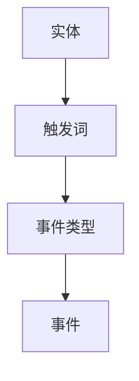
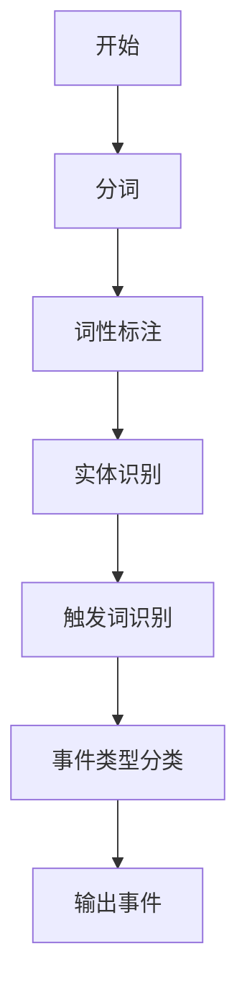
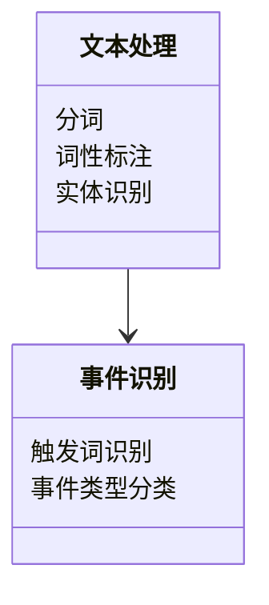
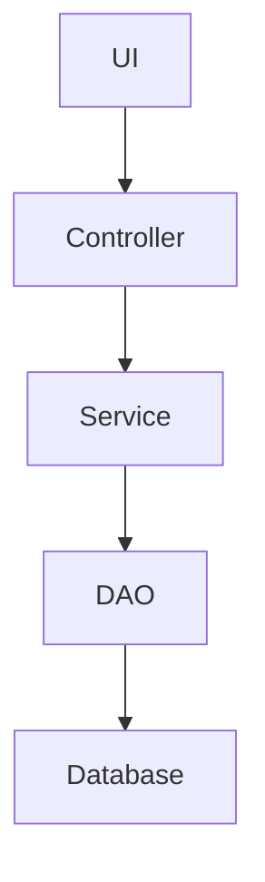
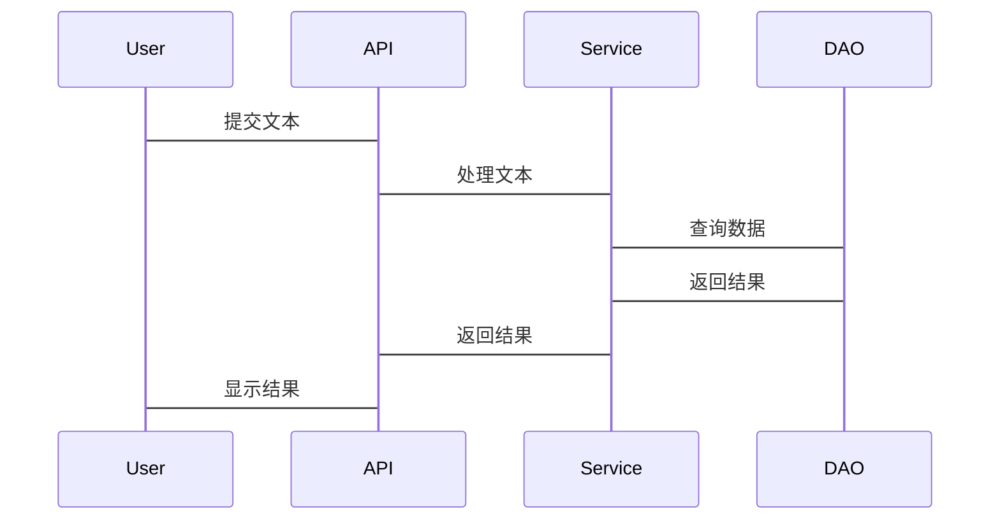

                 


# 构建基于NLP的金融新闻事件抽取系统

## 关键词：自然语言处理，事件抽取，金融新闻，文本挖掘，机器学习

## 摘要：本文详细讲解了如何利用自然语言处理技术构建一个金融新闻事件抽取系统。从背景介绍、核心概念、算法原理到系统设计和项目实战，系统地阐述了整个构建过程，帮助读者掌握从文本数据中提取关键金融事件的方法。

---

## 第1章：背景介绍

### 1.1 问题背景
#### 1.1.1 金融新闻事件的重要性
金融新闻中的事件，如并购、财报发布等，对投资者决策至关重要。然而，手动提取这些信息耗时且容易出错。

#### 1.1.2 传统金融信息处理的局限性
传统方法依赖人工整理，效率低，且难以处理大量非结构化数据。

#### 1.1.3 自动化事件抽取的必要性
自动化处理可以快速、准确地提取关键信息，提高效率。

### 1.2 问题描述
#### 1.2.1 事件抽取的定义
从文本中识别事件、实体和时间信息。

#### 1.2.2 金融新闻的特点
专业术语多、结构复杂、事件关联性强。

#### 1.2.3 事件抽取的目标
提取事件、实体和时间信息，便于后续分析。

### 1.3 问题解决
#### 1.3.1 NLP技术在金融领域的应用
利用NLP技术处理金融文本，提取有价值的信息。

#### 1.3.2 事件抽取的关键步骤
包括分词、实体识别、触发词识别和事件类型分类。

#### 1.3.3 技术路线的选择
采用分步处理，结合规则和机器学习方法。

### 1.4 边界与外延
#### 1.4.1 事件抽取的范围界定
专注于特定类型的事件，如并购、财报发布等。

#### 1.4.2 相关领域的区别与联系
与文本分类、信息抽取等任务的区别与联系。

#### 1.4.3 系统的输入输出描述
输入为文本数据，输出为结构化的事件信息。

### 1.5 核心概念
#### 1.5.1 实体识别
识别文本中的公司名称、人物等实体。

#### 1.5.2 事件触发词
如“收购”、“发布”等词汇，用于识别事件的发生。

#### 1.5.3 事件类型分类
将事件分为并购、财报发布等类别。

---

## 第2章：核心概念与联系

### 2.1 核心概念原理
#### 2.1.1 实体识别的原理
使用NLP工具进行分词和实体识别，提取文本中的实体。

#### 2.1.2 事件触发词的识别
通过关键词匹配或模式识别，找出触发事件的词汇。

#### 2.1.3 事件类型分类的方法
利用机器学习模型，根据触发词和上下文进行分类。

### 2.2 概念属性特征对比
| 概念       | 实体识别       | 事件触发词       | 事件类型分类       |
|------------|---------------|------------------|--------------------|
| 定义       | 识别文本中的实体 | 找出触发事件的词   | 判断事件类型       |
| 输入       | 文本数据       | 分词后的文本      | 事件相关信息       |
| 输出       | 实体列表       | 触发词列表        | 事件类型标签       |
| 示例       | 公司A         | 收购             | 并购事件           |

### 2.3 ER实体关系图


---

## 第3章：算法原理讲解

### 3.1 算法流程


### 3.2 算法实现

#### 3.2.1 分词与词性标注
使用Python的`jieba`库进行分词，`spaCy`进行词性标注。

```python
import jieba
from spacy.lang.zh import Chinese

# 分词示例
text = "苹果公司收购了一家科技公司"
words = jieba.lcut(text)

# 词性标注示例
nlp = Chinese()
doc = nlp(text)
for token in doc:
    print(token.text, token.pos_)
```

#### 3.2.2 实体识别
使用`spaCy`进行实体识别。

```python
# 实体识别示例
nlp = Chinese()
doc = nlp(text)
for entity in doc.ents:
    print(entity.text, entity.label_)
```

#### 3.2.3 触发词识别
基于规则的触发词识别。

```python
# 触发词识别示例
trigger_words = ["收购", "发布", "合并"]
for word in words:
    if word in trigger_words:
        print("触发词：", word)
```

#### 3.2.4 事件类型分类
使用机器学习模型，如SVM或随机森林进行分类。

```python
# 示例代码
from sklearn.feature_extraction.text import TfidfVectorizer
from sklearn.svm import SVC

# 训练数据
texts = ["苹果收购公司", "公司发布财报"]
labels = ["并购", "财报发布"]

# 特征提取
vectorizer = TfidfVectorizer()
X = vectorizer.fit_transform(texts)

# 训练模型
model = SVC()
model.fit(X, labels)

# 预测
new_text = ["科技公司合并"]
new_X = vectorizer.transform(new_text)
print(model.predict(new_X))
```

### 3.3 数学模型
#### 3.3.1 TF-IDF计算
$$ TF-IDF = \frac{TF}{\log_{10}(N) + 1} \times (1 + \log_{10}(N)) $$
其中，\( TF \)为词频，\( N \)为文本总数。

#### 3.3.2 朴素贝叶斯分类
$$ P(y|X) = P(X|y)P(y) / P(X) $$

---

## 第4章：系统架构与设计

### 4.1 问题场景介绍
金融新闻数据量大，事件类型多样，需要高效准确的处理系统。

### 4.2 项目介绍
构建一个能够自动提取金融新闻事件的系统，包括数据预处理、模型训练和结果展示。

### 4.3 系统功能设计
#### 4.3.1 领域模型


#### 4.3.2 系统架构


#### 4.3.3 接口设计
API接口用于接收文本数据，返回结构化的事件信息。

#### 4.3.4 交互流程


---

## 第5章：项目实战

### 5.1 环境安装
安装必要的库：`jieba`, `spaCy`, `scikit-learn`。

### 5.2 核心代码实现
#### 5.2.1 数据预处理
```python
import jieba
from spacy.lang.zh import Chinese
import requests

# 下载金融新闻数据
url = "https://example.com/financial_news"
response = requests.get(url)
text = response.text
```

#### 5.2.2 模型训练
```python
from sklearn.feature_extraction.text import TfidfVectorizer
from sklearn.svm import SVC

# 训练数据
texts = ["苹果收购公司", "公司发布财报"]
labels = ["并购", "财报发布"]

# 特征提取
vectorizer = TfidfVectorizer()
X = vectorizer.fit_transform(texts)

# 训练模型
model = SVC()
model.fit(X, labels)
```

#### 5.2.3 结果展示
```python
# 预测示例
new_text = ["科技公司合并"]
new_X = vectorizer.transform([new_text])
print(model.predict(new_X))  # 输出：['并购']
```

### 5.3 案例分析
分析一次并购事件的抽取过程，从数据预处理到模型训练，再到结果展示，详细解读每一步骤。

### 5.4 项目小结
总结项目实现的关键点和注意事项，为后续优化提供方向。

---

## 第6章：系统优化与扩展

### 6.1 系统优化
#### 6.1.1 性能优化
优化模型训练和处理速度，提升系统响应时间。

#### 6.1.2 模型优化
尝试不同的算法，如深度学习模型，提升分类准确率。

### 6.2 功能扩展
#### 6.2.1 多语言支持
支持多种语言的金融新闻处理。

#### 6.2.2 实时监控
实时抓取新闻并自动抽取事件。

### 6.3 注意事项
数据质量、模型泛化能力、系统可扩展性等方面需要注意。

---

## 第7章：总结与展望

### 7.1 总结
回顾整个构建过程，总结关键技术和实现步骤。

### 7.2 展望
未来的研究方向，如更复杂的事件抽取、多模态数据处理等。

---

## 作者：AI天才研究院/AI Genius Institute & 禅与计算机程序设计艺术 /Zen And The Art of Computer Programming

