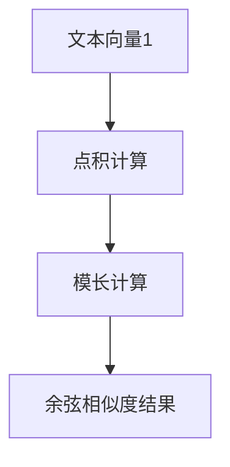
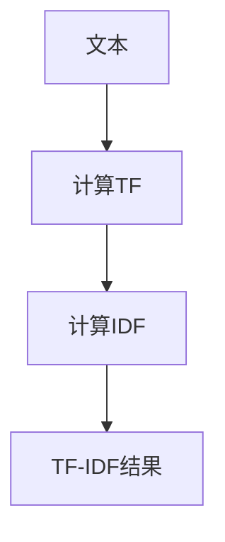
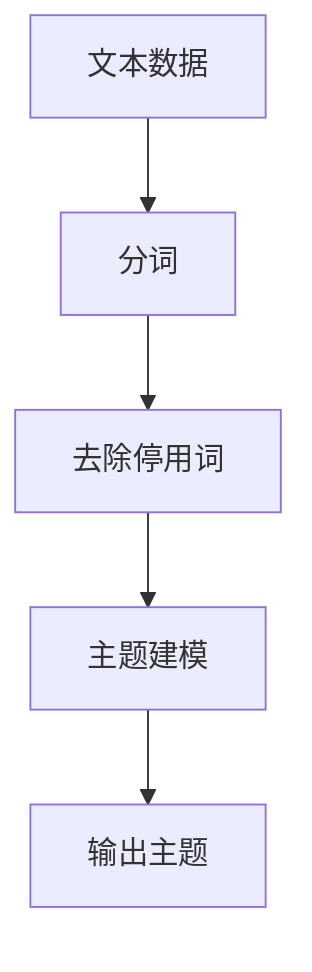
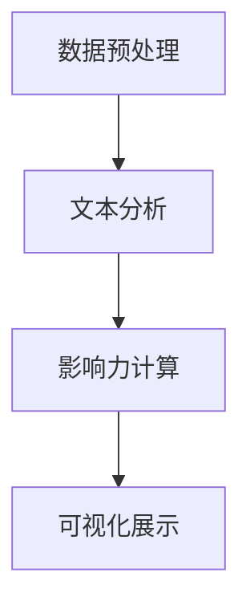

                 


# 构建基于NLP的金融研究报告影响力评估系统

> 关键词：自然语言处理（NLP）、金融研究报告、影响力评估、文本相似度、主题模型

> 摘要：本文探讨了如何利用自然语言处理技术构建金融研究报告影响力评估系统，详细分析了系统的设计思路、实现过程及应用场景，为金融领域的研究者和从业者提供了有效的工具和方法。

---

## 第一部分：背景介绍

### 第1章：问题背景与描述

#### 1.1 问题背景
- **金融研究报告的重要性**：金融研究报告是投资者、分析师和机构做出决策的重要依据。然而，随着金融市场数据的爆炸式增长，如何快速评估研究报告的影响力成为一个挑战。
- **研究报告影响力评估的挑战**：传统评估方法依赖人工阅读和主观判断，耗时且成本高。此外，报告内容的复杂性和多样性使得传统方法难以量化。
- **NLP技术在金融领域的潜力**：自然语言处理技术能够自动化地从大量文本中提取信息，为金融研究报告的影响力评估提供技术支持。

#### 1.2 问题描述
- **研究报告影响力的定义**：影响力指的是报告内容对市场行为、投资决策或学术研究的实际影响程度。
- **影响力评估的关键因素**：包括报告的内容质量、信息新颖性、作者权威性、读者关注度等。
- **当前评估方法的局限性**：传统方法依赖主观判断，缺乏量化标准，且难以处理海量数据。

#### 1.3 问题解决思路
- **引入NLP技术的必要性**：通过自动化分析文本内容，提取关键信息，量化报告影响力。
- **构建自动化评估系统的框架**：从数据收集、文本分析到影响力评分，构建一个完整的评估系统。
- **系统的目标与预期效果**：提高评估效率，降低人工成本，为用户提供客观的影响力评估结果。

---

## 第二部分：核心概念与联系

### 第2章：核心概念与原理

#### 2.1 NLP技术基础
- **NLP的基本概念与技术**：包括分词、实体识别、情感分析、主题模型等。
- **常见NLP任务与模型**：如文本分类、信息抽取、文本生成等。

#### 2.2 金融研究报告的文本特征
- **文本内容的结构化特征**：包括标题、摘要、正文等部分。
- **金融术语与专业领域的特点**：金融报告中涉及大量专业术语和复杂概念。

#### 2.3 影响力评估的指标体系
- **评估指标的设计原则**：指标应涵盖内容质量、信息新颖性、作者权威性等多个维度。
- **指标的权重与计算方法**：通过加权平均等方式，综合评估报告的影响力。

### 第3章：核心概念的联系与架构

#### 3.1 核心概念的属性特征对比
- **表格对比**：以下是一个对比表格，展示了NLP技术、金融文本特征和影响力评估指标的主要属性。

| 概念         | 属性                     | 描述                                                                 |
|--------------|--------------------------|----------------------------------------------------------------------|
| NLP技术      | 任务类型                 | 文本分析、信息提取、主题建模                                       |
| 金融文本特征 | 结构特征                 | 包括标题、摘要、正文等                                             |
| 影响力指标   | 评估维度                 | 包括内容质量、信息新颖性、读者关注度等                             |

#### 3.2 ER实体关系图
- **Mermaid图**：展示NLP技术、金融文本、影响力评估指标之间的关系。

```mermaid
erd
    报告内容 (Report_Content)
    报告作者 (Report_Author)
    读者关注度 (Reader_Attention)
    内容质量 (Content_Quality)
    信息新颖性 (Information_Newness)
    报告影响力 (Report_Influence)

    报告内容 --> 报告影响力
    报告作者 --> 报告影响力
    读者关注度 --> 报告影响力
    内容质量 --> 报告影响力
    信息新颖性 --> 报告影响力
```

---

## 第三部分：算法原理讲解

### 第4章：文本相似度计算算法

#### 4.1 余弦相似度
- **Mermaid图**：余弦相似度计算流程。



- **Python代码示例**：

```python
from sklearn.metrics.pairwise import cosine_similarity

# 示例文本向量化后的向量
vector1 = [0.5, 0.8, 0.3]
vector2 = [0.6, 0.7, 0.4]

# 计算余弦相似度
similarity = cosine_similarity([vector1], [vector2])[0][0]
print(f"余弦相似度为：{similarity}")
```

- **数学公式**：

$$\cos\theta = \frac{\vec{A} \cdot \vec{B}}{|\vec{A}||\vec{B}|}$$

#### 4.2 TF-IDF
- **Mermaid图**：TF-IDF计算流程。



- **Python代码示例**：

```python
from sklearn.feature_extraction.text import TfidfVectorizer

# 示例文本
texts = ["This is a sample text.", "This text is for TF-IDF calculation."]

# 创建TF-IDF向量器
vectorizer = TfidfVectorizer()
tfidf_matrix = vectorizer.fit_transform(texts)

print(tfidf_matrix.todense())
```

- **数学公式**：

$$TF-IDF = TF \times (1 + \log(N/DF))$$

### 第5章：主题模型算法

#### 5.1 LDA主题模型
- **Mermaid图**：LDA主题模型流程图。



- **Python代码示例**：

```python
import gensim
from gensim import corpora

# 示例文本数据
texts = ["This is a sample text.", "This text is for LDA."]

# 创建词典
dictionary = corpora.Dictionary(texts)
corpus = [dictionary.doc2bow(text.split()) for text in texts]

# 训练LDA模型
lda_model = gensim.models.LdaModel(corpus, num_topics=2, id2word=dictionary)

# 打印主题
for topic in lda_model.print_topics():
    print(topic)
```

- **数学公式**：

$$P(\text{word}|\text{topic}) = \frac{\alpha + \text{count(word, topic)}}{\alpha + \beta}$$

---

## 第四部分：系统分析与架构设计

### 第6章：系统架构设计

#### 6.1 项目介绍
- 本系统旨在通过NLP技术，对金融研究报告进行影响力评估。

#### 6.2 功能设计
- **数据预处理模块**：负责清洗和分词。
- **文本分析模块**：包括文本相似度计算和主题模型。
- **影响力计算模块**：综合各指标计算影响力评分。
- **可视化模块**：展示评估结果。

#### 6.3 系统架构图
- **Mermaid图**：系统架构设计。



---

## 第五部分：项目实战

### 第7章：项目实战

#### 7.1 环境安装
- 安装必要的库：`spaCy`、`Gensim`、`scikit-learn`。

#### 7.2 核心实现

##### 7.2.1 数据预处理
```python
import spacy

# 加载中文模型
nlp = spacy.load("zh")

# 示例文本
text = "这是一份关于金融市场的研究报告。"
doc = nlp(text)
tokens = [token.text for token in doc]

print(tokens)
```

##### 7.2.2 文本向量化
```python
from sklearn.feature_extraction.text import TfidfVectorizer

# 示例文本
texts = ["This is a sample text.", "This text is for TF-IDF calculation."]

# 创建TF-IDF向量器
vectorizer = TfidfVectorizer()
tfidf_matrix = vectorizer.fit_transform(texts)

print(tfidf_matrix.todense())
```

##### 7.2.3 主题模型训练
```python
import gensim
from gensim import corpora

# 示例文本数据
texts = ["This is a sample text.", "This text is for LDA."]

# 创建词典
dictionary = corpora.Dictionary(texts)
corpus = [dictionary.doc2bow(text.split()) for text in texts]

# 训练LDA模型
lda_model = gensim.models.LdaModel(corpus, num_topics=2, id2word=dictionary)

# 打印主题
for topic in lda_model.print_topics():
    print(topic)
```

##### 7.2.4 影响力评分计算
```python
# 示例影响力评分计算
scores = [0.85, 0.75, 0.90]
average_score = sum(scores) / len(scores)

print(f"平均影响力评分为：{average_score}")
```

#### 7.3 案例分析
- 通过具体案例展示系统的实际应用，分析评估结果并解释其意义。

---

## 第六部分：总结与展望

### 第8章：总结与展望

#### 8.1 系统建设的意义
- 本系统为金融领域的研究者和从业者提供了自动化、高效的影响力评估工具。

#### 8.2 应用价值
- 帮助投资者快速筛选高质量报告，辅助决策。

#### 8.3 未来展望
- 引入深度学习模型（如BERT）提升评估精度。
- 扩大系统的应用范围，支持多语言和多领域分析。

---

## 作者：AI天才研究院 & 禅与计算机程序设计艺术

---

本文详细探讨了如何构建基于NLP的金融研究报告影响力评估系统，从背景分析到算法实现，再到系统设计和项目实战，为读者提供了全面的技术指导。希望本文能为金融领域的研究者和从业者提供有价值的参考和启发。

