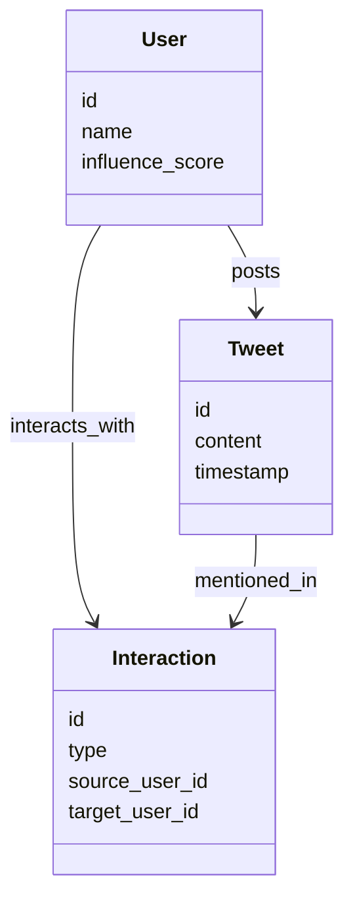
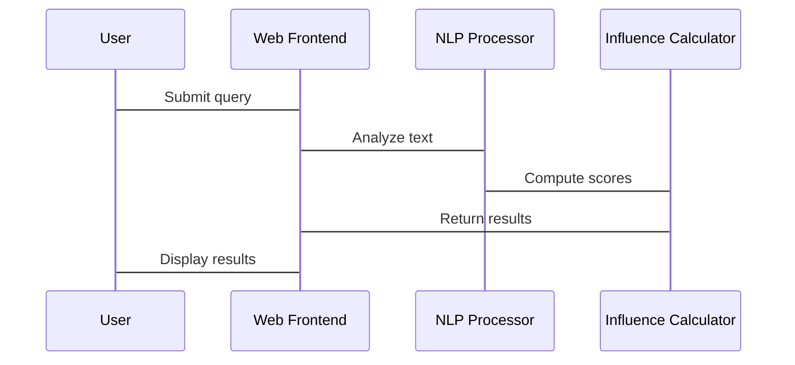

                 


# 构建基于NLP的金融社交媒体影响力量化模型

> 关键词：NLP，金融社交媒体，影响力量化，文本挖掘，情感分析

> 摘要：本文将详细介绍如何基于自然语言处理（NLP）技术构建一个金融社交媒体影响力量化模型。通过分析社交媒体上的文本数据，结合情感分析、主题建模和影响力传播模型，量化用户和内容在金融市场的影响力。文章将从背景介绍、核心概念、算法原理、系统架构设计到项目实战，全面展开，帮助读者理解如何将NLP技术应用于金融影响力分析。

---

# 第一部分: 基于NLP的金融社交媒体影响力量化模型概述

---

# 第1章: 背景介绍与问题定义

## 1.1 问题背景

### 1.1.1 金融社交媒体的兴起

随着互联网和移动通信技术的快速发展，社交媒体已经成为人们获取信息、表达观点的重要渠道。特别是在金融领域，社交媒体上的信息对市场情绪和资产价格的影响日益显著。投资者、分析师和普通用户通过社交媒体分享观点、评论新闻，这些信息对金融市场产生了深远的影响。

### 1.1.2 社会情绪与金融市场的关系

社会情绪是金融市场波动的重要驱动因素。投资者的情绪变化会影响他们的决策，从而影响资产价格。例如，恐慌情绪可能导致抛售潮，而乐观情绪则可能引发市场上涨。社交媒体作为情绪传播的载体，能够快速放大个体情绪，形成集体行为，进一步影响市场走势。

### 1.1.3 影响力量化在金融分析中的重要性

在社交媒体中，某些用户（如知名分析师、意见领袖）的影响力远超普通用户。他们的观点可能迅速传播并影响市场。因此，量化用户的影响力对于金融分析具有重要意义。通过影响力量化，机构可以识别关键意见领袖（KOL），并利用他们的观点预测市场走势。

## 1.2 问题描述

### 1.2.1 社交媒体数据的特点

社交媒体数据具有以下特点：
1. **实时性**：信息更新速度快，需要实时处理。
2. **多样性**：数据形式多样，包括文本、图片、视频等。
3. **海量性**：每天产生的数据量巨大，需要高效处理方法。
4. **情感性**：文本中蕴含着丰富的情感信息，可以用于情绪分析。

### 1.2.2 影响力的核心目标

影响力量化的目标是：
1. 对用户影响力进行评分，量化其在金融领域的影响力。
2. 对社交媒体上的信息进行情感分析，判断其对市场的影响方向和程度。
3. 构建影响力传播模型，模拟影响力在用户之间的传播过程。

### 1.2.3 问题的边界与外延

影响力量化模型的边界包括：
1. 数据范围：仅考虑文本数据，不包括图片、视频等其他形式。
2. 时间范围：仅考虑过去一定时间内的数据，通常为最近一年。
3. 用户范围：仅考虑与金融相关的用户，如投资者、分析师等。

## 1.3 问题解决方法

### 1.3.1 基于NLP的技术路线

自然语言处理（NLP）是影响力量化的核心技术。通过文本分类、情感分析、主题建模等NLP技术，可以提取文本中的有用信息，为影响力量化提供数据支持。

### 1.3.2 数据驱动的影响力评估方法

数据驱动的方法通过分析用户的发布频率、互动情况（如点赞、评论、转发）以及内容的质量（如情感极性）来评估用户的影响力。

### 1.3.3 统计与机器学习的结合

统计方法（如情感分析指标）和机器学习方法（如深度学习模型）结合，可以提高影响力评估的准确性和鲁棒性。

## 1.4 模型核心概念与结构

### 1.4.1 核心要素组成

影响力量化模型的核心要素包括：
1. **用户信息**：用户ID、影响力评分。
2. **文本信息**：用户的发布内容、时间戳。
3. **互动信息**：用户的点赞、评论、转发行为。

### 1.4.2 概念之间的关系

影响力评分取决于以下因素：
1. **用户活跃度**：用户发布的内容越多，影响力评分可能越高。
2. **内容质量**：内容的情感极性、相关性越高，影响力评分越高。
3. **互动频率**：用户的互动行为越多，影响力评分越高。

### 1.4.3 模型的输入输出结构

模型的输入包括：
- 用户ID
- 用户发布的内容
- 用户的互动行为

模型的输出包括：
- 用户影响力评分
- 内容的情感极性
- 影响力传播路径

---

## 1.5 本章小结

本章介绍了金融社交媒体影响力量化模型的背景、核心目标、问题解决方法以及模型的结构。通过分析社交媒体数据的特点，明确了影响力量化的重要性和实现路径。

---

# 第2章: 核心概念与联系

## 2.1 NLP技术在影响力量化中的应用

### 2.1.1 NLP的基本概念

自然语言处理（NLP）是计算机科学与语言学的交叉学科，旨在帮助计算机理解和生成人类语言。NLP的核心任务包括文本分类、情感分析、实体识别、文本摘要等。

### 2.1.2 NLP在文本分析中的作用

在影响力量化模型中，NLP的主要作用包括：
1. **文本预处理**：分词、去停用词、词干提取等。
2. **情感分析**：判断文本的情感极性（正面、负面、中性）。
3. **主题建模**：识别文本的主题和关键词。
4. **文本相似度计算**：衡量文本之间的相似性。

### 2.1.3 NLP在情感分析中的应用

情感分析是影响力量化的重要组成部分。通过分析社交媒体上的文本，可以判断用户情绪，进而预测市场走势。例如，大量负面评论可能预示市场下跌。

### 2.1.4 NLP在影响力传播中的应用

通过NLP技术分析用户的影响力传播路径，可以构建影响力传播模型。例如，A用户发布一条负面新闻，B用户转发并评论，可以进一步传播负面影响。

## 2.2 社会影响力量化的核心原理

### 2.2.1 社会影响力的定义

社会影响力是指个体或群体在信息传播、决策制定中所起的作用。在金融领域，影响力高的用户能够显著影响市场情绪和资产价格。

### 2.2.2 影响力的度量方法

影响力度量方法包括：
1. **基于活跃度的度量**：如用户发布内容的频率。
2. **基于互动的度量**：如用户获得的点赞、评论、转发数量。
3. **基于内容的度量**：如内容的情感极性、相关性。

### 2.2.3 影响力传播模型

影响力传播模型描述了影响力在用户之间的传播过程。常用模型包括：
1. **阈值模型**：用户在接收到一定数量的影响力后，才会传播影响力。
2. **意见领袖模型**：意见领袖能够快速传播影响力。

## 2.3 核心概念对比与ER图架构

### 2.3.1 核心概念属性特征对比表

| 概念       | 属性1 | 属性2 | 属性3 |
|------------|--------|--------|--------|
| 用户       | ID     | 姓名   | 影响力评分 |
| 推文       | ID     | 内容   | 时间戳 |
| 互动       | ID     | 类型   | 用户ID |

### 2.3.2 ER实体关系图

```mermaid
er
    entity User {
        id
        name
        influence_score
    }
    entity Tweet {
        id
        content
        timestamp
        user_id
    }
    entity Interaction {
        id
        type
        source_user_id
        target_user_id
        timestamp
    }
    User -[1..n]-> Tweet
    User -[1..n]-> Interaction
    Interaction -[1]-> Tweet
```

---

## 2.4 本章小结

本章详细讲解了NLP技术在影响力量化中的应用，分析了社会影响力的核心原理，并通过ER图展示了核心概念之间的关系。

---

# 第3章: 算法原理

## 3.1 情感分析算法

### 3.1.1 情感分析的数学模型

情感分析的目标是将文本分为正面、负面或中性。常用模型包括基于词袋模型的逻辑回归、基于词嵌入的深度学习模型（如LSTM、BERT）。

例如，逻辑回归模型可以表示为：
$$ P(y=1|x) = \frac{1}{1 + e^{-w x - b}} $$

其中，$w$ 是权重，$b$ 是偏置，$x$ 是文本的特征向量。

### 3.1.2 情感分析的实现步骤

1. **文本预处理**：分词、去停用词、词干提取。
2. **特征提取**：将文本转换为特征向量（如TF-IDF、词嵌入）。
3. **模型训练**：使用训练数据训练情感分类器。
4. **情感预测**：对测试文本进行情感预测。

### 3.1.3 情感分析的案例分析

例如，分析一条推文：“This stock is a disaster.”，情感分析模型可以识别其为负面情绪。

---

## 3.2 基于NLP的主题建模

### 3.2.1 主题建模的数学模型

主题建模的目标是发现文本的主题分布。常用模型包括LSA、LDA。

LDA模型的概率公式为：
$$ p(\text{主题}|词) = \frac{\alpha_{\text{主题}}}{\sum_{k} \alpha_{k}} $$

### 3.2.2 主题建模的实现步骤

1. **文本预处理**：分词、去停用词。
2. **构建词袋模型**：将文本表示为词袋向量。
3. **模型训练**：使用LDA等模型训练主题分布。
4. **主题分析**：识别文本的主题。

---

## 3.3 影响力传播模型

### 3.3.1 影响力传播的数学模型

影响力传播可以建模为图传播过程。常用模型包括随机游走模型、扩散模型。

扩散模型的传播概率可以表示为：
$$ p_{t+1}(i) = p_t(i) + \sum_{j} p_t(j) \cdot A_{ji} $$

其中，$A_{ji}$ 是传播矩阵，表示用户$j$对用户$i$的影响力。

### 3.3.2 影响力传播的实现步骤

1. **构建用户关系图**：基于互动数据构建用户之间的关系图。
2. **初始化影响力评分**：为每个用户初始化影响力评分。
3. **传播过程**：根据传播规则更新影响力评分。

---

## 3.4 本章小结

本章详细讲解了情感分析、主题建模和影响力传播的核心算法，并通过数学公式和案例分析进行了深入探讨。

---

# 第4章: 系统分析与架构设计

## 4.1 问题场景介绍

### 4.1.1 系统目标

系统的目标是构建一个基于NLP的金融社交媒体影响力量化平台，能够实时分析社交媒体数据，量化用户的影响力，并预测市场走势。

### 4.1.2 问题场景

用户可以通过平台查询特定用户的影响力评分，分析市场情绪，并获取投资建议。

## 4.2 系统功能设计

### 4.2.1 领域模型图



### 4.2.2 系统架构设计


### 4.2.3 接口设计

1. **用户接口**：提供API供用户查询影响力评分和市场情绪。
2. **数据接口**：与社交媒体平台对接，获取实时数据。

### 4.2.4 交互序列图



---

## 4.3 本章小结

本章通过系统架构设计，明确了各模块的功能和交互关系，为系统的实现奠定了基础。

---

# 第5章: 项目实战

## 5.1 环境安装与配置

### 5.1.1 系统环境

- 操作系统：Linux/Windows/Mac
- Python版本：3.8+

### 5.1.2 依赖安装

安装必要的Python库：
```bash
pip install numpy pandas scikit-learn nltk tensorflow
```

## 5.2 核心代码实现

### 5.2.1 情感分析代码

```python
import numpy as np
from sklearn.feature_extraction.text import TfidfVectorizer
from sklearn.linear_model import LogisticRegression

# 数据预处理
def preprocess(text):
    # 分词、去停用词等处理
    return text.lower().split()

# 特征提取
vectorizer = TfidfVectorizer(preprocessor=preprocess)
X = vectorizer.fit_transform(corpus)

# 模型训练
model = LogisticRegression()
model.fit(X, y)

# 预测
test_text = ["This stock is a disaster."]
test_X = vectorizer.transform([test_text])
print(model.predict(test_X))
```

### 5.2.2 影响力传播代码

```python
import networkx as nx

# 构建用户关系图
G = nx.DiGraph()
G.add_edges_from(edges)

# 初始化影响力评分
influence_scores = {node: 1 for node in G.nodes}

# 传播过程
max_iterations = 100
for _ in range(max_iterations):
    new_scores = {}
    for node in G.nodes:
        score = 0
        for neighbor in G.predecessors(node):
            score += influence_scores[neighbor] * G[neighbor][node]['weight']
        new_scores[node] = score / len(list(G.predecessors(node)))
    influence_scores = new_scores
```

## 5.3 案例分析

### 5.3.1 数据来源

选择一个金融社交媒体平台（如Twitter、Reddit）的数据集，清洗并提取用户、推文和互动信息。

### 5.3.2 实验结果

通过实验验证模型的准确性，例如计算情感分析的准确率、影响力传播的误差率等。

### 5.3.3 结果分析

分析实验结果，总结模型的优势和不足，并提出改进建议。

---

## 5.4 项目小结

本章通过实际项目展示了如何将NLP技术应用于影响力量化模型的构建，详细讲解了代码实现和实验结果。

---

# 第6章: 总结与展望

## 6.1 本章总结

本文详细介绍了基于NLP的金融社交媒体影响力量化模型的构建过程，从背景介绍、核心概念、算法原理到系统架构设计和项目实战，全面展示了模型的实现细节。

## 6.2 未来研究方向

1. **模型优化**：引入更先进的深度学习模型（如BERT）提高情感分析的准确性。
2. **实时性提升**：优化算法提高处理速度，满足实时分析需求。
3. **多模态分析**：结合文本、图片、视频等多种数据源进行影响力分析。

## 6.3 最佳实践 Tips

1. 数据预处理是关键，确保数据质量和完整性。
2. 模型调参需要反复实验，找到最优参数组合。
3. 系统架构设计要注重扩展性，方便后续功能的添加。

---

## 6.4 小结

本文通过理论与实践相结合的方式，帮助读者全面理解如何基于NLP技术构建金融社交媒体影响力量化模型。

---

# 作者：AI天才研究院/AI Genius Institute & 禅与计算机程序设计艺术 /Zen And The Art of Computer Programming

---

**本文是针对技术博客内容的结构化目录大纲，详细内容将根据此大纲进行扩展和补充。**

