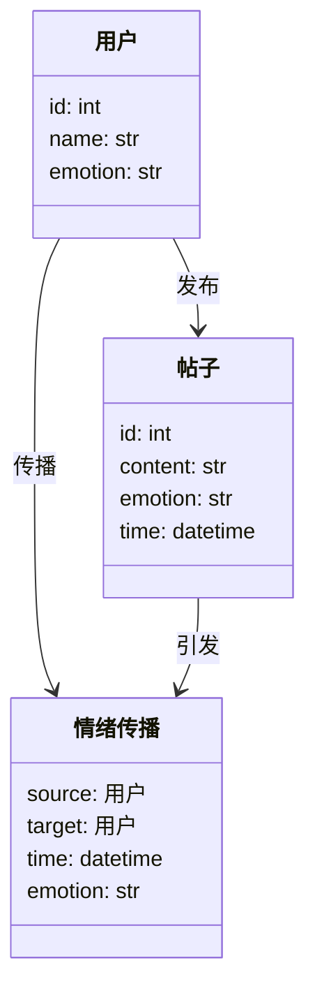
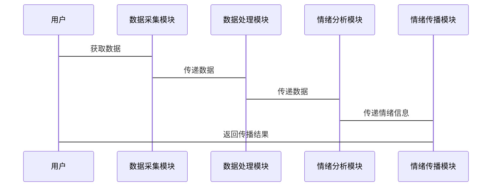

                 


# 构建基于NLP的金融社交媒体情绪传播模型

> 关键词：自然语言处理(NLP)、情绪传播模型、金融社交媒体、情感分析、传播动力学

> 摘要：本文详细介绍了如何利用自然语言处理技术构建金融社交媒体中的情绪传播模型。从问题背景到核心概念，从算法原理到系统架构，从项目实战到最佳实践，系统性地阐述了情绪传播模型的构建过程。通过本文，读者可以掌握基于NLP的情绪传播模型的核心原理和实现方法。

---

# 第一部分: 金融社交媒体情绪传播模型概述

## 第1章: 问题背景与目标

### 1.1 情绪传播的金融应用场景

#### 1.1.1 金融市场的信息传播特点
金融市场是一个高度信息驱动的市场，投资者的行为往往受到市场信息的影响。社交媒体作为信息传播的重要渠道，其上的信息传播具有以下特点：
- **实时性**：社交媒体上的信息传播速度快，能够在短时间内影响市场情绪。
- **广泛性**：社交媒体覆盖范围广，能够触达大量投资者。
- **多样性**：社交媒体上的信息形式多样，包括文本、图片、视频等。

#### 1.1.2 社交媒体在金融信息传播中的作用
社交媒体已经成为金融信息传播的重要渠道，其作用体现在以下几个方面：
- **信息扩散**：社交媒体能够快速扩散金融相关信息，影响投资者的决策。
- **情绪放大**：社交媒体上的情绪化言论会放大市场情绪，进一步影响市场价格。
- **信息筛选**：社交媒体上的信息经过多次转发和评论，会形成一个信息筛选的过程，进一步影响市场情绪。

#### 1.1.3 情绪传播对金融市场的实际影响
情绪传播对金融市场的影响是多方面的，主要体现在以下几个方面：
- **价格波动**：情绪传播会引发投资者的买卖行为，导致市场价格波动。
- **交易决策**：投资者的情绪会受到社交媒体上信息的影响，从而影响其交易决策。
- **市场风险**：情绪传播可能引发市场恐慌，进而增加市场的系统性风险。

### 1.2 问题描述与解决思路

#### 1.2.1 金融社交媒体情绪传播的核心问题
在金融社交媒体中，情绪传播的核心问题在于如何准确捕捉和量化社交媒体上的情绪信息，并利用这些信息进行市场预测和风险评估。具体来说，以下问题是需要解决的：
- 如何从社交媒体文本中提取情绪信息？
- 如何建模情绪传播的过程？
- 如何利用情绪传播模型进行市场预测和风险评估？

#### 1.2.2 情绪传播模型的构建目标
构建金融社交媒体情绪传播模型的目标是：
- 准确捕捉社交媒体上的情绪信息，量化情绪强度。
- 模拟情绪传播的过程，分析情绪传播的网络结构和传播速度。
- 利用情绪传播模型进行市场预测和风险评估。

#### 1.2.3 基于NLP的技术实现路径
基于NLP的技术实现路径主要包括以下几个步骤：
1. **数据采集**：从社交媒体上采集相关文本数据。
2. **文本预处理**：对文本数据进行清洗、分词、去停用词等预处理。
3. **情感分析**：利用NLP技术对文本进行情感分析，提取情绪信息。
4. **情绪传播建模**：基于情绪信息，构建情绪传播模型，模拟情绪传播过程。
5. **模型优化与验证**：对模型进行优化和验证，确保模型的准确性和实用性。

### 1.3 模型的边界与外延

#### 1.3.1 情绪传播的边界条件
情绪传播的边界条件包括以下几个方面：
- **时间范围**：情绪传播的时间范围，如实时传播、短期传播、长期传播等。
- **空间范围**：情绪传播的空间范围，如局部传播、全局传播等。
- **传播网络**：情绪传播的网络结构，如社交网络的节点和边。

#### 1.3.2 模型的适用场景与限制
模型的适用场景包括：
- 金融市场情绪预测
- 投资者行为分析
- 市场风险评估

模型的限制包括：
- 数据质量：社交媒体数据可能存在噪声，影响模型的准确性。
- 情绪复杂性：情绪传播过程可能受到多种因素的影响，模型难以完全捕捉所有因素。
- 模型复杂度：复杂的情绪传播模型可能难以实时运行。

#### 1.3.3 情绪传播与其他金融现象的关系
情绪传播与其他金融现象的关系包括：
- **市场波动**：情绪传播会引发市场波动，两者密切相关。
- **投资者行为**：情绪传播会影响投资者的行为，进而影响市场价格。
- **市场风险**：情绪传播可能引发市场风险，如系统性风险。

### 1.4 核心概念与组成要素

#### 1.4.1 情绪传播的基本概念
情绪传播是指情绪在社交网络中的传播过程，其核心在于情绪信息的扩散和影响。

#### 1.4.2 情绪传播模型的组成要素
情绪传播模型的组成要素包括：
- **情绪源**：情绪传播的起点，如社交媒体上的某些言论。
- **传播网络**：情绪传播的路径和结构，如社交网络的节点和边。
- **传播规则**：情绪传播的规则，如概率传播、基于影响力的传播等。
- **情绪强度**：情绪的强度，如正面情绪、负面情绪等。

#### 1.4.3 情绪传播的核心属性与特征
情绪传播的核心属性包括：
- **传播速度**：情绪传播的速度，如快速传播、缓慢传播等。
- **传播范围**：情绪传播的范围，如局部传播、全局传播等。
- **传播强度**：情绪的强度，如情绪的强烈程度。

---

## 第2章: 核心概念与联系

### 2.1 NLP技术在情绪分析中的应用

#### 2.1.1 NLP的基本原理
NLP（自然语言处理）是研究如何让计算机理解和生成人类语言的技术。其基本原理包括文本预处理、特征提取、模型训练等。

#### 2.1.2 情感分析的实现方法
情感分析是NLP中的一个重要任务，其实现方法包括：
- **基于词袋模型的方法**：将文本表示为词袋，利用统计方法进行分类。
- **基于深度学习的方法**：如LSTM、BERT等模型，能够捕捉文本的上下文信息。

#### 2.1.3 基于NLP的情绪传播模型构建
基于NLP的情绪传播模型构建包括以下几个步骤：
1. **文本预处理**：对社交媒体文本进行清洗、分词、去停用词等。
2. **情感分析**：对文本进行情感分类，提取情绪信息。
3. **情绪传播建模**：基于情绪信息，构建情绪传播模型。

### 2.2 情绪传播模型的原理

#### 2.2.1 情绪传播的基本机制
情绪传播的基本机制包括以下几个方面：
- **情绪源的产生**：情绪源是情绪传播的起点，如社交媒体上的某些言论。
- **情绪的扩散**：情绪通过社交网络进行扩散，影响其他节点的情绪。
- **情绪的感染**：节点的情绪状态会受到其邻居节点的影响，从而发生改变。

#### 2.2.2 情绪传播的数学模型
情绪传播的数学模型包括：
- **SIR模型**：将情绪传播分为易感态、感染态、恢复态。
- **SEIR模型**：在SIR模型的基础上，增加暴露态。

#### 2.2.3 情绪传播的网络结构特征
情绪传播的网络结构特征包括：
- **网络密度**：网络中边的密度。
- **网络中心性**：节点的中心性，如度中心性、介数中心性等。

### 2.3 核心概念的对比分析

#### 2.3.1 不同情绪传播模型的对比
不同情绪传播模型的对比包括：
- **SIR模型**：适用于情绪传播的基本过程。
- **SEIR模型**：适用于更复杂的情绪传播过程。
- **其他模型**：如基于网络的传播模型。

#### 2.3.2 NLP技术在不同模型中的应用
NLP技术在不同模型中的应用包括：
- **情感分析**：用于提取情绪信息。
- **文本分类**：用于分类情绪类型。
- **文本生成**：用于生成情绪传播的内容。

#### 2.3.3 情绪传播模型的优缺点分析
情绪传播模型的优缺点分析包括：
- **优点**：能够模拟情绪传播的过程，帮助理解情绪传播的机制。
- **缺点**：模型的复杂性较高，实际应用中可能难以实现。

---

## 第3章: 情绪传播模型的数学基础

### 3.1 情感分析的数学模型

#### 3.1.1 基于统计的分类模型
基于统计的分类模型包括：
- **朴素贝叶斯**：基于贝叶斯定理的分类方法。
- **线性回归**：将情绪分类问题转化为回归问题。

#### 3.1.2 基于深度学习的分类模型
基于深度学习的分类模型包括：
- **LSTM**：用于捕捉文本的时序信息。
- **BERT**：用于捕捉文本的上下文信息。

#### 3.1.3 情感分析的评价指标
情感分析的评价指标包括：
- **准确率**：分类的准确率。
- **召回率**：分类的召回率。
- **F1值**：分类的F1值。

### 3.2 情绪传播的数学模型

#### 3.2.1 情绪传播的基本方程
情绪传播的基本方程包括：
- **SIR模型**：$dS/dt = -\beta SI$, $dI/dt = \beta SI - \gamma I$, $dR/dt = \gamma I$
- **SEIR模型**：$dS/dt = -\beta SI$, $dE/dt = \beta SI - \delta E$, $dI/dt = \delta E - \gamma I$, $dR/dt = \gamma I$

#### 3.2.2 情绪传播的网络模型
情绪传播的网络模型包括：
- **网络流模型**：将情绪传播视为网络中的流。
- **网络扩散模型**：基于网络的扩散过程。

#### 3.2.3 情绪传播的动态分析
情绪传播的动态分析包括：
- **稳定性分析**：分析模型的稳定性。
- **传播速度分析**：分析情绪传播的速度。

### 3.3 情绪传播与NLP的结合

#### 3.3.1 NLP在情绪传播模型中的作用
NLP在情绪传播模型中的作用包括：
- **情绪信息提取**：从文本中提取情绪信息。
- **情绪传播预测**：基于情绪信息预测情绪传播的过程。

#### 3.3.2 情绪传播模型的优化方法
情绪传播模型的优化方法包括：
- **参数优化**：通过优化模型参数提高模型的准确性。
- **模型改进**：改进模型的结构，提高模型的性能。

#### 3.3.3 情绪传播的数学表达式
情绪传播的数学表达式包括：
- **情感分类的损失函数**：$L = -\sum_{i=1}^{n} y_i \log p_i + (1-y_i)\log (1-p_i)$
- **情绪传播的传播概率**：$P = \beta \cdot \frac{I}{N}$

---

## 第4章: 情绪传播模型的算法实现

### 4.1 情感分析算法

#### 4.1.1 基于SVM的情感分类算法
基于SVM的情感分类算法包括：
- **文本特征提取**：将文本表示为特征向量。
- **SVM训练**：利用SVM进行分类。

#### 4.1.2 基于LSTM的情感分类算法
基于LSTM的情感分类算法包括：
- **LSTM网络构建**：构建LSTM网络进行情感分类。
- **模型训练**：利用训练数据训练模型。

#### 4.1.3 情感分析的评价指标
情感分析的评价指标包括：
- **准确率**：分类的准确率。
- **召回率**：分类的召回率。
- **F1值**：分类的F1值。

### 4.2 情绪传播算法

#### 4.2.1 基于SIR模型的情绪传播算法
基于SIR模型的情绪传播算法包括：
- **初始化**：设置初始状态。
- **传播过程模拟**：模拟情绪传播的过程。
- **结果分析**：分析传播结果。

#### 4.2.2 基于网络的情绪传播算法
基于网络的情绪传播算法包括：
- **网络构建**：构建社交网络。
- **传播过程模拟**：模拟情绪传播的过程。
- **结果分析**：分析传播结果。

#### 4.2.3 情绪传播的算法优化
情绪传播的算法优化包括：
- **参数优化**：优化模型的参数。
- **算法改进**：改进算法的结构。

### 4.3 算法实现的代码示例

#### 4.3.1 基于SVM的情感分类代码
```python
from sklearn.svm import SVC
from sklearn.feature_extraction.text import TfidfVectorizer

# 文本预处理
vectorizer = TfidfVectorizer()
X = vectorizer.fit_transform(texts)
y = labels

# 模型训练
model = SVC()
model.fit(X, y)

# 模型预测
test_X = vectorizer.transform(test_texts)
predictions = model.predict(test_X)
```

#### 4.3.2 基于LSTM的情感分类代码
```python
import tensorflow as tf
from tensorflow.keras import layers

# 构建LSTM模型
model = tf.keras.Sequential()
model.add(layers.Embedding(max_words, 128))
model.add(layers.LSTM(64))
model.add(layers.Dense(2, activation='sigmoid'))

# 模型训练
model.compile(loss='binary_crossentropy', optimizer='adam', metrics=['accuracy'])
model.fit(X_train, y_train, epochs=5, batch_size=32)

# 模型预测
X_test = ...
predictions = model.predict(X_test)
```

#### 4.3.3 基于SIR模型的情绪传播代码
```python
import numpy as np

# 初始化
S = np.array([0.99])
I = np.array([0.01])
R = np.array([0.0])
beta = 0.3
gamma = 0.1

# 传播过程模拟
for _ in range(100):
    dS = -beta * S * I
    dI = beta * S * I - gamma * I
    dR = gamma * I
    S += dS
    I += dI
    R += dR
```

---

## 第5章: 系统分析与架构设计方案

### 5.1 问题场景介绍
系统需要构建一个基于NLP的金融社交媒体情绪传播模型，用于分析和预测金融市场的情绪传播。

### 5.2 项目介绍
项目目标是构建一个基于NLP的金融社交媒体情绪传播模型，实现情绪传播的建模与分析。

### 5.3 系统功能设计

#### 5.3.1 领域模型


#### 5.3.2 系统架构设计


#### 5.3.3 系统接口设计
- 数据采集接口：从社交媒体获取数据。
- 情绪分析接口：对文本进行情感分析。
- 情绪传播接口：模拟情绪传播过程。

#### 5.3.4 系统交互设计


### 5.4 系统实现
系统实现包括数据采集、数据处理、情绪分析和情绪传播四个模块。

### 5.5 系统优化
系统优化包括算法优化和系统性能优化。

---

## 第6章: 项目实战

### 6.1 环境安装
安装所需的Python库，如scikit-learn、TensorFlow、networkx等。

### 6.2 系统核心实现

#### 6.2.1 数据采集
```python
import requests
from bs4 import BeautifulSoup

# 数据采集代码
url = "https://www.example.com"
response = requests.get(url)
soup = BeautifulSoup(response.text, 'html.parser')
texts = soup.find_all('div', class_='text')
```

#### 6.2.2 数据处理
```python
from sklearn.feature_extraction.text import TfidfVectorizer

# 数据处理代码
vectorizer = TfidfVectorizer()
X = vectorizer.fit_transform(texts)
```

#### 6.2.3 情绪分析
```python
from sklearn.svm import SVC

# 情绪分析代码
model = SVC()
model.fit(X, y)
```

#### 6.2.4 情绪传播
```python
from networkx import Graph

# 情绪传播代码
graph = Graph()
graph.add_nodes_from(users)
graph.add_edges_from(edges)
```

### 6.3 代码应用解读与分析
解读和分析实现的代码，说明每一步的作用。

### 6.4 实际案例分析
通过实际案例分析，展示模型的应用效果。

### 6.5 项目小结
总结项目实现的过程和成果。

---

## 第7章: 最佳实践、小结与展望

### 7.1 最佳实践
- 数据质量：确保数据的准确性和完整性。
- 模型优化：不断优化模型的参数和结构。
- 系统性能：优化系统的性能，确保实时性。

### 7.2 小结
本文详细介绍了基于NLP的金融社交媒体情绪传播模型的构建过程，包括问题背景、核心概念、算法实现、系统架构和项目实战。

### 7.3 展望
未来的研究方向包括：
- 更复杂的情绪传播模型。
- 更高效的情绪分析算法。
- 更精确的情绪传播预测方法。

---

## 第8章: 参考文献与拓展阅读

### 8.1 参考文献
列出本文参考的相关文献。

### 8.2 拓展阅读
推荐相关的拓展阅读资料。

---

## 作者

作者：AI天才研究院/AI Genius Institute & 禅与计算机程序设计艺术/Zen And The Art of Computer Programming

---

以上是《构建基于NLP的金融社交媒体情绪传播模型》的技术博客文章的完整内容，涵盖了从问题背景到系统实现的各个方面，详细讲解了基于NLP的情绪传播模型的构建过程。

