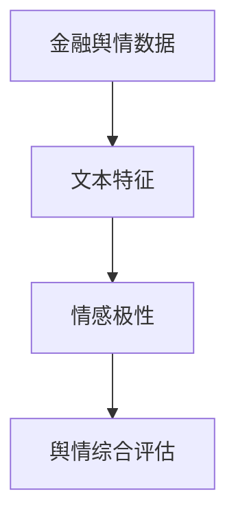

                 

# 第一部分: 金融舆情情感分析系统概述

## 第1章: 问题背景与需求分析

### 1.1 问题背景

#### 1.1.1 金融舆情分析的定义与重要性
金融舆情分析是指通过收集和分析金融市场中的各种评论、新闻、社交媒体等信息，来判断市场情绪、预测股票价格波动等。其重要性体现在帮助投资者做出更明智的决策，帮助企业了解市场动态，维护企业声誉等。

#### 1.1.2 情感分析在金融领域的应用
在金融领域，情感分析主要用于股票价格预测、市场情绪监测、风险管理等。例如，通过分析社交媒体上的评论，可以预测某只股票的价格走势。

#### 1.1.3 当前金融舆情分析的主要挑战
挑战包括数据的多样性、噪声多、实时性要求高、模型的可解释性差等。

### 1.2 问题描述

#### 1.2.1 金融舆情数据的特点
数据来源广泛（新闻、社交媒体、评论等），数据量大，数据格式多样，数据实时性强。

#### 1.2.2 情感分析的核心问题
如何准确地从文本中提取情感信息，如何处理数据中的噪声，如何提高模型的泛化能力等。

#### 1.2.3 系统目标与功能需求
系统的目标是构建一个能够实时分析金融舆情情感的系统，功能需求包括数据采集、预处理、情感分析、结果可视化等。

### 1.3 问题解决思路

#### 1.3.1 基于NLP的情感分析方法
使用自然语言处理技术，如分词、词性标注、情感分析等，对文本进行处理。

#### 1.3.2 数据驱动与模型驱动的结合
结合数据驱动的方法（如机器学习）和模型驱动的方法（如深度学习），以提高系统的准确性和效率。

#### 1.3.3 系统设计的初步框架
包括数据采集模块、预处理模块、模型训练模块、结果输出模块等。

### 1.4 系统边界与外延

#### 1.4.1 系统的功能边界
明确系统的核心功能和辅助功能，如数据采集仅限于金融相关的文本数据。

#### 1.4.2 系统的输入输出范围
输入包括各种金融文本数据，输出包括情感极性、情感强度等。

#### 1.4.3 系统与其他模块的交互
如与数据存储模块、用户界面模块的交互。

### 1.5 核心概念与组成

#### 1.5.1 金融舆情数据的构成
包括文本内容、时间戳、来源等。

#### 1.5.2 情感分析的核心要素
如情感类别（正面、负面、中性）、情感强度等。

#### 1.5.3 系统架构的组成模块
如数据采集模块、预处理模块、模型训练模块、结果输出模块等。

### 1.6 本章小结
总结本章的主要内容，强调金融舆情分析的重要性和挑战，以及系统设计的初步思路。

---

## 第2章: 核心概念与联系

### 2.1 NLP与情感分析的基本原理

#### 2.1.1 自然语言处理的三要素
语法、语义和语用，分别对应文本的结构、含义和使用场景。

#### 2.1.2 情感分析的分类方法
基于规则的方法、机器学习方法、深度学习方法等。

#### 2.1.3 金融领域文本的特点
专业术语多、情感表达隐晦、数据时间相关性强等。

### 2.2 金融舆情分析的核心概念

#### 2.2.1 文本特征提取
从文本中提取有用的特征，如关键词、句式结构等。

#### 2.2.2 情感极性判定
判断文本的情感倾向，如正面、负面、中性。

#### 2.2.3 舆情综合评估
综合多个文本的情感分析结果，给出整体的舆情评估。

### 2.3 核心概念的对比分析

#### 2.3.1 不同情感分析模型的对比
比较传统机器学习模型（如SVM）和深度学习模型（如LSTM）的优缺点。

#### 2.3.2 金融领域与通用领域的差异
金融领域的文本更专业，情感表达更复杂。

#### 2.3.3 数据特征与模型选择的关系
数据特征影响模型选择，如文本长度、领域专业性等。

### 2.4 实体关系图

### 2.5 本章小结
总结核心概念及其在金融舆情分析中的作用。

---

## 第3章: 情感分析算法原理

### 3.1 基于传统机器学习的情感分析

#### 3.1.1 文本预处理流程
分词、去除停用词、词干提取等。

#### 3.1.2 特征提取方法
使用TF-IDF提取关键词，构建特征向量。

#### 3.1.3 常用机器学习模型
如朴素贝叶斯、SVM等。

### 3.2 基于深度学习的情感分析

#### 3.2.1 RNN与LSTM的原理
RNN处理序列数据，LSTM通过门控机制解决梯度消失问题。

#### 3.2.2 Transformer架构的引入
使用自注意力机制，提升模型的并行计算能力和效果。

#### 3.2.3 预训练语言模型的迁移学习
使用如BERT等预训练模型，进行微调以适应金融领域任务。

### 3.3 情感分析的数学模型

#### 3.3.1 朴素贝叶斯分类器
$$ P(c|t) = \frac{P(t|c)P(c)}{P(t)} $$
其中，c为类别，t为特征向量。

#### 3.3.2 LSTM的结构
使用门控机制来控制信息的流动，公式如下：
$$ f_t = \sigma(W_f \cdot [h_{t-1}, x_t] + b_f) $$
$$ i_t = \sigma(W_i \cdot [h_{t-1}, x_t] + b_i) $$
$$ o_t = \sigma(W_o \cdot [h_{t-1}, x_t] + b_o) $$
$$ h_t = f_t \cdot c_{t-1} + i_t \cdot x_t $$

### 3.4 本章小结
总结传统机器学习和深度学习在情感分析中的应用，以及各自的优缺点。

---

# 作者：AI天才研究院/AI Genius Institute & 禅与计算机程序设计艺术 /Zen And The Art of Computer Programming

通过以上内容，我逐步构建了《构建基于NLP的金融舆情情感分析系统》的详细目录和内容框架。接下来，我将按照这个结构继续完成每一章的具体内容，确保每一部分都详细且符合逻辑。

