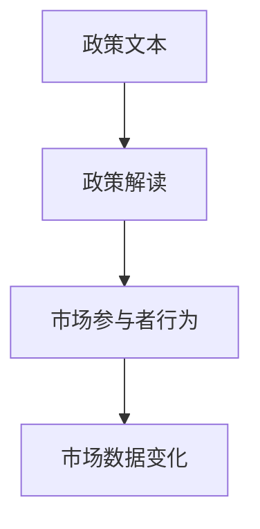
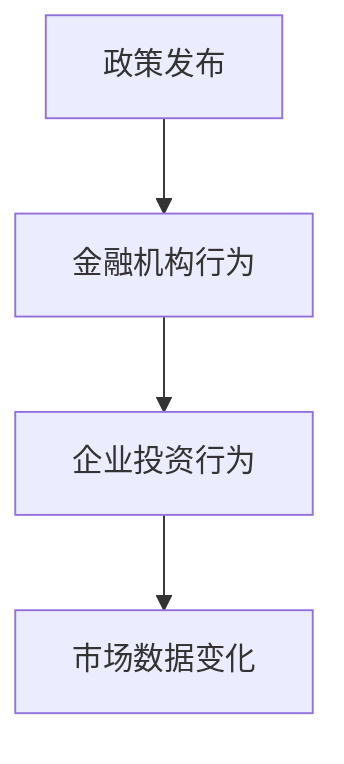
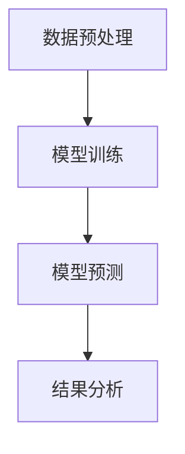
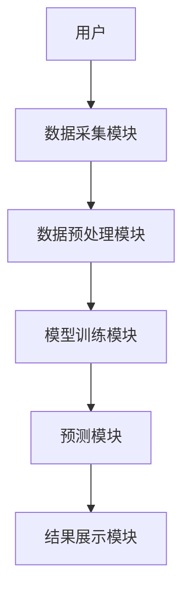

                 


# 构建基于大模型的金融监管政策影响链预测平台

> 关键词：金融监管，大模型，政策影响链，预测平台，系统架构

> 摘要：本文详细介绍了如何利用大模型构建金融监管政策影响链预测平台，从背景与概述、核心概念、算法原理、系统架构到项目实战，逐步深入分析，最终实现一个具备实际应用价值的预测平台。

---

## 第一章：背景与概述

### 1.1 问题背景

#### 1.1.1 金融监管的重要性
金融监管是维护金融市场稳定、保护投资者利益的重要手段。传统的金融监管主要依赖人工分析和简单的统计模型，难以应对日益复杂的金融环境和高频交易的挑战。

#### 1.1.2 政策对金融市场的影响
政策的变化直接影响金融市场的波动。例如，货币政策调整、财政政策变化等都会对股市、债市、汇市产生深远影响。然而，政策的复杂性和多变性使得预测其影响链变得困难。

#### 1.1.3 传统金融监管的局限性
传统的金融监管方法依赖于历史数据分析和专家经验，存在以下问题：
- 数据处理能力有限，难以应对海量数据。
- 预测精度不高，难以捕捉复杂政策的多级影响。
- 可解释性不足，难以向决策者提供清晰的政策效果分析。

### 1.2 问题描述

#### 1.2.1 政策影响链的概念
政策影响链是指政策的实施如何逐步传导至金融市场，影响金融机构、企业和个人的行为，最终作用于经济整体的过程。

#### 1.2.2 政策影响链的核心要素
- 政策内容：包括政策的类型、力度、实施时间等。
- 传导路径：政策如何通过金融机构、市场参与者等逐步影响金融市场。
- 影响结果：政策对金融市场各方面的最终影响，如股价波动、交易量变化等。

#### 1.2.3 平台构建的必要性
为了更准确地预测政策的影响，构建一个基于大模型的政策影响链预测平台至关重要。该平台可以辅助监管机构提前了解政策可能带来的市场反应，优化监管策略。

### 1.3 问题解决

#### 1.3.1 大模型在金融监管中的应用
大模型（如GPT、BERT）具有强大的自然语言处理能力和深度学习能力，可以用于政策文本分析、市场情绪预测等。

#### 1.3.2 基于大模型的政策影响链预测方法
通过大模型分析政策文本，预测政策对金融市场的影响路径和结果。

#### 1.3.3 平台构建的必要性
平台可以整合多方数据，提供实时政策分析和预测服务，帮助监管机构和金融机构做出更明智的决策。

### 1.4 边界与外延

#### 1.4.1 平台的边界
- 数据范围：仅限于政策文本和金融市场数据。
- 功能范围：仅提供政策影响链预测，不涉及实时交易执行。

#### 1.4.2 平台的外延
- 数据来源：可扩展至更多类型的数据，如社交媒体情绪数据。
- 功能扩展：可增加风险评估、投资建议等功能。

#### 1.4.3 平台与其他系统的区别与联系
平台作为金融监管系统的一部分，与交易系统、数据采集系统等其他子系统相互连接，共同构成完整的金融监管体系。

### 1.5 概念结构与核心要素

#### 1.5.1 核心概念组成
| 核心概念 | 定义 | 示例 |
|----------|------|------|
| 政策文本 | 政府发布的政策文件 | 财政刺激计划 |
| 市场数据 | 金融市场相关数据 | 股价、成交量 |
| 影响链 | 政策如何传导至市场 | 从政策发布到企业投资行为变化 |

#### 1.5.2 实体关系图


---

## 第二章：政策影响链预测的核心概念

### 2.1 政策影响链的定义与特点

#### 2.1.1 政策影响链的定义
政策影响链是描述政策如何通过层层传导最终影响金融市场的过程。

#### 2.1.2 政策影响链的特点
- **多级性**：政策影响通常涉及多个中间环节。
- **复杂性**：影响链中涉及多种市场参与者和复杂的市场机制。
- **动态性**：政策影响会随时间推移而变化。

#### 2.1.3 政策影响链的分类
- **直接影响链**：政策直接影响市场参与者。
- **间接影响链**：政策通过其他中介因素影响市场。

### 2.2 大模型在政策影响链中的作用

#### 2.2.1 大模型的文本处理能力
大模型能够理解和分析复杂的政策文本，提取关键信息。

#### 2.2.2 大模型的预测能力
通过大模型可以预测政策对市场的影响路径和结果。

#### 2.2.3 大模型的可解释性
大模型的预测结果可以通过中间层分析，提供可解释的预测依据。

### 2.3 政策影响链预测的实体关系图



---

## 第三章：大模型的算法原理

### 3.1 大模型的训练过程

#### 3.1.1 预训练过程
大模型在大规模通用数据上进行无监督预训练，学习语言的结构和语义。

#### 3.1.2 微调过程
针对特定任务（如政策分析）进行有监督微调，优化模型在任务上的表现。

#### 3.1.3 评估过程
使用验证集评估模型的性能，调整超参数以优化模型效果。

### 3.2 大模型的调优策略

#### 3.2.1 参数调整
通过调整学习率、批量大小等参数，优化模型训练效果。

#### 3.2.2 模型压缩
通过剪枝、量化等技术，减少模型参数数量，降低计算成本。

#### 3.2.3 模型融合
将多个模型的输出结果进行融合，提高预测的准确性和稳定性。

### 3.3 政策影响链预测的算法流程



---

## 第四章：政策影响链预测的数学模型

### 4.1 线性回归模型

#### 4.1.1 模型定义
$$ y = \beta_0 + \beta_1 x_1 + \beta_2 x_2 + ... + \beta_n x_n + \epsilon $$

#### 4.1.2 模型应用
用于预测政策对市场的影响程度。

### 4.2 随机森林模型

#### 4.2.1 模型定义
随机森林是一种基于树的集成学习方法，通过构建多棵决策树进行投票或平均预测。

#### 4.2.2 模型应用
用于分类和回归问题，适合处理高维数据。

### 4.3 LSTM模型

#### 4.3.1 模型定义
$$ h_t = \tanh(W_{hh} h_{t-1} + W_{xh} x_t + b_h) $$
$$ o_t = \sigma(W_{ho} h_t + b_o) $$

#### 4.3.2 模型应用
用于时间序列预测，适合处理政策影响的时序变化。

---

## 第五章：系统分析与架构设计

### 5.1 系统功能设计

#### 5.1.1 数据采集模块
- 采集政策文本和金融市场数据。
- 数据清洗和预处理。

#### 5.1.2 模型训练模块
- 对大模型进行微调和优化。
- 保存训练好的模型。

#### 5.1.3 预测模块
- 接收用户输入的政策文本。
- 输出政策影响链的预测结果。

### 5.2 系统架构设计



### 5.3 系统接口设计

#### 5.3.1 API接口
- 输入：政策文本内容。
- 输出：影响链预测结果。

#### 5.3.2 数据接口
- 输入：金融市场数据。
- 输出：数据清洗后的结果。

---

## 第六章：项目实战

### 6.1 环境安装

#### 6.1.1 安装Python
```bash
python --version
```

#### 6.1.2 安装依赖库
```bash
pip install numpy pandas tensorflow transformers
```

### 6.2 核心代码实现

#### 6.2.1 数据预处理
```python
import pandas as pd
def preprocess_data(data):
    # 数据清洗和预处理
    return processed_data
```

#### 6.2.2 模型训练
```python
import tensorflow as tf
def train_model(model, train_data, epochs=10):
    model.fit(train_data, epochs=epochs)
    return model
```

#### 6.2.3 模型预测
```python
def predict_policy_impact(policy_text, model):
    prediction = model.predict(policy_text)
    return prediction
```

### 6.3 案例分析

#### 6.3.1 政策案例
- 政策文本：降低企业税负政策。
- 预测结果：企业投资增加，股市上涨。

#### 6.3.2 数据分析
- 政策发布后，相关股票的成交量和价格的变化趋势。

### 6.4 项目总结

#### 6.4.1 项目成果
- 成功构建了基于大模型的政策影响链预测平台。
- 提供了准确的政策影响预测服务。

#### 6.4.2 项目经验
- 数据质量和模型调优是影响预测准确性的关键因素。

---

## 第七章：总结与展望

### 7.1 平台的意义
- 提高金融监管的科学性和准确性。
- 为政策制定者提供决策支持。

### 7.2 小结
- 本文详细介绍了构建基于大模型的政策影响链预测平台的全过程。
- 从背景分析到系统实现，逐步深入，最终实现了一个具有实际应用价值的预测平台。

### 7.3 注意事项
- 数据隐私和安全问题需要注意。
- 模型的可解释性和鲁棒性需要进一步优化。

### 7.4 未来展望
- 结合更多的数据源，如社交媒体情绪数据，提高预测精度。
- 开发更复杂的模型，如图神经网络，进一步优化预测效果。

---

作者：AI天才研究院/AI Genius Institute & 禅与计算机程序设计艺术 /Zen And The Art of Computer Programming

