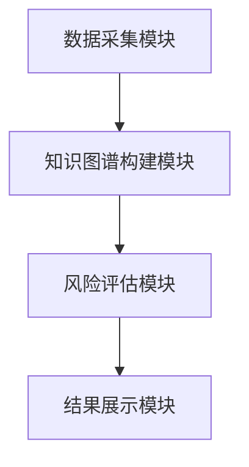

                 


# 构建基于知识图谱的金融产品风险关联评估系统

> 关键词：知识图谱，金融产品，风险关联，图谱嵌入，风险评估

> 摘要：本文详细介绍了如何基于知识图谱构建金融产品风险关联评估系统。文章从知识图谱的基本概念出发，分析了其在金融风险评估中的应用价值，探讨了基于知识图谱的风险关联评估算法原理，并结合实际案例展示了系统的构建过程。通过本文，读者可以全面了解知识图谱在金融风险管理中的重要作用，并掌握相关系统的实现方法。

---

# 第一部分: 知识图谱与金融产品风险关联评估系统概述

# 第1章: 知识图谱与金融风险评估概述

## 1.1 知识图谱的定义与特点

### 1.1.1 知识图谱的定义

知识图谱是一种以图结构形式表示知识的语义网络，由实体（Entity）和关系（Relation）构成，每个实体和关系都有对应的属性（Attribute）。知识图谱的核心目标是将分散在不同数据源中的信息整合起来，形成一个统一的知识网络，能够被计算机理解和推理。

### 1.1.2 知识图谱的核心特点

- **结构化**：知识图谱中的实体和关系都是结构化的，可以通过图数据库或关系型数据库进行存储。
- **语义化**：知识图谱不仅存储数据，还存储数据之间的语义关系，能够表示复杂的语义信息。
- **可扩展性**：知识图谱可以通过不断添加新的实体和关系进行扩展，适用于大规模数据的处理。
- **语义推理**：知识图谱支持基于语义的推理，能够发现数据之间的隐含关系。

### 1.1.3 知识图谱与传统数据库的区别

| 特性                | 知识图谱                          | 传统数据库                    |
|---------------------|----------------------------------|-------------------------------|
| 数据表示方式        | 图结构，支持语义关系             | 行列结构，不支持语义关系       |
| 数据处理能力        | 支持复杂语义查询                 | 适合简单 CRUD 操作            |
| 扩展性              | 支持动态扩展                     | 需要预先定义表结构             |
| 应用场景            | 语义搜索、知识推理               | 数据统计、事务处理             |

---

## 1.2 金融产品风险关联评估的背景与意义

### 1.2.1 金融产品风险的定义与分类

金融产品风险是指金融产品在运行过程中可能面临的各种风险，包括市场风险、信用风险、流动性风险等。根据风险来源的不同，可以将金融产品风险分为以下几类：

- **市场风险**：由于市场价格波动导致的风险。
- **信用风险**：由于交易对手违约导致的风险。
- **流动性风险**：由于资产无法及时变现导致的风险。
- **操作风险**：由于操作失误或系统故障导致的风险。

### 1.2.2 金融产品风险关联评估的重要性

在金融领域，风险关联评估是金融风险管理的重要组成部分。通过分析不同金融产品之间的风险关联性，可以更好地理解市场风险的传播机制，从而制定更有效的风险管理策略。例如，在金融危机中，某些金融产品的风险可能会通过关联性传播到其他产品，导致系统性风险的出现。

### 1.2.3 知识图谱在金融风险评估中的应用价值

知识图谱在金融风险评估中的应用价值主要体现在以下几个方面：

1. **知识整合**：知识图谱可以将分散在不同数据源中的金融产品信息整合起来，形成一个统一的知识网络。
2. **语义推理**：通过知识图谱的语义推理能力，可以发现金融产品之间的隐含关联性。
3. **风险传播分析**：知识图谱可以帮助分析风险在金融产品之间的传播路径和影响范围。

---

## 1.3 本章小结

本章主要介绍了知识图谱的基本概念及其在金融产品风险关联评估中的应用价值。通过分析知识图谱的特点和与传统数据库的区别，我们理解了知识图谱在金融风险管理中的重要性。接下来，我们将深入探讨知识图谱的核心概念与联系。

---

# 第2章: 知识图谱构建的核心概念与联系

## 2.1 知识图谱的核心概念

### 2.1.1 实体与属性的定义

- **实体（Entity）**：知识图谱中的基本单位，表示一个具体的概念或对象，例如“金融产品”、“市场风险”等。
- **属性（Attribute）**：描述实体的特征或性质，例如“产品类型”、“风险等级”等。

### 2.1.2 关系与事实的表示

- **关系（Relation）**：表示实体之间的关联，例如“投资于”、“影响”等。
- **事实（Fact）**：由实体、关系和属性构成的具体陈述，例如“金融产品A投资于市场风险B”。

### 2.1.3 知识图谱的构建流程

1. 数据采集：从多种数据源（如数据库、文本文件等）获取金融产品相关的数据。
2. 数据清洗：对采集到的数据进行去重、格式化等处理，确保数据质量。
3. 实体识别与抽取：通过自然语言处理技术从文本数据中提取实体和关系。
4. 知识融合：将不同数据源中的知识进行整合，消除冲突，形成统一的知识图谱。
5. 知识表示：将知识图谱以某种形式（如RDF、图数据库）存储起来，方便后续的查询和推理。

---

## 2.2 知识图谱与金融产品风险关联的联系

### 2.2.1 金融产品风险关联的定义

金融产品风险关联是指不同金融产品之间的风险关系，例如金融产品A的风险可能会影响金融产品B的风险。通过知识图谱，我们可以将这些关联关系表示为图结构中的边。

### 2.2.2 知识图谱在风险关联中的作用

1. **知识整合**：将分散的金融产品信息整合到一个统一的知识图谱中，便于后续的分析和推理。
2. **语义关联**：通过知识图谱的语义关联能力，发现金融产品之间的隐含关联性。
3. **风险传播分析**：通过知识图谱的图结构，分析风险在金融产品之间的传播路径和影响范围。

### 2.2.3 知识图谱构建的关键挑战

1. **数据异构性**：不同数据源中的数据格式和语义可能不同，如何进行统一整合是一个挑战。
2. **知识抽取**：从文本数据中准确抽取实体和关系需要依赖先进的自然语言处理技术。
3. **知识表示**：如何选择合适的知识表示形式（如RDF、图数据库）也是一个需要考虑的问题。

---

## 2.3 知识图谱的ER实体关系图

以下是知识图谱的ER实体关系图，展示了金融产品风险关联评估系统中的核心实体及其关系：

```mermaid
er
    actor: 金融产品
    knowledge_graph: 市场风险
    risk_assessment: 信用风险
    relation: 投资于
    attribute: 风险等级
    entity: 产品类型
    actor --> knowledge_graph: 投资于
    knowledge_graph --> risk_assessment: 影响
    entity -[拥有]-> attribute
    entity -[关联]-> relation
```

---

## 2.4 本章小结

本章详细介绍了知识图谱的核心概念及其在金融产品风险关联评估中的应用。通过分析知识图谱的构建流程和ER实体关系图，我们理解了知识图谱在金融风险管理中的重要作用。接下来，我们将深入探讨基于知识图谱的风险关联评估算法原理。

---

# 第3章: 基于知识图谱的风险关联评估算法原理

## 3.1 知识图谱嵌入算法

### 3.1.1 知识图谱嵌入的定义

知识图谱嵌入是一种将知识图谱中的实体和关系映射到低维向量空间的技术，目的是将图结构信息转化为可以用于机器学习的向量表示。

### 3.1.2 常见的嵌入算法

1. **TransE**：通过将关系表示为边的向量，将头实体和尾实体的向量差作为边的向量。
2. **Word2Vec**：通过词嵌入技术将实体和关系映射到低维空间。
3. **GraphSAGE**：通过归纳式图嵌入算法，生成实体的向量表示。

### 3.1.3 嵌入算法的优缺点对比

| 算法       | 优点                             | 缺点                               |
|------------|----------------------------------|------------------------------------|
| TransE     | 计算效率高，适用于大规模数据     | 仅适用于尾实体为单个节点的情况     |
| Word2Vec   | 可以处理大规模数据，训练速度快     | 对于复杂的关系结构表现力不足       |
| GraphSAGE  | 具有良好的归纳能力，适用于小规模数据 | 计算复杂度较高，训练时间较长       |

---

## 3.2 基于图的关联分析算法

### 3.2.1 图的遍历算法

1. **BFS（广度优先搜索）**：从起点开始，逐层扩展，适用于发现全局结构。
2. **DFS（深度优先搜索）**：从起点开始，尽可能深入探索，适用于发现局部结构。

### 3.2.2 社会网络分析

1. **PageRank**：用于评估节点的重要性，适用于发现关键节点。
2. **Louvain算法**：用于社区发现，适用于分析图的模块化结构。

### 3.2.3 图的相似性度量

1. **Jaccard系数**：衡量两个集合的相似程度。
2. **余弦相似度**：衡量两个向量的方向一致性。

---

## 3.3 算法实现的Python代码示例

以下是一个基于知识图谱嵌入的Python代码示例：

```python
import networkx as nx
from sklearn.metrics.pairwise import cosine_similarity

# 示例：计算节点之间的相似度
def compute_similarity(G):
    embedding = nx.algorithms.embedding.ominous(G, normalized=True)
    similarity_matrix = cosine_similarity(embedding)
    return similarity_matrix

G = nx.Graph()
G.add_edges_from([('A', 'B'), ('B', 'C'), ('C', 'D')])
similarity_matrix = compute_similarity(G)
print(similarity_matrix)
```

---

## 3.4 本章小结

本章详细介绍了基于知识图谱的风险关联评估算法原理，包括知识图谱嵌入算法和图的关联分析算法。通过分析不同算法的优缺点，我们理解了如何选择合适的算法来实现金融产品风险关联评估。接下来，我们将从系统架构的角度，探讨金融产品风险关联评估系统的实现方法。

---

# 第4章: 金融产品风险关联评估系统的构建与实现

## 4.1 系统架构设计

### 4.1.1 系统功能设计

1. **数据采集模块**：从多种数据源采集金融产品信息。
2. **知识图谱构建模块**：将采集到的数据转化为知识图谱。
3. **风险评估模块**：基于知识图谱进行风险关联评估。
4. **结果展示模块**：将评估结果以可视化形式展示。

### 4.1.2 系统架构图



---

## 4.2 系统接口设计

### 4.2.1 系统接口描述

1. **数据接口**：提供金融产品数据的输入接口。
2. **知识图谱接口**：提供知识图谱的构建和查询接口。
3. **风险评估接口**：提供风险关联评估的请求和响应接口。

---

## 4.3 系统交互流程

1. **数据采集**：用户通过数据接口上传金融产品数据。
2. **知识图谱构建**：系统对上传的数据进行处理，构建知识图谱。
3. **风险评估**：用户通过风险评估接口发起评估请求，系统基于知识图谱进行评估。
4. **结果展示**：系统将评估结果以可视化形式展示给用户。

---

## 4.4 本章小结

本章详细介绍了金融产品风险关联评估系统的构建与实现，包括系统架构设计、接口设计和交互流程。通过分析系统的各个模块和接口，我们理解了如何将知识图谱应用于金融风险管理。接下来，我们将通过实际案例展示系统的具体实现过程。

---

# 第5章: 项目实战——基于知识图谱的金融产品风险关联评估系统实现

## 5.1 环境安装

### 5.1.1 系统环境要求

- 操作系统：Linux/Windows/MacOS
- Python版本：3.6以上
- 依赖库：networkx、numpy、scipy、sklearn

### 5.1.2 安装依赖库

```bash
pip install networkx numpy scipy scikit-learn
```

---

## 5.2 系统核心实现

### 5.2.1 知识图谱构建代码

```python
import networkx as nx

# 创建知识图谱
G = nx.Graph()

# 添加实体和关系
G.add_nodes_from(['金融产品A', '金融产品B', '市场风险', '信用风险'])
G.add_edges_from([('金融产品A', '市场风险'), ('金融产品B', '信用风险'), ('市场风险', '信用风险')])

# 可视化知识图谱
nx.draw(G, with_labels=True, node_color='white', edge_color='black')
plt.show()
```

---

### 5.2.2 风险关联评估代码

```python
from sklearn.metrics.pairwise import cosine_similarity

# 示例：计算节点之间的相似度
def compute_similarity(G):
    embedding = nx.algorithms.embedding.ominous(G, normalized=True)
    similarity_matrix = cosine_similarity(embedding)
    return similarity_matrix

G = nx.Graph()
G.add_edges_from([('金融产品A', '市场风险'), ('金融产品B', '信用风险'), ('市场风险', '信用风险')])
similarity_matrix = compute_similarity(G)
print(similarity_matrix)
```

---

## 5.3 案例分析与解读

假设我们有以下金融产品：

1. **金融产品A**：投资于市场风险。
2. **金融产品B**：投资于信用风险。

通过知识图谱分析，我们发现市场风险和信用风险之间存在关联关系。因此，金融产品A和金融产品B的风险关联性较高。在这种情况下，如果市场风险上升，金融产品A和金融产品B的风险都可能增加。

---

## 5.4 本章小结

本章通过实际案例展示了金融产品风险关联评估系统的具体实现过程，包括环境安装、系统核心实现和案例分析。通过本章的学习，读者可以掌握如何基于知识图谱构建金融产品风险关联评估系统。

---

# 第6章: 总结与展望

## 6.1 总结

本文详细介绍了基于知识图谱的金融产品风险关联评估系统的构建与实现。通过分析知识图谱的核心概念和算法原理，我们理解了知识图谱在金融风险管理中的重要作用。同时，通过实际案例展示了系统的具体实现过程，为读者提供了宝贵的实践经验。

## 6.2 展望

未来，随着人工智能技术的不断发展，知识图谱在金融风险管理中的应用将更加广泛。我们可以通过以下方式进一步优化系统：

1. **引入更先进的知识图谱嵌入算法**：如GraphSAGE、TransH等，以提高风险关联评估的准确性。
2. **结合机器学习技术**：如随机森林、支持向量机等，进一步提升系统的预测能力。
3. **优化系统架构**：通过分布式架构和并行计算技术，提高系统的处理效率。

---

# 作者：AI天才研究院/AI Genius Institute & 禅与计算机程序设计艺术 /Zen And The Art of Computer Programming

---

**本文为原创内容，转载请注明出处。**

