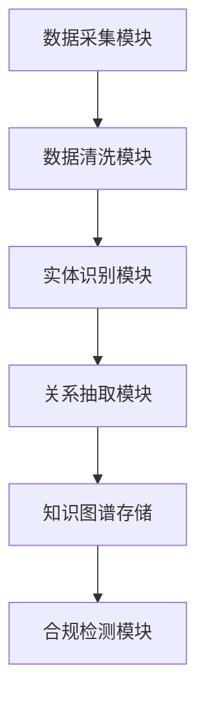
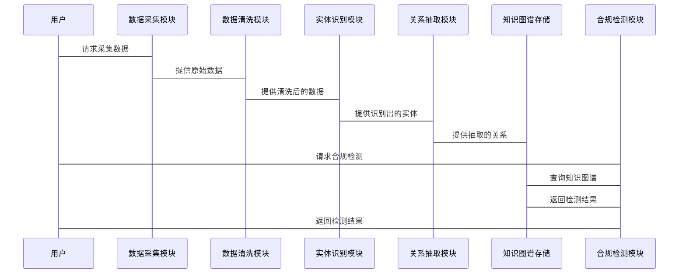

                 


# 构建基于知识图谱的金融监管合规追踪系统

## 关键词：知识图谱，金融监管，合规追踪，系统架构，算法原理，项目实战

## 摘要：本文章详细探讨了如何利用知识图谱构建金融监管合规追踪系统。文章从背景与概述出发，分析了金融监管的挑战与知识图谱的优势，随后深入讲解了知识图谱的核心概念、构建方法以及在金融监管中的应用。接着，文章详细阐述了系统的算法原理，包括图嵌入、规则推理和相似度计算等。通过系统分析与架构设计，展示了系统的功能模块与交互流程。最后，通过项目实战部分，提供了系统的具体实现步骤与实际案例分析，总结了系统的应用价值与未来发展方向。

---

## 第1章: 知识图谱与金融监管概述

### 1.1 知识图谱的定义与特点

#### 1.1.1 知识图谱的定义
知识图谱是一种以图结构形式表示知识的数据模型，节点表示实体或概念，边表示实体之间的关系。

#### 1.1.2 知识图谱的核心特点
- **结构化**：通过节点和边的结构化表示，能够清晰地展示实体间的关系。
- **可扩展性**：支持动态扩展，能够实时更新和添加新的实体与关系。
- **语义丰富性**：通过丰富的语义信息，能够实现复杂的推理与关联分析。

#### 1.1.3 知识图谱与传统数据库的区别
| 特性             | 传统数据库      | 知识图谱         |
|------------------|----------------|-----------------|
| 数据结构         | 行数据         | 图结构           |
| 查询效率         | 高             | 较低            |
| 关系表示         | 有限           | 丰富且灵活       |
| 可扩展性         | 有限           | 高              |

### 1.2 金融监管的背景与挑战

#### 1.2.1 金融监管的定义与目标
金融监管是指通过法律法规和制度对金融市场进行监督和管理，以确保市场的公平性、透明性和稳定性。

#### 1.2.2 传统金融监管的痛点与不足
- **数据孤岛**：不同机构之间的数据难以整合，导致监管效率低下。
- **信息滞后**：传统监管手段依赖人工操作，信息更新不及时。
- **复杂性高**：金融市场涉及众多主体和复杂的交易关系，监管难度大。

#### 1.2.3 金融监管中的合规追踪需求
合规追踪是金融监管的核心任务之一，主要涉及对金融机构的业务行为是否符合相关法律法规的检查。

### 1.3 知识图谱在金融监管中的应用

#### 1.3.1 知识图谱在金融监管中的优势
- **数据整合能力强**：能够将分散在不同机构的异构数据整合到统一的知识图谱中。
- **关系推理能力强**：通过图结构可以发现隐藏的关联关系，辅助监管决策。
- **实时更新能力**：支持动态更新，能够实时反映金融市场变化。

#### 1.3.2 知识图谱在合规追踪中的作用
- **关联分析**：通过图结构分析金融机构之间的关联，识别潜在的违规行为。
- **风险预警**：基于知识图谱的推理能力，提前发现潜在的金融风险。
- **数据可视化**：通过知识图谱的可视化，帮助监管人员更直观地理解市场结构。

#### 1.3.3 知识图谱与金融监管的结合场景
- **关联交易识别**：识别同一实际控制人控制的多家公司之间的关联交易。
- **风险传导分析**：分析某金融机构的风险事件对其他机构的影响。
- **合规性检查**：通过知识图谱推理，检查金融机构是否符合相关法规要求。

---

## 第2章: 金融监管合规追踪系统的背景与目标

### 2.1 问题背景

#### 2.1.1 金融市场的复杂性与监管难度
金融市场涉及众多金融机构、投资者、交易行为等复杂因素，监管难度大。

#### 2.1.2 合规追踪的必要性
合规追踪是确保金融机构行为合法合规的重要手段，能够有效防范金融风险。

#### 2.1.3 知识图谱在合规追踪中的应用价值
知识图谱能够通过关联分析和关系推理，帮助监管机构快速发现潜在的合规问题。

### 2.2 问题描述

#### 2.2.1 合规追踪的核心问题
如何高效、准确地识别金融机构的违规行为，并实现及时预警。

#### 2.2.2 知识图谱如何解决合规追踪问题
通过构建金融领域的知识图谱，利用关联分析和关系推理技术，快速发现潜在的违规行为。

#### 2.2.3 系统的目标与边界
- **目标**：构建一个基于知识图谱的金融监管合规追踪系统，实现金融机构行为的实时监控和合规性检查。
- **边界**：仅关注金融机构的合规性问题，不涉及具体的交易行为监控。

### 2.3 系统的核心要素

#### 2.3.1 知识图谱构建的核心要素
- **数据来源**：金融机构的公开信息、监管数据等。
- **实体识别**：识别金融机构、投资者、交易行为等实体。
- **关系抽取**：抽取实体之间的关系，如“控制”、“关联交易”等。

#### 2.3.2 系统功能的核心模块
- **数据采集**：从多种数据源采集相关数据。
- **知识构建**：构建金融领域的知识图谱。
- **合规检测**：基于知识图谱进行合规性检查。

#### 2.3.3 系统性能的核心指标
- **构建效率**：知识图谱的构建速度。
- **查询效率**：基于知识图谱的查询速度。
- **准确率**：合规检测的准确率。

---

## 第3章: 知识图谱构建的核心原理

### 3.1 知识图谱的构建方法

#### 3.1.1 数据预处理
- **数据清洗**：去除重复数据、噪声数据等。
- **数据标准化**：将数据转换为统一的格式。

#### 3.1.2 实体识别与抽取
- **实体识别**：通过自然语言处理技术识别文本中的实体。
- **实体链接**：将识别出的实体映射到知识图谱中的节点。

#### 3.1.3 关系抽取与构建
- **关系抽取**：识别文本中的关系信息。
- **关系构建**：将关系信息添加到知识图谱中。

### 3.2 知识图谱的数据建模

#### 3.2.1 实体与关系的定义
- **实体**：金融机构、投资者、交易行为等。
- **关系**：控制、关联交易、投资关系等。

#### 3.2.2 知识图谱的存储与检索
- **存储**：使用图数据库（如Neo4j）存储知识图谱。
- **检索**：通过查询语言（如Cypher）进行图查询。

### 3.3 知识图谱的表示与推理

#### 3.3.1 实体表示的向量化
- **向量表示**：将实体表示为向量，用于后续的相似度计算。
- **向量空间模型**：通过向量空间模型表示实体间的语义关系。

#### 3.3.2 知识图谱的推理方法
- **规则推理**：基于预定义的规则进行推理。
- **图嵌入**：通过图嵌入技术将实体和关系表示为低维向量。
- **注意力机制**：在图嵌入中引入注意力机制，提高推理效果。

#### 3.3.3 知识图谱的动态更新
- **实时更新**：根据最新的数据动态更新知识图谱。
- **版本控制**：记录知识图谱的修改历史，方便回溯。

---

## 第4章: 金融监管中的知识图谱应用

### 4.1 金融监管中的实体与关系

#### 4.1.1 实体类型定义
- **金融机构**：银行、证券公司、保险公司等。
- **投资者**：个人投资者、机构投资者等。
- **交易行为**：股票交易、债券交易等。

#### 4.1.2 关系类型定义
- **控制关系**：A公司控制B公司。
- **关联关系**：A公司与B公司存在关联交易。
- **投资关系**：A投资者投资于B公司。

#### 4.1.3 金融监管知识图谱的构建流程
1. 数据采集：从公开数据源采集金融机构的公开信息。
2. 数据清洗：去除重复数据和噪声数据。
3. 实体识别：识别文本中的实体。
4. 关系抽取：抽取实体之间的关系。
5. 知识构建：将实体和关系存储到知识图谱中。

### 4.2 知识图谱在合规追踪中的应用

#### 4.2.1 关联交易识别
- **场景**：识别同一实际控制人控制的多家公司之间的关联交易。
- **方法**：通过知识图谱分析公司之间的控制关系。

#### 4.2.2 风险预警
- **场景**：某金融机构发生风险事件，可能影响其他机构。
- **方法**：通过知识图谱分析风险传导路径。

#### 4.2.3 合规性检查
- **场景**：检查金融机构是否符合相关法规要求。
- **方法**：通过知识图谱推理金融机构之间的关系，发现潜在的违规行为。

### 4.3 系统功能模块

#### 4.3.1 数据采集模块
- **功能**：从多种数据源采集数据。
- **实现**：使用爬虫技术从公开数据源采集数据。

#### 4.3.2 知识构建模块
- **功能**：构建金融领域的知识图谱。
- **实现**：使用图数据库和自然语言处理技术。

#### 4.3.3 合规检测模块
- **功能**：基于知识图谱进行合规性检查。
- **实现**：使用图嵌入和规则推理技术。

---

## 第5章: 系统分析与架构设计

### 5.1 系统应用场景

#### 5.1.1 场景一：关联交易识别
- **目标**：识别同一实际控制人控制的多家公司之间的关联交易。
- **实现**：通过知识图谱分析公司之间的控制关系。

#### 5.1.2 场景二：风险预警
- **目标**：及时发现金融机构的风险事件，并进行预警。
- **实现**：通过知识图谱分析风险传导路径。

### 5.2 系统功能设计

#### 5.2.1 数据采集模块
- **功能**：从多种数据源采集数据。
- **接口**：提供API接口，接收外部数据。

#### 5.2.2 知识构建模块
- **功能**：构建金融领域的知识图谱。
- **接口**：提供数据清洗、实体识别、关系抽取等功能。

#### 5.2.3 合规检测模块
- **功能**：基于知识图谱进行合规性检查。
- **接口**：提供合规检测接口，返回检测结果。

### 5.3 系统架构设计

#### 5.3.1 系统架构分层
- **数据层**：存储知识图谱数据。
- **服务层**：提供数据处理和知识构建服务。
- **应用层**：提供用户界面和API接口。

#### 5.3.2 系统架构图


#### 5.3.3 系统交互序列图


---

## 第6章: 项目实战

### 6.1 环境安装

#### 6.1.1 环境配置
- **操作系统**：Linux/Windows/MacOS
- **Python版本**：3.6+
- **依赖库安装**：
  - `pip install neo4j`
  - `pip install networkx`
  - `pip install spacy`

#### 6.1.2 数据源
- **数据来源**：公开的金融数据，如公司基本信息、股东信息等。

### 6.2 系统核心实现

#### 6.2.1 数据采集模块
```python
import requests
from bs4 import BeautifulSoup

def fetch_data(url):
    response = requests.get(url)
    soup = BeautifulSoup(response.text, 'html.parser')
    # 提取数据
    data = []
    for item in soup.find_all('div', class_='data-item'):
        company_name = item.find('h2').text
        data.append(company_name)
    return data
```

#### 6.2.2 知识构建模块
```python
from neo4j import GraphDatabase
from neo4j.exceptions import ServiceUnavailable

def create_graph(neo4j_uri, neo4j_user, neo4j_password):
    try:
        driver = GraphDatabase.driver(neo4j_uri, auth=(neo4j_user, neo4j_password))
        with driver.session() as session:
            session.run("CREATE (a:Company {name: 'Company A'})")
            session.run("CREATE (b:Company {name: 'Company B'})")
            session.run("CREATE (a)-[:CONTROLS]->(b)")
        driver.close()
    except ServiceUnavailable as e:
        print(e)
```

#### 6.2.3 合规检测模块
```python
def detect_compliance(neo4j_uri, neo4j_user, neo4j_password):
    driver = GraphDatabase.driver(neo4j_uri, auth=(neo4j_user, neo4j_password))
    with driver.session() as session:
        result = session.run("MATCH (a:Company)-[r]->(b:Company) RETURN a.name, r.type, b.name")
        for record in result:
            print(f"{record['a.name']} {record['r.type']} {record['b.name']}")
    driver.close()
```

### 6.3 实际案例分析

#### 6.3.1 案例一：关联交易识别
- **数据**：Company A 控制 Company B 和 Company C。
- **分析**：通过知识图谱发现Company A与Company B、C之间的控制关系。

#### 6.3.2 案例二：风险预警
- **数据**：Company A 发生重大风险事件。
- **分析**：通过知识图谱分析风险传导路径，发现受波及的其他公司。

### 6.4 项目小结

#### 6.4.1 知识图谱构建的挑战
- **数据质量**：数据清洗和预处理的难度较大。
- **计算效率**：大规模数据的处理需要高效的算法和优化的数据库支持。

#### 6.4.2 系统优化建议
- **算法优化**：进一步优化图嵌入算法，提高计算效率。
- **数据源扩展**：引入更多数据源，丰富知识图谱的内容。

---

## 第7章: 总结与展望

### 7.1 系统总结

#### 7.1.1 核心价值
- 提高金融监管的效率和准确性。
- 实现金融机构行为的实时监控和合规性检查。

#### 7.1.2 系统特点
- 基于知识图谱的关联分析能力，能够发现隐藏的关联关系。
- 支持动态更新，能够实时反映金融市场变化。

### 7.2 未来展望

#### 7.2.1 技术优化
- **算法优化**：进一步优化图嵌入算法，提高计算效率。
- **数据源扩展**：引入更多数据源，丰富知识图谱的内容。

#### 7.2.2 应用场景拓展
- **风险评估**：利用知识图谱进行风险评估和预警。
- **智能监管**：结合人工智能技术，实现智能监管。

### 7.3 最佳实践 Tips

#### 7.3.1 数据质量的重要性
- 数据清洗和预处理是知识图谱构建的关键步骤，直接影响系统的准确率。

#### 7.3.2 系统性能的优化
- 通过优化数据库查询和算法实现，提高系统的运行效率。

#### 7.3.3 代码规范
- 保持代码的可读性和可维护性，遵循编程规范。

---

## 作者：AI天才研究院/AI Genius Institute & 禅与计算机程序设计艺术 /Zen And The Art of Computer Programming

