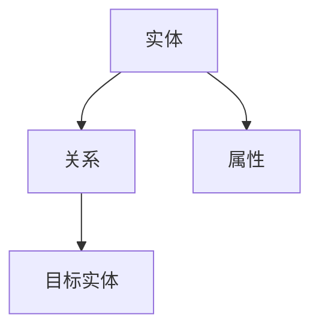
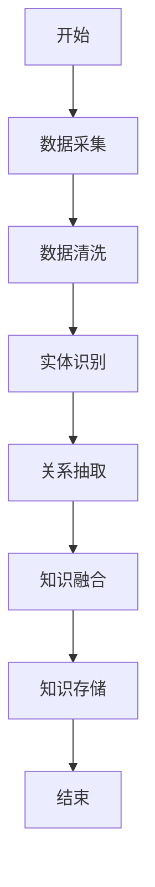
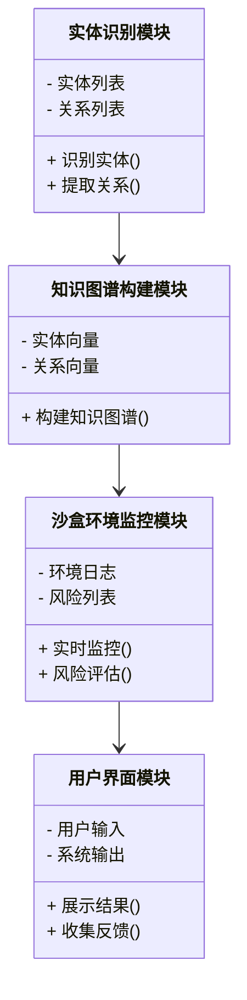
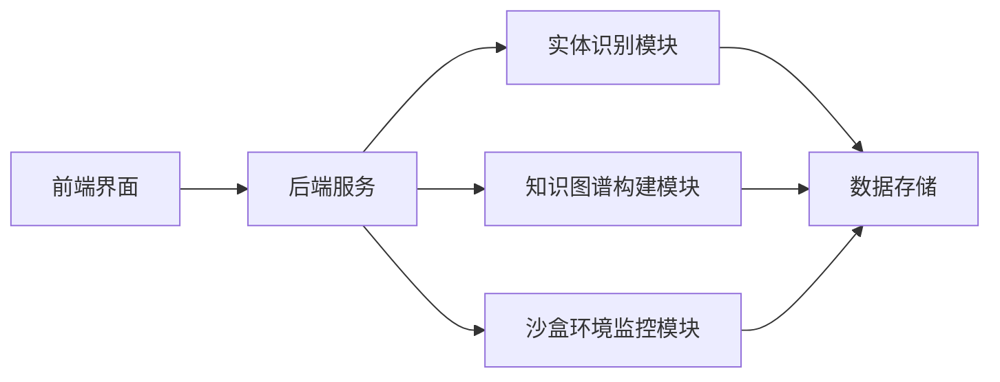
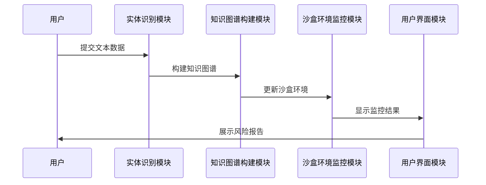

                 


# 构建基于知识图谱的金融监管沙盒测试平台

> 关键词：知识图谱，金融监管，沙盒测试，实体识别，关系抽取，系统架构

> 摘要：本文详细介绍了如何基于知识图谱构建金融监管沙盒测试平台。首先从知识图谱和金融监管沙盒的基本概念出发，分析了它们的定义、特点和应用场景。然后，探讨了知识图谱在金融监管沙盒中的具体应用，包括实体识别、关系抽取和知识图谱构建算法。接着，详细讲解了系统的架构设计，包括功能模块划分、系统架构图和接口设计。最后，通过实际案例展示了如何搭建环境并实现核心功能，总结了项目经验和最佳实践。

---

# 第1章 知识图谱与金融监管沙盒的背景介绍

## 1.1 知识图谱的定义与特点

### 1.1.1 知识图谱的定义
知识图谱是一种以图结构形式表示知识的语义网络，由节点（实体）和边（关系）组成，能够描述实体之间的语义关系。知识图谱的核心目标是将分散的、异构的数据源整合到一个统一的知识网络中，从而实现对海量数据的语义理解和关联分析。

### 1.1.2 知识图谱的核心特点
1. **语义性**：知识图谱不仅包含数据的结构化信息，还包含实体之间的语义关系。
2. **可扩展性**：知识图谱可以通过不断添加新的实体和关系进行扩展。
3. **分布式表示**：实体和关系可以表示为向量形式，便于计算和推理。

### 1.1.3 知识图谱与传统数据库的区别
| 特性         | 知识图谱               | 传统数据库         |
|--------------|-----------------------|--------------------|
| 数据结构     | 图结构（节点和边）     | 行列式结构         |
| 数据复杂度   | 高（语义关联）         | 低（结构化数据）    |
| 查询能力     | 支持语义查询           | 支持结构化查询      |

---

## 1.2 金融监管沙盒的概念与作用

### 1.2.1 金融监管沙盒的定义
金融监管沙盒是一种在受控环境中测试和验证金融创新产品、服务或流程的安全机制。它通过隔离测试环境，降低创新可能带来的风险，同时确保金融系统的稳定性和合规性。

### 1.2.2 金融监管沙盒的核心作用
1. **风险隔离**：通过沙盒环境，将创新产品与实际金融系统隔离，防止风险外溢。
2. **快速验证**：在沙盒环境中快速测试和验证创新产品，缩短产品上线周期。
3. **合规监控**：通过沙盒环境监控创新产品的合规性，确保其符合监管要求。

### 1.2.3 金融监管沙盒的实施流程
1. **申请与审批**：金融机构提出申请，监管机构审批通过后进入沙盒环境。
2. **环境搭建**：搭建受控的沙盒环境，确保与实际金融系统隔离。
3. **测试与验证**：在沙盒环境中测试创新产品，收集数据和反馈。
4. **合规评估**：评估创新产品的合规性，确保符合监管要求。
5. **结果输出**：根据测试结果，决定是否允许创新产品进入实际金融系统。

---

## 1.3 知识图谱在金融监管中的应用

### 1.3.1 知识图谱在金融监管中的优势
1. **语义关联**：知识图谱能够发现实体之间的语义关联，帮助监管机构识别潜在风险。
2. **数据整合**：知识图谱可以整合多源异构数据，形成统一的知识网络。
3. **智能推理**：基于知识图谱的推理能力，可以实现智能风险预警和决策支持。

### 1.3.2 知识图谱在金融监管中的应用场景
1. **风险识别**：通过知识图谱发现关联风险，提前预警潜在问题。
2. **合规监控**：利用知识图谱监控金融机构的合规性，确保符合监管要求。
3. **智能决策**：基于知识图谱的语义理解能力，辅助监管机构做出智能决策。

### 1.3.3 知识图谱与金融监管沙盒的结合
知识图谱可以为金融监管沙盒提供语义理解和支持，帮助监管机构在沙盒环境中更好地识别和管理风险。

---

## 1.4 本章小结

本章介绍了知识图谱和金融监管沙盒的基本概念、特点和应用场景，分析了知识图谱在金融监管中的优势及其与沙盒环境的结合方式，为后续内容奠定了基础。

---

# 第2章 知识图谱与金融监管沙盒的核心概念与联系

## 2.1 知识图谱的核心概念

### 2.1.1 实体与关系
- **实体**：知识图谱中的基本单元，可以是人、组织、事件等。
- **关系**：描述实体之间的关联，如“人A是公司B的CEO”。

### 2.1.2 属性与节点
- **属性**：描述实体的特征，如“公司B的注册资本为100万元”。
- **节点**：表示实体或概念的图中节点。

### 2.1.3 知识图谱的构建流程
1. **数据采集**：从多种数据源采集结构化和非结构化数据。
2. **数据清洗**：对数据进行清洗和预处理，去除噪声数据。
3. **实体识别**：识别文本中的实体并进行标注。
4. **关系抽取**：从文本中抽取实体之间的关系。
5. **知识融合**：将多个数据源中的知识进行整合，消除冗余和冲突。
6. **知识存储**：将知识图谱存储在图数据库中，如Neo4j。

---

## 2.2 金融监管沙盒的核心概念

### 2.2.1 沙盒环境的定义
沙盒环境是一个隔离的测试环境，用于测试和验证创新产品或服务，确保其在实际金融系统中不会引发风险。

### 2.2.2 沙盒环境的隔离机制
- **网络隔离**：通过网络防火墙和虚拟专用网络（VPN）实现沙盒环境与实际金融系统的隔离。
- **数据隔离**：在沙盒环境中使用虚拟机或容器技术实现数据隔离。

### 2.2.3 沙盒环境的监控与分析
- **实时监控**：通过日志监控和流量分析，实时监控沙盒环境中的活动。
- **风险评估**：根据监控数据，评估创新产品的风险，并提出改进建议。

---

## 2.3 知识图谱与金融监管沙盒的联系

### 2.3.1 知识图谱在沙盒环境中的应用
- **风险识别**：通过知识图谱发现沙盒环境中潜在的风险点。
- **合规监控**：利用知识图谱监控沙盒环境中的金融机构行为，确保其符合监管要求。

### 2.3.2 知识图谱与沙盒环境的交互
- **数据输入**：沙盒环境中的数据输入知识图谱进行语义理解和关联分析。
- **结果输出**：知识图谱的分析结果反馈到沙盒环境，指导风险管理和合规监控。

### 2.3.3 知识图谱对沙盒环境的优化作用
- **智能风险预警**：基于知识图谱的推理能力，实现智能风险预警。
- **优化测试流程**：通过知识图谱的语义理解能力，优化沙盒环境中的测试流程。

---

## 2.4 核心概念对比与ER实体关系图

### 2.4.1 核心概念属性特征对比表
| 特性         | 知识图谱               | 金融监管沙盒         |
|--------------|-----------------------|----------------------|
| 核心要素     | 实体、关系、属性       | 环境、隔离、监控      |
| 功能         | 语义理解、关联分析     | 风险隔离、合规监控   |
| 应用场景     | 金融风险识别、智能决策 | 金融创新测试、合规验证 |

### 2.4.2 ER实体关系图的Mermaid流程图


---

## 2.5 本章小结

本章详细分析了知识图谱和金融监管沙盒的核心概念，并通过对比和ER实体关系图展示了它们之间的联系，为后续的知识图谱构建和系统设计奠定了基础。

---

# 第3章 知识图谱构建算法原理

## 3.1 实体识别与抽取算法

### 3.1.1 基于规则的实体识别
- **规则定义**：根据预定义的规则匹配文本中的实体。
- **优点**：简单易实现，适用于特定领域。
- **缺点**：需要手动编写规则，扩展性差。

### 3.1.2 基于统计的实体识别
- **统计模型**：利用统计学方法（如HMM）进行实体识别。
- **优点**：能够处理大规模数据，适应性强。
- **缺点**：需要大量标注数据，计算复杂度高。

### 3.1.3 基于深度学习的实体识别
- **深度学习模型**：如LSTM、BERT等。
- **优点**：性能高，能够处理复杂语义。
- **缺点**：需要大量标注数据，计算资源消耗大。

---

## 3.2 关系抽取算法

### 3.2.1 基于规则的关系抽取
- **规则定义**：根据预定义的规则匹配文本中的关系。
- **优点**：简单易实现，适用于特定领域。
- **缺点**：需要手动编写规则，扩展性差。

### 3.2.2 基于统计的关系抽取
- **统计模型**：利用统计学方法（如CRF）进行关系抽取。
- **优点**：能够处理大规模数据，适应性强。
- **缺点**：需要大量标注数据，计算复杂度高。

### 3.2.3 基于深度学习的关系抽取
- **深度学习模型**：如LSTM、BERT等。
- **优点**：性能高，能够处理复杂语义。
- **缺点**：需要大量标注数据，计算资源消耗大。

---

## 3.3 知识图谱构建的数学模型

### 3.3.1 实体表示的向量空间模型
- **向量表示**：将实体表示为向量，计算实体之间的相似度。
- **公式**：$$ sim(e_i, e_j) = \frac{e_i \cdot e_j}{\|e_i\| \|e_j\|} $$

### 3.3.2 关系表示的图结构模型
- **图结构表示**：通过图结构表示实体之间的关系，计算最短路径。
- **公式**：$$ shortest\_path(e_i, e_j) = \sum_{k=1}^{n} w_k $$

### 3.3.3 知识图谱的构建公式
$$ E = \{ (e_i, r_j, e_k) | e_i, e_k \in Entities, r_j \in Relations \} $$

---

## 3.4 算法流程图



---

## 3.5 本章小结

本章详细介绍了知识图谱构建的核心算法，包括实体识别、关系抽取和知识融合的数学模型，并通过流程图展示了知识图谱的构建过程。

---

# 第4章 系统分析与架构设计

## 4.1 问题场景介绍

### 4.1.1 系统目标
- 实现基于知识图谱的金融监管沙盒测试平台。
- 提供风险识别、合规监控和智能决策功能。

### 4.1.2 系统需求
- 实体识别与关系抽取功能。
- 知识图谱构建与存储功能。
- 沙盒环境搭建与监控功能。

---

## 4.2 项目介绍

### 4.2.1 项目背景
- 随着金融创新的快速发展，监管需求日益复杂。
- 知识图谱技术能够为金融监管提供语义理解和关联分析支持。

### 4.2.2 项目目标
- 构建基于知识图谱的金融监管沙盒测试平台。
- 提供风险识别、合规监控和智能决策功能。

---

## 4.3 系统功能设计

### 4.3.1 领域模型Mermaid类图


---

## 4.4 系统架构设计

### 4.4.1 系统架构图


### 4.4.2 接口设计
- **实体识别接口**：提供实体识别和关系抽取功能。
- **知识图谱构建接口**：提供知识图谱构建和存储功能。
- **沙盒环境监控接口**：提供实时监控和风险评估功能。

### 4.4.3 系统交互序列图


---

## 4.5 本章小结

本章通过系统分析和架构设计，明确了基于知识图谱的金融监管沙盒测试平台的功能模块和系统架构，为后续的系统实现提供了理论基础。

---

# 第5章 项目实战

## 5.1 环境搭建

### 5.1.1 开发环境
- **操作系统**：Linux/Windows/MacOS
- **编程语言**：Python 3.8+
- **框架与工具**：
  - **知识图谱构建工具**：spaCy、NLTK、HanLP
  - **图数据库**：Neo4j
  - **深度学习框架**：TensorFlow、PyTorch

### 5.1.2 安装依赖
```bash
pip install spacy neo4j tensorflow
python -m spacy download en_core_web_sm
```

---

## 5.2 系统核心实现

### 5.2.1 实体识别模块实现
```python
import spacy

nlp = spacy.load("en_core_web_sm")

def extract_entities(text):
    doc = nlp(text)
    entities = []
    for ent in doc.ents:
        entities.append((ent.text, ent.label_))
    return entities
```

### 5.2.2 关系抽取模块实现
```python
from tensorflow.keras import models, layers

# 定义关系抽取模型
def relation_extractor():
    model = models.Sequential()
    model.add(layers.Embedding(input_dim=1000, output_dim=50))
    model.add(layers.LSTM(32))
    model.add(layers.Dense(2, activation='softmax'))
    model.compile(loss='sparse_categorical_crossentropy', optimizer='adam', metrics=['accuracy'])
    return model
```

### 5.2.3 知识图谱构建模块实现
```python
from neo4j import GraphDatabase

def create_knowledge_graph(neo4j_uri, entities, relations):
    driver = GraphDatabase.driver(neo4j_uri, auth=None)
    session = driver.session()
    # 创建实体节点
    for entity in entities:
        session.run("CREATE (e:{ EntityType } {{ name: '{0}' }})", entity[0])
    # 创建关系边
    for relation in relations:
        session.run("MATCH (a {{ name: '{0}' }}), (b {{ name: '{1}' }}) CREATE (a)-[r:{ RelationType } {{ type: '{2}' }}]->(b)", relation[0], relation[1], relation[2])
    session.close()
    driver.close()
```

### 5.2.4 沙盒环境监控模块实现
```python
import logging

class SandBoxMonitor:
    def __init__(self, sandbox_env):
        self.sandbox_env = sandbox_env
        self.logger = logging.getLogger(__name__)
        self.logger.setLevel(logging.INFO)
        handler = logging.StreamHandler()
        handler.setFormatter(logging.Formatter('%(asctime)s - %(levelname)s - %(message)s'))
        self.logger.addHandler(handler)

    def monitor(self):
        while True:
            try:
                # 获取环境日志
                log = self.sandbox_env.get_log()
                self.logger.info(log)
                # 分析风险
                risk = self.sandbox_env.analyze_risk(log)
                if risk > 0.5:
                    self.logger.warning("High risk detected!")
                    self.sandbox_env.take_action()
            except Exception as e:
                self.logger.error(f"Monitor error: {e}")
            finally:
                time.sleep(60)
```

---

## 5.3 实际案例分析

### 5.3.1 案例背景
假设我们有一个金融监管沙盒测试平台，需要测试一个创新型金融产品。

### 5.3.2 数据准备
- **文本数据**：产品说明书、监管法规。
- **结构化数据**：产品参数、历史数据。

### 5.3.3 系统实现
1. **实体识别**：识别产品说明书中的实体，如“产品名称”、“产品类型”。
2. **关系抽取**：抽取实体之间的关系，如“产品A由公司B开发”。
3. **知识图谱构建**：将实体和关系存储到图数据库中。
4. **沙盒环境搭建**：搭建受控的测试环境，部署创新产品。
5. **环境监控**：实时监控沙盒环境中的活动，识别潜在风险。

### 5.3.4 结果分析
- **风险识别**：通过知识图谱发现潜在风险，如“产品A的收益率与实际不符”。
- **合规监控**：监控创新产品的合规性，确保符合监管要求。
- **智能决策**：基于知识图谱的分析结果，辅助监管机构做出智能决策。

---

## 5.4 项目小结

本章通过实际案例展示了如何搭建基于知识图谱的金融监管沙盒测试平台，并详细讲解了系统的实现过程，为读者提供了实践指导。

---

# 第6章 总结与展望

## 6.1 项目总结

### 6.1.1 核心成果
- 成功构建了基于知识图谱的金融监管沙盒测试平台。
- 实现了实体识别、关系抽取和知识图谱构建的核心功能。
- 提供了风险识别、合规监控和智能决策的系统支持。

### 6.1.2 经验总结
- 知识图谱构建需要大量标注数据和深度学习模型的支持。
- 金融监管沙盒测试需要实时监控和智能分析能力。

---

## 6.2 项目展望

### 6.2.1 知识图谱的优化
- 引入更多数据源，丰富知识图谱的内容。
- 提升实体识别和关系抽取的准确率。

### 6.2.2 沙盒环境的扩展
- 支持更多金融机构和金融产品的测试。
- 提供更加智能化的监控和分析能力。

### 6.2.3 系统的集成与应用
- 将知识图谱技术应用于更多的金融监管场景。
- 推动金融监管沙盒测试平台的普及和应用。

---

## 6.3 注意事项

### 6.3.1 数据隐私与安全
- 在构建知识图谱时，需要注意数据隐私和安全问题。
- 确保数据的合法性和合规性。

### 6.3.2 系统稳定性与可用性
- 确保系统的稳定性和可用性，特别是在金融监管环境中。
- 定期进行系统维护和升级。

---

## 6.4 拓展阅读

### 6.4.1 推荐书籍
- 《知识图谱：概念、方法与应用》
- 《金融监管：理论与实践》

### 6.4.2 推荐博客与资源
- [知识图谱构建工具](https://www.neopixel.com/)
- [金融监管沙盒测试平台](https://www.sandbox-test.com/)

---

## 6.5 本章小结

本章总结了项目的成果和经验，展望了知识图谱和金融监管沙盒测试平台的未来发展，并提供了相关的注意事项和拓展资源。

---

# 作者：AI天才研究院/AI Genius Institute & 禅与计算机程序设计艺术 /Zen And The Art of Computer Programming

---

感谢您的阅读！如需进一步了解或参与讨论，请随时联系！

