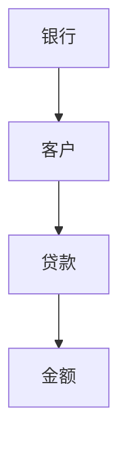
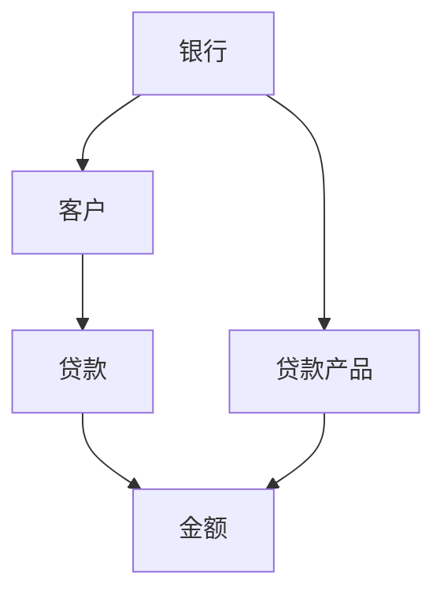
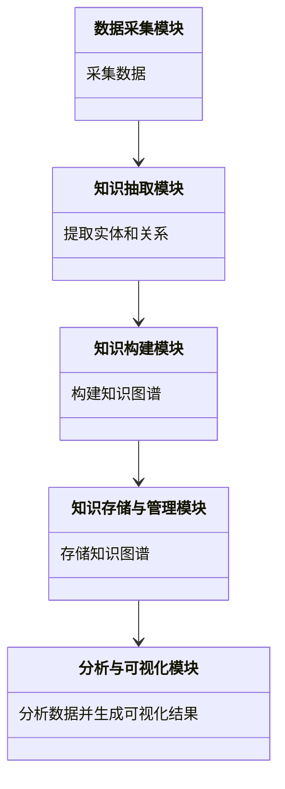
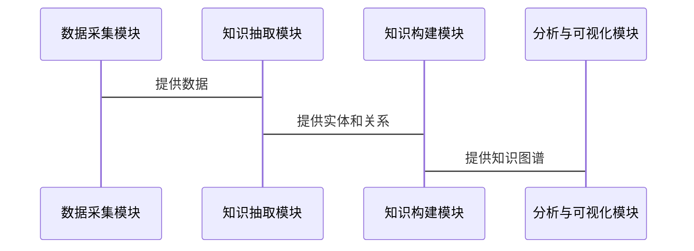

                 


# 构建基于知识图谱的金融监管沙盒测试结果分析平台

> 关键词：金融监管沙盒、知识图谱、测试结果分析、数据可视化、人工智能技术、自然语言处理、机器学习

> 摘要：本文详细探讨了如何利用知识图谱技术构建金融监管沙盒测试结果分析平台。文章首先介绍了金融监管沙盒的背景与意义，分析了知识图谱的核心概念与特点。接着，深入阐述了知识图谱的构建算法原理，包括实体识别、关系抽取及数学模型的构建。然后，详细设计了系统的架构，包括数据采集、知识抽取、知识构建、存储与分析、可视化等模块。最后，通过实际项目案例展示了平台的实现过程，并提出了最佳实践建议。本文旨在为金融监管领域提供一种高效、智能的测试结果分析方法，助力监管机构提升风险识别与应对能力。

---

## 第一部分: 金融监管沙盒与知识图谱概述

### 第1章: 金融监管沙盒的背景与意义

#### 1.1 什么是金融监管沙盒
##### 1.1.1 金融监管沙盒的定义
金融监管沙盒是一种创新监管工具，旨在为金融机构提供一个安全的测试环境，允许其在受控条件下测试新产品、服务或业务模式，同时确保风险可控。通过沙盒机制，监管机构能够及时识别潜在风险，确保金融创新在合规的前提下进行。

##### 1.1.2 金融监管沙盒的核心目标
- 保护消费者权益
- 提升金融创新能力
- 降低监管成本
- 提高监管效率

##### 1.1.3 金融监管沙盒的边界与外延
金融监管沙盒的边界包括：
- 测试范围：限定于特定金融产品或服务
- 测试主体：金融机构或金融科技公司
- 测试环境：虚拟化、受控的环境
- 测试结果：用于监管决策和改进

金融监管沙盒的外延包括：
- 测试数据：真实或模拟数据
- 测试场景：多种金融场景的组合
- 测试周期：灵活可调的周期

#### 1.2 知识图谱的定义与特点
##### 1.2.1 知识图谱的定义
知识图谱是一种以图结构形式表示知识的语义网络，其中节点表示实体或概念，边表示实体之间的关系。

##### 1.2.2 知识图谱的核心特点
- 结构化：以图结构表示，便于计算机理解和推理
- 可扩展性：支持大规模数据的存储与分析
- 语义丰富性：包含实体、关系及属性等多种信息

##### 1.2.3 知识图谱与传统数据库的区别
| 特性 | 传统数据库 | 知识图谱 |
|------|--------------|----------|
| 数据结构 | 行为数据，关系有限 | 图结构，语义丰富 |
| 存储方式 | 表格形式 | 图形化存储 |
| 查询方式 | SQL查询 | 图查询语言（如SPARQL） |

#### 1.3 金融监管沙盒与知识图谱的结合
##### 1.3.1 金融监管沙盒中知识图谱的应用场景
- 产品风险评估
- 业务流程优化
- 监管规则匹配
- 数据关联分析

##### 1.3.2 知识图谱在金融监管中的优势
- 提升数据关联性
- 实现语义理解
- 支持智能决策

##### 1.3.3 金融监管沙盒测试结果分析的需求
- 测试结果的可视化
- 数据的关联分析
- 智能风险预警

---

## 第二部分: 知识图谱的核心概念与联系

### 第2章: 知识图谱的核心概念与联系

#### 2.1 知识图谱的核心概念
##### 2.1.1 实体与关系的定义
实体：代表现实世界中的具体事物，如“银行”、“客户”等。
关系：描述实体之间的关联，如“银行为客户提供贷款”。

##### 2.1.2 知识图谱的构建流程
1. 数据采集
2. 数据清洗
3. 实体识别与抽取
4. 关系抽取与构建
5. 知识图谱存储与表示

##### 2.1.3 知识图谱的存储与表示
- 使用图数据库（如Neo4j）存储
- 使用RDF（Resource Description Framework）表示

#### 2.2 知识图谱的属性特征对比
##### 2.2.1 实体属性的特征分析
| 属性 | 描述 | 示例 |
|------|------|------|
| 名称 | 实体的名称 | 银行名称 |
| 类型 | 实体的分类 | 银行、客户 |
| 属性值 | 实体的具体属性 | 成立时间、注册资本 |

##### 2.2.2 关系属性的特征分析
| 关系类型 | 描述 | 示例 |
|--------|------|------|
| 实体关系 | 描述实体之间的关系 | 银行为客户提供贷款 |
| 关系属性 | 关系的附加属性 | 贷款金额、贷款期限 |

##### 2.2.3 知识图谱属性对比表格
| 属性 | 传统数据库 | 知识图谱 |
|------|--------------|----------|
| 实体 | 行为数据 | 语义数据 |
| 关系 | 有限关系 | 丰富关系 |

#### 2.3 知识图谱的ER实体关系图
##### 2.3.1 实体关系图的构建


##### 2.3.2 实体关系图的Mermaid流程图


---

## 第三部分: 知识图谱构建与算法原理

### 第3章: 知识图谱构建算法原理

#### 3.1 实体识别与抽取算法
##### 3.1.1 实体识别的定义与流程
- 实体识别：从文本中识别出具体的实体（如人名、地名、组织名）。
- 实体抽取：将实体从文本中提取出来。

##### 3.1.2 基于规则的实体识别算法
```python
import re

text = "中国银行为客户提供贷款服务。"
pattern = r'\b[A-Z][a-z]+[A-Z][a-z]+\b'  # 简单的银行名称匹配规则
matches = re.findall(pattern, text)
print(matches)  # 输出：['中国银行']
```

##### 3.1.3 基于深度学习的实体识别算法
- 使用预训练模型（如BERT）进行实体识别。
- 通过序列标注任务（如CRF）进行实体抽取。

#### 3.2 关系抽取与构建算法
##### 3.2.1 关系抽取的定义与流程
- 关系抽取：从文本中识别出实体之间的关系。

##### 3.2.2 基于规则的关系抽取算法
```python
import re

text = "中国银行为客户提供贷款服务。"
pattern = r'(\b[A-Z][a-z]+[A-Z][a-z]+\b)为(\b[A-Z][a-z]+\b)提供(\w+)'  # 示例规则
matches = re.match(pattern, text)
print(matches.groups())  # 输出：('中国银行', '客户', '贷款')
```

##### 3.2.3 基于深度学习的关系抽取算法
- 使用预训练模型（如BERT）进行关系抽取。
- 通过序列标注任务（如CRF）进行关系抽取。

#### 3.3 知识图谱构建的数学模型
##### 3.3.1 实体表示的向量空间模型
$$
\text{向量空间模型} = \sum_{i=1}^{n} \text{词向量}_i \times \text{权重}_i
$$

##### 3.3.2 关系表示的图结构模型
$$
\text{图结构模型} = \sum_{i=1}^{m} \text{边向量}_i \times \text{权重}_i
$$

---

## 第四章: 系统分析与架构设计

### 第4章: 系统分析与架构设计

#### 4.1 系统功能设计
##### 4.1.1 系统功能模块
- 数据采集模块
- 知识抽取模块
- 知识构建模块
- 知识存储与管理模块
- 分析与可视化模块

##### 4.1.2 系统功能的ER类图


#### 4.2 系统架构设计
##### 4.2.1 系统架构图


#### 4.3 系统接口设计
##### 4.3.1 系统接口设计
- 数据采集接口
- 知识抽取接口
- 知识构建接口
- 分析与可视化接口

##### 4.3.2 系统接口的交互流程


---

## 第五部分: 项目实战与案例分析

### 第5章: 项目实战

#### 5.1 环境安装与配置
##### 5.1.1 环境安装
- 安装Python
- 安装相关库（如：networkx、igraph、Neo4j）
- 安装深度学习框架（如：TensorFlow、PyTorch）

##### 5.1.2 环境配置
```bash
pip install networkx
pip install neo4j-driver
pip install tensorflow
```

#### 5.2 系统核心实现
##### 5.2.1 数据采集模块实现
```python
import neo4j-driver

driver = neo4j-driver.GraphDatabase.driver("bolt://localhost:7687", auth=("neo4j", "password"))
```

##### 5.2.2 知识抽取模块实现
```python
import spacy

nlp = spacy.load("en_core_web_sm")
text = "中国银行为客户提供贷款服务。"
doc = nlp(text)
for ent in doc.ents:
    print(ent.text, ent.label_)
```

##### 5.2.3 知识构建模块实现
```python
from networkx import Graph

graph = Graph()
graph.add_node("中国银行")
graph.add_node("客户")
graph.add_edge("中国银行", "客户", label="提供贷款")
```

##### 5.2.4 分析与可视化模块实现
```python
import matplotlib.pyplot as plt

graph = Graph()
graph.add_node("中国银行")
graph.add_node("客户")
graph.add_edge("中国银行", "客户", label="提供贷款")

plt.figure(figsize=(5, 5))
graph.draw(plt)
plt.show()
```

#### 5.3 项目实战案例分析
##### 5.3.1 案例背景
某银行开发了一款新的贷款产品，希望通过金融监管沙盒进行测试。

##### 5.3.2 数据采集与处理
从银行系统中采集贷款产品的相关数据，包括产品名称、贷款金额、贷款期限等。

##### 5.3.3 知识抽取与构建
通过自然语言处理技术，抽取贷款产品的实体和关系，构建知识图谱。

##### 5.3.4 分析与可视化
基于知识图谱，分析贷款产品的风险点，并生成可视化报告。

#### 5.4 项目小结
- 知识图谱构建的关键在于数据的准确性和算法的有效性。
- 通过金融监管沙盒测试结果分析平台，能够有效提升监管效率和决策能力。

---

## 第六部分: 最佳实践与未来展望

### 第6章: 最佳实践

#### 6.1 小结
- 知识图谱在金融监管沙盒中的应用前景广阔。
- 构建知识图谱需要结合实际业务需求，选择合适的算法和工具。

#### 6.2 注意事项
- 数据隐私与安全问题
- 知识图谱的可扩展性与维护性
- 算法的准确性和效率

#### 6.3 拓展阅读
- 《知识图谱：从概念到实现》
- 《金融监管沙盒：创新与挑战》
- 《深度学习在金融领域的应用》

---

## 作者信息

作者：AI天才研究院 & 禅与计算机程序设计艺术  
日期：2023年10月

---

通过以上思考和分析，我们逐步构建了一个完整的基于知识图谱的金融监管沙盒测试结果分析平台。从背景介绍、核心概念、算法原理到系统设计和项目实战，每一步都进行了详细的分析和阐述。希望本文能够为相关领域的读者提供有价值的参考和启发。

