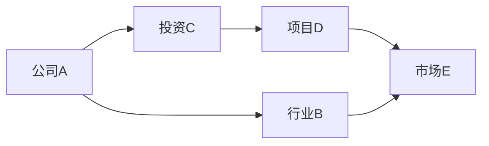
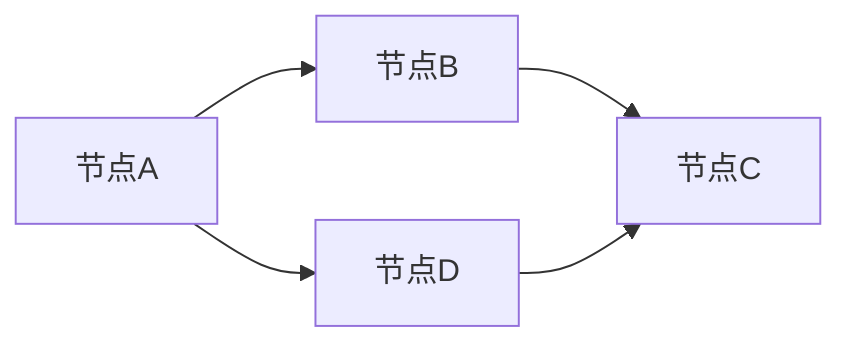

                 


# 构建基于知识图谱的金融风险关联分析系统

> 关键词：知识图谱，金融风险，关联分析，图嵌入，关联规则学习

> 摘要：本文详细探讨了基于知识图谱的金融风险关联分析系统的构建方法。通过分析知识图谱的核心概念、算法原理、系统架构设计以及项目实战，本文为读者提供了一套完整的解决方案，帮助他们理解如何利用知识图谱技术有效进行金融风险的关联分析。本文还结合实际案例，深入分析了系统实现的关键步骤，并提出了性能优化和数据质量控制的最佳实践建议。

---

# 第一部分: 知识图谱与金融风险关联分析概述

## 第1章: 知识图谱与金融风险关联分析的背景与概念

### 1.1 知识图谱的基本概念

#### 1.1.1 知识图谱的定义与特点

知识图谱是一种以图结构形式表示知识的语义网络，节点代表实体或概念，边表示实体之间的关系。其特点包括：
- **语义性**：通过实体和关系描述复杂的语义信息。
- **可扩展性**：支持大规模数据的集成与关联。
- **动态性**：能够实时更新和维护。

#### 1.1.2 知识图谱在金融领域的应用背景

金融领域的数据复杂性高，涉及大量非结构化数据（如新闻、报告）和结构化数据（如财务报表）。传统的数据分析方法难以发现隐含关联关系，而知识图谱能够通过语义理解与关联挖掘，为金融风险分析提供新的视角。

#### 1.1.3 金融风险关联分析的核心问题

金融风险关联分析旨在发现不同金融实体（如公司、行业、市场）之间的潜在关联关系，从而预测和防范系统性风险。核心问题包括：
- 如何从异构数据中提取关联关系？
- 如何构建高效的关联分析模型？
- 如何将关联分析结果应用于实际风险管理？

### 1.2 金融风险关联分析的定义与挑战

#### 1.2.1 金融风险的基本概念

金融风险包括市场风险、信用风险、操作风险等，通常通过量化指标（如VaR、CVaR）进行评估。风险关联分析的核心是发现不同风险因子之间的相互作用。

#### 1.2.2 金融风险关联分析的目标与意义

目标是通过关联分析发现潜在风险源，提前预警系统性风险。意义在于：
- 提高风险预测的准确性。
- 实现跨领域风险的关联分析。
- 支持决策者制定更有效的风险管理策略。

#### 1.2.3 当前金融风险关联分析的主要挑战

- 数据异构性：金融数据来源多样，格式复杂。
- 关联关系的动态性：市场变化可能导致关联关系快速变化。
- 计算复杂性：大规模数据的关联分析需要高效的算法支持。

---

## 第2章: 知识图谱与金融风险关联分析的核心概念

### 2.1 知识图谱的构建与属性

#### 2.1.1 实体与关系的定义

- **实体**：金融领域的实体包括公司、行业、市场、产品等。
- **关系**：实体之间的关系，如“公司A属于行业B”、“公司C投资于项目D”。

#### 2.1.2 知识图谱的构建过程

构建过程包括数据采集、数据清洗、实体识别、关系抽取和知识图谱存储。例如，使用自然语言处理技术从新闻中提取公司与行业的关系。

#### 2.1.3 知识图谱的属性特征

知识图谱中的属性包括实体的类型、关系的权重（如投资金额）、时间戳等。

#### 2.1.4 知识图谱的ER实体关系图

以下是知识图谱的实体关系图示：

```mermaid
erDiagram
    company {
        id: string
        name: string
        industry: string
        founding_year: integer
    }
    market {
        id: string
        name: string
        index: string
    }
    investment {
        id: string
        investor: company
        investee: company
        amount: integer
        date: date
    }
    relation {
        id: string
        source: entity
        target: entity
        type: string
        weight: integer
    }
```

### 2.2 知识图谱与金融风险关联分析的关联

#### 2.2.1 知识图谱在金融风险中的应用场景

- **风险传染性分析**：通过知识图谱发现不同公司之间的投资关系，评估风险传染路径。
- **风险因子关联**：分析市场波动与行业风险的关联关系。

#### 2.2.2 金融风险关联分析的实体关系图

以下是金融风险关联分析的实体关系图示：



#### 2.2.3 知识图谱与金融风险关联的数学模型

金融风险关联分析可以通过关联规则学习和图嵌入模型进行。关联规则学习用于发现频繁出现的关联项，图嵌入模型用于学习实体的低维表示，捕捉实体之间的潜在关联关系。

---

## 第3章: 知识图谱与金融风险关联分析的算法原理

### 3.1 关联规则学习算法

#### 3.1.1 关联规则学习的基本原理

关联规则学习用于发现数据中的频繁项集。基本步骤包括：
1. 生成候选项集。
2. 计算候选项集的支持度。
3. 剪枝不满足条件的项集。

#### 3.1.2 Apriori算法的工作流程

Apriori算法通过递归地生成候选项集并计算支持度，如下：

```mermaid
flowchart TD
    start --> input_data
    input_data --> generate_candidates
    generate_candidates --> compute_support
    compute_support --> prune_candidates
    prune_candidates --> output_rules
    output_rules --> end
```

#### 3.1.3 关联规则在金融风险中的应用

例如，发现同一行业的多家公司投资于同一项目，可能形成风险集中。

### 3.2 图嵌入算法

#### 3.2.1 图嵌入的基本概念

图嵌入将图中的节点映射到低维向量空间，保留节点之间的语义信息。

#### 3.2.2 node2vec算法的工作原理

node2vec通过随机游走生成节点的上下文表示，如下：



#### 3.2.3 图嵌入在金融风险中的应用

通过图嵌入，可以发现不同实体之间的潜在关联关系，如公司与市场的潜在关联。

---

## 第4章: 知识图谱与金融风险关联分析的系统架构设计

### 4.1 系统功能模块设计

#### 4.1.1 数据采集与预处理模块

- 数据来源：金融数据库、新闻媒体、政府公告。
- 数据清洗：去除重复数据、填充缺失值。

#### 4.1.2 知识图谱构建模块

- 实体识别：使用NLP技术提取实体。
- 关系抽取：识别实体之间的关系。

#### 4.1.3 风险关联分析模块

- 使用关联规则学习和图嵌入算法进行风险关联分析。

#### 4.1.4 可视化展示模块

- 展示风险关联关系的图表。

### 4.2 系统架构设计图

以下是系统的架构设计图：


---

## 第5章: 知识图谱与金融风险关联分析的项目实战

### 5.1 环境配置与数据准备

#### 5.1.1 开发环境的安装与配置

- 安装Python、Jupyter Notebook、NetworkX库。

#### 5.1.2 数据集的获取与预处理

- 数据来源：公开金融数据集、新闻数据。

### 5.2 知识图谱的构建与存储

#### 5.2.1 使用NetworkX构建知识图谱

代码示例：

```python
import networkx as nx

G = nx.DiGraph()
G.add_node("公司A")
G.add_node("行业B")
G.add_edge("公司A", "行业B", label="属于")
```

#### 5.2.2 知识图谱的存储与管理

使用图数据库（如Neo4j）存储知识图谱。

### 5.3 风险关联分析算法的实现

#### 5.3.1 使用node2vec进行图嵌入

代码示例：

```python
from node2vec import Node2Vec

G = nx.DiGraph()
model = Node2Vec(G, workers=4, num_walks=10)
```

#### 5.3.2 基于关联规则的金融风险分析

代码示例：

```python
from mlxtend.frequent_itemsets import apriori

transactions = [
    ["公司A", "行业B"],
    ["公司A", "投资C"],
    ["行业B", "市场D"]
]
frequent_itemsets = apriori(transactions, min_support=0.5)
```

### 5.4 系统功能实现与测试

#### 5.4.1 系统功能的实现步骤

- 数据预处理、知识图谱构建、风险关联分析、可视化展示。

#### 5.4.2 系统功能的测试与优化

- 测试系统的准确性和效率。

---

## 第6章: 知识图谱与金融风险关联分析的最佳实践

### 6.1 系统性能优化的建议

- 数据处理：使用分布式计算框架（如Spark）处理大规模数据。
- 算法优化：采用并行化算法提高计算效率。

### 6.2 知识图谱构建的注意事项

- 数据质量：确保数据的准确性和完整性。
- 关系抽取：选择合适的NLP技术提高关系抽取的准确率。

---

## 第7章: 小结与展望

通过本文的详细讲解，读者可以掌握基于知识图谱的金融风险关联分析系统的构建方法。未来，随着人工智能技术的不断发展，知识图谱在金融领域的应用将更加广泛和深入。

---

# 作者：AI天才研究院/AI Genius Institute & 禅与计算机程序设计艺术 /Zen And The Art of Computer Programming

