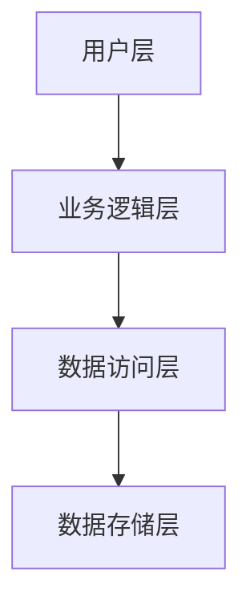
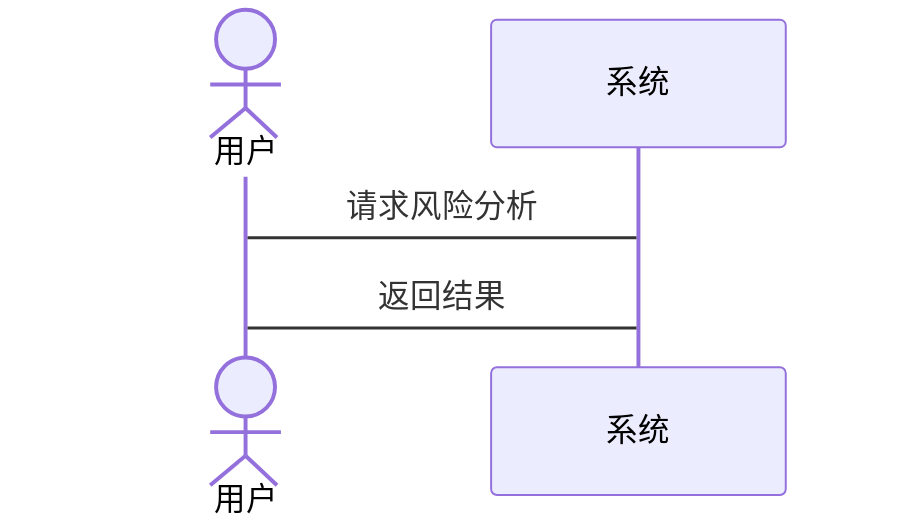

                 


# 构建基于知识图谱的金融风险关联网络

> 关键词：知识图谱、金融风险、关联网络、图嵌入、风险传播、社会网络分析

> 摘要：本文系统地探讨了基于知识图谱构建金融风险关联网络的方法，从问题背景、核心概念、算法原理到系统设计和项目实战，层层深入，结合实际案例和数学模型，详细阐述了如何利用知识图谱技术进行金融风险分析与管理。

---

# 第一部分: 背景介绍

## 第1章: 知识图谱与金融风险关联网络概述

### 1.1 问题背景与问题描述

#### 1.1.1 金融风险分析的挑战
在金融领域，风险分析是核心任务之一，但传统的基于统计的方法难以捕捉复杂的关联关系。随着金融市场日益复杂化，单点风险可能通过多条路径传导至整个系统，形成连锁反应。

#### 1.1.2 知识图谱在金融领域的应用潜力
知识图谱通过将金融数据中的实体及其关系显式化，为理解复杂的金融系统提供了新的视角。它可以捕捉隐含的关联关系，帮助发现潜在风险。

#### 1.1.3 金融风险关联网络的核心问题
金融风险关联网络旨在通过图结构建模，识别风险在金融系统中的传播路径和影响范围，从而实现风险预警和管理。

### 1.2 问题解决与边界定义

#### 1.2.1 知识图谱如何解决金融风险问题
通过构建金融实体（如公司、机构、交易）及其关系的知识图谱，可以发现潜在的关联风险，实现风险的早期预警和管理。

#### 1.2.2 金融风险关联网络的边界与外延
金融风险关联网络的边界包括金融实体、交易关系和风险传播路径。外延则扩展到跨市场、跨机构的风险传染。

#### 1.2.3 核心概念与组成要素
金融风险关联网络由以下核心要素组成：
- **实体**：公司、金融机构、资产等。
- **关系**：持有、交易、借贷等。
- **风险传播路径**：通过实体之间的关系链传播风险。

---

## 第2章: 知识图谱与风险关联网络的核心概念

### 2.1 知识图谱的基本原理

#### 2.1.1 知识图谱的定义与特点
知识图谱是一种图结构，由节点（实体）和边（关系）组成，具有语义丰富、结构化的特点。

#### 2.1.2 实体与关系的定义
- **实体**：公司、机构、资产。
- **关系**：持有、交易、借贷。

#### 2.1.3 知识图谱的构建流程
1. 数据采集。
2. 实体识别。
3. 关系抽取。
4. 知识融合。

### 2.2 风险关联网络的构建原理

#### 2.2.1 风险关联网络的定义
风险关联网络是一种图结构，节点代表金融实体，边代表风险传播路径。

#### 2.2.2 网络节点与边的定义
- **节点**：金融实体。
- **边**：风险关联关系。

#### 2.2.3 风险传播与关联分析
通过分析图结构，发现风险传播路径和影响范围。

### 2.3 核心概念对比与ER图架构

#### 2.3.1 知识图谱与风险网络的对比分析
| 特性 | 知识图谱 | 风险关联网络 |
|------|----------|---------------|
| 节点 | 实体 | 金融实体 |
| 边 | 关系 | 风险传播路径 |

#### 2.3.2 ER实体关系图展示
```mermaid
er
actor: "金融实体"
relation: "关联关系"
```

---

## 第3章: 算法原理与数学模型

### 3.1 知识图谱构建算法

#### 3.1.1 基于规则的实体识别
通过预定义的规则提取文本中的实体。

#### 3.1.2 基于统计的实体链接
使用统计模型将实体链接到知识库。

#### 3.1.3 知识图谱融合算法
将多个数据源的信息融合到一个知识图谱中。

### 3.2 风险关联网络算法

#### 3.2.1 图嵌入算法
- **Word2Vec**：用于节点表示。
- **Node2Vec**：用于边表示。

#### 3.2.2 社会网络分析（SNA）方法
- **度数**：节点的度数表示其重要性。
- **中心性**：节点的中心性表示其影响力。

#### 3.2.3 风险传播模型
- **Girvan-Newman算法**：用于发现社区结构。

### 3.3 数学模型与公式

#### 3.3.1 图嵌入公式
$$ E = \sum_{i=1}^{n} (x_i - f(x_i))^2 $$

#### 3.3.2 风险传播模型
$$ R_i = \sum_{j} w_{ij} R_j $$

### 3.4 实际案例分析

#### 3.4.1 算法选择与实现
选择适合的算法并实现。

#### 3.4.2 案例分析与结果解读
通过案例分析验证算法的有效性。

---

# 第二部分: 系统分析与架构设计

## 第4章: 系统分析与架构设计

### 4.1 问题场景介绍

#### 4.1.1 金融风险分析的典型场景
- 风险预警。
- 风险传播分析。

#### 4.1.2 知识图谱构建的系统需求
- 数据采集。
- 实体识别。
- 关系抽取。

### 4.2 系统功能设计

#### 4.2.1 知识图谱构建模块
- 数据采集。
- 实体识别。
- 关系抽取。

#### 4.2.2 风险关联网络分析模块
- 风险传播分析。
- 关键节点识别。

#### 4.2.3 可视化展示模块
- 图形化展示风险网络。

### 4.3 系统架构设计

#### 4.3.1 分层架构设计


#### 4.3.2 接口设计与交互流程


---

# 第三部分: 项目实战与实现

## 第5章: 项目实战与实现

### 5.1 环境安装与配置

#### 5.1.1 开发环境搭建
安装Python、Neo4j等工具。

#### 5.1.2 工具链安装
安装必要的Python库，如`networkx`、`node2vec`。

### 5.2 核心代码实现

#### 5.2.1 数据采集与预处理
```python
import requests

url = "https://example.com/api"
response = requests.get(url)
data = response.json()
```

#### 5.2.2 实体识别与关系抽取
```python
from spacy.lang.zh import Chinese
nlp = Chinese()
doc = nlp("中国工商银行持有某公司股票")
for token in doc:
    print(token.text)
```

#### 5.2.3 知识图谱构建
```python
from networkx import DiGraph
g = DiGraph()
g.add_node("中国工商银行")
g.add_node("某公司")
g.add_edge("中国工商银行", "某公司", label="持有")
```

### 5.3 案例分析与解读

#### 5.3.1 案例背景
分析某次金融危机中的风险传播路径。

#### 5.3.2 数据处理与建模
使用图嵌入算法进行风险建模。

#### 5.3.3 实验结果与分析
展示风险传播路径和关键节点。

### 5.4 系统实现与优化

#### 5.4.1 系统实现
完成知识图谱构建和风险分析的系统实现。

#### 5.4.2 性能优化
优化算法和系统架构，提高处理效率。

---

# 第四部分: 最佳实践与总结

## 第6章: 最佳实践与总结

### 6.1 最佳实践 tips

#### 6.1.1 数据质量
确保数据的准确性和完整性。

#### 6.1.2 算法选择
根据实际需求选择合适的算法。

### 6.2 项目小结

#### 6.2.1 核心成果
构建了金融风险关联网络，实现了风险预警和分析。

#### 6.2.2 经验总结
知识图谱在金融风险分析中的应用潜力巨大，但仍需进一步优化。

### 6.3 注意事项

#### 6.3.1 数据隐私
注意数据隐私和合规性。

#### 6.3.2 系统性能
优化系统性能，确保高效运行。

### 6.4 拓展阅读

#### 6.4.1 推荐书籍
- 《图算法与应用》。
- 《知识图谱实战》。

#### 6.4.2 推荐文章
- "金融风险管理的新方法"。

---

# 作者：AI天才研究院/AI Genius Institute & 禅与计算机程序设计艺术 /Zen And The Art of Computer Programming

