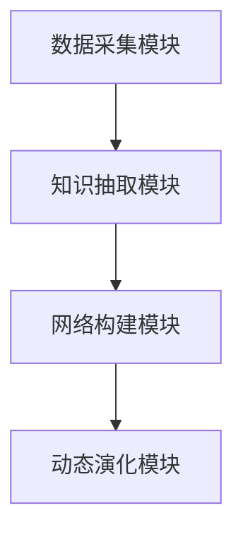

                 


# 构建基于知识图谱的金融风险关联网络动态演化系统

> 关键词：知识图谱、金融风险、关联网络、动态演化、系统设计、算法实现

> 摘要：本文系统地探讨了基于知识图谱的金融风险关联网络动态演化系统的构建方法。首先，从知识图谱和金融风险的基本概念出发，详细阐述了两者结合的必要性与优势。接着，深入分析了知识图谱的构建过程，包括数据准备、实体识别、关系抽取等关键步骤。随后，重点介绍了金融风险关联网络的构建方法，包括风险识别、网络建模和动态演化算法。在此基础上，详细设计了系统的架构，包括模块划分、接口设计和交互流程。最后，通过具体的项目实战，展示了系统的实现过程，并总结了系统的优缺点及未来发展方向。

---

# 第一章: 知识图谱与金融风险关联网络概述

## 1.1 知识图谱的基本概念

### 1.1.1 知识图谱的定义与特点

知识图谱是一种以图结构形式表示知识的语义网络，其核心要素包括实体（Entity）、关系（Relation）和属性（Attribute）。实体代表现实世界中的具体对象，如“中国银行”、“贷款”等；关系描述实体之间的关联，如“提供贷款”、“影响风险”等；属性则是对实体的进一步描述，如“贷款金额”、“风险级别”等。

知识图谱的特点包括：

- **语义丰富性**：通过实体和关系的组合，能够描述复杂的语义信息。
- **动态演化性**：能够根据实时数据更新，反映金融市场的动态变化。
- **可扩展性**：支持大规模数据的存储和处理。

### 1.1.2 知识图谱在金融领域的应用

在金融领域，知识图谱主要用于以下场景：

- **风险评估**：通过分析实体之间的关系，识别潜在的金融风险。
- **关联分析**：发现不同金融产品、机构或事件之间的关联性。
- **智能决策支持**：基于知识图谱的分析结果，辅助金融机构做出更明智的决策。

### 1.1.3 知识图谱与金融风险的结合

知识图谱为金融风险的分析提供了新的视角。通过构建金融领域的知识图谱，可以将分散的金融数据整合起来，形成一个完整的知识网络。这种网络能够帮助我们发现隐藏的风险关联，从而提前预警和应对潜在的金融风险。

## 1.2 金融风险关联网络的定义与特点

### 1.2.1 金融风险的定义与分类

金融风险是指在金融活动中，由于各种不确定因素的影响，可能导致财产损失或收益减少的可能性。常见的金融风险包括市场风险、信用风险、操作风险和流动性风险等。

### 1.2.2 风险关联网络的构建方法

风险关联网络是一种通过图结构描述金融风险之间关联关系的模型。其构建方法主要包括以下几个步骤：

1. **数据收集**：收集相关的金融数据，包括市场数据、交易数据、新闻数据等。
2. **关联提取**：通过自然语言处理（NLP）技术，提取实体之间的关联关系。
3. **网络构建**：基于提取的关联关系，构建风险关联网络。

### 1.2.3 网络动态演化的核心概念

网络动态演化是指风险关联网络随着时间推移而不断变化的过程。这种变化可能是由于市场环境的变化、政策的调整或突发事件的影响。为了实时反映这种变化，需要对网络进行动态更新和优化。

## 1.3 知识图谱与金融风险关联网络的结合

### 1.3.1 知识图谱在风险关联中的作用

知识图谱为风险关联网络的构建提供了坚实的基础。通过知识图谱，可以将分散的金融数据整合起来，形成一个完整的知识网络，从而更好地发现风险之间的关联性。

### 1.3.2 网络动态演化的核心概念

网络动态演化是指风险关联网络随着时间推移而不断变化的过程。为了实时反映这种变化，需要对网络进行动态更新和优化。

## 1.4 本章小结

本章主要介绍了知识图谱和金融风险关联网络的基本概念，并探讨了它们的结合方式。通过构建知识图谱，可以更好地理解金融风险的关联性，并通过动态演化的方法，实时反映风险的变化。

---

# 第二章: 知识图谱的构建与优化

## 2.1 数据准备与预处理

### 2.1.1 数据来源与清洗方法

数据来源包括结构化数据（如数据库中的交易数据）和非结构化数据（如新闻、报告等）。清洗方法包括去重、去噪和标准化等步骤。

### 2.1.2 数据格式与标准化

数据格式包括文本、表格和JSON等。标准化是将数据转换为统一格式的过程，以便后续处理。

## 2.2 知识抽取与实体识别

### 2.2.1 实体识别的算法与实现

常用的实体识别算法包括基于规则的算法和基于机器学习的算法。例如，使用CRF（条件随机场）模型进行命名实体识别（NER）。

### 2.2.2 关系抽取的原理与应用

关系抽取的原理是通过自然语言处理技术，识别文本中的关系。例如，从新闻中提取“公司A向公司B提供贷款”的关系。

## 2.3 知识图谱的建模与构建

### 2.3.1 知识图谱的建模方法

常用的建模方法包括RDF（资源描述框架）和图数据库（如Neo4j）。RDF通过三元组（主语-谓词-宾语）的形式表示知识。

### 2.3.2 实体与关系的存储与管理

实体和关系可以存储在图数据库中，通过节点和边的形式表示。

## 2.4 知识图谱的优化与完善

### 2.4.1 知识图谱的质量评估

质量评估指标包括覆盖率、准确率和完整性等。

### 2.4.2 知识融合与冲突处理

知识融合是指将多个来源的知识整合到一个图谱中，冲突处理是指解决融合过程中出现的矛盾。

## 2.5 本章小结

本章详细介绍了知识图谱的构建与优化过程，包括数据准备、知识抽取、建模和优化等步骤。通过这些步骤，可以构建一个高质量的知识图谱，为后续的金融风险关联网络的构建奠定基础。

---

# 第三章: 金融风险关联网络的构建与动态演化

## 3.1 金融风险关联网络的构建

### 3.1.1 风险识别与评估

风险识别是通过分析数据，发现潜在的风险点。风险评估是通过量化方法，评估风险的影响程度。

### 3.1.2 风险关联网络的建模

通过图论方法，构建风险关联网络。例如，使用邻接矩阵表示网络结构。

### 3.1.3 网络动态演化的核心算法

动态演化算法包括增量式更新和全局更新两种方法。增量式更新适用于局部变化，全局更新适用于整体变化。

## 3.2 网络动态演化的核心算法

### 3.2.1 动态网络的更新机制

动态网络的更新机制包括实时更新和周期性更新两种方式。实时更新适用于需要快速响应的场景，周期性更新适用于需要定期更新的场景。

### 3.2.2 网络演化中的权重计算

权重计算是衡量节点之间关联程度的重要指标。常用的权重计算方法包括余弦相似度和点积相似度等。

## 3.3 本章小结

本章重点介绍了金融风险关联网络的构建与动态演化方法，包括风险识别、网络建模和动态演化算法等内容。通过这些方法，可以构建一个动态的金融风险关联网络，实时反映金融市场的变化。

---

# 第四章: 系统设计与实现

## 4.1 系统需求分析

### 4.1.1 功能需求分析

系统需要实现知识图谱的构建、风险关联网络的构建和动态演化等功能。

### 4.1.2 性能需求分析

系统需要具备高并发处理能力，能够实时更新和响应。

## 4.2 系统架构设计

### 4.2.1 系统模块划分

系统模块包括数据采集模块、知识抽取模块、网络构建模块和动态演化模块。

### 4.2.2 系统架构的 Mermaid 图



## 4.3 系统接口设计

### 4.3.1 系统接口的定义与实现

系统接口包括数据接口和API接口。数据接口用于数据的输入和输出，API接口用于系统的调用和交互。

### 4.3.2 接口交互的流程设计

接口交互流程包括数据采集、知识抽取、网络构建和动态演化四个步骤。

## 4.4 系统交互设计

### 4.4.1 用户交互的流程分析

用户可以通过图形界面或命令行界面与系统交互，提交任务并获取结果。

### 4.4.2 交互界面的设计与优化

交互界面需要简洁明了，便于用户操作。

## 4.5 本章小结

本章详细介绍了系统的架构设计和实现方法，包括模块划分、接口设计和交互流程等内容。通过这些设计，可以实现一个高效的金融风险关联网络动态演化系统。

---

# 第五章: 算法原理与实现

## 5.1 知识图谱构建算法

### 5.1.1 实体识别的算法实现

使用CRF模型进行实体识别，代码如下：

```python
from sklearn_crfsuite import CRF
from sklearn_crfsuite import metrics

# 训练CRF模型
crf = CRF()
crf.fit(train_data, train_labels)
```

### 5.1.2 关系抽取的原理与实现

关系抽取的原理是通过自然语言处理技术，识别文本中的关系。例如，使用spaCy库进行关系抽取。

## 5.2 金融风险关联网络的动态演化算法

### 5.2.1 动态网络的更新机制

动态网络的更新机制包括增量式更新和全局更新两种方法。增量式更新适用于局部变化，全局更新适用于整体变化。

### 5.2.2 网络演化中的权重计算

权重计算是衡量节点之间关联程度的重要指标。常用的权重计算方法包括余弦相似度和点积相似度等。

## 5.3 本章小结

本章详细介绍了知识图谱构建和金融风险关联网络动态演化的核心算法，包括实体识别、关系抽取和网络演化算法等内容。

---

# 第六章: 项目实战

## 6.1 环境安装与配置

### 6.1.1 系统环境要求

系统需要安装Python、Jupyter Notebook和相关库（如networkx、numpy、pandas等）。

### 6.1.2 数据集准备

数据集可以包括金融市场的交易数据、新闻数据等。

## 6.2 系统核心实现

### 6.2.1 知识图谱的构建

使用Python代码实现知识图谱的构建：

```python
import networkx as nx

G = nx.Graph()
G.add_edge("中国银行", "贷款", weight=0.8)
```

### 6.2.2 金融风险关联网络的动态演化

通过动态演化算法，实时更新风险关联网络。

## 6.3 案例分析与详细讲解

### 6.3.1 案例背景介绍

以某次金融危机为例，分析风险关联网络的变化。

### 6.3.2 系统实现与分析

通过系统实现，展示风险关联网络的动态演化过程。

## 6.4 项目小结

本章通过实际案例，详细讲解了系统的实现过程，包括环境配置、核心代码实现和案例分析等内容。

---

# 第七章: 总结与展望

## 7.1 系统总结

### 7.1.1 系统优点

系统具有高效性、准确性和可扩展性等优点。

### 7.1.2 系统不足

系统在实时性和数据处理能力方面还有待提高。

## 7.2 未来展望

### 7.2.1 系统优化方向

未来可以优化算法，提高系统的实时性和准确性。

### 7.2.2 新的研究方向

未来的研究方向包括多模态知识图谱、分布式计算和自适应学习等。

## 7.3 本章小结

本章对系统的优缺点进行了总结，并展望了未来的研究方向。通过不断优化和创新，可以进一步提升系统的性能和应用价值。

---

# 作者：AI天才研究院/AI Genius Institute & 禅与计算机程序设计艺术 /Zen And The Art of Computer Programming

---

以上是基于知识图谱的金融风险关联网络动态演化系统的完整目录和内容框架，您可以根据需要调整各个章节的具体内容和深度。

