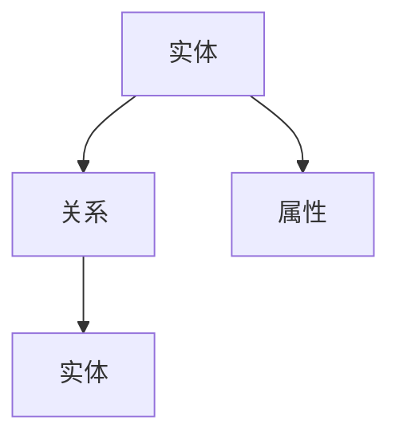
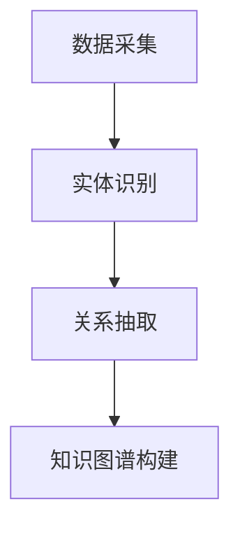
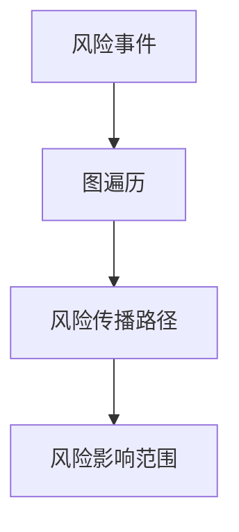
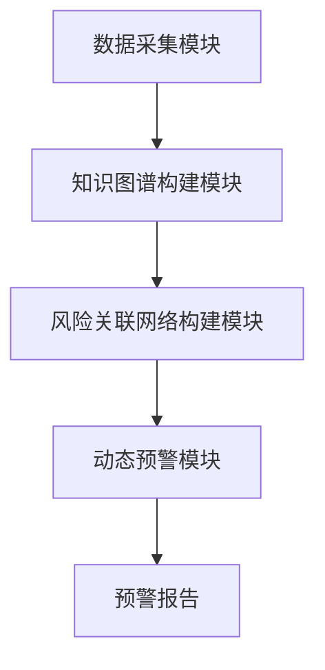
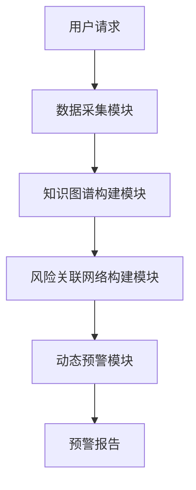

                 


# 构建基于知识图谱的金融风险关联网络动态预警系统

## 关键词：知识图谱、金融风险、关联网络、动态预警、系统架构

## 摘要：本文详细探讨了基于知识图谱构建金融风险关联网络动态预警系统的方法。通过分析金融风险的关联性，结合知识图谱的技术优势，提出了一种动态预警机制，能够实时捕捉和分析潜在风险，为金融机构提供智能化的风险管理解决方案。文章从核心概念、算法原理、系统架构到项目实战，全面阐述了该系统的构建过程和实际应用价值。

---

## 第1章: 背景介绍与核心概念

### 1.1 金融风险关联网络的定义与背景

#### 1.1.1 金融风险的基本概念
金融风险是指在金融活动中，由于各种不确定因素的影响，导致资金损失或收益下降的可能性。常见的金融风险包括市场风险、信用风险、流动性风险等。

#### 1.1.2 风险关联网络的定义
风险关联网络是指通过分析金融市场的数据，构建一个能够反映金融实体之间风险关联关系的网络模型。该模型可以用来识别风险事件的传播路径和影响范围。

#### 1.1.3 知识图谱在金融风险中的应用背景
知识图谱是一种以图结构表示知识的技术，能够有效地处理和分析复杂的数据关系。在金融领域，知识图谱可以用于构建金融实体之间的关联网络，帮助识别潜在的风险传播路径。

### 1.2 问题背景与描述

#### 1.2.1 传统金融风险分析的局限性
传统的金融风险分析方法通常依赖于统计模型和历史数据，难以捕捉复杂的关联关系和新兴风险。例如，传统的信用风险分析主要基于单个资产的信用评级，而忽略了资产之间的相互影响。

#### 1.2.2 知识图谱在金融风险分析中的优势
知识图谱能够通过语义理解技术，从非结构化数据中提取实体和关系，构建金融市场的知识网络。这种网络能够帮助分析师更好地理解风险的传播机制和影响范围。

#### 1.2.3 问题解决的核心目标
本文的核心目标是通过构建基于知识图谱的金融风险关联网络，实现对金融风险的动态预警。系统能够实时监测金融市场中的风险事件，并通过关联网络分析，快速识别潜在的风险传播路径。

### 1.3 核心概念与边界

#### 1.3.1 知识图谱的核心要素
知识图谱由实体、关系和属性三部分组成：
- 实体：代表金融市场的参与者，如公司、资产等。
- 关系：表示实体之间的关联关系，如“投资于”、“控股”等。
- 属性：描述实体的特征，如“行业类别”、“信用评级”等。

#### 1.3.2 风险关联网络的构建边界
风险关联网络的构建基于知识图谱中的实体和关系，重点关注实体之间的风险传播路径。网络的构建边界包括：
- 实体范围：限于金融市场的参与者和相关资产。
- 关系范围：限于能够影响风险传播的关联关系。

#### 1.3.3 动态预警系统的功能边界
动态预警系统的主要功能包括：
- 实时监测金融市场数据，识别潜在风险事件。
- 基于风险关联网络分析，预测风险的传播路径和影响范围。
- 提供风险预警报告，辅助决策。

---

## 第2章: 知识图谱与风险关联网络的关系

### 2.1 知识图谱的基本原理

#### 2.1.1 知识图谱的定义
知识图谱是一种以图结构表示知识的技术，由节点和边组成。节点代表实体或概念，边代表实体之间的关系。

#### 2.1.2 知识图谱的构建过程
知识图谱的构建过程包括数据采集、实体识别、关系抽取和知识融合四个步骤。

#### 2.1.3 知识图谱的存储与表示
知识图谱通常存储在图数据库中，如Neo4j。数据表示采用RDF（资源描述框架）或属性图模型。

### 2.2 风险关联网络的构建原理

#### 2.2.1 风险关联网络的构建方法
风险关联网络的构建基于知识图谱中的实体和关系。通过分析实体之间的关联关系，构建一个能够反映风险传播路径的网络模型。

#### 2.2.2 知识图谱与风险关联网络的结合方式
知识图谱为风险关联网络提供了实体和关系的语义信息。通过知识图谱的语义理解能力，可以更准确地识别风险传播路径。

#### 2.2.3 网络节点与边的关系
在网络中，节点代表金融实体，边代表实体之间的关联关系。边的权重表示关联强度，节点的属性表示实体的特征。

### 2.3 核心概念属性对比表

| 概念 | 属性 | 描述 |
|------|------|------|
| 知识图谱 | 实体 | 表示金融实体（公司、资产等） |
|      | 关系 | 表示实体之间的关联关系 |
| 风险关联网络 | 节点 | 表示风险事件或实体 |
|      | 边 | 表示风险传播路径或关联强度 |

### 2.4 ER实体关系图



---

## 第3章: 知识图谱构建算法

### 3.1 知识图谱构建流程

#### 3.1.1 数据采集与预处理
数据采集包括从多种数据源（如新闻、财务报告）获取文本数据。预处理步骤包括分词、去除停用词和实体识别。

#### 3.1.2 实体识别与链接
实体识别通过NLP技术从文本中提取实体信息。实体链接将提取的实体与知识库中的实体进行匹配，建立实体之间的关联关系。

#### 3.1.3 关系抽取与构建
关系抽取通过模式匹配或机器学习方法从文本中提取实体之间的关系。关系构建将抽取的关系信息添加到知识图谱中。

### 3.2 算法原理

#### 3.2.1 实体识别算法
常用实体识别算法包括基于规则的算法和基于机器学习的算法。例如，使用CRF（条件随机场）模型进行命名实体识别（NER）。

#### 3.2.2 关系抽取算法
关系抽取算法包括基于模式匹配的方法和基于语义角色标注（SRL）的方法。例如，使用spaCy库进行关系抽取。

### 3.3 算法流程图



---

## 第4章: 风险关联网络分析算法

### 4.1 风险关联网络的构建

#### 4.1.1 基于知识图谱的网络构建方法
通过知识图谱中的实体和关系，构建一个反映金融实体之间关联关系的风险网络。

#### 4.1.2 网络节点与边的属性
节点属性包括实体的行业、规模等特征。边属性包括关联强度、关联类型等特征。

### 4.2 算法原理

#### 4.2.1 风险传播路径分析
通过图遍历算法（如BFS、DFS）分析风险在网络中的传播路径。

#### 4.2.2 风险影响范围计算
基于网络节点的度数和中心性，计算风险事件的影响范围。

### 4.3 算法流程图



---

## 第5章: 数学模型与公式

### 5.1 知识图谱的表示模型

#### 5.1.1 实体表示
使用向量表示实体，例如使用Word2Vec模型将实体表示为低维向量。

#### 5.1.2 关系表示
关系可以通过边权重或边类型来表示。例如，边权重表示关系强度，边类型表示关系类型。

### 5.2 风险传播模型

#### 5.2.1 风险传播概率计算
假设风险传播的概率与节点的度数和边权重相关，可以表示为：
$$ P(i \rightarrow j) = \frac{w_{i,j}}{\sum_{k} w_{i,k}} $$
其中，$w_{i,j}$表示节点$i$与节点$j$之间的边权重。

#### 5.2.2 风险累积概率计算
通过马尔可夫链模型计算风险在网络中的累积概率。例如，初始风险概率为$P_0$，经过一步传播后的概率为：
$$ P_1 = P_0 \cdot W $$
其中，$W$是转移概率矩阵。

---

## 第6章: 系统架构设计

### 6.1 系统功能设计

#### 6.1.1 数据采集模块
从多种数据源采集金融数据，包括新闻、财务报告等。

#### 6.1.2 知识图谱构建模块
使用NLP技术构建金融知识图谱，包括实体识别、关系抽取和知识融合。

#### 6.1.3 风险关联网络构建模块
基于知识图谱构建风险关联网络，分析风险传播路径和影响范围。

#### 6.1.4 动态预警模块
实时监测金融市场数据，识别潜在风险事件，并通过关联网络分析提供预警报告。

### 6.2 系统架构图



### 6.3 接口设计

#### 6.3.1 数据接口
提供REST接口，接收金融市场数据。

#### 6.3.2 预警接口
提供预警接口，输出风险预警报告。

### 6.4 交互流程图



---

## 第7章: 项目实战

### 7.1 环境安装

#### 7.1.1 知识图谱构建工具
安装Neo4j图数据库和Python库（如networkx、spacy）。

#### 7.1.2 数据处理工具
安装Jupyter Notebook和Pandas库。

### 7.2 核心代码实现

#### 7.2.1 实体识别代码

```python
import spacy

nlp = spacy.load("en_core_web_sm")
doc = nlp("Apple invests in Google.")
for ent in doc.ents:
    print(ent.text, ent.label_)
```

#### 7.2.2 关系抽取代码

```python
from networkx import DiGraph

graph = DiGraph()
graph.add_edge("Apple", "invests in", "Google")
```

### 7.3 代码解读与分析
上述代码展示了如何使用spaCy进行实体识别，以及如何使用NetworkX构建图结构。实体识别部分提取了“Apple”和“Google”两个实体，以及“invests in”关系。

### 7.4 实际案例分析

#### 7.4.1 案例背景
假设某公司投资于另一家公司，存在潜在的信用风险。

#### 7.4.2 系统应用
系统通过知识图谱构建关联网络，识别投资关系，并预测风险传播路径。

### 7.5 项目小结
通过本项目，我们成功构建了一个基于知识图谱的金融风险关联网络动态预警系统。系统能够实时监测金融市场数据，识别潜在风险事件，并通过关联网络分析提供预警报告。

---

## 第8章: 最佳实践

### 8.1 小结
本文详细探讨了基于知识图谱构建金融风险关联网络动态预警系统的方法。通过分析金融风险的关联性，结合知识图谱的技术优势，提出了一种动态预警机制，能够实时捕捉和分析潜在风险，为金融机构提供智能化的风险管理解决方案。

### 8.2 注意事项
在实际应用中，需要注意数据质量和模型的可解释性。同时，需要定期更新知识图谱，以保持系统的准确性和实时性。

### 8.3 拓展阅读
推荐阅读以下书籍和论文：
- 《知识图谱：概念、方法与应用》
- “Knowledge Graphs for Financial Risk Management”

---

## 作者：AI天才研究院/AI Genius Institute & 禅与计算机程序设计艺术 /Zen And The Art of Computer Programming

