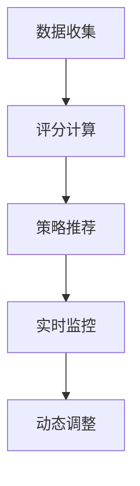
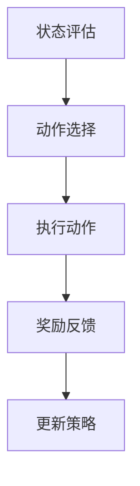
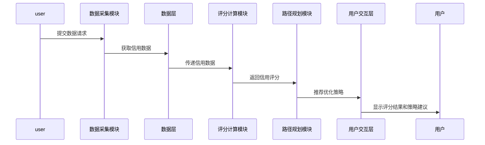

                 


# 构建智能化的个人信用分数提升路径规划器

> 关键词：人工智能、信用评分、路径规划、算法优化、个人信用管理

> 摘要：本文旨在探讨如何利用人工智能技术构建智能化的个人信用评分提升路径规划器。通过分析信用评分的重要性、传统评分的局限性，结合智能化算法，设计一个高效的路径规划系统，帮助个人优化信用评分。文章从背景介绍、核心概念、算法原理、系统架构到项目实战，全面阐述了构建智能化路径规划器的全过程。

---

## 第1章: 背景介绍

### 1.1 信用评分的定义与作用

信用评分是衡量个人或企业信用状况的重要指标，广泛应用于金融贷款、信用卡审批等领域。高信用评分意味着更低的贷款利率和更高的信用额度，直接影响个人的财务健康和融资能力。

- **信用评分的基本概念**：信用评分是一种量化评估工具，基于历史信用行为、财务状况和市场数据，预测个人或企业的信用风险。
- **信用评分在金融领域的应用**：银行、信用卡公司等金融机构利用信用评分决定贷款审批、额度和利率。信用评分越高，获得的贷款条件越优惠。
- **信用评分对个人和企业的影响**：个人信用评分直接影响个人的信用健康和经济机会，企业信用评分影响企业的融资能力和商业信誉。

### 1.2 传统信用评分的局限性

传统信用评分体系存在诸多局限，主要体现在数据获取与处理、模型可解释性以及评分准确性方面。

- **传统评分模型的局限性**：传统评分模型通常基于简单的线性回归或逻辑回归，难以捕捉复杂的信用行为模式。评分结果可能不够精准，特别是在数据不足或异常情况下。
- **数据获取与处理的挑战**：传统评分模型依赖于有限的信用历史数据，难以充分利用其他数据源（如社交媒体数据、交易记录等）提供的信息。
- **评分模型的可解释性问题**：复杂的模型（如深度学习模型）虽然预测能力强，但缺乏可解释性，难以满足监管要求和用户信任。

### 1.3 智能化信用评分的必要性

随着人工智能技术的发展，智能化信用评分体系展现出显著优势，特别是在数据处理能力和模型可解释性方面。

- **人工智能在信用评分中的应用潜力**：机器学习算法能够处理大量非结构化数据，发现传统模型难以捕捉的信用风险因素。
- **数据驱动的评分模型优势**：智能化模型可以整合多源数据，提供更全面的信用评估，显著提高评分的准确性和个性化。
- **提升信用评分智能化的路径规划**：通过构建智能化路径规划器，用户可以实时监控信用评分，制定个性化提升策略，优化信用状况。

---

## 第2章: 核心概念与联系

### 2.1 个人信用评分的核心概念

个人信用评分的核心概念包括评分模型、评分特征和评分标准。

- **评分模型**：评分模型是信用评分的核心工具，基于输入特征计算信用评分。常见的评分模型包括线性回归、逻辑回归、随机森林和神经网络等。
- **评分特征**：评分特征是影响信用评分的关键因素，如还款历史、信用额度、信用年龄、贷款类型和信用余额等。
- **评分标准**：评分标准是信用评分的评价基准，通常采用分数区间划分信用等级（如优秀、良好、一般、较差、差）。

| 评分模型 | 特点 | 适用场景 |
|----------|------|----------|
| 线性回归 | 简单易懂，线性关系明显 | 初步信用评估 |
| 逻辑回归 | 适合二分类问题，预测违约概率 | 信用风险评估 |
| 随机森林 | 高准确性，适合复杂特征 | 高维信用数据评估 |

### 2.2 路径规划算法的原理

路径规划算法是智能化信用评分提升的核心技术，基于信用评分结果推荐优化策略。

- **路径规划算法的流程**：
  1. **数据收集**：收集用户的信用历史、交易记录、财务状况等数据。
  2. **评分计算**：使用评分模型计算当前信用评分。
  3. **策略推荐**：根据评分结果，推荐提升信用评分的具体策略，如按时还款、减少负债、增加信用历史等。
  4. **实时监控**：实时跟踪信用评分变化，动态调整优化策略。

- **路径规划算法的实现**：
  使用强化学习（如Q-learning）优化信用行为策略。通过状态-动作-奖励机制，帮助用户选择最优的信用行为路径。

- **路径规划算法的流程图**：



### 2.3 系统架构与核心要素

智能化信用评分提升路径规划器的系统架构包括数据层、计算层和用户交互层。

- **系统架构**：
  - 数据层：负责数据的存储和管理，包括信用历史、交易记录等。
  - 计算层：实现评分模型和路径规划算法，计算信用评分并推荐优化策略。
  - 用户交互层：提供用户界面，展示评分结果和优化建议。

- **核心要素**：
  - 数据采集模块：收集多源数据，如银行流水、信用报告、社交媒体数据。
  - 评分计算模块：基于机器学习模型计算信用评分。
  - 路径规划模块：根据评分结果推荐优化策略。
  - 用户界面模块：展示评分结果和优化建议。

---

## 第3章: 算法原理讲解

### 3.1 评分模型的数学模型

评分模型的数学模型是智能化信用评分的核心。线性回归模型是一个简单的评分模型，公式如下：

$$
\text{score} = \beta_0 + \beta_1x_1 + \beta_2x_2 + \dots + \beta_nx_n
$$

其中，$\beta_0$是截距项，$\beta_1, \beta_2, \dots, \beta_n$是特征变量的系数，$x_1, x_2, \dots, x_n$是特征变量。

### 3.2 路径规划算法的实现

路径规划算法基于强化学习，使用Q-learning算法优化信用行为策略。算法流程如下：

1. **初始化**：设置初始状态、动作和奖励参数。
2. **状态评估**：评估当前信用评分状态。
3. **动作选择**：根据当前状态选择信用行为动作。
4. **执行动作**：实施选择的信用行为。
5. **奖励反馈**：根据信用评分变化给予奖励反馈。
6. **更新策略**：根据奖励更新Q值表，优化策略。

路径规划算法的流程图如下：



---

## 第4章: 系统分析与架构设计

### 4.1 系统功能设计

智能化信用评分提升路径规划器的功能模块包括：

- 数据采集模块：负责收集多源数据。
- 评分计算模块：基于机器学习模型计算信用评分。
- 路径规划模块：推荐信用提升策略。
- 用户交互模块：展示评分结果和优化建议。

### 4.2 系统架构设计

系统架构采用分层设计，包括数据层、计算层和用户交互层。


### 4.3 接口设计与交互流程

系统接口设计包括数据接口和用户接口。

- 数据接口：与第三方数据源（如银行、征信机构）对接，获取信用数据。
- 用户接口：提供用户登录、数据查询、策略推荐等功能。

用户交互流程如下：



---

## 第5章: 项目实战

### 5.1 环境安装

构建智能化信用评分提升路径规划器需要以下环境：

- **Python 3.8+**
- **scikit-learn、pandas、numpy**

安装命令：

```bash
pip install scikit-learn pandas numpy
```

### 5.2 核心实现

实现评分模型和路径规划算法的核心代码如下：

```python
# 评分模型实现
from sklearn.linear_model import LinearRegression
import pandas as pd
import numpy as np

# 数据准备
data = pd.DataFrame({
    '特征1': [1, 2, 3],
    '特征2': [4, 5, 6],
    '标签': [7, 8, 9]
})

# 模型训练
model = LinearRegression()
model.fit(data[['特征1', '特征2']], data['标签'])

# 预测评分
new_data = pd.DataFrame({
    '特征1': [1],
    '特征2': [4]
})
predicted_score = model.predict(new_data[['特征1', '特征2']])
print(predicted_score)
```

### 5.3 实际案例分析

通过实际案例分析，展示系统的应用效果。例如，一个用户的信用评分为650分，系统推荐以下提升策略：

1. 按时还款，避免逾期记录。
2. 优化信用结构，减少高利贷使用。
3. 增加信用历史，提升信用评分。

---

## 第6章: 总结与展望

### 6.1 小结

本文详细探讨了如何构建智能化的个人信用分数提升路径规划器，从背景介绍、核心概念、算法原理到系统架构和项目实战，全面阐述了系统的构建过程。

### 6.2 注意事项

- 数据隐私保护：系统设计需遵循数据隐私保护法规，确保用户数据安全。
- 模型可解释性：评分模型和路径规划算法需具备可解释性，便于用户理解和监管审查。

### 6.3 拓展阅读

- 《机器学习实战》：深入学习机器学习算法及其应用。
- 《信用评分模型开发与应用》：系统介绍信用评分模型的构建与优化方法。

---

## 作者

作者：AI天才研究院/AI Genius Institute & 禅与计算机程序设计艺术 /Zen And The Art of Computer Programming

---

通过本文的详细阐述，读者可以全面了解如何利用人工智能技术构建智能化的个人信用分数提升路径规划器，从理论到实践，系统性地提升个人信用评分，优化信用管理策略。

