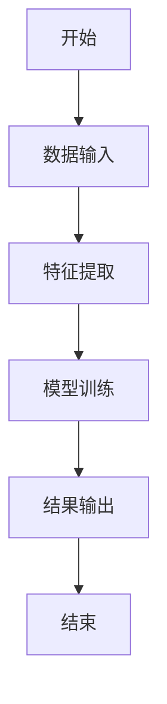
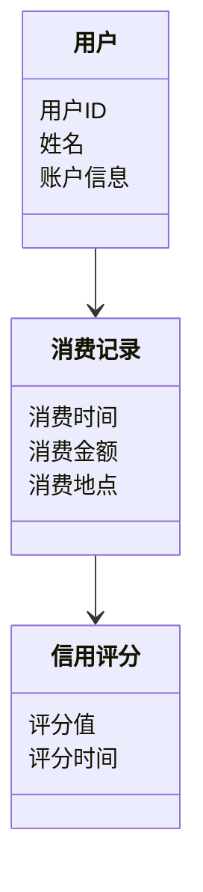
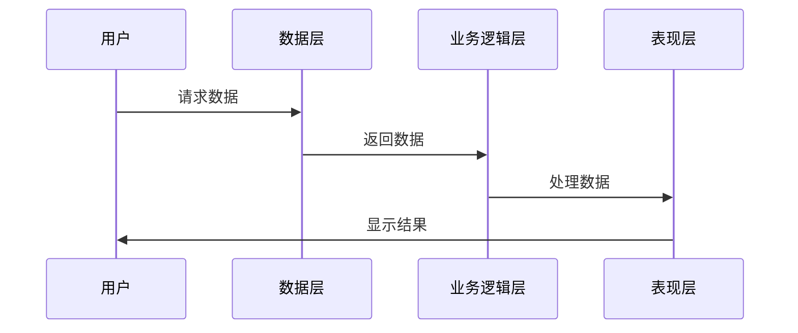

                 


# 构建智能化的个人信用卡使用优化助手

**关键词**：信用卡优化助手，智能化推荐，机器学习，数据挖掘，金融智能化

**摘要**：本文深入探讨了如何利用人工智能和机器学习技术构建智能化的个人信用卡使用优化助手。通过分析用户消费数据，结合智能推荐算法和系统架构设计，提出了一套完整的解决方案，旨在帮助用户优化信用卡使用策略，避免过度消费，提升信用评分。本文详细介绍了核心概念、算法原理、系统架构以及实际项目实现，为读者提供了一个从理论到实践的全面指南。

---

## 第一部分: 背景介绍与核心概念

### 第1章: 智能化信用卡使用优化助手的背景与需求

#### 1.1 信用卡使用中的问题与挑战

##### 1.1.1 信用卡使用中的常见问题
- **过度消费**：用户容易因为缺乏预算控制而产生高额债务。
- **还款压力**：逾期还款会影响信用评分，甚至引发法律问题。
- **优惠信息忽视**：用户可能错过信用卡提供的各种优惠活动。

##### 1.1.2 信用卡滥用与过度消费的危害
- 影响个人信用记录，导致贷款困难。
- 增加财务压力，影响生活质量。
- 容易陷入债务循环，难以摆脱困境。

##### 1.1.3 用户需求与痛点分析
- 用户希望实时监控消费记录，避免超支。
- 用户需要个性化的还款提醒和优化建议。
- 用户希望利用信用卡优惠，最大化利益。

#### 1.2 智能化优化助手的定义与目标

##### 1.2.1 智能化优化助手的核心定义
智能化的个人信用卡使用优化助手是一种基于人工智能技术的工具，通过分析用户的消费数据，提供个性化的优化建议，帮助用户合理规划信用卡使用。

##### 1.2.2 优化助手的目标与功能定位
- 提供消费记录的实时监控。
- 自动生成还款计划，避免逾期。
- 推荐最优的信用卡使用策略，最大化优惠利用。

##### 1.2.3 边界与外延分析
- 边界：仅针对信用卡使用优化，不涉及其他金融产品。
- 外延：未来可以扩展到其他金融工具的智能化管理。

#### 1.3 核心概念与系统架构

##### 1.3.1 核心概念关系图


---

## 第二部分: 核心概念与算法原理

### 第2章: 数据分析与特征提取

#### 2.1 数据预处理与清洗

##### 2.1.1 数据收集与整理
- 数据来源：用户消费记录、信用评分报告。
- 数据格式：结构化数据，包括消费金额、时间、地点等。

##### 2.1.2 数据清洗方法
- 去重：删除重复记录。
- 填补缺失值：使用均值或中位数填充。
- 标准化：统一时间格式。

##### 2.1.3 数据标准化与归一化
- 标准化：使用Z-score方法。
- 归一化：使用Min-Max方法。

#### 2.2 特征提取与选择

##### 2.2.1 特征工程的定义
- 特征工程是通过提取和选择关键特征，提升模型性能的过程。

##### 2.2.2 常用特征提取方法
- 时间特征：消费频率、高峰消费时段。
- 地理特征：消费地点分布。
- 额度特征：单笔消费金额、平均消费金额。

##### 2.2.3 特征选择的数学模型
$$ R^2 = 1 - \frac{\sum (y_i - \hat{y}_i)^2}{\sum (y_i - \bar{y})^2} $$

### 第3章: 智能化推荐算法

#### 3.1 基于机器学习的推荐系统

##### 3.1.1 基于协同过滤的推荐算法
- **用户-用户协同过滤**：找到与当前用户相似的用户，推荐其喜欢的内容。
- **物品-物品协同过滤**：基于用户行为数据，推荐相似的物品。

##### 3.1.2 基于内容的推荐算法
- 使用商品的属性特征进行推荐，例如信用卡优惠类型。

##### 3.1.3 混合推荐算法
- 结合协同过滤和内容推荐的优势，提升推荐准确率。

#### 3.2 算法实现与优化

##### 3.2.1 算法流程图


#### 3.3 推荐系统的数学模型

##### 3.3.1 基于矩阵分解的推荐公式
$$ X = U \cdot V^T $$

##### 3.3.2 基于相似度计算的公式
$$ sim(i,j) = \frac{\sum_{k} r_{ik} r_{jk}}{\sqrt{\sum_{k} r_{ik}^2} \cdot \sqrt{\sum_{k} r_{jk}^2}} $$

---

## 第三部分: 系统架构与设计

### 第4章: 系统架构设计

#### 4.1 系统功能设计

##### 4.1.1 领域模型


#### 4.2 系统架构设计

##### 4.2.1 系统架构图


#### 4.3 接口设计与交互流程

##### 4.3.1 系统接口设计
- API接口：RESTful API，提供数据查询和优化建议接口。

##### 4.3.2 交互流程图


---

## 第四部分: 项目实战与应用

### 第5章: 项目实战

#### 5.1 环境安装与配置

##### 5.1.1 环境要求
- Python 3.6+
- 安装必要的库：numpy、pandas、scikit-learn、flask。

#### 5.2 核心代码实现

##### 5.2.1 数据处理代码
```python
import pandas as pd

# 数据加载
data = pd.read_csv('credit_data.csv')

# 数据清洗
data.drop_duplicates(inplace=True)
data['消费时间'] = pd.to_datetime(data['消费时间'])
```

##### 5.2.2 推荐算法实现
```python
from sklearn.neighbors import NearestNeighbors

model = NearestNeighbors(n_neighbors=5).fit(X)
distances, indices = model.kneighbors([new_user_features])
```

#### 5.3 案例分析与结果解读

##### 5.3.1 案例分析
- 用户A的消费记录显示，其每月平均消费额为3000元，信用评分为750分。
- 系统推荐每月消费上限为2500元，并建议优先使用信用卡优惠活动。

##### 5.3.2 结果解读
- 系统通过分析用户消费习惯，提供个性化的优化建议，帮助用户避免超支。

---

## 第五部分: 总结与展望

### 5.1 最佳实践 Tips

- 定期检查信用评分，及时调整消费策略。
- 合理利用信用卡优惠，避免过度依赖信用卡。

### 5.2 小结

智能化的个人信用卡使用优化助手通过数据分析和机器学习算法，帮助用户优化信用卡使用策略，避免过度消费，提升信用评分。本文从背景、核心概念、算法原理到系统架构和项目实战，为读者提供了一个完整的解决方案。

### 5.3 注意事项

- 数据隐私保护：确保用户数据的安全性。
- 算法可解释性：优化助手的建议需要清晰透明。

### 5.4 拓展阅读

- 《机器学习实战》
- 《Python数据分析 cookbook》

---

**作者：AI天才研究院/AI Genius Institute & 禅与计算机程序设计艺术 /Zen And The Art of Computer Programming**

---

通过本文的详细讲解，读者可以深入了解如何构建智能化的个人信用卡使用优化助手，并实际应用这些技术来提升信用卡使用的效率和安全性。

