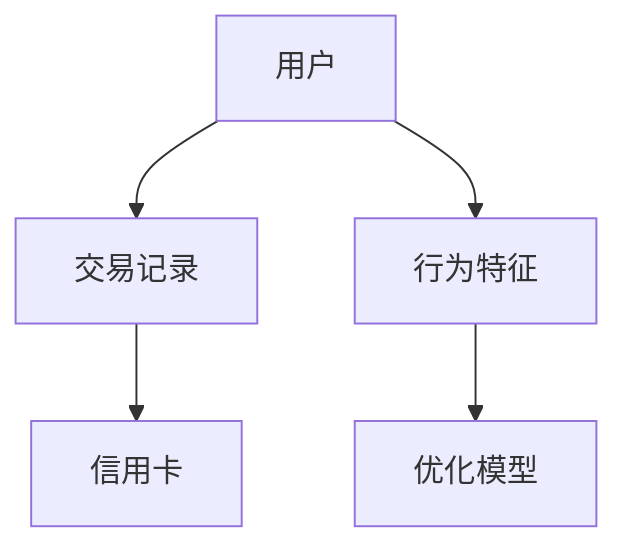
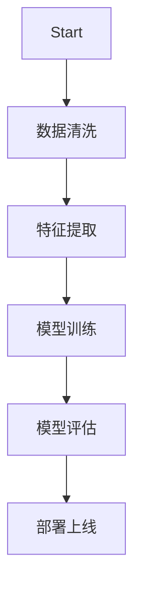
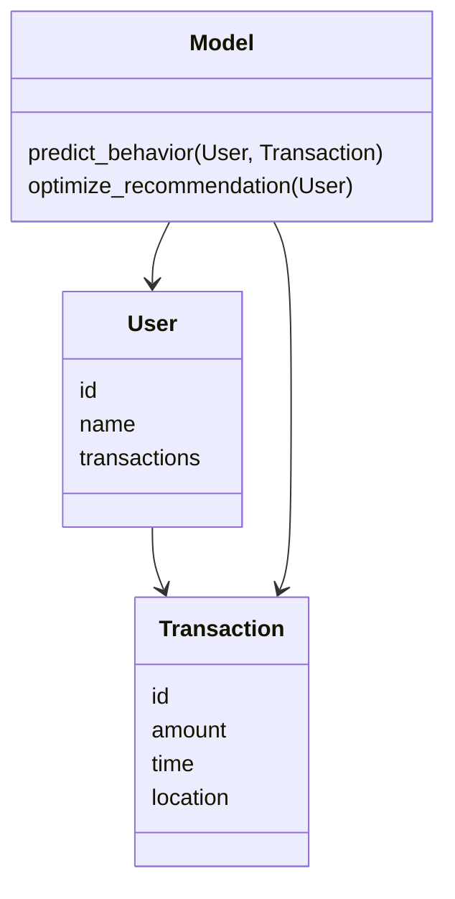
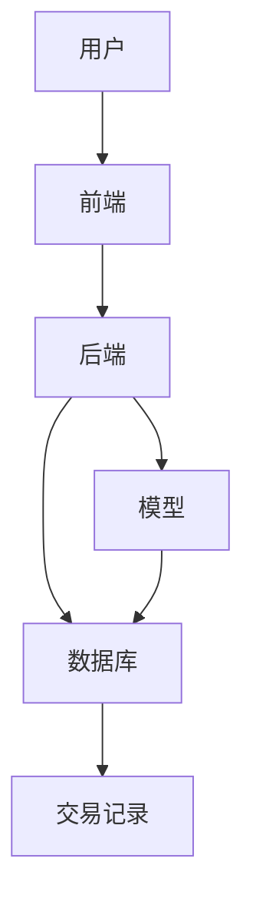
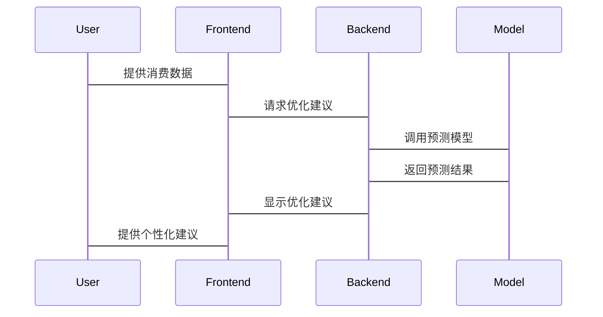

                 


# 构建智能化的个人信用卡使用行为优化助手

> **关键词**：人工智能，信用卡优化，行为分析，机器学习，系统架构，项目实战  
>
> **摘要**：本文详细探讨了如何利用人工智能技术优化个人信用卡使用行为。通过数据分析、机器学习和系统架构设计，构建一个智能化的助手，帮助用户合理规划消费，避免不合理支出。文章从背景介绍、核心概念、算法原理、数学模型、系统架构设计、项目实战到最佳实践，全面解析了实现这一目标的每一步骤。

---

# 第一部分: 背景介绍

## 第1章: 信用卡使用行为优化的背景与问题

### 1.1 问题背景
#### 1.1.1 信用卡使用中的常见问题
现代生活中，信用卡已成为主要的支付工具之一。然而，用户在使用信用卡时常常面临以下问题：
- **冲动消费**：缺乏对消费金额的控制，导致超支。
- **还款压力**：高额消费导致还款压力增大。
- **积分浪费**：信用卡积分未充分利用，白白浪费。

#### 1.1.2 用户行为分析的重要性
通过分析用户的信用卡使用行为，可以发现用户的消费习惯、偏好和潜在风险，从而制定个性化的优化策略。

#### 1.1.3 智能化优化的必要性
传统的信用卡管理工具多依赖用户手动记录和简单的提醒功能，难以应对复杂多变的消费场景。通过引入人工智能技术，可以实现自动化、智能化的消费行为优化。

### 1.2 问题描述
#### 1.2.1 用户信用卡使用行为的多样性
用户在不同时间、地点和情境下的消费行为差异显著，例如：
- 工作日午餐消费固定。
- 周末娱乐消费较高。
- 特殊节日消费激增。

#### 1.2.2 不合理消费的典型表现
- 非计划性消费：未在预算范围内。
- 高额分期付款：增加长期债务负担。
- 积分未充分利用：资源浪费。

#### 1.2.3 优化目标的设定
- 提高消费合理性。
- 减少不必要的债务负担。
- 提升信用卡积分使用效率。

### 1.3 问题解决思路
#### 1.3.1 数据驱动的优化方法
通过收集和分析用户的消费数据，识别消费模式和潜在风险。

#### 1.3.2 人工智能技术的应用
利用机器学习算法，预测用户的消费行为，并提出优化建议。

#### 1.3.3 行为预测与干预策略
基于预测结果，制定个性化的消费提醒和优化建议。

### 1.4 边界与外延
#### 1.4.1 优化助手的适用范围
- 信用卡持卡人。
- 具备一定消费数据的用户。
- 有优化消费习惯需求的用户。

#### 1.4.2 边界条件的设定
- 数据隐私保护。
- 消费行为预测的准确性。
- 用户接受度和使用体验。

#### 1.4.3 外延功能的扩展
- 财务预算管理。
- 债务优化建议。
- 积分兑换推荐。

### 1.5 核心要素组成
#### 1.5.1 数据采集模块
- 消费记录。
- 地理位置。
- 时间戳。

#### 1.5.2 行为分析模块
- 消费模式识别。
- 风险评估。
- 需求预测。

#### 1.5.3 优化建议模块
- 消费提醒。
- 分期优化建议。
- 积分使用推荐。

---

# 第二部分: 核心概念与联系

## 第2章: 智能化助手的核心概念

### 2.1 核心概念原理
#### 2.1.1 数据驱动的决策机制
通过收集和分析用户的消费数据，利用统计学和机器学习算法，生成个性化的消费建议。

#### 2.1.2 机器学习模型的应用
使用监督学习算法（如随机森林、逻辑回归）对用户的消费行为进行分类和预测。

#### 2.1.3 用户行为预测的数学模型
通过回归分析和聚类分析，建立用户行为预测模型。

### 2.2 核心概念属性对比
| 核心概念      | 描述                                                                 |
|---------------|----------------------------------------------------------------------|
| 数据采集      | 从信用卡交易记录中提取用户消费行为数据。                              |
| 行为分析      | 利用机器学习算法分析用户的消费模式和偏好。                            |
| 优化建议      | 根据分析结果，提供个性化的消费优化方案。                              |

### 2.3 ER实体关系图


---

# 第三部分: 算法原理讲解

## 第3章: 优化助手的算法原理

### 3.1 算法原理概述
#### 3.1.1 监督学习与无监督学习的区别
- **监督学习**：有标签的数据，用于分类和回归任务。
- **无监督学习**：无标签的数据，用于聚类和降维。

#### 3.1.2 分类与回归算法的应用场景
- **分类**：预测用户是否会在某段时间内进行大额消费。
- **回归**：预测用户的月均消费金额。

### 3.2 算法流程图


### 3.3 算法实现代码
```python
import pandas as pd
from sklearn.ensemble import RandomForestClassifier
from sklearn.metrics import accuracy_score

# 数据加载
data = pd.read_csv('credit_card.csv')

# 特征提取
features = ['amount', 'time', 'location']
target = 'is_high_spender'

# 数据分割
X = data[features]
y = data[target]

# 模型训练
model = RandomForestClassifier()
model.fit(X, y)

# 模型预测
predictions = model.predict(X)
print("Accuracy:", accuracy_score(y, predictions))
```

---

## 第4章: 数学模型

### 4.1 回归分析
$$ y = \beta_0 + \beta_1x + \epsilon $$

### 4.2 分类算法
$$ P(Y=1|X) = \frac{e^{\beta_0 + \beta_1x}}{1 + e^{\beta_0 + \beta_1x}} $$

---

# 第四部分: 系统分析与架构设计方案

## 第5章: 系统架构设计

### 5.1 项目介绍
开发一个基于机器学习的信用卡使用行为优化助手，帮助用户合理规划消费。

### 5.2 系统功能设计


### 5.3 系统架构设计


### 5.4 系统接口设计
- 用户输入接口：记录消费数据。
- 数据处理接口：清洗和特征提取。
- 模型调用接口：预测消费行为。

### 5.5 系统交互流程


---

## 第6章: 项目实战

### 6.1 环境搭建
- 安装Python和必要的库（pandas, scikit-learn）。
- 数据集准备：信用卡交易记录。

### 6.2 核心实现代码
```python
import pandas as pd
from sklearn.ensemble import RandomForestClassifier
from sklearn.metrics import accuracy_score

# 数据加载
data = pd.read_csv('credit_card.csv')

# 特征提取
features = ['amount', 'time', 'location']
target = 'is_high_spender'

# 数据分割
X = data[features]
y = data[target]

# 模型训练
model = RandomForestClassifier()
model.fit(X, y)

# 模型预测
predictions = model.predict(X)
print("Accuracy:", accuracy_score(y, predictions))
```

### 6.3 案例分析
- 输入用户消费数据，预测其是否为高 spender。
- 根据预测结果，给出消费提醒和优化建议。

---

## 第7章: 最佳实践

### 7.1 小结
通过机器学习算法和系统架构设计，构建了一个智能化的信用卡使用行为优化助手，帮助用户合理规划消费。

### 7.2 注意事项
- 数据隐私保护。
- 模型的可解释性和准确性。
- 用户的接受度和体验。

### 7.3 未来趋势
- 更加个性化的优化策略。
- 更多维度的数据分析。
- 自然语言处理技术的应用。

### 7.4 拓展阅读
- 《机器学习实战》。
- 《Python机器学习》。

---

# 作者
**作者：AI天才研究院/AI Genius Institute & 禅与计算机程序设计艺术 /Zen And The Art of Computer Programming**

