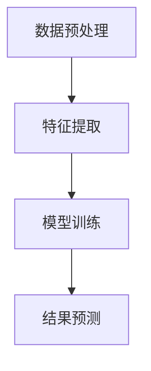
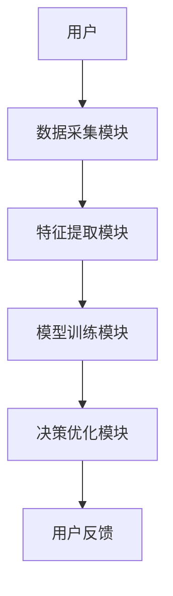

                 


# 构建智能化的个人信用卡额度与利率优化管理助手

> 关键词：信用卡额度优化、利率优化、人工智能、数据驱动、智能化管理

> 摘要：本文将详细探讨如何利用人工智能技术构建一个智能化的个人信用卡额度与利率优化管理助手。通过分析信用卡管理的现状与痛点，结合数据驱动的决策优化方法，提出一种基于机器学习的解决方案，实现信用卡额度与利率的智能化管理。本文将从问题背景、核心概念、算法原理、系统架构到项目实战等多个方面展开，为读者提供一个全面的技术解读。

---

## 第一部分：问题背景与目标

### 第1章：问题背景与目标

#### 1.1 问题背景

随着信用卡的普及，个人信用卡用户的数量与日俱增。然而，传统的信用卡管理方式存在诸多痛点：

- **额度与利率不匹配**：传统银行的信用卡额度和利率往往是基于用户的基本信息（如收入、信用评分）进行粗略评估，缺乏个性化和动态调整。
- **用户行为分析不足**：银行难以实时捕捉用户的消费行为和信用风险变化，导致额度调整滞后。
- **决策效率低**：传统信用卡管理依赖人工审核，效率低下，难以满足用户对快速响应的需求。

#### 1.2 问题描述

本文的核心问题是如何利用人工智能技术，构建一个智能化的助手，实现以下目标：

- 根据用户的实时行为和历史数据，动态优化信用卡额度和利率。
- 提供个性化的信用评估和风险管理。
- 实现高效、实时的决策支持，提升用户体验。

#### 1.3 问题解决思路

- **数据驱动的决策优化**：通过收集和分析用户的交易数据、信用评分、消费行为等，构建数据驱动的决策模型。
- **人工智能技术的应用**：利用机器学习算法（如支持向量机、随机森林等）对用户行为进行建模和预测，优化信用卡额度和利率。
- **系统化解决方案的设计**：设计一个智能化的管理系统，实现数据采集、模型训练、决策优化和用户反馈的闭环。

#### 1.4 边界与外延

- **系统边界**：本系统仅关注信用卡额度和利率的优化管理，不涉及其他信用卡功能（如支付功能、账单管理）。
- **外部系统交互**：系统需要与银行的核心系统（如信用评分系统、交易系统）进行交互，获取必要的数据支持。
- **功能扩展**：未来可以考虑扩展功能，如信用评分预测、欺诈检测等。

---

## 第二部分：核心概念与联系

### 第2章：核心概念与联系

#### 2.1 智能化助手的核心原理

智能化助手通过以下方式实现信用卡额度与利率的优化：

- **数据采集**：收集用户的交易数据、信用评分、消费行为等。
- **特征提取**：从数据中提取有用的特征，如消费频率、平均交易金额、信用评分变化等。
- **模型训练**：利用机器学习算法训练模型，预测用户的信用风险和消费行为。
- **决策优化**：根据模型预测结果，动态调整信用卡额度和利率。

#### 2.2 核心概念属性对比

下表对比了信用卡额度与利率优化的核心概念：

| **概念** | **信用卡额度** | **信用卡利率** |
|----------|----------------|----------------|
| **定义** | 银行授予用户的信用额度上限 | 银行向用户收取的利息率 |
| **影响因素** | 收入、信用评分、消费行为 | 信用评分、市场利率、风险评估 |
| **优化目标** | 提高用户使用效率，降低风险 | 降低银行风险，提高收益 |

#### 2.3 ER实体关系图

以下是信用卡额度与利率优化的核心实体关系图：

```mermaid
er
    Customer
    CreditCard
    Transaction
    UserBehavior
    Model
```

---

## 第三部分：算法原理与实现

### 第3章：算法原理与实现

#### 3.1 算法原理

我们选择支持向量机（SVM）和随机森林（Random Forest）作为主要的机器学习算法。以下是其原理简述：

- **支持向量机（SVM）**：
  - 通过寻找最优超平面，将数据点分为两类。
  - 适用于分类和回归问题，特别适合高维数据。

- **随机森林（Random Forest）**：
  - 通过构建多个决策树，集成学习，提高模型的鲁棒性。
  - 适用于分类和回归问题，适合处理非线性关系。

#### 3.2 算法流程图

以下是算法实现的流程图：



#### 3.3 算法实现

以下是支持向量机的Python实现示例：

```python
from sklearn.svm import SVC
from sklearn.model_selection import train_test_split
from sklearn.metrics import accuracy_score

# 数据预处理
X = df.drop('target', axis=1)
y = df['target']

# 划分训练集和测试集
X_train, X_test, y_train, y_test = train_test_split(X, y, test_size=0.2)

# 模型训练
model = SVC()
model.fit(X_train, y_train)

# 模型预测
y_pred = model.predict(X_test)

# 模型评估
print("准确率：", accuracy_score(y_test, y_pred))
```

#### 3.4 数学模型与公式

以下是支持向量机的数学模型：

$$ \text{目标函数：} \min \frac{1}{2} \|w\|^2 + C \sum_{i=1}^n \xi_i $$

$$ \text{约束条件：} y_i (w \cdot x_i + b) \geq 1 - \xi_i $$

---

## 第四部分：系统分析与架构设计

### 第4章：系统分析与架构设计

#### 4.1 问题场景介绍

我们设计了一个智能化的信用卡管理助手，用户可以通过该系统实时查看信用卡额度和利率，并根据系统建议进行调整。

#### 4.2 系统功能设计

以下是系统的核心功能模块：

- **数据采集模块**：采集用户的交易数据、信用评分等。
- **特征提取模块**：从数据中提取有用的特征。
- **模型训练模块**：利用机器学习算法训练模型，预测用户行为。
- **决策优化模块**：根据模型预测结果，动态调整信用卡额度和利率。

#### 4.3 系统架构设计

以下是系统的架构图：



---

## 第五部分：项目实战

### 第5章：项目实战

#### 5.1 环境安装

以下是项目所需的环境配置：

- Python 3.8+
- Scikit-learn
- Pandas
- Numpy

#### 5.2 系统核心实现

以下是系统核心代码实现：

```python
import pandas as pd
from sklearn.ensemble import RandomForestClassifier
from sklearn.model_selection import train_test_split
from sklearn.metrics import accuracy_score

# 数据加载
df = pd.read_csv('credit_card_data.csv')

# 数据预处理
X = df.drop('target', axis=1)
y = df['target']

# 划分训练集和测试集
X_train, X_test, y_train, y_test = train_test_split(X, y, test_size=0.2)

# 模型训练
model = RandomForestClassifier()
model.fit(X_train, y_train)

# 模型预测
y_pred = model.predict(X_test)

# 模型评估
print("准确率：", accuracy_score(y_test, y_pred))
```

#### 5.3 案例分析

以下是实际案例分析：

假设一位用户的交易数据如下：

| 交易金额 | 消费频率 | 信用评分 |
|----------|----------|----------|
| 1000     | 3次/月   | 750      |

根据模型预测，该用户的信用评分为750，消费频率为3次/月，交易金额为1000元。系统会根据这些数据动态调整信用卡额度和利率。

---

## 第六部分：总结与展望

### 第6章：总结与展望

#### 6.1 总结

本文详细探讨了如何利用人工智能技术构建一个智能化的个人信用卡额度与利率优化管理助手。通过分析信用卡管理的现状与痛点，结合数据驱动的决策优化方法，提出了一种基于机器学习的解决方案。

#### 6.2 优化建议

- **数据采集**：进一步优化数据采集模块，实时获取用户的交易数据和信用评分。
- **模型优化**：尝试使用更复杂的深度学习模型（如神经网络）进行优化。
- **用户体验**：优化用户界面，提供更直观的额度和利率调整建议。

#### 6.3 注意事项

- **数据隐私**：在数据采集和处理过程中，必须严格遵守数据隐私保护法规。
- **模型解释性**：确保模型的可解释性，方便用户理解和信任。

#### 6.4 拓展阅读

- 《机器学习实战》
- 《Python机器学习》
- 《数据驱动的决策优化》

---

作者：AI天才研究院/AI Genius Institute & 禅与计算机程序设计艺术 /Zen And The Art of Computer Programming

