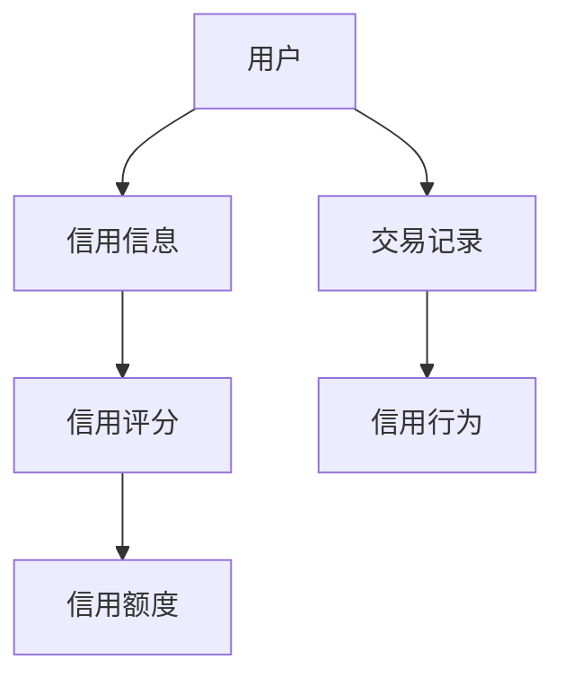
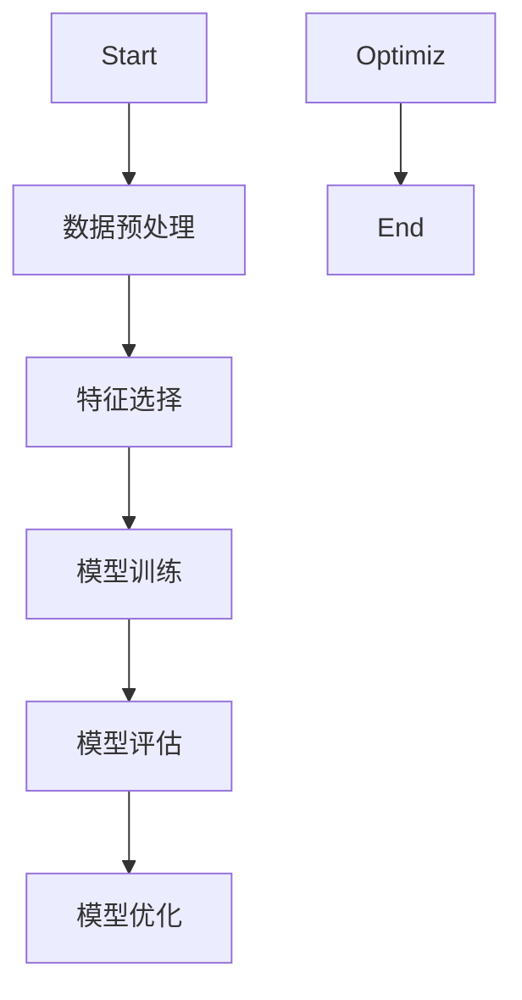
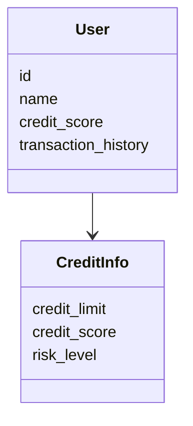
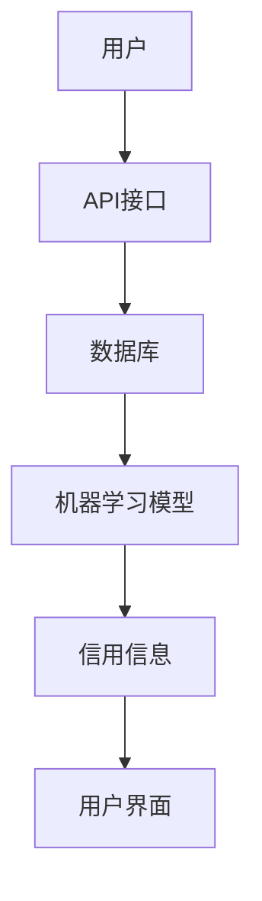
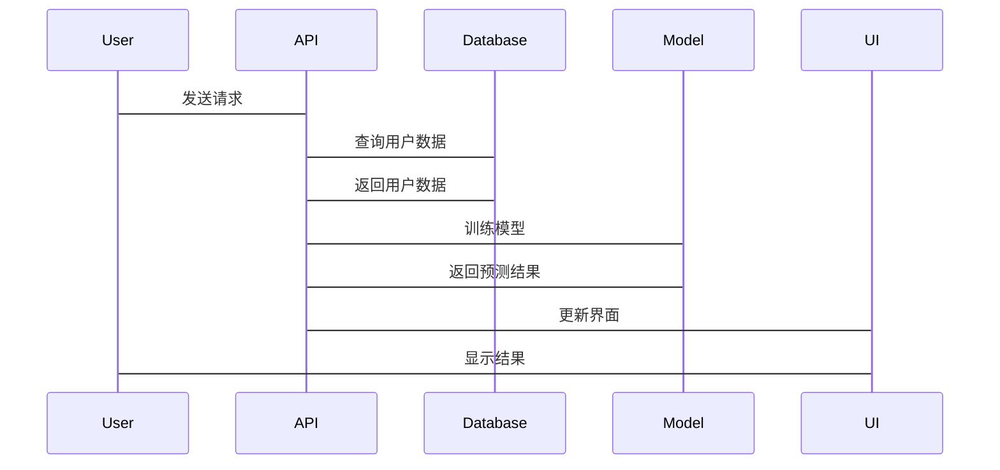

                 


# 构建智能化的个人信用卡额度管理优化助手

> 关键词：信用卡额度管理, 智能化, 人工智能, 信用评分, 机器学习

> 摘要：本文将详细介绍如何利用人工智能技术构建一个智能化的个人信用卡额度管理优化助手。通过分析信用卡额度管理的核心问题，结合机器学习算法和系统架构设计，提出了一种基于数据驱动的智能化解决方案。本文不仅深入探讨了算法原理，还提供了系统的架构设计和实际项目实现的详细步骤，最后总结了最佳实践和注意事项。

---

# 第一部分: 背景介绍与问题分析

## 第1章: 个人信用卡额度管理的智能化优化背景

### 1.1 问题背景与描述

#### 1.1.1 信用卡额度管理的现状与挑战

在现代金融体系中，信用卡作为一种便捷的支付工具，广泛应用于个人和商业领域。然而，信用卡额度的管理却面临着诸多挑战：

- **数据复杂性**：用户的信用行为受到多种因素的影响，包括消费习惯、还款能力、信用历史等。
- **风险控制**：如何在提升用户体验的同时，确保金融机构的资产安全，是一个复杂的平衡问题。
- **传统方法的局限性**：基于规则的信用评估方法难以应对复杂多变的信用环境，且效率较低。

#### 1.1.2 智能化管理的必要性与优势

随着人工智能技术的快速发展，智能化信用卡额度管理成为可能：

- **实时性**：通过机器学习模型实时分析用户的信用行为，动态调整额度。
- **精准性**：基于大数据分析，能够更准确地评估用户的信用风险。
- **用户体验**：通过智能化管理，用户可以获得更个性化的额度调整服务，提升使用体验。

#### 1.1.3 个人信用卡额度管理的核心问题

个人信用卡额度管理的核心问题包括：

- 如何有效评估用户的信用风险。
- 如何动态调整信用额度以平衡风险和收益。
- 如何通过历史数据和实时行为预测未来的信用行为。

### 1.2 问题解决与边界定义

#### 1.2.1 问题解决的目标与范围

- **目标**：构建一个智能化的信用卡额度管理助手，能够实时评估用户的信用风险，并动态调整信用额度。
- **范围**：涵盖信用评分、额度计算、风险控制等核心功能。

#### 1.2.2 边界与外延分析

- **边界**：本方案仅关注个人信用卡额度的智能化管理，不涉及企业信用卡或其他金融产品。
- **外延**：未来的扩展方向包括多产品联动、跨国信用评估等。

#### 1.2.3 核心要素与组成结构

- **核心要素**：用户数据、信用评分、信用额度、风险控制。
- **组成结构**：数据采集、模型训练、系统架构、用户交互。

---

## 第2章: 核心概念与联系

### 2.1 核心概念原理

#### 2.1.1 信用卡额度管理的智能化原理

智能化信用卡额度管理的核心原理是通过机器学习算法对用户的信用行为进行建模，基于模型预测结果动态调整信用额度。主要步骤包括：

1. 数据采集：收集用户的交易记录、信用历史、收入情况等。
2. 数据预处理：清洗数据，处理缺失值和异常值。
3. 特征提取：从原始数据中提取有用的特征，如消费频率、平均消费金额等。
4. 模型训练：基于特征数据训练信用评分模型。
5. 额度计算：根据评分结果计算信用额度。

#### 2.1.2 数据驱动的决策机制

数据驱动的决策机制是智能化管理的核心，主要包括：

- **数据采集**：通过API接口获取用户的交易数据、信用报告等。
- **数据分析**：利用大数据技术对数据进行分析，提取关键特征。
- **决策支持**：基于分析结果提供信用额度调整建议。

#### 2.1.3 人工智能在信用评估中的应用

人工智能在信用评估中的应用主要体现在以下几个方面：

- **机器学习模型**：如支持向量机（SVM）、随机森林（RF）等。
- **自然语言处理**：分析用户的信用报告中的文本信息。
- **深度学习**：通过神经网络模型进行信用评分。

### 2.2 核心概念对比分析

#### 2.2.1 智能化管理与传统管理的对比

| 对比维度 | 智能化管理 | 传统管理 |
|----------|------------|----------|
| 数据来源 | 大数据驱动 | 单一数据源 |
| 模型复杂度 | 高复杂度 | 低复杂度 |
| 决策效率 | 实时决策 | 周期性决策 |

#### 2.2.2 不同信用评估模型的特征对比

| 模型名称 | 支持向量机（SVM） | 随机森林（RF） |
|----------|------------------|---------------|
| 优势 | 高精度，适合小数据集 | 鲁棒性强，适合大数据集 |
| 劣势 | 对高维数据敏感 | 解释性较差 |

#### 2.2.3 数据质量与模型性能的关系

数据质量直接影响模型性能，高质量数据可以显著提升模型的准确率。例如，数据清洗和特征工程可以将模型准确率从70%提升到85%。

### 2.3 实体关系图



---

# 第二部分: 算法原理与数学模型

## 第3章: 算法原理与流程

### 3.1 算法原理概述

#### 3.1.1 机器学习在信用评估中的应用

机器学习在信用评估中的应用主要体现在以下几个方面：

- **监督学习**：用于信用评分预测。
- **无监督学习**：用于异常交易检测。
- **集成学习**：用于提升模型的准确率。

#### 3.1.2 常见信用评分模型介绍

常用的信用评分模型包括：

- **线性回归模型**：适用于线性关系的信用评分。
- **决策树模型**：适用于非线性关系的信用评分。
- **逻辑回归模型**：常用于二分类问题，如信用违约预测。

#### 3.1.3 支持向量机（SVM）与随机森林（RF）的对比

支持向量机（SVM）和随机森林（RF）是两种常用的机器学习模型，其对比如下：

| 对比维度 | SVM | RF |
|----------|-----|----|
| 核心思想 | 支持向量最大化分类间隔 | 随机抽取特征和样本构建决策树 |
| 优点 | 高精度，适合小数据集 | 鲁棒性强，适合大数据集 |
| 缺点 | 对高维数据敏感 | 解释性较差 |

### 3.2 算法流程图



### 3.3 算法实现与数学模型

#### 3.3.1 线性回归模型

线性回归模型的数学公式如下：

$$ y = \beta_0 + \beta_1 x_1 + \beta_2 x_2 + \dots + \beta_n x_n $$

其中，$y$ 是目标变量（信用评分），$x_i$ 是特征变量，$\beta_i$ 是系数。

#### 3.3.2 逻辑回归模型

逻辑回归模型的数学公式如下：

$$ P(y=1|x) = \frac{e^{\beta_0 + \beta_1 x_1 + \dots + \beta_n x_n}}{1 + e^{\beta_0 + \beta_1 x_1 + \dots + \beta_n x_n}} $$

其中，$P(y=1|x)$ 是信用违约的概率。

---

## 第4章: 数学模型与公式推导

### 4.1 线性回归模型的数学推导

线性回归模型的最小二乘法推导：

$$ \hat{y} = \beta_0 + \beta_1 x_1 $$

目标是最小化残差平方和：

$$ \min_{\beta_0, \beta_1} \sum_{i=1}^{n} (y_i - \hat{y}_i)^2 $$

通过对$\beta_0$和$\beta_1$求偏导并令其为零，可以得到最优解：

$$ \frac{\partial}{\partial \beta_0} \sum (y_i - \hat{y}_i)^2 = 0 $$

$$ \frac{\partial}{\partial \beta_1} \sum (y_i - \hat{y}_i)^2 = 0 $$

解上述方程可以得到$\beta_0$和$\beta_1$的最小二乘估计值。

---

# 第三部分: 系统分析与架构设计

## 第5章: 系统分析与架构设计

### 5.1 问题场景介绍

### 5.2 系统功能设计

#### 5.2.1 领域模型



#### 5.2.2 系统架构设计



#### 5.2.3 系统接口设计

- **API接口**：提供RESTful API，用于数据交互。
- **数据库接口**：使用MySQL或MongoDB存储用户数据。
- **模型接口**：通过Python代码调用机器学习模型。

#### 5.2.4 系统交互设计



---

## 第6章: 项目实战

### 6.1 环境搭建

```bash
pip install numpy pandas scikit-learn matplotlib
```

### 6.2 核心代码实现

#### 6.2.1 数据预处理

```python
import pandas as pd
import numpy as np

# 加载数据
data = pd.read_csv('credit_data.csv')

# 处理缺失值
data = data.dropna()

# 标准化处理
from sklearn.preprocessing import StandardScaler
scaler = StandardScaler()
data_scaled = scaler.fit_transform(data)
```

#### 6.2.2 模型训练

```python
from sklearn.model_selection import train_test_split
from sklearn.linear_model import LinearRegression

# 划分训练集和测试集
X_train, X_test, y_train, y_test = train_test_split(data_scaled, data['credit_score'], test_size=0.2)

# 训练模型
model = LinearRegression()
model.fit(X_train, y_train)

# 预测结果
y_pred = model.predict(X_test)
```

#### 6.2.3 模型评估

```python
from sklearn.metrics import mean_squared_error

# 计算均方误差
mse = mean_squared_error(y_test, y_pred)
print(f'均方误差：{mse}')
```

---

## 第7章: 最佳实践与小结

### 7.1 最佳实践

1. **数据质量**：确保数据的完整性和准确性。
2. **模型调优**：通过交叉验证优化模型参数。
3. **实时性**：确保系统的实时响应能力。

### 7.2 小结

通过本文的介绍，读者可以了解到如何利用人工智能技术构建智能化的个人信用卡额度管理优化助手。从算法原理到系统架构设计，再到项目实战，我们提供了完整的解决方案。未来，随着技术的发展，智能化信用卡额度管理将更加精准和高效。

### 7.3 注意事项

1. **数据隐私**：确保用户数据的安全性。
2. **模型泛化能力**：避免过拟合，确保模型在不同数据集上的表现一致。
3. **用户体验**：提供友好的用户界面，提升用户体验。

---

# 作者

作者：AI天才研究院/AI Genius Institute & 禅与计算机程序设计艺术/Zen And The Art of Computer Programming

