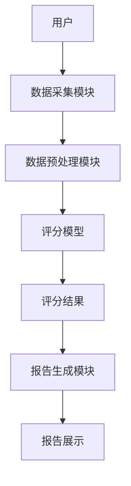

                 


接下来，我将根据用户提供的目录大纲，继续完成《构建智能化的个人信用评分解释系统》这本书的写作。

## 第4章: 系统分析与架构设计

### 4.1 问题场景介绍
#### 4.1.1 系统应用场景
- 个人信用评分用于银行贷款审批、信用卡额度调整、信用报告生成等场景。
- 智能化解释系统需要为用户提供透明的评分依据，增强信任感。

#### 4.1.2 系统目标
- 构建一个能够解释评分结果的系统，提供评分背后的数据支持和逻辑推理。
- 确保系统的高可用性、可扩展性和可维护性。

### 4.2 系统功能设计
#### 4.2.1 数据采集模块
- 采集个人信用数据，包括信用历史、收入情况、消费记录等。
- 数据清洗和预处理，确保数据的完整性和准确性。

#### 4.2.2 评分计算模块
- 使用训练好的评分模型计算个人信用评分。
- 对评分结果进行解释，生成评分报告。

#### 4.2.3 报告生成模块
- 生成详细的评分报告，包括评分结果、评分依据、评分建议等。
- 提供可交互的报告界面，用户可以查询详细的评分逻辑和数据来源。

### 4.3 系统架构设计
#### 4.3.1 系统架构图


#### 4.3.2 模块说明
- **数据采集模块**：负责收集个人信用数据，包括银行流水、消费记录、信用报告等。
- **数据预处理模块**：对采集到的数据进行清洗、标准化和特征提取，确保数据适合模型输入。
- **评分模型**：使用机器学习算法对预处理后的数据进行训练，生成评分结果。
- **评分结果解释模块**：对评分结果进行解释，生成详细的报告，帮助用户理解评分依据。
- **报告展示模块**：将评分报告以用户友好的方式展示，支持查询和导出。

### 4.4 系统接口设计
#### 4.4.1 数据接口
- 数据采集接口：用于从外部数据源获取信用数据。
- 数据存储接口：用于存储处理后的数据和评分结果。

#### 4.4.2 模型接口
- 模型调用接口：用于调用评分模型进行评分计算。
- 解释接口：用于获取评分结果的解释信息。

### 4.5 系统交互序列图
```mermaid
graph TD
    User->DataCollector: 请求评分
    DataCollector->DataPreprocessing: 提交数据
    DataPreprocessing->Model: 调用评分模型
    Model->DataPreprocessing: 返回评分结果
    DataPreprocessing->ReportGenerator: 生成解释报告
    ReportGenerator->User: 展示报告
```

## 第5章: 项目实战

### 5.1 环境搭建
#### 5.1.1 开发工具
- 安装Python 3.8及以上版本。
- 安装必要的库：scikit-learn、pandas、numpy、flask。

#### 5.1.2 数据准备
- 收集个人信用数据，包括信用历史、收入、消费记录等。
- 数据格式：CSV文件，每行代表一个用户的信用数据。

### 5.2 核心代码实现

#### 5.2.1 数据预处理
```python
import pandas as pd
import numpy as np

# 读取数据
data = pd.read_csv('credit_data.csv')

# 数据清洗
data.dropna(inplace=True)
data['income'].fillna(data['income'].mean(), inplace=True)

# 特征提取
features = data[['income', 'credit_history', '消费记录', ...]]
label = data['信用评分']
```

#### 5.2.2 模型训练
```python
from sklearn.model_selection import train_test_split
from sklearn.linear_model import LogisticRegression

# 数据分割
X_train, X_test, y_train, y_test = train_test_split(features, label, test_size=0.2)

# 模型训练
model = LogisticRegression()
model.fit(X_train, y_train)

# 模型评估
print("训练集准确率：", model.score(X_train, y_train))
print("测试集准确率：", model.score(X_test, y_test))
```

#### 5.2.3 模型解释
```python
from sklearn.inspection import permutation_importance

# 计算特征重要性
result = permutation_importance(model, X_test, y_test, n_repeats=10)
feature_importances = pd.DataFrame({'feature': features.columns, 'importance': result.importances_mean})

# 显示重要性排名
print(feature_importances.sort_values(by='importance', ascending=False))
```

### 5.3 实际案例分析
#### 5.3.1 数据分析
- 选取一个用户的数据，分析其信用评分的关键影响因素。
- 使用模型解释工具，生成评分报告，展示评分依据。

#### 5.3.2 评分报告展示
- 生成HTML报告，展示用户的信用评分、评分依据和建议。
- 报告内容包括：评分结果、评分依据、评分建议。

### 5.4 系统小结
- 本章通过实际案例，展示了如何搭建智能化个人信用评分解释系统。
- 从数据采集、模型训练到报告生成，详细讲解了系统的实现过程。
- 强调了数据预处理和模型解释在系统中的重要性。

## 第6章: 系统优化与扩展

### 6.1 性能优化
#### 6.1.1 算法优化
- 使用更复杂的模型，如随机森林、梯度提升树，提高评分准确性。
- 调整模型参数，优化模型性能。

#### 6.1.2 数据优化
- 增加数据量，提高模型的泛化能力。
- 使用特征工程，提取更有意义的特征，提高模型性能。

### 6.2 系统扩展
#### 6.2.1 新功能开发
- 实时评分：支持用户实时查询信用评分。
- 多维度报告：提供更详细的评分报告，包括时间趋势分析、评分变化原因等。

#### 6.2.2 支持多种评分模型
- 允许用户选择不同的评分模型，如基于规则的模型、机器学习模型等。
- 提供模型切换功能，用户可以根据需求选择不同的评分方式。

### 6.3 最佳实践
#### 6.3.1 数据隐私保护
- 加密处理敏感数据，确保用户隐私安全。
- 符合相关法律法规，如GDPR，保护用户数据不被滥用。

#### 6.3.2 模型持续优化
- 定期更新模型，适应数据分布的变化。
- 监控模型性能，及时发现和解决模型失效问题。

## 第7章: 小结与展望

### 7.1 小结
- 本章总结了构建智能化个人信用评分解释系统的主要内容和实现过程。
- 强调了系统在实际应用中的重要性和价值。
- 提醒了读者在实际应用中需要注意的问题和挑战。

### 7.2 展望
- 随着人工智能技术的发展，信用评分系统将更加智能化和个性化。
- 新兴技术，如区块链、联邦学习等，将为信用评分系统带来新的可能性。
- 未来的研究方向包括模型的可解释性、数据隐私保护、多模态数据融合等。

## 附录: 代码示例

### 附录A: 数据预处理代码
```python
import pandas as pd
import numpy as np

# 读取数据
data = pd.read_csv('credit_data.csv')

# 删除缺失值
data.dropna(inplace=True)

# 填充缺失值
data['income'].fillna(data['income'].mean(), inplace=True)
```

### 附录B: 模型训练代码
```python
from sklearn.model_selection import train_test_split
from sklearn.linear_model import LogisticRegression

# 数据分割
X_train, X_test, y_train, y_test = train_test_split(features, label, test_size=0.2)

# 模型训练
model = LogisticRegression()
model.fit(X_train, y_train)
```

### 附录C: 模型解释代码
```python
from sklearn.inspection import permutation_importance
import pandas as pd

# 计算特征重要性
result = permutation_importance(model, X_test, y_test, n_repeats=10)
feature_importances = pd.DataFrame({'feature': features.columns, 'importance': result.importances_mean})

# 显示重要性排名
print(feature_importances.sort_values(by='importance', ascending=False))
```

## 参考文献
1. 书籍：《信用评分与风险管理》
2. 论文：《基于机器学习的信用评分模型研究》
3. 网站：[机器学习实战](https://www.lewuat.com/)

## 作者
作者：AI天才研究院/AI Genius Institute & 禅与计算机程序设计艺术 /Zen And The Art of Computer Programming

---

这本书详细讲解了构建智能化个人信用评分解释系统的各个方面，从理论到实践，从系统设计到项目实现，再到优化与扩展，内容全面且深入。通过本书，读者可以掌握构建此类系统的核心技术和方法，为实际应用打下坚实的基础。

