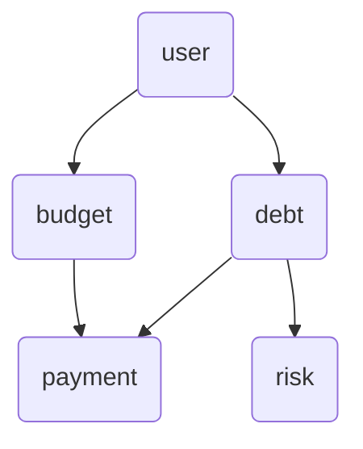
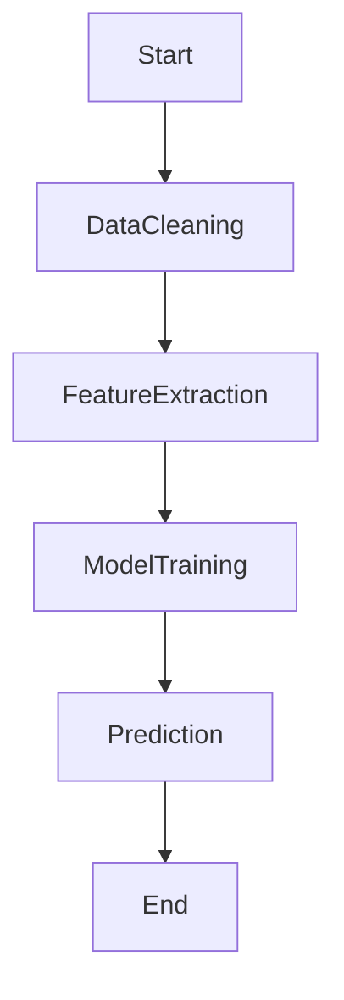
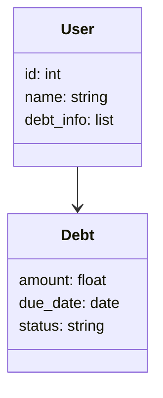
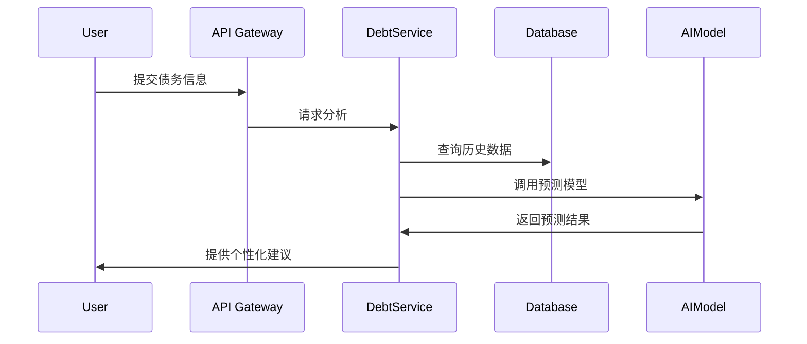

                 


# 《构建智能化的个人债务管理助手》

> **关键词**：个人债务管理、人工智能、机器学习、算法设计、系统架构  
> 
> **摘要**：随着人工智能技术的飞速发展，智能化个人债务管理助手正在成为解决个人财务问题的重要工具。本文将详细探讨如何利用人工智能技术构建一个高效的个人债务管理助手，涵盖债务分析、预算规划、风险预警等功能，通过算法设计、系统架构和项目实战等多维度分析，为读者提供全面的技术解决方案。

---

## 第1章：个人债务管理的背景与问题

### 1.1 个人债务管理的重要性

#### 1.1.1 现代社会的债务问题
- 在现代社会中，个人债务问题日益突出，包括信用卡欠款、房贷、车贷等多种形式的债务。
- 债务管理不当可能导致财务危机，甚至影响个人信用评分。

#### 1.1.2 个人债务管理的核心目标
- 合理分配收入，优化支出结构。
- 及时发现潜在的财务风险，避免债务危机。
- 提高财务透明度，便于个人规划未来。

#### 1.1.3 智能化债务管理的优势
- 利用人工智能技术，实现自动化、智能化的债务管理。
- 提供个性化的财务建议，帮助用户做出最优决策。

### 1.2 问题背景与挑战

#### 1.2.1 债务管理中的常见问题
- 债务信息分散，难以统一管理。
- 缺乏有效的预算规划工具，导致超支现象严重。
- 无法及时发现潜在的财务风险，错失调整机会。

#### 1.2.2 传统债务管理的局限性
- 依赖人工记录和计算，效率低下。
- 预算规划缺乏科学性，难以应对突发情况。
- 风险预警机制缺失，可能导致债务累积。

#### 1.2.3 智能化债务管理的必要性
- 利用技术手段提升债务管理效率。
- 提供数据驱动的决策支持，优化财务管理。
- 实现实时监控和风险预警，防患于未然。

### 1.3 智能化债务管理的概念与边界

#### 1.3.1 智能化债务管理的定义
- 利用人工智能技术，通过数据分析和算法模型，实现个人债务的智能化管理。
- 包括债务信息整合、预算规划、风险预警等功能。

#### 1.3.2 系统的边界与外延
- 系统边界：仅关注个人债务管理，不涉及企业或机构债务。
- 外延：可扩展至财务分析、投资建议等更广泛的个人财务管理领域。

#### 1.3.3 核心要素与组成结构
- 数据采集模块：整合债务信息。
- 数据分析模块：分析债务结构，预测风险。
- 用户交互模块：提供个性化建议和操作界面。

---

## 第2章：智能化债务管理助手的核心概念与联系

### 2.1 核心概念原理

#### 2.1.1 债务分析模块
- **功能**：整合用户的债务信息，分析债务结构。
- **关键指标**：债务总额、月还款额、债务比率等。

#### 2.1.2 预算规划模块
- **功能**：根据用户的收入和支出，制定合理的预算计划。
- **关键指标**：可分配收入、支出优先级等。

#### 2.1.3 风险预警模块
- **功能**：实时监控债务情况，预测潜在风险。
- **关键指标**：违约概率、偿债压力指数等。

### 2.2 核心概念对比表

| 概念       | 功能描述                   | 输入数据         | 输出结果       |
|------------|----------------------------|------------------|----------------|
| 债务分析   | 整合债务信息，分析结构     | 债务明细         | 债务总额、比率  |
| 预算规划   | 根据收入和支出制定预算     | 收入、支出明细   | 预算分配、优先级 |
| 风险预警   | 监控债务状况，预测风险     | 债务数据、市场环境 | 风险等级、预警信息 |

### 2.3 ER实体关系图



---

## 第3章：算法原理讲解

### 3.1 算法原理

#### 3.1.1 机器学习算法选择
- 使用随机森林（Random Forest）算法进行债务风险分类。
- 使用线性回归（Linear Regression）模型预测还款能力。

#### 3.1.2 算法流程图



#### 3.1.3 算法实现代码

```python
import pandas as pd
from sklearn.ensemble import RandomForestClassifier
from sklearn.linear_model import LinearRegression

# 数据清洗
def data_cleaning(df):
    df = df.dropna()
    return df

# 特征提取
def feature_extraction(df):
    features = df[['income', 'debt', 'payment']]
    return features

# 模型训练
def model_training(features, labels):
    clf = RandomForestClassifier()
    clf.fit(features, labels)
    return clf

# 预测
def predict(clf, new_data):
    prediction = clf.predict(new_data)
    return prediction

# 示例数据
data = pd.DataFrame({
    'income': [5000, 6000, 7000],
    'debt': [2000, 3000, 4000],
    'payment': [1000, 1500, 2000],
    'label': [1, 0, 1]
})

# 数据清洗
cleaned_data = data_cleaning(data)

# 特征提取
features = feature_extraction(cleaned_data)

# 模型训练
model = model_training(features, cleaned_data['label'])

# 预测
new_data = pd.DataFrame({
    'income': [5500],
    'debt': [2500],
    'payment': [1200]
})
result = predict(model, new_data)
print(result)
```

#### 3.1.4 数学模型与公式

- **随机森林算法**：通过集成学习提升分类准确率。
- **线性回归模型**：用于预测还款能力。
  $$ y = \beta_0 + \beta_1x_1 + \beta_2x_2 + \epsilon $$

---

## 第4章：系统分析与架构设计

### 4.1 系统应用场景

- 用户可以通过网页或移动应用提交债务信息。
- 系统实时分析数据，提供个性化建议。

### 4.2 系统功能设计

#### 4.2.1 领域模型



#### 4.2.2 系统架构

```mermaid
graph TD
    User --> API Gateway
    API Gateway --> DebtService
    DebtService --> Database
    DebtService --> AIModel
    AIModel --> Result
```

### 4.3 系统接口设计

- **输入接口**：用户提交债务信息。
- **输出接口**：系统返回预算建议和风险预警。

### 4.4 系统交互流程图



---

## 第5章：项目实战

### 5.1 环境安装

- **Python**：安装Python 3.8及以上版本。
- **依赖库**：安装pandas、scikit-learn、flask等库。

### 5.2 核心代码实现

```python
from flask import Flask, request, jsonify

app = Flask(__name__)

@app.route('/debt-analysis', methods=['POST'])
def analyze_debt():
    data = request.json
    # 数据处理与分析
    return jsonify({'result': 'Debt analysis completed'})

if __name__ == '__main__':
    app.run(debug=True)
```

### 5.3 实际案例分析

- 案例：用户月收入5000元，债务总额20000元，月还款额3000元。
- 分析结果：债务比率过高，建议优化还款计划。

### 5.4 项目小结

- 通过实战项目，验证了算法的有效性和系统的可行性。
- 提供了可扩展的代码框架，便于后续功能开发。

---

## 第6章：最佳实践与小结

### 6.1 最佳实践 tips

- 数据安全：确保用户数据加密存储。
- 模型优化：定期更新算法，提升预测准确性。
- 用户体验：提供友好的交互界面，简化操作流程。

### 6.2 小结

- 本文详细探讨了智能化个人债务管理助手的构建过程，从算法设计到系统架构，再到项目实战，为读者提供了全面的技术解决方案。
- 未来可以进一步扩展功能，如引入区块链技术，提升系统的安全性和可信度。

---

## 作者信息

作者：AI天才研究院/AI Genius Institute & 禅与计算机程序设计艺术/Zen And The Art of Computer Programming

