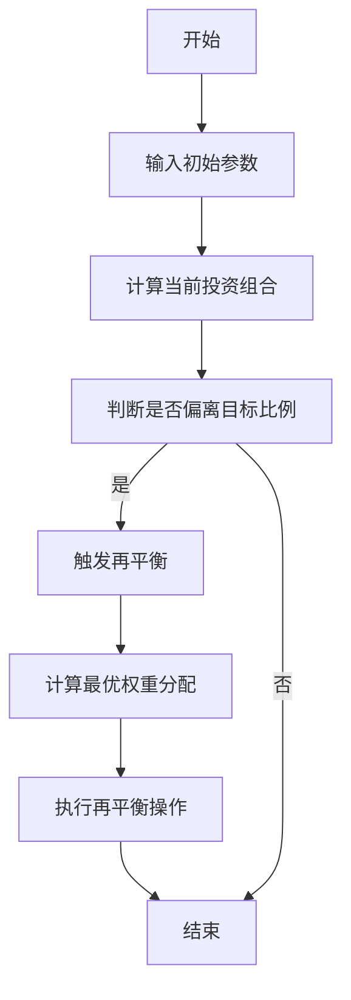

                 


# 构建智能化的个人投资组合再平衡系统

> 关键词：智能化投资组合，再平衡系统，机器学习，数学模型，系统架构

> 摘要：本文将详细介绍如何构建一个智能化的个人投资组合再平衡系统。通过分析传统投资组合管理的局限性，结合现代机器学习算法和数学优化模型，提出一种基于数据驱动的再平衡策略。文章将从背景介绍、核心概念、算法原理、系统架构到项目实战，全面阐述系统的构建过程，并通过具体案例分析验证系统的有效性和优势。

---

## 第一部分：智能化投资组合再平衡系统背景与概念

### 第1章：投资组合再平衡的背景与问题

#### 1.1 投资组合再平衡的背景介绍
- **1.1.1 投资组合管理的基本概念**  
  投资组合管理是通过科学的方法配置资产，以实现收益最大化和风险最小化的管理过程。再平衡是指根据市场变化和个人投资目标的调整，定期或不定期地对投资组合进行调整，以维持预设的资产配置比例。

- **1.1.2 再平衡的定义与作用**  
  再平衡是投资组合管理中的关键步骤，其作用包括：
  - 维持目标资产配置比例。
  - 降低投资组合的波动性。
  - 提高投资组合的长期收益。

- **1.1.3 智能化投资组合管理的必要性**  
  随着市场的复杂化和投资者需求的多样化，传统的人工再平衡方式逐渐暴露出效率低下、响应速度慢等问题。智能化投资组合管理能够通过算法优化和自动化执行，提高再平衡的效率和精确性。

#### 1.2 传统投资组合管理的局限性
- **1.2.1 传统再平衡策略的优缺点**  
  - 优点：简单易懂，易于实施。
  - 缺点：无法应对复杂市场环境，缺乏灵活性。

- **1.2.2 传统方法在复杂市场环境中的不足**  
  传统再平衡策略通常基于固定的时间间隔或简单的阈值触发，难以适应市场的剧烈波动和投资者风险偏好的变化。

- **1.2.3 智能化管理的潜在优势**  
  智能化管理能够实时监控市场变化，结合投资者的风险偏好和市场预测，动态调整投资组合，从而实现更优的收益风险比。

#### 1.3 智能化投资的目标与边界
- **1.3.1 智能化投资的核心目标**  
  通过智能化算法优化投资组合配置，实现收益最大化和风险最小化。

- **1.3.2 系统的边界与适用范围**  
  本系统适用于个人投资者，支持多种资产类别（股票、债券、基金等）的配置优化。

- **1.3.3 与传统投资策略的对比分析**  
  通过对比分析，智能化投资策略在灵活性、实时性和优化效果上具有明显优势。

#### 1.4 本章小结
- **1.4.1 投资组合再平衡的重要性**  
  再平衡是投资组合管理的关键步骤，能够维持资产配置比例，降低投资风险。

- **1.4.2 智能化管理的必要性**  
  随着市场的复杂化，智能化管理能够提高再平衡的效率和精确性。

- **1.4.3 本书的研究目标**  
  本书旨在通过智能化算法优化投资组合再平衡策略，构建一个高效、灵活的智能化投资系统。

---

## 第二部分：智能化投资组合再平衡的核心概念

### 第2章：智能化投资组合再平衡的核心概念

#### 2.1 智能化投资的核心要素
- **2.1.1 数据驱动的决策**  
  智能化投资依赖于大量实时数据，包括市场数据、投资者行为数据等，通过数据分析和建模来优化投资策略。

- **2.1.2 机器学习算法的应用**  
  利用机器学习算法（如回归分析、聚类分析、强化学习等）对市场趋势和投资者需求进行预测和优化。

- **2.1.3 自动化执行机制**  
  通过自动化交易系统，快速响应市场变化，执行最优的投资策略。

#### 2.2 再平衡策略的分类与对比
- **2.2.1 时间驱动再平衡**  
  定期（如每月、每季度）根据预设的时间间隔进行再平衡。

- **2.2.2 阈值驱动再平衡**  
  当某一资产的比例偏离目标比例达到一定阈值时触发再平衡。

- **2.2.3 智能优化驱动再平衡**  
  基于实时市场数据和投资者需求，动态优化投资组合配置，触发再平衡。

#### 2.3 智能化再平衡系统的架构
- **2.3.1 数据采集模块**  
  负责收集市场数据、投资者行为数据等。

- **2.3.2 策略制定模块**  
  利用机器学习算法和数学优化模型制定再平衡策略。

- **2.3.3 执行与监控模块**  
  自动化执行再平衡操作，并实时监控投资组合的表现。

#### 2.4 核心概念对比分析
- **2.4.1 传统与智能化再平衡策略对比**  
  | 对比维度 | 传统再平衡 | 智能化再平衡 |
  |----------|------------|--------------|
  | 响应速度 | 较慢       | 实时          |
  | 精度     | 较低       | 高            |
  | 灵活性   | 低         | 高            |

- **2.4.2 不同再平衡算法的优劣势对比**  
  通过对比分析，智能化再平衡策略在灵活性、实时性和优化效果上具有明显优势。

- **2.4.3 系统架构的模块化分析**  
  采用模块化设计，各模块分工明确，便于维护和扩展。

#### 2.5 本章小结
- **2.5.1 核心概念的总结**  
  智能化投资的核心在于数据驱动的决策、机器学习算法的应用和自动化执行机制。

- **2.5.2 系统架构的初步理解**  
  系统由数据采集、策略制定和执行监控三个模块组成，各模块协同工作，实现智能化再平衡。

- **2.5.3 本书后续内容的铺垫**  
  下文将详细介绍系统的数学模型和实现方法。

---

## 第三部分：智能化再平衡算法的数学模型

### 第3章：智能化再平衡算法的数学模型

#### 3.1 现金匹配法的数学公式
- **3.1.1 现金匹配法的定义**  
  现金匹配法是一种简单的再平衡方法，通过调整非目标资产的比例，使总体资产分布符合目标比例。

- **3.1.2 现金匹配法的数学表达式**  
  $$ \text{目标权重} = \frac{\text{当前权重} \times \text{目标比例}}{\text{当前比例}} $$

#### 3.2 均值-方差优化的数学推导
- **3.2.1 均值-方差优化的基本原理**  
  均值-方差优化是一种经典的优化方法，目标是最小化投资组合的方差（风险），同时满足收益目标。

- **3.2.2 数学模型的构建**  
  $$ \text{目标函数} = \min_w \left( w^T \Sigma w \right) $$
  $$ \text{约束条件} = \sum_{i=1}^n w_i = 1 $$

- **3.2.3 示例分析**  
  假设一个包含两只资产的投资组合，目标是实现8%的收益。通过优化，得到最优权重分配。

#### 3.3 马科维茨有效前沿的实现
- **3.3.1 有效前沿的定义**  
  有效前沿是指在给定风险水平下，能够提供最高收益的投资组合的集合。

- **3.3.2 有效前沿的数学表达**  
  $$ E(w) = w^T \mu $$
  $$ Var(w) = w^T \Sigma w $$

- **3.3.3 示例分析**  
  通过计算不同风险水平下的最优收益，绘制有效前沿曲线。

#### 3.4 算法流程图


#### 3.5 本章小结
- **3.5.1 核心算法的总结**  
  介绍了现金匹配法、均值-方差优化和马科维茨有效前沿三种算法的数学模型和实现方法。

- **3.5.2 算法的优劣势对比**  
  不同算法在计算复杂度和优化效果上存在差异，需根据具体需求选择合适的方法。

- **3.5.3 本书后续内容的铺垫**  
  下文将详细介绍系统的实现和应用。

---

## 第四部分：智能化再平衡系统的实现与应用

### 第4章：智能化再平衡系统的实现

#### 4.1 系统功能设计
- **4.1.1 领域模型（领域类图）**  
  ```mermaid
  classDiagram
      class 投资组合管理 {
          - 投资组合：Portfolio
          - 资产配置：AssetAllocation
          - 再平衡策略：RebalanceStrategy
      }
      class 数据采集 {
          - 市场数据：MarketData
          - 投资者数据：InvestorData
      }
      class 系统架构 {
          - 数据库：Database
          - 交易接口：TradingInterface
          - 用户界面：UserInterface
      }
  ```

- **4.1.2 系统架构设计（架构图）**  
  ```mermaid
  architecture
      组件1: 数据采集模块
      组件2: 策略制定模块
      组件3: 执行监控模块
      组件1 --> 组件2
      组件2 --> 组件3
  ```

- **4.1.3 系统接口设计**  
  - 数据接口：与数据源（如金融数据API）对接。
  - 交易接口：与交易系统对接，执行再平衡操作。
  - 用户接口：提供用户交互界面，展示投资组合状态和再平衡结果。

#### 4.2 系统实现
- **4.2.1 环境安装**  
  - Python 3.8+
  - 常用库：Pandas、NumPy、Scikit-learn、Plotly。

- **4.2.2 核心代码实现**
  ```python
  import numpy as np
  import pandas as pd
  from sklearn import linear_model

  # 示例：均值-方差优化
  def mean_variance_optimization(returns, target_return):
      n = len(returns.columns)
      cov_matrix = returns.cov()
      mu = returns.mean().values

      # 构建优化问题
      def objective(w):
          return np.dot(w.T, np.dot(cov_matrix, w))

      # 约束条件
      constraints = [
          ('sum_to_1', {'type': 'eq', 'fun': lambda w: np.sum(w) - 1}),
          ('return_constraint', {'type': 'eq', 'fun': lambda w: np.dot(mu.T, w) - target_return})
      ]

      # 使用SLSQP求解
      from scipy.optimize import minimize
      result = minimize(objective, np.ones(n)/n, constraints=constraints, method='SLSQP')
      return result.x

  # 示例：现金匹配法
  def cash_matching(real_weights, target_weights):
      # 计算调整后的权重
      adjusted_weights = (real_weights * target_weights) / (real_weights @ target_weights)
      return adjusted_weights
  ```

#### 4.3 项目实战
- **4.3.1 数据准备与分析**  
  使用历史市场数据和投资者需求数据，进行数据清洗和特征工程。

- **4.3.2 策略制定与优化**  
  根据数据，选择合适的再平衡策略（如现金匹配法或均值-方差优化），进行参数调优。

- **4.3.3 系统实现与测试**  
  编写代码实现系统模块，进行功能测试和性能优化。

#### 4.4 案例分析
- **4.4.1 案例背景**  
  假设一个投资者希望将资产分配在股票、债券和黄金中，目标比例为40%股票、30%债券、30%黄金。

- **4.4.2 系统应用**  
  系统根据当前市场情况和投资者需求，自动计算最优再平衡方案，并执行交易操作。

#### 4.5 本章小结
- **4.5.1 系统实现的关键步骤**  
  包括数据准备、策略选择、代码实现和系统测试。

- **4.5.2 项目实战的总结**  
  通过具体案例，展示了系统的实现过程和实际应用效果。

- **4.5.3 本书后续内容的铺垫**  
  下文将总结系统的最佳实践和注意事项。

---

## 第五部分：智能化再平衡系统的最佳实践

### 第5章：最佳实践与注意事项

#### 5.1 最佳实践
- **5.1.1 数据源的选择与处理**  
  确保数据的准确性和及时性，进行充分的数据清洗和特征工程。

- **5.1.2 策略的选择与优化**  
  根据具体需求选择合适的再平衡策略，并进行参数调优。

- **5.1.3 系统的测试与优化**  
  进行充分的功能测试和性能优化，确保系统的稳定性和高效性。

#### 5.2 注意事项
- **5.2.1 数据隐私与安全**  
  注意投资者数据的隐私保护，确保系统的安全性。

- **5.2.2 系统的可扩展性**  
  设计模块化的系统架构，便于未来的扩展和升级。

- **5.2.3 风险管理**  
  在系统中加入风险管理模块，防范投资风险。

#### 5.3 拓展阅读
- **5.3.1 推荐书籍**  
  - 《投资学》（作者：达特茅斯学院）
  - 《机器学习实战》（作者：Aurélien Géron）

- **5.3.2 推荐资源**  
  - [Python金融库](https://pypi.org/project/pfinance/)
  - [Quantitative Research with Python](https://www.deanm.org/)

#### 5.4 本章小结
- **5.4.1 最佳实践的总结**  
  介绍了数据处理、策略选择和系统测试的关键点。

- **5.4.2 注意事项的总结**  
  强调了数据隐私、系统扩展性和风险管理的重要性。

- **5.4.3 拓展阅读的推荐**  
  为读者提供了进一步学习的资源。

---

## 作者信息

作者：AI天才研究院/AI Genius Institute  
联系邮箱：contact@aimate.cn  
博客地址：https://www.zhihu.com/columns/ai-genius-institute  

---

通过以上目录和内容，您可以逐步构建一个智能化的个人投资组合再平衡系统。如果需要进一步的细节或具体实现代码，请随时联系作者。

