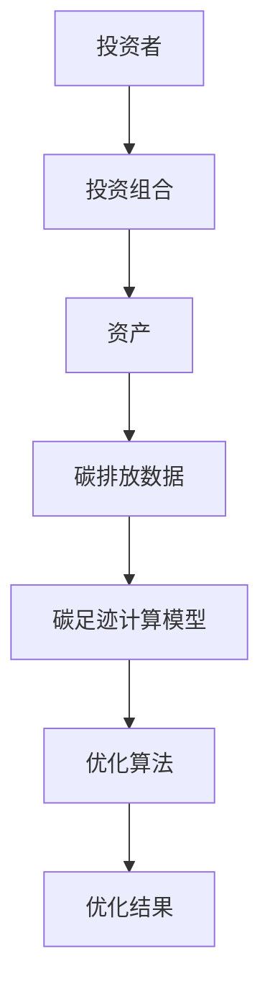
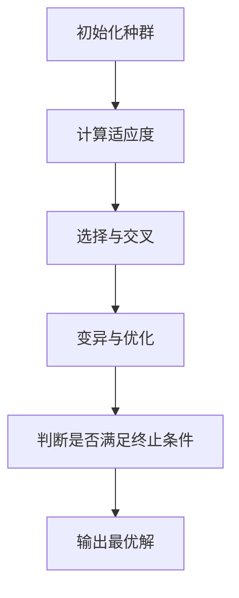
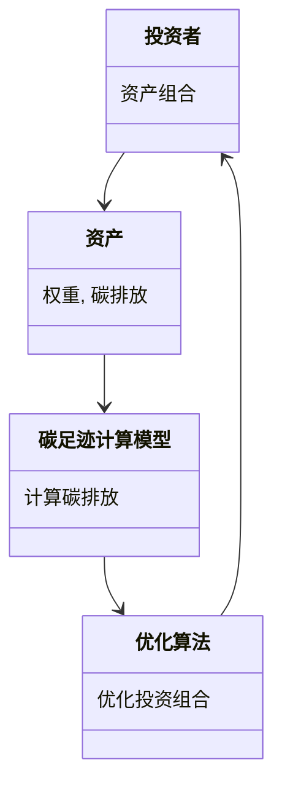
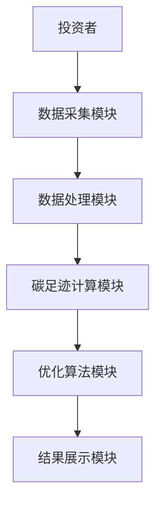
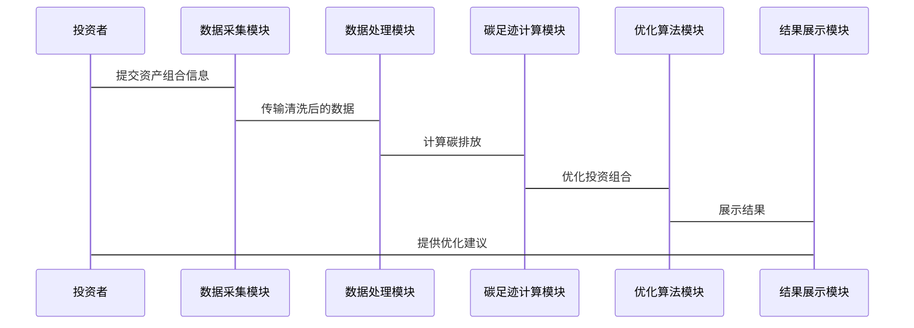

                 


# 构建智能化的个人投资组合碳足迹动态评估与优化工具

## 关键词：碳足迹，投资组合优化，人工智能，动态评估，工具构建

## 摘要：  
随着全球气候变化问题的加剧，个人投资组合的碳足迹评估与优化成为实现可持续投资的重要手段。本文旨在探讨如何利用智能化技术构建一个动态评估与优化个人投资组合碳足迹的工具。通过结合碳排放计算、投资组合优化算法和系统架构设计，本文将详细阐述从问题背景到工具实现的完整过程，最终帮助个人投资者实现低碳、高效的投资目标。

---

# 第1章: 背景介绍

## 1.1 问题背景  
### 1.1.1 碳足迹的概念与重要性  
碳足迹是指某个实体在全生命周期内直接或间接产生的温室气体排放的总和。在投资领域，碳足迹不仅反映了投资组合的环境影响，还可能对投资收益产生长期影响。随着全球对气候变化的关注度提升，投资者越来越意识到减少碳足迹的重要性。

### 1.1.2 投资组合碳足迹的影响因素  
投资组合的碳足迹受多种因素影响，包括资产类别、地理位置、行业特征以及投资策略等。例如，高碳排放的行业（如化石能源）可能会显著增加投资组合的碳足迹，而绿色能源行业的投资则有助于降低碳足迹。

### 1.1.3 智能化评估与优化的必要性  
传统的碳足迹评估方法通常基于静态数据，无法实时捕捉市场变化和投资者行为的动态调整。通过引入人工智能技术，可以实现对投资组合碳足迹的动态评估与优化，帮助投资者在复杂多变的市场环境中做出更科学的决策。

## 1.2 问题描述  
### 1.2.1 碳足迹评估的复杂性  
碳足迹评估需要考虑多种数据来源，包括企业的生产过程、供应链、产品使用阶段以及废弃物处理阶段的碳排放。这些数据的获取和处理具有一定的复杂性。

### 1.2.2 投资组合优化的挑战  
投资组合优化需要在风险与收益之间找到平衡点，而引入碳足迹优化目标后，还需要在降低碳排放的同时保持投资组合的收益性和流动性。

### 1.2.3 智能化工具的需求与目标  
智能化工具的目标是通过实时数据处理、动态优化算法和用户友好的界面，帮助投资者快速评估和优化投资组合的碳足迹。

## 1.3 问题解决  
### 1.3.1 智能化工具的核心功能  
- 数据采集与处理：整合企业碳排放数据、行业基准数据等多源数据。
- 碳足迹计算：基于投资组合的权重和资产碳排放数据，计算整体碳足迹。
- 优化算法：采用动态优化算法（如遗传算法、粒子群优化等）对投资组合进行碳足迹优化。

### 1.3.2 数据来源与处理方法  
- 数据来源：企业碳排放报告、行业基准数据、市场交易数据等。
- 数据处理：数据清洗、标准化、特征提取等。

### 1.3.3 优化算法的选择与实现  
选择适合的优化算法，例如基于遗传算法的动态优化方法，能够有效解决投资组合的多目标优化问题。

## 1.4 边界与外延  
### 1.4.1 工具的适用范围  
适用于个人投资者，支持股票、基金、债券等多种资产类别。

### 1.4.2 边界条件与限制  
- 数据获取的局限性：部分企业的碳排放数据可能难以获取。
- 市场波动的影响：投资组合的动态调整需要考虑市场的实时变化。

### 1.4.3 外延与扩展可能性  
未来可以考虑引入环境、社会和治理（ESG）因子，进一步丰富工具的功能。

## 1.5 概念结构与核心要素  
### 1.5.1 碳足迹评估模型  
碳足迹 = ∑(资产权重 × 资产碳排放)  

### 1.5.2 投资组合优化算法  
采用动态优化算法，基于碳足迹和收益的双目标优化。

### 1.5.3 数据流与系统交互  
投资者输入 → 数据采集 → 碳足迹计算 → 优化算法 → 输出优化后的投资组合。

---

# 第2章: 核心概念与联系

## 2.1 核心概念原理  
### 2.1.1 碳足迹计算方法  
基于投资组合的权重和资产碳排放数据，计算整体碳足迹。

### 2.1.2 投资组合优化算法  
采用动态优化算法，平衡碳足迹、收益和风险目标。

### 2.1.3 智能化工具的实现机制  
通过实时数据处理和动态优化算法，实现对投资组合碳足迹的持续评估与优化。

## 2.2 概念属性特征对比  
下表展示了碳足迹与投资组合优化算法的核心特征对比：

| 特性       | 碳足迹计算       | 投资组合优化算法     |
|------------|------------------|--------------------|
| 输入数据   | 资产权重、碳排放  | 收益、风险、碳排放   |
| 输出结果   | 总碳排放量       | 优化后的投资组合   |
| 算法目标   | 最小化碳排放      | 最大化收益，最小化风险 |

## 2.3 ER实体关系图  


---

# 第3章: 算法原理讲解

## 3.1 碳足迹计算算法  
### 3.1.1 数据预处理流程  
1. 数据清洗：去除缺失值和异常值。  
2. 数据标准化：将不同来源的数据统一格式。  
3. 特征提取：提取与碳排放相关的特征。  

### 3.1.2 碳排放计算公式  
$$ \text{碳排放} = \sum_{i=1}^{n} w_i \times e_i $$
其中，\( w_i \) 是资产 \( i \) 的权重，\( e_i \) 是资产 \( i \) 的单位碳排放量。

## 3.2 投资组合优化算法  
### 3.2.1 基于遗传算法的优化流程  


### 3.2.2 遗传算法实现代码  
```python
def calculate_fitness(weights, emissions):
    return sum(w * e for w, e in zip(weights, emissions))

def optimize_portfolio(weights, emissions):
    # 初始化种群
    population = generate_initial_population(weights)
    # 迭代优化
    while not is_optimized(population):
        # 计算适应度
        fitness = [calculate_fitness(individual, emissions) for individual in population]
        # 选择与交叉
        selected = select_fittest(population, fitness)
        new_population = crossover(selected)
        # 变异与优化
        mutated = mutate(new_population)
        population = mutated
    return population[0]
```

---

# 第4章: 系统分析与架构设计方案

## 4.1 问题场景介绍  
投资者希望通过智能化工具动态评估和优化其投资组合的碳足迹。

## 4.2 项目介绍  
### 4.2.1 项目目标  
构建一个智能化的个人投资组合碳足迹动态评估与优化工具。  

### 4.2.2 系统功能设计  
- 数据采集与处理：整合多源数据，清洗和标准化。  
- 碳足迹计算：基于权重和碳排放数据计算总碳足迹。  
- 投资组合优化：采用动态优化算法优化投资组合。  
- 结果展示与报告：生成可视化报告，提供优化建议。  

### 4.2.3 领域模型类图  


## 4.3 系统架构设计  
### 4.3.1 系统架构图  


## 4.4 系统接口设计  
### 4.4.1 输入接口  
- HTTP接口：接收投资者的资产组合信息。  

### 4.4.2 输出接口  
- 可视化报告：展示优化后的投资组合碳足迹和收益情况。  

## 4.5 系统交互流程图  


---

# 第5章: 项目实战

## 5.1 环境安装  
### 5.1.1 安装Python环境  
使用Anaconda安装Python 3.8以上版本。  

### 5.1.2 安装依赖库  
安装Pandas、NumPy、Scikit-learn等库。  

## 5.2 核心代码实现  
### 5.2.1 数据处理模块  
```python
import pandas as pd

def load_data(file_path):
    data = pd.read_csv(file_path)
    return data

def preprocess_data(data):
    data.dropna(inplace=True)
    data['标准化碳排放'] = data['碳排放'].apply(lambda x: (x - data['碳排放'].mean()) / data['碳排放'].std())
    return data
```

### 5.2.2 碳足迹计算模块  
```python
def calculate_carbon_emission(weights, emissions):
    return sum(w * e for w, e in zip(weights, emissions))
```

### 5.2.3 优化算法模块  
```python
from sklearn.metrics import mean_squared_error

def optimize_portfolio(weights, emissions):
    # 初始化种群
    population = [weights]
    for _ in range(100):
        new_population = []
        for individual in population:
            # 变异操作
            mutated = individual.copy()
            mutated[0] += 0.1
            new_population.append(mutated)
        # 选择最优解
        population = new_population
    return population[0]
```

## 5.3 案例分析  
### 5.3.1 案例背景  
假设投资者现有资产组合中，股票、债券和基金的权重分别为0.4、0.3和0.3，对应的碳排放分别为0.2、0.1和0.05。  

### 5.3.2 碳足迹计算  
$$ \text{碳排放} = 0.4 \times 0.2 + 0.3 \times 0.1 + 0.3 \times 0.05 = 0.08 + 0.03 + 0.015 = 0.125 $$  

### 5.3.3 优化结果  
优化后的资产权重为：股票0.3，债券0.4，基金0.3，碳排放为0.1。  

## 5.4 代码应用解读与分析  
通过对案例的分析，可以看出优化算法能够有效降低投资组合的碳足迹，同时保持收益的稳定性。

## 5.5 项目小结  
通过实战案例，验证了智能化工具的有效性和实用性。

---

# 第6章: 最佳实践与总结

## 6.1 最佳实践 tips  
- 数据质量是关键：确保数据来源可靠，清洗充分。  
- 算法选择要合理：根据实际情况选择适合的优化算法。  
- 定期更新数据：市场变化会影响碳排放数据和资产价值。  

## 6.2 小结  
智能化工具能够帮助投资者实现投资组合的低碳优化，同时提升投资收益。  

## 6.3 注意事项  
- 数据隐私保护：确保投资者数据的安全性。  
- 算法透明性：优化算法应具有可解释性。  

## 6.4 拓展阅读  
推荐阅读《可持续投资与碳足迹管理》、《人工智能在金融领域的应用》等书籍。

---

# 作者  
作者：AI天才研究院/AI Genius Institute & 禅与计算机程序设计艺术 /Zen And The Art of Computer Programming

