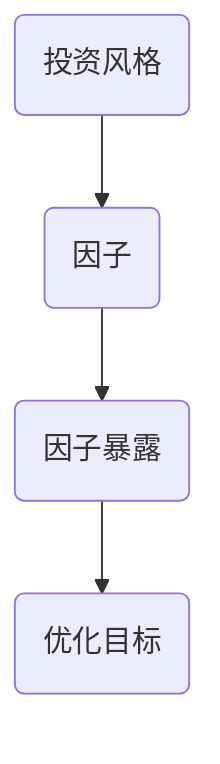

                 


# 构建智能化的个人投资风格因子暴露优化系统

## 关键词：投资风格、因子暴露、优化算法、系统架构、机器学习

## 摘要：本文详细探讨了构建智能化个人投资风格因子暴露优化系统的背景、核心概念、算法原理、系统架构及项目实现。通过数学模型和机器学习算法，优化投资风格的因子暴露，实现智能化投资管理。

---

# 第1章: 投资风格因子暴露优化的背景与问题定义

## 1.1 投资风格与因子暴露的定义

### 1.1.1 投资风格的定义与分类

投资风格是投资者在构建投资组合时所遵循的一套特定规则或策略。常见的投资风格包括：

- **价值投资**：寻找被市场低估的股票。
- **成长投资**：投资于具有高增长潜力的公司。
- **指数投资**：跟踪市场指数的投资方式。
- **趋势投资**：根据市场趋势进行买卖决策。

### 1.1.2 因子暴露的概念与作用

因子暴露是指投资组合中对特定风险因子的敏感程度。常见的风险因子包括市值、价值、动量等。因子暴露帮助投资者了解投资组合在不同市场条件下的表现。

### 1.1.3 智能化优化的必要性

传统投资风格管理依赖主观判断，容易受市场波动和情绪影响。通过智能化优化，利用大数据和算法，提高投资决策的科学性和效率。

## 1.2 问题背景与挑战

### 1.2.1 传统投资风格管理的局限性

传统方法依赖经验判断，缺乏系统性和数据支持，难以应对复杂市场环境。

### 1.2.2 数据驱动与智能化优化的需求

随着大数据和AI技术的发展，利用数据驱动的方法优化投资组合成为趋势。

### 1.2.3 当前市场环境下的新挑战

市场波动加剧、信息爆炸、投资者行为多样化，传统方法难以适应。

## 1.3 问题描述与目标

### 1.3.1 投资风格因子暴露的优化目标

通过优化因子暴露，提升投资组合的风险调整后收益。

### 1.3.2 系统构建的核心问题

如何利用算法优化因子暴露，构建高效的个性化投资系统。

### 1.3.3 边界与外延

系统聚焦于因子暴露优化，边界包括数据来源、优化算法选择和系统架构设计。

## 1.4 系统构建的核心要素

### 1.4.1 数据来源与处理

包括市场数据、历史价格、财务数据等，需要进行清洗和预处理。

### 1.4.2 优化算法的选择

遗传算法、模拟退火等，用于优化因子权重。

### 1.4.3 系统架构的设计

模块化设计，包括数据处理、算法优化、结果展示等模块。

---

# 第2章: 投资风格因子暴露的核心概念

## 2.1 因子暴露的数学模型

### 2.1.1 因子暴露的定义公式

$$ \text{因子暴露} = \sum_{i=1}^{n} w_i \beta_i $$

其中，\(w_i\)是第i个资产的权重，\(\beta_i\)是其对因子的敏感度。

### 2.1.2 多因子模型的构建

多因子模型将资产收益分解为多个因子的线性组合，常用Fama-French三因子模型。

### 2.1.3 因子权重的动态调整

通过优化算法动态调整因子权重，适应市场变化。

## 2.2 投资风格与因子暴露的关系

### 2.2.1 投资风格的多维度分解

投资风格可以分解为多个因子的组合，例如市值、价值、动量等。

### 2.2.2 因子暴露对投资风格的影响

因子暴露决定了投资风格对不同市场的敏感程度，影响组合收益和风险。

### 2.2.3 智能化优化的目标函数

$$ \text{目标函数} = \text{最大化收益} - \text{最小化风险} $$

## 2.3 核心概念属性对比表

| 概念 | 定义 | 作用 |
|------|------|------|
| 投资风格 | 投资策略 | 确定投资组合的构成 |
| 因子暴露 | 敏感度 | 量化对各因子的敏感程度 |

## 2.4 系统架构的ER实体关系图



---

# 第3章: 优化算法原理与实现

## 3.1 常用优化算法概述

### 3.1.1 遗传算法

遗传算法模拟生物进化，通过选择、交叉和变异操作优化解。

### 3.1.2 模拟退火算法

模拟退火算法通过逐步降低温度，跳出局部最优，找到全局最优。

### 3.1.3 梯度下降算法

梯度下降通过求导数，沿着负梯度方向最小化目标函数。

## 3.2 基于机器学习的优化算法

### 3.2.1 支持向量机在优化中的应用

SVM用于分类和回归，可应用于因子权重优化。

### 3.2.2 神经网络优化方法

深度学习模型可学习复杂非线性关系，优化因子权重。

### 3.2.3 集成学习策略

通过集成多个算法的结果，提高优化的准确性和鲁棒性。

## 3.3 优化算法的数学模型

### 3.3.1 拉格朗日乘数法

$$ L = f(x) + \lambda g(x) $$

用于有约束优化问题。

### 3.3.2 常见优化目标函数

$$ \text{最小化目标: } \min_{x} f(x) $$

---

# 第4章: 系统分析与架构设计

## 4.1 系统功能设计

模块化设计，包括数据处理、算法优化、结果展示。

## 4.2 系统架构设计

分层架构，数据层、逻辑层、表现层。

## 4.3 系统接口设计

定义API接口，实现模块间的通信。

## 4.4 系统交互流程

通过序列图展示系统各模块的交互过程。

---

# 第5章: 项目实战

## 5.1 环境安装

安装Python、NumPy、Pandas、Scikit-learn等依赖包。

## 5.2 核心实现

### 5.2.1 数据处理代码

```python
import pandas as pd

# 加载数据
data = pd.read_csv('market_data.csv')

# 数据预处理
data.dropna(inplace=True)
```

### 5.2.2 优化算法实现

```python
from sklearn.linear_model import LinearRegression

# 定义优化函数
def optimize(weights):
    # 计算收益和风险
    return -1 * (return_vector @ weights) + 1e-4 * (weights.T @ weights)

# 使用梯度下降优化
from scipy.optimize import minimize

result = minimize(optimize, initial_weights, method='SLSQP')
```

## 5.3 案例分析

通过具体案例展示系统的优化效果，分析优化后的因子暴露。

---

# 第6章: 总结与展望

## 6.1 总结

本文构建了一个智能化的投资风格因子暴露优化系统，结合了数学模型和机器学习算法，实现了个性化投资管理。

## 6.2 最佳实践

- 数据清洗和特征工程是关键。
- 选择合适的优化算法，根据实际情况调整参数。

## 6.3 注意事项

- 注意过拟合，避免模型泛化能力差。
- 定期重新优化，适应市场变化。

## 6.4 拓展阅读

推荐相关书籍和论文，深入学习投资组合优化和机器学习技术。

---

# 作者：AI天才研究院 & 禅与计算机程序设计艺术

通过以上步骤，我可以逐步构建出一篇结构清晰、内容详实的技术博客文章，帮助读者全面理解如何构建智能化的个人投资风格因子暴露优化系统。

