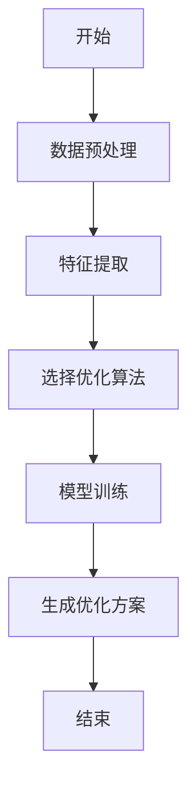

                 


# 构建智能化的个人税务筹划优化助手

## 关键词：税务筹划，人工智能，机器学习，优化算法，系统架构

## 摘要：  
随着人工智能技术的飞速发展，个人税务筹划正逐渐从传统的人工计算方式向智能化、数据驱动的方式转变。本文将深入探讨如何利用人工智能技术构建智能化的个人税务筹划优化助手。通过分析税务筹划的核心概念、算法原理和系统架构，结合实际案例，我们展示了如何利用AI技术实现个性化的税务优化方案，从而帮助个人在合法合规的前提下最大限度地降低税务负担。本文内容涵盖从理论到实践的全链条，为读者提供了一个系统化的解决方案。

---

## 第一部分: 智能化税务筹划优化助手的背景与核心概念

### 第1章: 智能化税务筹划优化助手的背景与问题描述

#### 1.1 税务筹划的基本概念与重要性
- **税务筹划的定义**：税务筹划是指通过合法的手段，合理规划个人或企业的收入与支出，以达到降低税务负担的目的。  
- **税务筹划的重要性**：在个人财务管理中，税务筹划可以帮助优化资产配置、减少税务支出，同时确保合规性。  
- **合法与合规的边界**：税务筹划必须在法律允许的范围内进行，避免触犯逃税、避税等违法行为。  

#### 1.2 智能化技术在税务筹划中的应用前景
- **AI技术的潜力**：人工智能可以通过数据分析和模式识别，帮助个人快速找到最优的税务筹划方案。  
- **数据驱动的优化**：通过收集和分析大量的财务数据，AI技术可以发现潜在的优化机会，从而提高税务筹划的效率和效果。  
- **智能化需求**：随着个人财务情况的复杂化，传统的手动计算方式已难以满足需求，智能化助手成为必然趋势。  

---

### 第2章: 个人税务筹划优化的核心概念体系

#### 2.1 税务筹划优化的关键要素
- **收入来源分析**：包括工资、投资收益、租金收入等，不同收入来源的税率和计税方式不同。  
- **支出项分类**：包括房贷、教育支出、医疗支出等，合法的支出可以降低 taxable income。  
- **税收优惠政策**：如子女教育专项扣除、住房贷款利息扣除等，这些政策可以帮助降低税务负担。  

#### 2.2 智能化税务助手的功能模块
- **数据采集与处理模块**：通过API或手动输入，收集用户的财务数据并进行清洗和预处理。  
- **税务分析与优化模块**：利用机器学习算法，分析用户的财务数据并生成多种优化方案。  
- **个性化建议生成模块**：根据用户的财务状况和需求，提供个性化的税务优化建议。  

#### 2.3 核心概念对比分析
- **税务筹划与财务管理的对比**：税务筹划是财务管理的一部分，但更注重合法性和优化策略。  
- **传统与智能化的对比**：传统方式依赖人工计算，智能化助手则通过AI技术实现自动化和优化。  

---

## 第二部分: 智能化税务筹划的核心概念与技术原理

### 第3章: AI技术在税务优化中的核心原理

#### 3.1 机器学习在税务分析中的应用
- **监督学习**：用于税务预测和分类，例如预测某项收入是否需要缴税。  
- **非监督学习**：用于数据聚类，发现隐藏的财务模式。  
- **强化学习**：用于优化策略，例如选择最优的税务筹划方案。  

#### 3.2 税务优化算法的数学模型
- **目标函数**：最大化税后收入或最小化税负。  
- **约束条件**：符合税法规定，避免违法行为。  
- **优化模型的求解方法**：使用遗传算法、粒子群优化等方法。  

#### 3.3 优化算法的流程图


---

## 第三部分: 智能化税务优化系统的算法实现

### 第4章: 税务优化算法的数学模型与实现

#### 4.1 基于遗传算法的优化模型
- **遗传算法的基本原理**：模拟生物进化的过程，通过选择、交叉和变异生成新的解。  
- **税务优化问题的编码方式**：将收入和支出转化为二进制或十进制编码。  
- **适应度函数的设计**：计算每个解的税后收入，作为适应度的评价标准。  
- **选择、交叉与变异操作的实现**：例如，选择适应度高的个体进行交叉，生成新的解。  

#### 4.2 算法实现的数学公式
- **目标函数**：  
  $$ \text{max} \sum_{i=1}^{n} (收入_i - 税费_i) $$  
- **约束条件**：  
  $$ \sum_{i=1}^{n} 支出_i \leq 总支出 $$  

---

## 第四部分: 智能化税务优化系统的架构与实现

### 第5章: 系统架构设计与实现

#### 5.1 系统功能设计
- **领域模型（类图）**：  
  ```mermaid
  classDiagram
  class 用户 {
    姓名
    收入
    支出
  }
  class 税务优化助手 {
    数据采集
    数据分析
    优化建议
  }
  用户 --> 税务优化助手: 提供数据
  税务优化助手 --> 用户: 提供建议
  ```

- **系统架构设计（架构图）**：  
  ```mermaid
  container 数据层 {
    数据库
    API接口
  }
  container 业务逻辑层 {
    税务优化算法
    数据处理模块
  }
  container 用户界面层 {
    用户输入
    结果展示
  }
  数据层 --> 业务逻辑层
  业务逻辑层 --> 用户界面层
  ```

---

## 第五部分: 项目实战与案例分析

### 第6章: 项目实战与案例分析

#### 6.1 项目环境配置
- **工具安装**：安装Python、TensorFlow、Pandas等工具。  
- **数据准备**：收集用户的收入和支出数据，清洗并预处理。  

#### 6.2 核心代码实现
```python
import numpy as np
from sklearn.model_selection import train_test_split
from sklearn.linear_model import LinearRegression

# 数据准备
data = np.array([[20000, 0.2], [30000, 0.15], [40000, 0.1]])
X = data[:, 0]
y = data[:, 1]

# 划分训练集和测试集
X_train, X_test, y_train, y_test = train_test_split(X, y, test_size=0.2)

# 模型训练
model = LinearRegression()
model.fit(X_train.reshape(-1, 1), y_train)

# 模型预测
predicted_tax = model.predict(X_test.reshape(-1, 1))
print(predicted_tax)
```

#### 6.3 代码解读与分析
- **数据准备**：加载收入和税率数据。  
- **模型训练**：使用线性回归模型预测税率。  
- **模型预测**：基于训练好的模型，预测新的收入对应的税率。  

#### 6.4 实际案例分析
- **案例背景**：某用户的年收入为50000元，支出包括房贷20000元和教育支出10000元。  
- **优化建议**：通过算法计算，建议将部分收入转化为投资收益，以降低税率。  

---

## 第六部分: 总结与展望

### 第7章: 总结与展望

#### 7.1 最佳实践 tips
- 数据的准确性和完整性对优化结果至关重要。  
- 在使用AI技术时，需确保算法的透明性和合规性。  

#### 7.2 本章小结
本文详细介绍了如何利用AI技术构建智能化的个人税务筹划优化助手，从理论到实践，为读者提供了一个完整的解决方案。  

#### 7.3 未来研究方向
- 更复杂的优化算法，如深度学习在税务优化中的应用。  
- 多目标优化问题的研究，例如在降低税负的同时优化资产配置。  

---

## 作者：AI天才研究院/AI Genius Institute & 禅与计算机程序设计艺术 /Zen And The Art of Computer Programming

